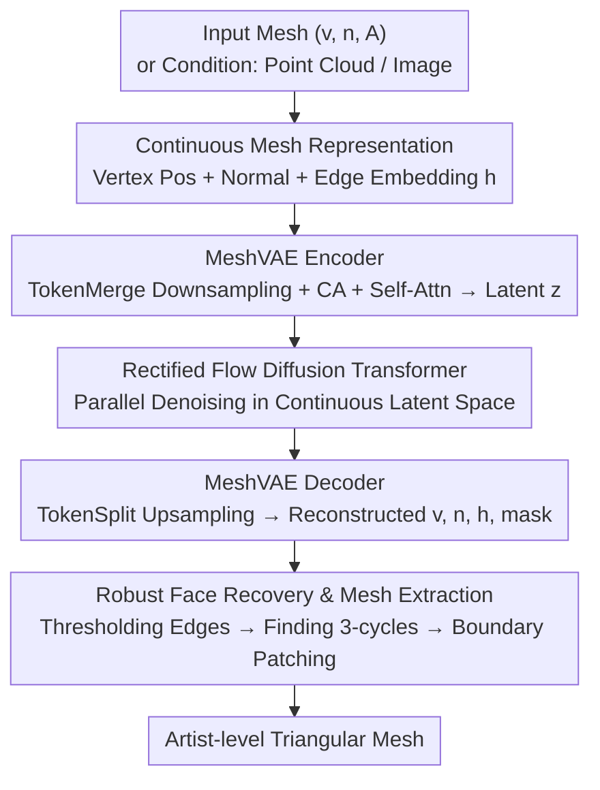

# MeshFlow: Efficient Artistic Mesh Generation via MeshVAE and Flow-based Diffusion Transformer

**Conference**: CVPR 2026  
**Paper**: [CVF Open Access](https://openaccess.thecvf.com/content/CVPR2026/html/Li_MeshFlow_Efficient_Artistic_Mesh_Generation_via_MeshVAE_and_Flow-based_Diffusion_CVPR_2026_paper.html)  
**Code**: TBD  
**Area**: 3D Vision  
**Keywords**: Artist-level mesh generation, MeshVAE, Rectified Flow, Continuous latent space, Non-autoregressive

## TL;DR
MeshFlow employs a MeshVAE that encodes vertex positions, normals, and "discrete connectivity" entirely into a **continuous latent space**. Combined with a Rectified Flow diffusion Transformer, it **parallelly** generates all vertices and edges, producing artist-level triangular meshes in approximately 1 second—about 18x faster than the fastest autoregressive generators while avoiding quantization errors.

## Background & Motivation

**Background**: Triangular meshes are the standard 3D representation for AR/VR, games, and film, but manual creation of artist-level meshes has a high barrier to entry. Generative approaches mainly follow two paths: generating implicit representations (e.g., SDF) followed by Marching Cubes, or treating mesh topology as discrete sequences to be **discretized, tokenized, and autoregressively (AR)** generated (e.g., MeshGPT, MeshAnything, MeshXL).

**Limitations of Prior Work**: Implicit methods produce meshes that are not "artist-level"—they either smooth out sharp edges or suffer from face count explosion, making them difficult to edit or use in real-time. The AR path has three major flaws: ① Naive tokenizers require $9n_f$ tokens per face, and even efficient ones only save 78%, causing inference costs to grow **quadratically** with mesh scale; ② AR sequences may terminate early, producing incomplete meshes; ③ Vertex coordinates are typically quantized to 128 levels, introducing quantization errors that occasionally cause vertex collapse or face overlapping.

**Key Challenge**: Meshes are essentially a hybrid of "continuous vertices + discrete topology." Discrete topology naturally fits the AR/language model paradigm, but AR's quadratic complexity and quantization errors hinder efficiency and precision.

**Goal**: To find a **non-autoregressive, non-quantized** efficient route that can parallelly output an entire mesh's vertices and edges at once, similar to how latent diffusion generates millions of pixels in parallel.

**Key Insight**: The authors observe that a **watertight mesh** can be uniquely recovered from vertices, edges connecting them, and the cyclic order of edges around each vertex. The difficulty lies in "edges being pairs of discrete vertex indices." Drawing inspiration from SpaceMesh, the authors **continuize** edge connections—assigning a feature vector to each vertex such that an edge exists if the distance between two vertices' vectors is below a threshold. Cyclic order is encoded using vertex normals. Thus, the entire mesh is represented as "one continuous latent vector per vertex."

**Core Idea**: Reformulate discrete mesh topology into **continuous per-vertex embeddings**, enabling parallel denoising in a continuous latent space using Rectified Flow. This replaces "discrete tokens + autoregression" with "continuized topology + diffusion."

## Method

### Overall Architecture
MeshFlow consists of two layers: first, a **MeshVAE** compresses a mesh into a compact continuous latent code $z$, followed by a **Rectified Flow diffusion Transformer** trained on this latent space for generation. A mesh is represented as a triplet $M=(v,n,h)$—each vertex $i$ has a position $v_i\in\mathbb{R}^3$, a normal $n_i\in S^2$, and an edge embedding $h_i\in\mathbb{R}^D$. Given $h$, the adjacency matrix $A$ is recovered via threshold rules, faces $F$ are recovered by finding 3-cycles, and face orientation is determined by normals. The MeshVAE encoder processes $(v,n,A)$, and the decoder outputs $(\hat v,\hat n,\hat h,\hat m)$ ($\hat m$ is the valid vertex mask), while downsampling $N$ vertex tokens to $n<N$. During generation, Rectified Flow parallelly denoises latent codes under conditions (point cloud/image), followed by the Mesh decoder and robust face recovery. Since the process is entirely continuous and parallel, inference cost grows **linearly** with mesh scale.

### Key Designs

**1. Continuized Mesh Representation: Edge Embeddings + Vertex Normals for Topology**

Naive representations treat faces as discrete indices and the adjacency matrix $A\in\{0,1\}^{N\times N}$ as discrete and non-differentiable, preventing direct diffusion generation. Borrowing from SpaceMesh, the authors assign a continuous edge embedding $h_i$ to each vertex, implicitly recovering adjacency via a distance threshold: $A_{ij}=\mathbb{I}[d(h_i,h_j)\le \tau]$. This expresses discrete connectivity as learnable continuous embeddings. For face orientation, instead of encoding vertex order, an outward-facing normal $n_i$ is assigned to each vertex, and the face normal is the mean of its three vertices' normals. Compared to SpaceMesh, MeshFlow **does not require** the mesh to be manifold or watertight and simplifies the representation by using only normals instead of three sets of embeddings $(y^{root},y^{prev},y^{next})$ for edge cyclic order.

**2. MeshVAE: "Translational" Autoencoder with TokenMerge/TokenSplit**

The goal is to compress a mesh into $z$ and decode it. This is a "translational" VAE—the input uses $(v,n,A)$ while the output uses $(v,n,h)$. The encoder first concatenates each vertex's normal and neighboring features $x_i=\mathrm{Concat}(PE(v_i),PE(n_i),\mathrm{Concat}_{j\in N_i}(v_j))$, then uses **TokenMerge** (inspired by InternVL pixel-shuffle) to reduce $N$ tokens to $n$. These reduced tokens then use cross-attention to look back at the full input to preserve detail, followed by $L_e$ self-attention layers to obtain $z=\mathrm{SA}(\mathrm{CA}(z_{merged},X))$. The decoder is symmetric: **TokenSplit** upsamples $n$ latent tokens back to $N$, reconstructs $\hat X$ via cross-attention with learnable positional embeddings. Experiments show that this simple TokenMerge/TokenSplit outperforms learned queries (Q-Former) or FPS sampling in terms of stability and reconstruction quality. This representation uses 72× fewer tokens than naive tokenizers and 16× fewer than the most efficient ones, without quantization.

**3. Contrastive Adjacency Supervision + Mask/Reconstruction Compound Loss**

The VAE is trained with a reconstruction loss $L_{rec}$ and KL regularization. $L_{rec}=L_{mask}+L_v+L_n+L_{adj}+\beta_{kl}L_{kl}$. Masking uses BCE; vertex/normal reconstruction uses MSE on valid vertices. Connectivity uses a **contrastive loss** $L_{adj}=L_{pos}+\lambda_{neg}R_{neg/pos}L_{neg}$, which pulls embeddings of connected vertices together and pushes non-connected ones apart. $R_{neg/pos}=|\neg E|/|E|$ balances the extreme ratio of negative to positive edges. The distance function $d$ follows SpaceMesh's Space-time Distance.

**4. Rectified Flow Parallel Generation + Robust Face Recovery Post-processing**

Generation uses Rectified Flow (RF) with its straight ODE form $x(t)=(1-t)x_0+t\epsilon$, which avoids path crossing and reduces discretization error. The network $v_\theta$ is trained with the Conditional Flow Matching objective $L_{CFM}=\mathbb{E}\lVert v_\theta(x,t)-(\epsilon-x_0)\rVert_2^2$. The Diffusion Transformer injects point cloud encoder features via cross-attention. For inference, a **robust face recovery** follows: valid edges are extracted via $h$ thresholding, 3-cycles are found to form faces, and orientation is determined by normals. A boundary patching step triangulates small holes ($k<5$ polygons) formed by edges belonging to only one face.

### Loss & Training
Two-stage training: ① MeshVAE with $L_{rec}+\beta_{kl}L_{kl}$. ② RF Diffusion Transformer with $L_{CFM}$. Data includes ~600k high-quality artistic 3D models. MeshVAE uses 8 Transformer layers (233M parameters); DiT uses 18 blocks (427M parameters). Trained using Flash Attention and BF16.

## Key Experimental Results

> CD (Chamfer Distance) measures structural similarity; HD (Hausdorff Distance) is sensitive to local maximum errors; Comp. Ratio measures compactness; Inf. Time is the average per-batch inference time. CD/HD are scaled by ×100.

### Main Results
Point cloud-conditioned mesh generation on Toys4K (testing generalization):

| Method | Type | CD↓ | HD↓ | Inf. Time(s)↓ |
|------|------|------|------|------|
| MeshAnything | AR | 12.02 | 26.87 | 26.06 |
| MeshAnythingV2 | AR | 10.23 | 24.98 | 31.94 |
| TreeMeshGPT | AR | 5.46 | 13.96 | 27.32 |
| BPT | AR | 5.71 | 12.02 | 49.23 |
| FastMesh-V1K | AR | 4.09 | 10.32 | 3.41 |
| FastMesh-V4K | AR | 4.05 | 10.22 | 6.60 |
| **MeshFlow (Ours)** | Diffusion | **2.45** | **6.40** | **1.2** |

MeshFlow achieves the lowest CD/HD with an inference time of 1.2s—nearly 3x faster than the fastest AR (FastMesh-V1K) and over 20x faster than others.

### Ablation Study

| Configuration | Vert. Dist.↓ | Normals Dist.↓ | F1↑ | Description |
|------|------|------|------|------|
| Q-former | 23.36 | 18.77 | 49.47 | Learnable queries; training fails to converge. |
| FPS | 18.29 | 14.61 | 60.18 | Farthest Point Sampling; severe degradation. |
| **TokenMerge** | **0.75** | **0.47** | **99.78** | **Ours**; stable training + high fidelity. |

### Key Findings
- **TokenMerge is critical for VAE training**: Replacing it with Q-Former or FPS causes vertex distance to jump from 0.75 to 18-23 and F1 to drop from 99.78 to ~50, leading to reconstruction failure.
- **Aggressive compression remains stable**: Even with 4× downsampling (retaining only $n_v/4$ latent vectors), edge F1 remains ~0.89, and increasing vertex counts from 2048 to 8192 does not significantly degrade reconstruction.
- **Metrics have limits**: Since the model directly predicts normals, Normal Consistency (NC) is artificially high; CD/HD struggle to capture topological defects like flipped normals or holes.

## Highlights & Insights
- **Complete continuization of discrete topology**: Using the triplet of "vertex edge embeddings + thresholding + normals" describes a mesh as purely continuous vectors, unlocking parallel latent diffusion.
- **Simpler than SpaceMesh**: MeshFlow does not require manifoldness and replaces three sets of embeddings with single normals for cyclic order, resulting in a tighter latent space.
- **Simple TokenMerge beats fancy sampling**: Pixel-shuffle-style merging is more accurate than Q-Former or FPS, suggesting that for strongly structured geometric data, information-preserving deterministic downsampling is superior.

## Limitations & Future Work
- **Triangles only**: The current approach assumes triangular meshes, while artists often use quads or n-gons.
- **Heuristic patching for holes**: Prediction inaccuracies can leave holes, currently addressed by post-processing.
- **Metric failure**: There is a lack of generative metrics that effectively evaluate mesh topological quality.
- **No texture**: Currently limited to geometry; future work could include UV mapping.

## Related Work & Insights
- **vs. AR Mesh Generation**: MeshFlow bypasses $O(N^2)$ complexity and quantization errors, providing 18x speedups and higher precision.
- **vs. SpaceMesh**: MeshFlow is more concise and less restrictive (no watertight requirement).
- **vs. Implicit Representation**: MeshFlow generates artist-level meshes directly, preserving sharp edges and providing more editable structures.

## Rating
- Novelty: ⭐⭐⭐⭐⭐ 
- Experimental Thoroughness: ⭐⭐⭐⭐ 
- Writing Quality: ⭐⭐⭐⭐⭐ 
- Value: ⭐⭐⭐⭐⭐ 

<!-- RELATED:START -->

## Related Papers

- [\[CVPR 2026\] ActionMesh: Animated 3D Mesh Generation with Temporal 3D Diffusion](actionmesh_animated_3d_mesh_generation_with_temporal_3d_diffusion.md)
- [\[CVPR 2026\] Beyond Geometry: Artistic Disparity Synthesis for Immersive 2D-to-3D](beyond_geometry_artistic_disparity_synthesis_for_immersive_2d-to-3d.md)
- [\[CVPR 2026\] ART: Articulated Reconstruction Transformer](art_articulated_reconstruction_transformer.md)
- [\[CVPR 2026\] Fast Spatial Tracking with Visual Geometry Transformer](fast_spatial_tracking_with_visual_geometry_transformer.md)
- [\[CVPR 2026\] LitePT: Lighter Yet Stronger Point Transformer](litept_lighter_yet_stronger_point_transformer.md)

<!-- RELATED:END -->

## Related Papers

- [\[CVPR 2026\] Efficient Hybrid SE(3)-Equivariant Visuomotor Flow Policy via Spherical Harmonics](efficient_hybrid_se3-equivariant_visuomotor_flow_policy_via_spherical_harmonics_.md)
- [\[CVPR 2026\] PartDiffuser: Part-wise 3D Mesh Generation via Discrete Diffusion](partdiffuser_part-wise_3d_mesh_generation_via_discrete_diffusion.md)
- [\[CVPR 2026\] ActionMesh: Animated 3D Mesh Generation with Temporal 3D Diffusion](actionmesh_animated_3d_mesh_generation_with_temporal_3d_diffusion.md)
- [\[CVPR 2025\] TreeMeshGPT: Artistic Mesh Generation with Autoregressive Tree Sequencing](../../CVPR2025/3d_vision/treemeshgpt_artistic_mesh_generation_with_autoregressive_tree_sequencing.md)
- [\[CVPR 2026\] TokenHand: Discrete Token Representation for Efficient Hand Mesh Reconstruction](tokenhand_discrete_token_representation_for_efficient_hand_mesh_reconstruction.md)

<!-- RELATED:END -->
