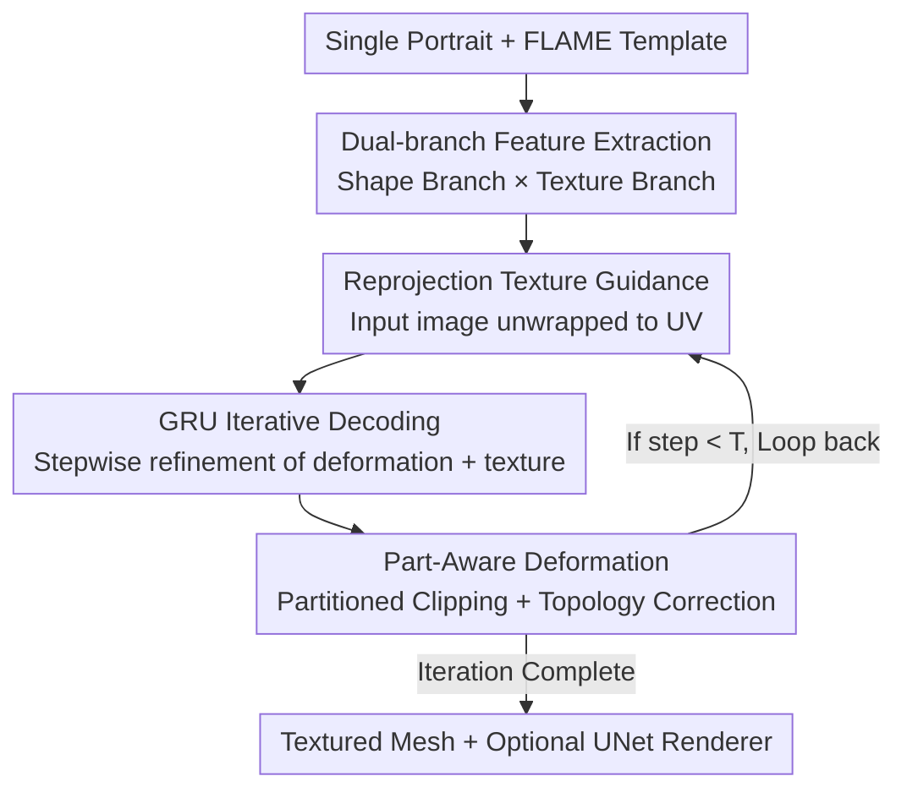

# MeshLAM: Feed-Forward One-Shot Animatable Textured Mesh Avatar Reconstruction

**Conference**: CVPR 2026  
**arXiv**: [2604.22865](https://arxiv.org/abs/2604.22865)  
**Code**: https://meshlam.github.io (Project Page)  
**Area**: 3D Vision / Digital Human Avatar / Feed-forward Reconstruction  
**Keywords**: Single-image Reconstruction, Animatable Mesh, Texture Mapping, GRU Iterative Decoding, Reprojection Guidance

## TL;DR
MeshLAM utilizes a dual-branch network with a shared Transformer to reconstruct a **textured, directly drivable** full 3D head mesh from a single portrait image in a single feed-forward pass (within seconds). The shape branch regresses per-vertex deformations, while the texture branch synthesizes UV maps. By employing GRU iterative decoding and reprojecting the input image onto the mesh for texture supervision, the method avoids mesh collapse and preserves high-frequency details, outperforming Gaussian-based feed-forward methods in both quality and efficiency.

## Background & Motivation
**Background**: Creating animatable 3D avatars from a single image is a core requirement for VR, gaming, and teleconferencing. Current mainstream approaches fall into three categories: 2D methods (StyleGAN/diffusion-driven) which lack explicit 3D structures and suffer from distortion under large poses; 3D methods like NeRF or 3DMM which offer high fidelity but often require per-person optimization or multi-view supervision; and recent feed-forward Gaussian methods (e.g., LAM) that use Transformer backbones with FLAME priors to directly decode animatable Gaussian avatars, skipping test-time optimization.

**Limitations of Prior Work**: Feed-forward Gaussian approaches face two major hurdles. First, representing fine-grained appearances like hair, beards, tattoos, or text requires a **massive** number of Gaussian primitives, causing the computational cost of the Transformer backbone to explode. Second, optimizing so many Gaussian points simultaneously in a single feed-forward pass is difficult to converge, often resulting in blurry outputs and lost high-frequency details. Conversely, traditional 3DMM-based mesh methods are typically limited to the facial region, failing to recover "out-of-face" geometry like hairstyles and headwear or high-fidelity textures.

**Key Challenge**: There is a trade-off between the "expressive capacity" of appearance details and the "optimizability/computational cost" of a single feed-forward pass. Gaussian points entangle geometry and appearance within the same set of primitives; more detail requires more points, which in turn makes single-pass optimization harder.

**Goal**: To achieve full head geometry (including hair/headwear), high-fidelity textures, and intact topology for direct bone-driven animation within a **single feed-forward pass**.

**Key Insight**: The authors return to the mesh representation, which naturally decouples reconstruction into "geometry (vertices)" and "appearance (texture maps)." High-frequency appearance can be stored in a compact texture map, while geometry only requires sparse vertices. This decoupling prevents the appearance details from burdening the geometry decoder. Experiments show that using approximately 8K vertices outperforms LAM’s 80K Gaussian points.

**Core Idea**: Replace "single-pass Gaussian stacking" with "dual-branch feed-forward mesh + GRU iterative refinement + reprojecting the input image back to UV space for texture supervision." This decouples geometry from appearance while preventing mesh collapse.

## Method

### Overall Architecture
Given a single portrait, MeshLAM uses the FLAME template as a prior to reconstruct an animatable textured head mesh via feed-forward. A shared ViT/DINOv2 backbone extracts multi-scale image features. The model then splits into two branches: the shape branch, where FLAME vertices attend to image features via cross-attention to regress per-vertex deformations; and the texture branch, where a set of learnable token grids aligned with the FLAME UV space synthesize the UV texture map. Instead of a single-pass decoding, both branches are iteratively refined by a GRU decoder over $T$ steps. At each step, the current mesh is driven by facial expression parameters, and the input image (along with prediction errors) is **reprojected (unwrapped) back to the UV space** as texture supervision. Simultaneously, part-aware deformation and topological correction are applied to the geometry. The iteration concludes with the final vertex mesh $V_K$ and texture map $T_K$, which can optionally be passed to a StyleGAN-style UNet neural renderer for enhanced quality.

### Key Designs

**1. Dual-branch Geometry-Appearance Decoupling: Utilizing sparse vertices + a single texture map**

To address the issue of Gaussian points entangling geometry and appearance, MeshLAM explicitly splits reconstruction into two branches sharing a backbone. The shape branch is initialized with FLAME vertices $V_0$, which, after positional encoding, produce vertex features $F_V$ via an MLP. These pass through $L_{\mathcal{A}}$ cross-attention layers to attend to image features $F_I$: $F_{V_i}=\mathcal{A}_i(F_{V_{i-1}}, F_I)$. The texture branch uses learnable token grids $T_0\in\mathbb{R}^{H_t\times W_t\times C_t}$ aligned with the FLAME UV map, which are flattened and passed through the **same** attention layers: $F_{T_i}=\mathcal{A}_i(F_{T_{i-1}}, F_I)$. Consequently, the geometry only needs to handle sparse vertex deformations, while appearance details are stored in the compact UV maps. This allows for far more efficient storage of details like hair or tattoos than vertex-based coloring.

**2. GRU Iterative Decoding: Differentiable stepwise refinement vs. single-pass regression**

The authors found that directly regressing deformation offsets with a single decoder frequently leads to mesh collapse in regions of large deformation (hair, headwear), where unconstrained vertex displacement causes distortion. MeshLAM adopts a recurrent GRU operator for coarse-to-fine iteration. The geometry GRU starts from a zero deformation field $\Delta V_0$: $\Delta V_{t+1}=\text{GRU}_{\text{geo}}([\psi(\vartheta(V_t), F_{d_t2v}), F_V], h_t^{\text{geo}})$, with vertex updates $V_{t+1}=V_t+\Delta V_{t+1}$. The texture GRU fuses the previous texture, unwrapped image, latent features, and error features: $T_{t+1}=\text{GRU}_{\text{tex}}(\varphi([\varphi([T_t,U_t]), F_a, F_{d_t}]), h_t^{\text{tex}})$. Hidden states $h_t$ preserve historical context, allowing deformations to evolve progressively from the template, ensuring stability even under large deformations.

**3. Reprojection Texture Guidance: Bridging the 3D evolution and 2D observations**

Purely feature-based texture synthesis tends to be blurry because it lacks anchors to observed appearances. At each iteration $t$, MeshLAM drives the current mesh $M_t$ with expression parameters and rasterizes it to establish "image pixels $\leftrightarrow$ UV coordinates" correspondences. The input image is then unwrapped to the UV space: $U_t=\mathcal{U}(I_{\text{input}}, \mathcal{R}(M_t^{\text{animated}}))$. Additionally, the concatenation of the input image, rendered image, and their residual is convolved and unwrapped to obtain error features $F_{d_t}=\mathcal{U}(\varphi([I_{\text{input}}, I_{\text{rendered}}, I_{\text{input}}-I_{\text{rendered}}]))$. This provides direct feedback for the texture GRU and guides geometry deformation via reprojection $F_{d_t2v}$ to the vertex space. This creates a closed loop where accurate geometry improves reprojection, which in turn provides stronger texture guidance and photometric constraints.

**4. Part-Aware Deformation + Topology Correction: Ensuring anatomical correctness and drivability**

Unconstrained mesh deformation can destroy the animatable structure of the face (e.g., misaligned eyeballs). The authors apply semantic partitioned clipping to the deformation $\Delta V_t$: the hair region allows large shifts ($\delta_{\text{hair}}=0.08$), the neck/face regions are moderate ($\delta_{\text{neck}}=0.02, \delta_{\text{face}}=0.003$), and eyeball/eyelid vertices remain **fixed** to maintain anatomical integrity. After each deformation step, topology correction is performed: ① subdividing triangles with edges exceeding threshold $\varepsilon$, ② flipping inconsistent face orientations, and ③ removing invalid faces. Since remeshing changes connectivity, skinning weights $W$ and blendshapes $B$ are updated via barycentric interpolation, and the joint regression matrix $J=J(M+B_s(\beta))^{-1}$ is recalculated to maintain skeleton consistency.

### Loss & Training
Each iteration uses a weighted multi-task objective: image reconstruction (L2 + Perceptual) $\mathcal{L}_{\text{img}}=\|I_{\text{rendered}}-I_{\text{gt}}\|_2^2+\phi(\cdot)$, silhouette mask $\mathcal{L}_{\text{mask}}$, normal supervision via a pre-trained normal network $\mathcal{L}_{\text{normal}}$, semantic partitioning via face parsing $\mathcal{L}_{\text{part}}$, and Laplacian smoothing $\mathcal{L}_{\text{lap}}$. The per-step loss is $\mathcal{L}_t=\lambda_i\mathcal{L}_{\text{img}}+\lambda_m\mathcal{L}_{\text{mask}}+\lambda_n\mathcal{L}_{\text{normal}}+\lambda_p\mathcal{L}_{\text{part}}+\lambda_l\mathcal{L}_{\text{lap}}$, with weights $\lambda_i=\lambda_m=\lambda_n=1, \lambda_p=0.5, \lambda_l=2$. The total loss is weighted across iterations: $\mathcal{L}_{\text{total}}=\sum_{t=1}^{N}\gamma^{N-t}\mathcal{L}_t$, where $N=2, \gamma=0.8$. The backbone utilizes a frozen DINOv2. The Transformer consists of 2 layers with 16 heads ($C_t=1024$). Training is performed for 100 epochs using Adam with cosine annealing and linear warm-up on the VFHQ dataset.

## Key Experimental Results

### Main Results
Evaluations were conducted on the VFHQ official test set for single-image 3D avatar creation and reenactment. Metrics include PSNR, SSIM, LPIPS, AKD (Average Keypoint Distance), CSIM (Cosine Similarity of Identity), and FID, all calculated within the head region mask.

| 3D Representation | Method | PSNR↑ | SSIM↑ | LPIPS↓ | AKD↓ | CSIM↑ | FID↓ |
|---------|------|-------|-------|--------|------|-------|------|
| Mesh | ROME w/ UNet | 22.850 | 0.874 | 0.098 | 4.98 | 0.681 | 42.542 |
| Mesh | Ours w/o UNet | 23.180 | 0.859 | 0.073 | 3.58 | 0.935 | 23.688 |
| Mesh | **Ours w/ UNet** | **25.233** | **0.879** | **0.061** | **3.24** | **0.948** | **22.699** |
| Gaussian | LAM+FLAME | 25.082 | 0.879 | 0.077 | 2.07 | 0.879 | 24.270 |
| Gaussian | **LAM+Ours** | **25.889** | **0.893** | **0.050** | 2.02 | 0.898 | **22.576** |

Within the mesh category, Ours w/ UNet significantly outperforms ROME (PSNR 25.23 vs 22.85; CSIM 0.948 vs 0.681). Even without the neural renderer (w/o UNet), the model remains competitive and more efficient. Interestingly, using the mesh reconstructed here as a geometric prior for Gaussian methods (LAM+Ours) yields the best overall performance (PSNR 25.889), indicating that this mesh provides a superior geometric initialization.

### Ablation Study
| Configuration | PSNR↑ | LPIPS↓ | FID↓ | Description |
|------|-------|--------|------|------|
| Ours-Full | 25.23 | 0.061 | 22.699 | Full model (2-step iteration + UNet) |
| w/o Texture Map | 18.09 | 0.126 | 74.083 | Switch to vertex coloring; textures fail |
| w/o GRU | 23.08 | 0.081 | 26.397 | Remove iterative refinement; mesh collapses |
| w/o Unwrapping | 22.98 | 0.089 | 29.428 | Remove reprojection guidance; textures blur |
| w/o P.A. Deform. | 22.72 | 0.096 | 32.405 | Remove partition constraints; anatomical distortion |
| w/o UNet | 23.18 | 0.073 | 23.688 | Remove neural renderer |
| GRU-1iter | 23.10 | 0.077 | 25.747 | 1-step iteration |
| GRU-2iter | 25.23 | 0.061 | 22.699 | 2-step (Optimal) |
| GRU-3iter | 25.38 | 0.063 | 23.431 | 3-step; slight PSNR gain but worse FID/LPIPS |

### Key Findings
- **Texture Maps are Crucial**: Switching to vertex coloring results in a PSNR drop from 25.23 to 18.09, proving that vertex-based rendering cannot store high-frequency details.
- **GRU Iteration Prevents Collapse**: Removing the GRU leads to mesh collapse (FID 22.7→26.4). Two iterations offer the best trade-off between performance and efficiency.
- **Reprojection and Partitioning Constraints**: Removing reprojection blurs textures (FID 29.4), while removing part-aware deformation causes anatomical loss.
- The entire feed-forward process completes in **under one second** without test-time optimization.

## Highlights & Insights
- **"Optical Flow"-style Reprojection in 3D Reconstruction**: Unwrapping the input image onto the evolving mesh provides "anchored" visual evidence, a strategy that could be generalized to other single-image 3D tasks to suppress hallucinations in occluded areas.
- **GRU as a Deformation Stabilizer**: Breaking down large displacements into multiple steps via a recurrent operator acts as a trajectory constraint, effectively handling large non-rigid deformations that typically cause mesh failure.
- **8K Vertices vs. 80K Gaussian Points**: The significant performance advantage with fewer parameters highlights how the choice of representation matters more than raw primitive count.
- **Mesh as a Prior for Gaussians**: The fact that LAM+Ours performs best suggests that high-quality meshes are not just endpoints but can serve as robust geometric foundations for other paradigms.

## Limitations & Future Work
- The method relies on FLAME for animation, which limits the expression of dynamic wrinkles or fine-grained tongue movement. 
- Training is limited to the VFHQ dataset, which may hinder generalization to extreme lighting or exaggerated accessories.
- The topology correction process (remeshing/subdivision) is somewhat engineering-heavy; its stability across diverse inputs requires further scrutiny.
- Texture completion in large occluded areas still relies on learned priors, which might not match the subject's true appearance.

## Related Work & Insights
- **vs. LAM (Feed-forward Gaussian)**: LAM uses Gaussians on FLAME but struggles with the computational cost of detail. MeshLAM uses a dual-branch mesh approach with texture maps to achieve clearer details with fewer parameters and lower compute.
- **vs. ROME (Mesh 3DMM)**: ROME is restricted to facial regions. MeshLAM recovers the full head (including hair) through part-aware deformation and topology correction.
- **vs. Optimization-based Routes**: Unlike NeRF-based methods requiring per-identity optimization, MeshLAM is single-pass and produces a mesh that is natively compatible with standard graphics pipelines.

## Rating
- Novelty: ⭐⭐⭐⭐ Combination of reprojection loops and GRU iteration for mesh feed-forward reconstruction is a solid innovation.
- Experimental Thoroughness: ⭐⭐⭐⭐ Extensive comparisons and ablations, though multi-dataset verification is lacking.
- Writing Quality: ⭐⭐⭐⭐ Clear chain of logic from pain points to design solutions.
- Value: ⭐⭐⭐⭐ High practical value for real-time digital human applications.

<!-- RELATED:START -->

## Related Papers

- [\[CVPR 2026\] Feed-Forward One-Shot Animatable Textured Mesh Avatar Reconstruction](feed-forward_one-shot_animatable_textured_mesh_avatar_reconstruction.md)
- [\[CVPR 2026\] Feed-forward Gaussian Registration for Head Avatar Creation and Editing](feed-forward_gaussian_registration_for_head_avatar_creation_and_editing.md)
- [\[CVPR 2026\] PanoVGGT: Feed-Forward 3D Reconstruction from Panoramic Imagery](panovggt_feed-forward_3d_reconstruction_from_panoramic_imagery.md)
- [\[CVPR 2026\] VGG-T3: Offline Feed-Forward 3D Reconstruction at Scale](vgg-t3_offline_feed-forward_3d_reconstruction_at_scale.md)
- [\[CVPR 2026\] MoRe: Motion-aware Feed-forward 4D Reconstruction Transformer](more_motion-aware_feed-forward_4d_reconstruction_transformer.md)

<!-- RELATED:END -->
