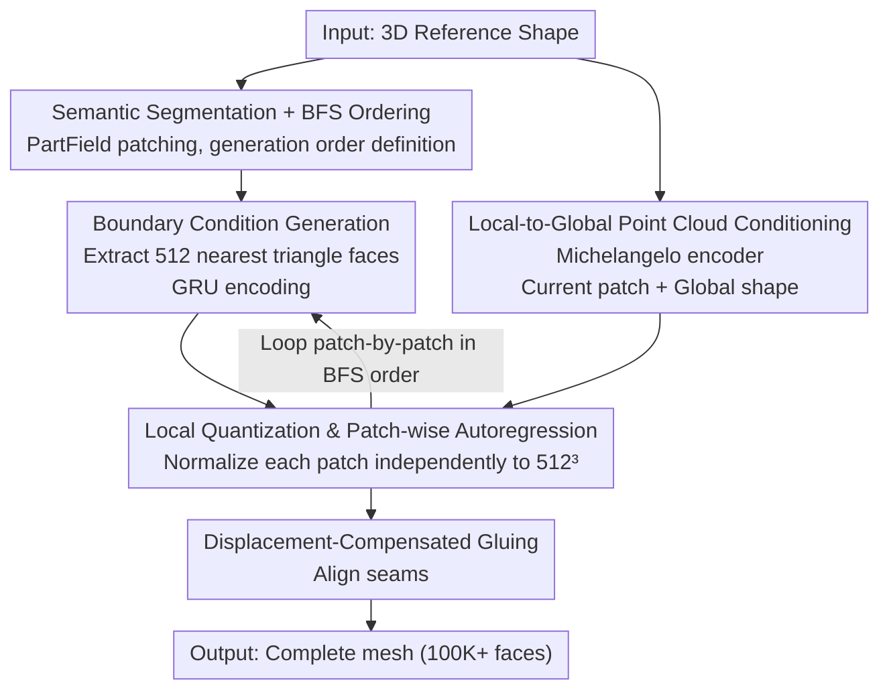

# MeshMosaic: Scaling Artist Mesh Generation via Local-to-Global Assembly

**Conference**: CVPR 2026  
**Paper**: [CVF Open Access](https://openaccess.thecvf.com/content/CVPR2026/html/Xu_MeshMosaic_Scaling_Artist_Mesh_Generation_via_Local-to-Global_Assembly_CVPR_2026_paper.html)  
**Code**: [Project Page](https://xrvitd.github.io/MeshMosaic/index.html)  
**Area**: 3D Vision  
**Keywords**: Artist mesh generation, autoregressive, local-to-global, boundary conditions, local quantization

## TL;DR
MeshMosaic replaces the "one-shot autoregressive generation of the entire mesh" with a local-to-global strategy of "patch decomposition, patch-wise generation, and seamless assembly". By leveraging shared boundary conditions and patch-independent quantization, this method breaks the dual bottlenecks of sequence length and quantization resolution. Using a small 0.5B model, it scales the size of artist meshes from around 8K faces to over 100,000 faces, consistently outperforming existing SOTA in geometric fidelity and user preference.

## Background & Motivation

**Background**: Artist-crafted triangle meshes (artist meshes) are the cornerstones of film, gaming, and AR/VR. They are characterized by stylized topology, directional edge flows, non-uniform face densities, sharp edges, and symmetric structures. Following MeshGPT, the mainstream approach is to "serialize" unordered meshes into tokens and use GPT-style autoregressive transformers to predict triangle faces token-by-token. Representative works include MeshAnythingV2, BPT, TreeMeshGPT, and DeepMesh.

**Limitations of Prior Work**: Such autoregressive methods suffer from two major bottlenecks. First is the **long sequence bottleneck**—serializing the entire mesh yields an enormous number of tokens that transformers struggle to handle, limiting generation to meshes of around 8K faces. In contrast, production-ready or main character assets often require over 100,000 faces, a difference of orders of magnitude. Second is the **limited quantization resolution**—to fit coordinates into a finite vocabulary, the entire mesh is uniformly quantized (e.g., DeepMesh uses a $512^3$ grid for global quantization). Consequently, fine details of small parts are smoothed out by the coarse global grid, preventing the recovery of sharp edges and delicate structures.

**Key Challenge**: Achieving both high face counts and fine details requires long sequences and high quantization resolutions; however, the computational budget and vocabulary of transformers strictly constrain both sequence length and quantization granularity. The paradigm of "modeling the entire mesh at once" inherently couples resolution and scale.

**Goal**: To scale artist mesh generation to over 100,000 faces without experiencing token sequence explosion or sacrificing quantization granularity, while ensuring cross-regional continuity, symmetry, and density structure.

**Key Insight**: The authors draw inspiration from classic **mosaic tile art**—the global complexity and coherence of a whole mosaic are assembled from exquisite local tiles. Meshes can be treated similarly: decomposing the entire mesh into semantically meaningful patches, generating each patch independently with full-resolution quantization, and then stitching them together using shared boundary conditions.

**Core Idea**: Replace "one-shot global generation" with "local-to-global patch-wise generation and assembly" — each patch is generated independently using the complete point cloud and full-resolution quantization, while shared boundary conditions between adjacent patches ensure seamless transitions. This fundamentally bypasses the long sequence bottleneck and enhances the effective quantization resolution.

## Method

### Overall Architecture
Given a 3D reference shape, the goal is to generate an artist-style triangle mesh. MeshMosaic decomposes this task into "patch-wise generation": during inference, it first performs **semantic segmentation** on the input shape using PartField to obtain several patches and determine their generation order. Then, it conducts **patch-by-patch autoregressive generation**. During the generation of each patch, the model receives **boundary conditions** from already generated neighboring patches, **local-to-global point cloud features** mapping the current patch to the entire shape, and performs **local quantization** in the patch's own normalized coordinate system. Finally, the patches are **glued** together into a clean, highly detailed, complete mesh using boundary displacement compensation. This pipeline decouples "resolution" from "scale": the sequence length is determined by the individual patch size (no longer exploding with the global face count), and the quantization granularity achieves a higher equivalent resolution because each patch is independently normalized to $[0,1]$.

### Key Designs

**1. Local-to-Global Semantic Segmentation and BFS Generation Order: Splitting the "entire long sequence" into manageable pieces**

Directly generating the entire mesh autoregressively hits both the long sequence bottleneck and low quantization resolution limits. MeshMosaic's first tactic is to partition the shape into multiple patches and generate them sequentially, keeping the input token count per patch manageable and retaining fine details within each patch. During inference, **PartField** is used for semantic segmentation—it represents the shape as continuous feature fields and produces boundaries that align well with curvature flows and semantics, which is beneficial for realism and subsequent editing. After partitioning, the generation order is defined: if two patches share a pair of adjacent triangle faces belonging to different segments, they are considered neighbors. The algorithm then performs a **Breadth-First Search (BFS)** starting from the spatially lowest patch. When a patch has multiple neighbors, the lowest coordinate is prioritized, ensuring a unique and deterministic order. The key role of BFS is that—except for the first connected component—each subsequent patch is connected to at least one already generated patch, allowing critical boundary information to propagate and maintain structural symmetry and smoothness.

**2. Shared Boundary Conditions and GRU Injection: Allowing adjacent patches to "see" neighbors to prevent broken edges, density jumps, and symmetry loss**

If each patch were generated independently using the same network without considering its connectivity to neighbors, it would suffer from continuity issues such as broken boundaries, irregular densities, and loss of symmetry. To address this, when generating a patch, the **triangle faces of already generated neighboring patches are fed as boundary conditions**. Specifically, to avoid inefficient processing and information dilution from poorly constructed long sequences, only the **512 spatially nearest triangle faces** are selected (the dataset contains no segmented patch boundaries exceeding this number). These triangle faces are serialized, tokenized, and passed through a **GRU (Gated Recurrent Unit)** network to produce a boundary embedding. A GRU is chosen over simple pooling or a fixed-length encoder because boundary lengths vary with geometric complexity across patches. GRU naturally handles variable-length sequences, captures temporal dependency, and selectively retains boundary information from long contexts. Once the boundary embedding is obtained, it is **prepended directly to the target patch's token sequence**. This allows self-attention to operate on both boundary tokens and in-patch tokens simultaneously, ensuring that triangle faces at the shared boundaries naturally extend and blend into neighboring patches. For the first patch (which lacks prior boundaries), a placeholder token sequence consisting entirely of end-of-sequence (EOS) tokens is fed as a neutral starting context.

**3. Patch-wise Local Quantization and Displacement-Compensated Gluing: Achieving higher equivalent resolution without expanding the vocabulary while eliminating seam misalignment**

This is the core design to break the quantization resolution bottleneck. Prior methods (e.g., DeepMesh) uniformly apply a global $512^3$ quantization to the entire mesh, which obliterates details of small-scale structures. MeshMosaic, conversely, **independently normalizes each patch to $[0,1]$ before applying the $512^3$ quantization**. Because each patch only covers a local space, the same $512^3$ vocabulary maps to much smaller spatial grids in the original scale, resulting in a higher equivalent resolution, which preserves sharp edges and fine structures. Each patch is also paired with 16,384 sampled points as inputs (whereas the baseline samples only 16,384 points globally), improving resolution and providing richer condition details. However, local normalization introduces small positional offsets for each patch. If unaddressed, this leads to seams and discontinuities at the junctions. The authors solve this via **displacement-compensated gluing**: the spatial displacement between the boundary condition faces referenced by the current patch and their original quantized positions in the already assembled structure is calculated, and the entire current patch is translated by this offset to perfectly align with the existing mesh. Since boundary triangle faces are precisely replicated between adjacent patches, this gluing process is highly stable and computationally efficient, resulting in a unified and highly detailed complete mesh.

**4. Local-to-Global Point Cloud Conditioning + Random Patching during Training: Anchoring local generation with global context and enhancing generalization and diversity**

While boundary conditions ensure **local continuity**, keeping the patches globally coordinated requires a global perspective. When generating each patch, the network is conditioned on both the **current patch's point cloud** and the **global shape point cloud**. Both point clouds are encoded using a frozen **Michelangelo encoder**, and their features are concatenated with the GRU boundary features to serve as the final context input for the transformer. This ensures that each patch is aware of its local structure as well as its position and role within the overall shape. The training stage purposely differs from inference. Semantic segmentation is slow and can limit structural diversity, so **random partition** is adopted during training. Given a mesh $M$ with $N_f$ faces, the number of patches is set to $N_{seg} = \frac{N_f}{2000} \times \lambda_{rand}$, where $\lambda_{rand}$ is randomly sampled from $[0.5, 2.5]$ to increase diversity. The denominator 2000 is chosen so that each tokenized patch has a sequence length close to the 9K transformer window, optimizing training efficiency. Farthest Point Sampling (FPS) selects $N_{seg}$ cluster centers, and a Voronoi diagram partitions the mesh into patches, with BFS ordering determining boundaries. The authors also curated a set of meshes annotated with high-quality connected components, directly using each connected component as a patch to support more structured partition and train semantic reasoning. During inference, the number of patches is not explicitly restricted and is determined by the default settings of PartField, allowing the model to adapt flexibly to anywhere from a single patch to hundreds of patches.

### Loss & Training
The implementation is fine-tuned on the open-source 0.5B parameter **DeepMesh** model. The newly introduced GRU boundary encoder and global point cloud features are progressively integrated using zero-initialized linear layers, while local point cloud features map directly to the original input point cloud. The training data consists of a curated dataset of **310K** meshes (about 90K of which contain connected component annotations). The model is trained on **32 NVIDIA H20 96GB GPUs** for 7 days. A cosine learning rate schedule is used, decaying from $1\times10^{-4}$ to $1\times10^{-5}$. The attention window size is kept at 9K (with 50% overlap) following DeepMesh. KV-caching is utilized in both training and inference, with a sampling temperature of 0.5 to ensure generation stability.

## Key Experimental Results

### Main Results
100 random samples from ShapeNet, Thingi10K, and Objaverse were evaluated against MeshAnythingV2, BPT (0.5B, same scale as ours), TreeMeshGPT, and DeepMesh. Metrics include Hausdorff Distance (HD), Chamfer Distance (CDL1/CDL2), Normal Consistency (NC), F-score (F1), and edge-preservation metrics: Edge Chamfer Distance (ECD) & Edge F-score (EF1).

| Dataset | Method | HD ↓ | CDL1 ↓ | NC ↑ | F1 ↑ | ECD ↓ | EF1 ↑ |
|--------|------|------|--------|------|------|-------|-------|
| ShapeNet | BPT | 0.017 | 0.003 | 0.962 | 0.875 | 0.040 | 0.159 |
| ShapeNet | DeepMesh | 0.037 | 0.004 | 0.967 | 0.791 | 0.056 | 0.177 |
| ShapeNet | **Ours** | 0.037 | **0.003** | **0.973** | **0.929** | **0.052** | **0.211** |
| Thingi10K | BPT | 0.157 | 0.035 | 0.875 | 0.496 | 0.051 | 0.179 |
| Thingi10K | DeepMesh | 0.165 | 0.026 | 0.853 | 0.321 | 0.031 | 0.137 |
| Thingi10K | **Ours** | **0.051** | **0.004** | **0.942** | **0.746** | **0.017** | **0.271** |
| Objaverse | BPT | 0.151 | 0.034 | 0.846 | 0.502 | 0.027 | 0.164 |
| Objaverse | DeepMesh | 0.111 | 0.016 | 0.866 | 0.471 | 0.021 | 0.168 |
| Objaverse | **Ours** | **0.072** | **0.007** | **0.919** | **0.785** | **0.006** | **0.348** |

Observations: On the simpler ShapeNet dataset, our method is highly competitive with BPT but achieves the best overall performance (ranking 1st in both F1 0.929 and EF1 0.211). When shape complexity scales up (Thingi10K, Objaverse), our lead expands dramatically. On Thingi10K, HD drops from BPT's 0.157 and DeepMesh's 0.165 to 0.051, while F1 jumps from ~0.5 to 0.746. On Objaverse, ECD drops to 0.006 and EF1 rises to 0.348, substantially outperforming other methods in sharp-edge preservation. This demonstrates that the gains of local quantization on fine details and sharp edges are most apparent in complex shapes.

### User Study
10 test models were sampled, and 27 professional users with computer graphics/3D modeling backgrounds anonymously ranked 5 methods across 4 dimensions (ranking 1st/2nd/3rd received 3/2/1 points respectively; others received 0).

| Method | Neatness ↑ | Artistry ↑ | Similarity to GT ↑ | Detail Recovery ↑ |
|------|-----------|-----------|--------------------|--------------------|
| MeshAnythingV2 | 0.864 | 0.780 | 0.612 | 0.628 |
| BPT | 1.040 | 0.932 | 1.072 | 1.084 |
| TreeMeshGPT | 0.696 | 0.684 | 0.600 | 0.512 |
| DeepMesh | 0.712 | 0.808 | 0.772 | 0.848 |
| **Ours** | **2.780** | **2.785** | **2.912** | **2.912** |

Our method ranked first across all four dimensions, with scores (about 2.8–2.9) significantly higher than the runner-up BPT (about 1.0–1.1)—reflecting a strong alignment between professional user preferences and geometric metrics. The authors noted that prior methods scored lower primarily because single-pass autoregressive models often "hang" or fail on long and complex meshes, outputting incomplete meshes. BPT ranks second due to more stable generation, but still lacks quality and detail compared to our method.

### Key Findings
- **Greatest Advantage on Complex Shapes**: As complexity increases across the three datasets, the performance gap between our method and prior ones widens. For instance, on a complex fighter jet model, our method reconstructs exquisite details using nearly 30,000 faces, whereas other methods typically yield only hundreds to thousands of faces.
- **Most Significant Gains in Sharp Edge Metrics**: Metrics specifically measuring sharp edges, such as ECD and EF1, saw the largest improvements (Objaverse ECD 0.006, EF1 0.348), showing that the "high equivalent resolution" from local quantization serves high-frequency details and sharp edges best.
- **Small Model, Big Results**: With only 0.5B parameters, it outperforms the same-scale BPT-0.5B, and even surpasses the proprietary commercial Hunyuan3D model in geometric completeness.
- ⚠️ Ablation studies validating various conditions (boundary conditions, different segmentation inputs, text/image inputs, runtime, diversity, etc.) are placed in Appendix A.2 of the original paper; no ablation table is presented in the main text. Refer to the original paper's appendix for specific numbers.

## Highlights & Insights
- **"Decomposition + local normalized quantization" is a free lunch for resolution improvement**: Without altering the vocabulary or increasing the sequence length of a single patch, merely normalizing each patch independently to $[0,1]$ before $512^3$ quantization yields a much higher equivalent resolution. This approach can be transferred to any structured 3D autoregressive generation limited by vocabulary size.
- **GRU elegant handling of variable-length boundary conditions**: The number of boundary triangle faces varies based on geometric complexity. Using GRU instead of fixed-length or pooling encoders naturally handles variable-length sequences and selectively retains contextual memory—making it a lightweight yet highly fitting choice.
- **Displacement-compensated gluing turns "side effects of local quantization" into an advantage**: Local quantization inevitably introduces seam misalignments. The authors embrace this by calculating the displacement using replicated boundary faces and translating the entire patch to align, eliminating seams stably and efficiently due to exact boundary copying.
- **Decoupling training-time random patching from inference-time semantic partitioning**: Training uses random Voronoi partitioning for diversity and generalization, whereas inference employs semantic partitioning (PartField) for quality and editability. Managing these two distinct partitioning strategies under the same framework is a very practical engineering insight.
- The most "Aha!" moment: Bypassing the long-sequence bottleneck that has
plagued autoregressive mesh generation for years via a paradigm shift ("mosaic-style local assembly") rather than marginal optimizations on tokenizers or attention mechanisms.

## Limitations & Future Work
- **Weak Long-Range Symmetry Coupling**: Since boundary conditions are inherently local, long-distance symmetric parts lack sufficient coupling. As shown in Fig.10 of the original paper, the two arms of a character exhibit minor asymmetry despite having reasonable connectivity and density. The authors suggest introducing global awareness mechanisms to couple distant components.
- **Dependency on External Segmentation Quality**: During inference, patch partitioning is entirely handled by the default configurations of PartField. The quality of segmentation boundaries directly impacts assembly quality and final mesh structure (⚠️ the effects of different segmentation inputs are detailed in the appendix, refer to the original paper for actual details).
- **Generation Speed and Cost**: Patch-wise autoregression remains a sequential process. The generation time for a 100K-face mesh is not explicitly provided in the main text. The authors list multi-node parallel generation and adaptive quantization as future directions to further accelerate and improve generation quality.
- The training cost is high (7 days on 32×H20), presenting a high barrier to reproducibility.

## Related Work & Insights
- **vs DeepMesh / BPT (Global Autoregression)**: These methods serialize the entire mesh and perform one-shot autoregression, strictly limited by both long-sequence bottlenecks and uniform quantization, capping out at around 8K faces. This work is fine-tuned on DeepMesh-0.5B but introduces patch-wise generation and local quantization, scaling mesh size to over 100,000 faces with higher quality under equivalent parameters.
- **vs Meshtron (Sliding Window Hourglass)**: Meshtron uses an hourglass architecture and 50% overlapping sliding windows to split long sequences into fixed-length windows, relieving sequence length pressure. While this work preserves the 9K window setting, it goes a step further by transitioning from "cutting sequences" to "cutting geometric patches," paired with boundary conditions and local quantization, targeting resolution rather than just sequence length.
- **vs Segmentation-based Part Generation (PartCrafter / PartField)**: These methods utilize patch/part segmentation as structural priors for controllable synthesis or reconstruction. This work employs semantic segmentation (PartField) as an organizational tool for generation order and quantization granularity. The objective is not to "generate parts" but to "decouple scale and resolution for high-resolution autoregressive mesh generation."

## Rating
- Novelty: ⭐⭐⭐⭐⭐ A paradigm shift from "one-shot global generation" to "local-to-global patch assembly", completely bypassing the long sequence bottleneck.
- Experimental Thoroughness: ⭐⭐⭐⭐ Solid evaluation across three datasets, 6 geometric metrics, and a 27-person professional user study, though ablation tables are placed in the appendix.
- Writing Quality: ⭐⭐⭐⭐⭐ Clear progression from motivation to methodology and experiments, with apt mosaic analogies and rich illustrations.
- Value: ⭐⭐⭐⭐⭐ Extends artist mesh generation to 100,000 faces with a practical model size, bringing direct value to game and film production pipelines.

<!-- RELATED:START -->

## Related Papers

- [\[CVPR 2026\] MeshRipple: Structured Autoregressive Generation of Artist-Meshes](meshripple_structured_autoregressive_generation_of_artist-meshes.md)
- [\[CVPR 2026\] LoG3D: Ultra-High-Resolution 3D Shape Modeling via Local-to-Global Partitioning](log3d_ultra-high-resolution_3d_shape_modeling_via_local-to-global_partitioning.md)
- [\[ICCV 2025\] MeshAnything V2: Artist-Created Mesh Generation with Adjacent Mesh Tokenization](../../ICCV2025/3d_vision/meshanything_v2_artist-created_mesh_generation_with_adjacent_mesh_tokenization.md)
- [\[CVPR 2026\] ActivePolicy: Active Gaussian Reconstruction and Optimization Strategy Based on Global-Local Information Gain](activepolicy_active_gaussian_reconstruction_and_optimization_strategy_based_on_g.md)
- [\[CVPR 2026\] Mesh-Pro: Asynchronous Advantage-guided Ranking Preference Optimization for Artist-style Quadrilateral Mesh Generation](mesh-pro_asynchronous_advantage-guided_ranking_preference_optimization_for_artis.md)

<!-- RELATED:END -->
