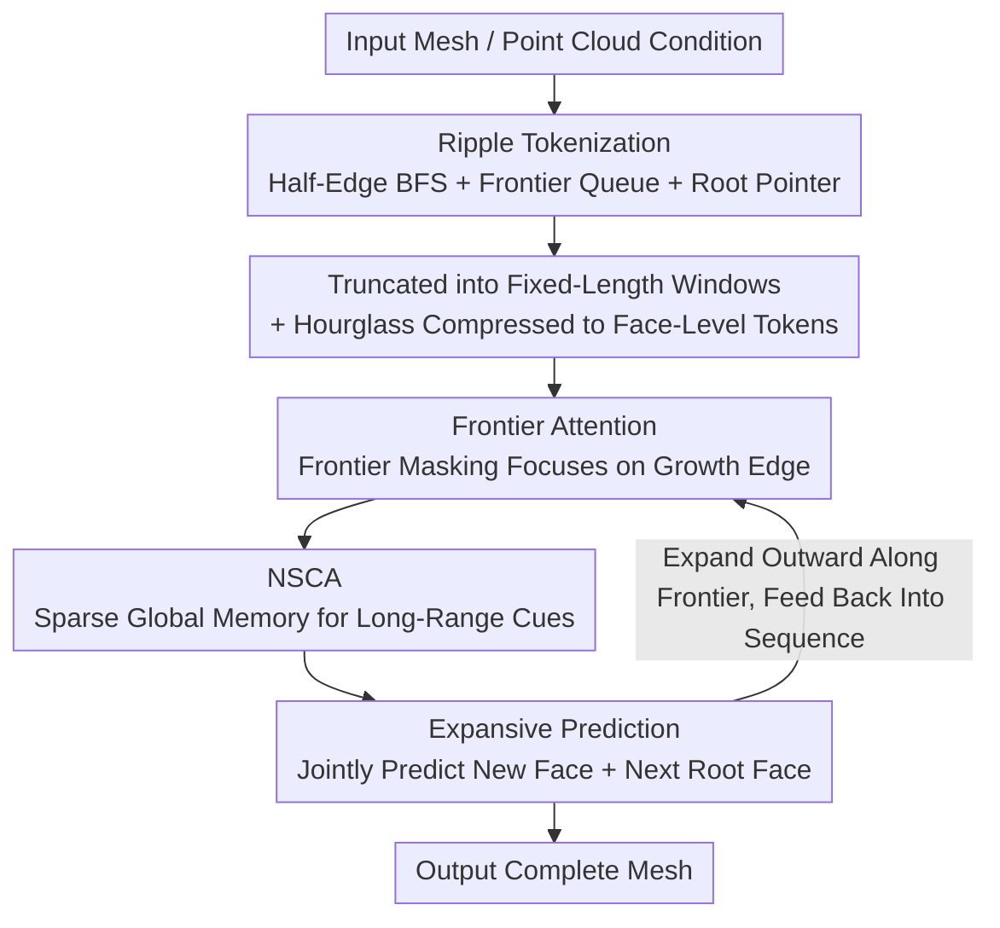

# MeshRipple: Structured Autoregressive Generation of Artist-Meshes

**Conference**: CVPR 2026  
**Paper**: [CVF Open Access](https://openaccess.thecvf.com/content/CVPR2026/html/Lin_MeshRipple_Structured_Autoregressive_Generation_of_Artist-Meshes_CVPR_2026_paper.html)  
**Code**: None (Project page https://maymhappy.github.io/MeshRipple/ )  
**Area**: 3D Vision  
**Keywords**: 3D mesh generation, autoregressive, mesh tokenization, topological alignment, sparse attention

## TL;DR
MeshRipple enables autoregressive mesh generation to propagate outward from an "active generation frontier" like ripples on water: through a "frontier-aware BFS tokenization," the relevant context of the next face is locked at the end of the sequence, ensuring that the truncated training window naturally covers the necessary local neighborhood. Combined with an expansive decoding scheme of "jointly predicting the face and the next root face" and a sparse global memory module, it fundamentally alleviates frequent holes and fragments common in existing mesh generation methods, thoroughly outperforming recent strong baselines on artist-mesh generation.

## Background & Motivation

**Background**: Direct generation of meshes has two main pathways. One is using diffusion models to generate a continuous field in latent space, followed by Marching Cubes to extract the surface (e.g., 3DShape2VecSet, CLAY, Trellis). While the geometry is acceptable, the topology is uncontrollable, resulting in overly dense, irregular meshes that do not align with artist workflows and require heavy post-processing. The other is the autoregressive (AR) route: serializing meshes into face/vertex tokens and learning a next-token distribution that respects mesh connectivity (MeshGPT, MeshAnythingV2, BPT, DeepMesh, etc.), which yields more structured and production-ready "artist-meshes."

**Limitations of Prior Work**: After serialization, the token stream of large and detailed meshes becomes extremely long, which cannot fit into AR training. Consequently, state-of-the-art (SOTA) methods commonly employ "truncated training": cutting sequences into fixed-length windows, training each window independently, and using a rolling KV cache during inference to approximate longer contexts. The issue is that existing tokenization schemes (coordinate sorting, depth-first expansion, block/patch coding) **do not guarantee that the genuinely relevant neighborhood tokens of the next face fall within the truncated window**. The model is frequently forced to predict connectivity without seeing the correct local neighborhood, resulting in holes, disconnected surfaces, and fragmented components. Using a rolling KV cache during inference does not solve this, as the model was never consistently trained under the "true context." While DeepMesh, MeshRFT, and QuadGPT employ reinforcement learning or preference fine-tuning to improve topological quality and style, they do not resolve connectivity errors programmatically.

**Key Challenge**: There is a misalignment between the truncated window (which must be finite due to GPU memory constraints) and where the topologically relevant context of the next face actually resides in the sequence. Since the tokenization order is dictated by geometry/coordinates rather than "which faces are adjacent to the face currently being generated," relevant tokens are often scattered outside the window.

**Goal**: To design a tokenization + model scheme such that: (1) for any next face to be predicted, its relevant neighborhood **always** falls at the tail of the sequence and is covered by the truncated window; (2) the decoding process is constrained to "grow along a coherent surface" rather than sampling triangles in a free, chaotic manner; (3) long-range cues like symmetry and repetition can still be utilized without exceeding GPU memory limits.

**Key Insight**: The authors observe that if the generation order of faces tightly follows the topology of the mesh surface, propagating outward like ripples from an "active frontier", then the "faces adjacent to the next face" will naturally be the ones most recently generated, which always reside at the tail of the sequence.

**Core Idea**: To leverage "frontier-aware half-edge BFS traversal" to align the tokenization order with the surface topology, enabling the truncated window to naturally contain the correct local context, while constraining the generation to connected growth along the frontier using expansive decoding and supplementing long-range dependencies with sparse global attention.

## Method

### Overall Architecture

MeshRipple addresses the generation of large and topologically complete meshes under truncated AR training. The overall pipeline is: the input mesh (or point cloud condition) is first serialized into a token sequence via **Ripple Tokenization**, and then cut into fixed-length truncated windows to feed into a structured AR Transformer. Hourglass layers are used at both ends of the model to convert between coordinate-level, vertex-level, and face-level tokens. The backbone consists of $2\times N$ identical blocks, where each block contains a **Frontier Attention** layer (frontier masking), a self-attention layer, a point cloud conditional cross-attention layer (omitted in the figure), and an **NSCA** layer (native sparse contextual attention). Finally, an **Expansive Prediction** head jointly predicts the 'new faces grown from the current root face' and the 'next root face to be expanded,' progressively pushing the surface outward.

### Key Designs

**1. Ripple Tokenization: Locking Topologically Relevant Context to the Sequence Tail**

This is the core of the entire paper. To address the fundamental pain point where "relevant tokens fall outside the truncated window," the authors abandon coordinate sorting or depth-first traversals that decouple from topology, and instead propose a **half-edge BFS face traversal assisted by an explicitly and dynamically maintained frontier queue**. Given a triangular mesh $M=(V,F)$, the vertex coordinates are first normalized to a canonical bounding box and quantized (256 bins). Each face $F_i=[v_0^i,v_1^i,v_2^i]$ is oriented counter-clockwise according to its outward normal, yielding three directed half-edges $(v_0\!\to\!v_1),(v_1\!\to\!v_2),(v_2\!\to\!v_0)$. Two faces are adjacent if they share a pair of twin half-edges. Starting from a seed face $F_s$, a half-edge BFS is executed: for each face, its three half-edges are examined in a fixed (counter-clockwise) order. If the adjacent face on the twin side has not been visited, it is marked as visited, appended to sequence $S$, and queued for expansion. Consequently, new faces are discovered strictly in the local half-edge order of their root faces, leading to a deterministic, topology-respecting BFS order.

The key lies in the "frontier queue + root pointer": a FIFO frontier queue $B_i$ is maintained for each face $F_i$. When face $F_i$ is appended to $S$, a root index $r_i\in\{1,\dots,|S|\}$ is recorded, indicating which face $F_{r_i}\in B$ in the queue it grew from (i.e., which shared edge attaches it). If all neighbors of a root face are visited, it is popped from the queue. Due to the properties of BFS, $F_{r_i}$ is always the first face in $B_i$. Consequently, each face carries structural information of $F_i\leftarrow\{r_i,B_i\}$, ensuring that the **active frontier is always near the end of the sequence**. The truncated window covering the last $L$ tokens will inevitably contain the local context required to predict the next face, directly resolving the topology-context misalignment. Furthermore, the root index $r_i$ constrains the sampling to valid boundary positions, significantly reducing topological ambiguity and broken surfaces. It is also friendly to non-manifolds: all twins of non-manifold edges are recorded, and each adjacent face is processed as a valid neighbor. Non-manifold vertices are naturally sliced into disconnected components. Multi-component meshes undergo independent BFS processes, with a special control token $N$ inserted between them. Compared to the concurrent work Mesh Silksong (which also uses BFS), this work avoids tokenizing vertices and edges together (preventing vocabulary explosion) and instead explicitly maintains a "boundary face frontier set," yielding a simpler prediction space while naturally supporting non-manifolds.

**2. Frontier Attention: Constraining Attention Strongly to Growth Boundaries**

Simply having a topological tokenization order is insufficient, as the model might still attend to tokens in the window that are irrelevant to "the face currently being grown." To solve this, the authors add a frontier attention layer over the face-level tokens: for a query at position $i$, only faces that belong to its frontier queue $B_i$ and do not exceed the current position are assigned non-negative logits, while all others are masked:

$$M^b_{i,j}=\begin{cases}0, & F_j\in B_i \text{ 且 } j\le i\\ -\infty, & \text{otherwise}\end{cases}$$

This forces the model to focus primarily on the faces of the "active growth boundary" that are genuinely responsible for structural connectivity when predicting the next face, and gradients are routed back to these tokens. It pairs with Ripple Tokenization: while tokenization ensures that relevant faces are near the tail, frontier attention concentrates computation and gradients onto the specific faces that are actually growable within that subset, rather than spreading them across the entire window.

**3. Native Sparse Contextual Attention (NSCA): "Infinite Receptive Field" Under Bounded Memory**

While frontier attention provides precise local structure, many meshes possess **long-range** regularities like symmetry and repetition, which remain unseen in truncated windows. Traditional sliding window inference approximates long-range context via rolling KV caches, which compromises training-inference consistency. The authors propose NSCA: a causal, memory-bounded mechanism that allows queries to access the "entire mesh history." Specifically, coordinate-level embeddings are first obtained for the complete face sequence, aggregated to the vertex level, concatenated channel-wise to form one token per face, and projected to the latent dimension via a small MLP. The complete face sequence is partitioned into non-overlapping blocks. Crucially, queries come from the truncated window, while the keys/values for NSCA come from the complete sequence, resulting in mismatched lengths. Hence, causal masking is applied at both block and token levels: any block containing tokens beyond the current position is masked to $-\infty$. Following DeepSeek's Native Sparse Attention, each valid block is compressed into a compressed KV pair. The host model's hidden states act as queries to compute importance values for each compressed block, selecting the top-k blocks, and retrieving the uncompressed raw KVs of these blocks. Concurrently, a standard local window is preserved for each token. A lightweight router learns to weightedly fuse three pathways—compressed block tokens, detailed tokens from top-k selected blocks, and the local window—which serves as the context memory for the query. This complements local truncated windows: it utilizes global long-range cues while capping computation and memory footprint close to a constant (shown in Table 4, where naive full attention OOMs on 50K/100K faces, but NSCA runs successfully).

**4. Expansive Prediction: Jointly Predicting 'New Face + Next Root Face' to Force Connected Growth along the Frontier**

Standard AR models only predict the next face token, which cannot guarantee that the generated face strictly attaches to a valid boundary. The authors modify this to expansive decoding: at each step, they **jointly** predict the "new face grown from the current root face" and the "next root face to be expanded along the frontier." The latter does not directly predict any face coordinate token on the next root; instead, it predicts "how many steps to move forward along the FIFO frontier from the current root face." Formally, let the root indices of two adjacent faces $F_i,F_{i+1}$ in the sequence be $r_i,r_{i+1}$, and define the offset step as $\Delta_{i+1}=r_{i+1}-r_i$ (with $\Delta=0$ if they share the same root). A lightweight pointer head performs attention over intermediate hidden states to output $p_\theta(\Delta_{i+1})$, and the root loss is standard cross-entropy:

$$L_{root}=-\sum_i \log p_\theta(\Delta_{i+1}\mid F_t, t\le i)$$

The total training objective is the sum of the next-root-face prediction loss and the standard next-face prediction loss. During inference, the dynamic FIFO frontier queue $B$, the generated sequence, and the current root face $F_r$ are maintained. When predicting the next face, **all candidate faces that do not attach to $F_r$ are masked out**. We sample from the remaining candidates to obtain $F^*$, append $F^*$ to both the complete sequence (for NSCA) and the AR input, and merge it into the frontier queue. The root pointer head predicts $\Delta$, moves $\Delta$ steps forward along the frontier to select the next root face $F'_r$, pops all faces prior to $F'_r$ from the queue, updates both sets of masks, and proceeds to the next iteration. Predicting relative offsets instead of absolute coordinates is crucial (see Table 3), as it converts the "next root" from a query in a massive coordinate space into a classification problem over small integer offsets, which is significantly more stable and accurate.

### Loss & Training
The total loss is the sum of the "next-face prediction" loss (standard AR cross-entropy) and the "next root-face offset prediction" loss $L_{root}$ (Equation 3). Truncated training is adopted from MeshTron/DeepMesh: cutting mesh sequences into fixed-length windows and padding short ones. The architecture uses an hourglass configuration of [4,4,9], with an embedding dimension of 1024, a 100-class next-root prediction head, and 256 bins for vertex quantization. For the point cloud condition, a Michelangelo encoder is used to encode 16,384 randomly selected points out of 40,960 uniformly sampled points per mesh, which are then injected via cross-attention. The maximum mesh length is 20k faces, and the input sequence length is 1k faces. AdamW is used with a cosine learning rate scheduler, decaying from $1\times10^{-4}$ to $1\times10^{-5}$, with a weight decay of 0.1. Training takes 16 A800 GPUs for 16 days.

## Key Experimental Results

The dataset is constructed from Objaverse-XL, G-Objaverse, ShapeNet, Toys4K, and 3D-FUTURE, filtering out meshes with face counts >20k or <500, serious discretization artifacts, connected components >20, or self-intersection ratios >10, resulting in approximately 300,000 meshes. For evaluation, 1024 points are uniformly sampled from both the generated meshes and the ground truth (GT), reporting Chamfer Distance (CD), Hausdorff Distance (HD), and Normal Consistency (NC).

### Main Results

| Dataset | Method | CD(↓, ×10³) | HD(↓) | NC(↑) |
|--------|------|------|------|------|
| Dense | DeepMesh | 50.27 | **0.0893** | 0.6025 |
| Dense | **Ours** | **48.73** | 0.1057 | **0.6280** |
| Artist | FastMesh | 47.26 | 0.0972 | 0.0106 |
| Artist | DeepMesh | 51.11 | 0.1023 | 0.3174 |
| Artist | **Ours** | **46.68** | **0.0938** | **0.5166** |

On artist-meshes, the proposed method achieves **SOTA across all three metrics** (CD/HD/NC); on dense meshes, it achieves the best CD/NC, with HD slightly trailing DeepMesh. Notably, there is a massive disparity in computational resources: DeepMesh utilizes 128 A100 GPUs for 4 days of pre-training plus DPO post-training, whereas the proposed method only requires 16 days on 16 A800 GPUs, yet achieves superior or comparable results. Qualitatively (Figure 4), BPT/MeshAnythingV2/FastMesh/Mesh Silksong frequently lose fine topology or produce holes/fragments, whereas the proposed method is simultaneously more detailed than these baselines and structurally more stable than DeepMesh.

### Ablation Study

For 5k-face meshes on a 128-mesh validation subset:

| Configuration | CD | ΔCD | HD | ΔHD | Description |
|------|----|----|----|----|------|
| Full Model (Ours) | 52.67 | — | 0.1058 | — | Full model |
| w/o Root Constraint | 65.08 | **+12.41** | 0.1180 | +0.0122 | Without root face constraint, causing the largest drop |
| w/o Context Injection | 60.56 | +7.89 | 0.1176 | +0.0118 | Only local window, no historical context |
| w/o Non-manifold | 57.75 | +5.08 | 0.1193 | +0.0135 | Without non-manifold encoding |
| w/o Frontier Mask | 54.79 | +2.12 | 0.1199 | +0.0141 | Without frontier mask |
| w/o NSCA | 52.43 | −0.24 | 0.1025 | −0.0033 | Replaced with dense full attention (accuracy slightly improves but memory explodes) |

Root-face prediction strategy (Table 3): predicting relative offsets is significantly superior to predicting absolute coordinates—MMD 15.26 vs 19.26, 1-NAA 50.73 vs 71.71, COV 58.29 vs 47.56.

Memory/Time (Table 4, NSCA kernel 32, stride 16, compression block 64, top-16 blocks): For 50K faces (window 5K) and 100K faces, naive full attention directly suffers from **OOM**, while NSCA runs successfully at 1.229s/48.46GB and 1.275s/49.19GB, respectively.

### Key Findings
- **Root face constraint makes the largest contribution**: removing it causes the CD to surge by +12.41, demonstrating that "constraining generation to valid frontier boundaries" is the lifeblood of connectivity and topological integrity, far more important than simple attention mechanisms.
- **NSCA trades negligible accuracy for massive memory savings**: removing NSCA (switching to dense full attention) actually slightly decreases CD by 0.24 and HD by 0.0033, but dense attention OOMs on $\ge$50K faces; NSCA allows the method to scale to 100K faces, which is the key enabler for scaling up generation.
- **Context injection has significant value**: using only local windows without historical context leads to a CD increase of +7.89, confirming that long-range clues like symmetry/repetition are indeed important.
- **Predicting offsets is superior to predicting coordinates**: changing the next root face from a query in a large coordinate space to a small integer offset classification yields overall improvements across all three metrics, proving to be a simple yet highly effective design choice.

## Highlights & Insights
- **The perspective of "aligning tokenization order with topology" is elegant**: while previous work focused heavily on "how to compress tokens to reduce memory," this paper changes the angle—since the window is inevitably finite, let the tokenization guarantee that "the items to be attended to are always within the window." This converts what was treated as a model/memory limitation into a data-ordering (tokenization) problem.
- **The frontier queue + root pointer serve as the glue connecting "tokenization" with "training/inference consistency"**: the FIFO frontier naturally pushes relevant context to the end of the sequence, and the root pointer constrains the sampling space to boundary faces, simultaneously improving training alignment and inference stability.
- **NSCA decouples "infinite receptive field" from "bounded memory"**: the three-pathway structure—compressed blocks + top-k selection + local window + gated fusion—is a generic memory schema that can be directly transferred to other long-sequence AR tasks (e.g., long video or document generation).
- **The extension to scene-level generation is elegant**: replacing the component control token $N$ with semantic tokens like CABINET/BED/CHAIR... demonstrates the natural adaptability of the frontier mechanism to multi-component, non-manifold, and topologically diverse scenes.

## Limitations & Future Work
- The authors admit that massive label noise or extreme configurations can degrade model performance.
- Currently, the coordinate quantization resolution (256 bins) and maximum face count (20k in training / up to 100k in experiments) remain limited. Future plans include increasing quantization resolution, scaling up to 100K faces, extending to quad meshes, and integrating with RL preference fine-tuning.
- Self-identified limitations: The ablation showing that "accuracy slightly improves when NSCA is removed" indicates that NSCA's primary value is saving memory rather than increasing accuracy; for small meshes, its approximation might be a minor burden. The method heavily relies on the input mesh being clean enough for half-edge traversal, and its robustness to severely damaged or degraded meshes (while non-manifolds are handled, severe defects may not be) is not fully validated. Image-conditioned generation is a two-stage pipeline ("TRELLIS generates mesh $\to$ extract point cloud $\to$ feed into ours") instead of end-to-end, so the quality is bottlenecked by the first stage.

## Related Work & Insights
- **vs DeepMesh / MeshRFT / QuadGPT**: These methods use RL/preference fine-tuning to "patch up" topological quality and style on top of existing tokenizations *post hoc*, but fails to address the root cause of "relevant context falling outside the window." This work aligns topology with truncated training from a tokenization perspective, reducing broken surfaces at the source, and requires an order of magnitude less computation.
- **vs Mesh Silksong (concurrent work)**: While it also utilizes BFS traversal, Silksong tokenizes vertices and edges together, leading to a massive vocabulary, and requires preprocessing for non-manifolds. In contrast, this work explicitly maintains only the "boundary face frontier set," keeping the prediction space simpler and naturally supporting non-manifolds.
- **vs MeshGPT / MeshAnythingV2 / BPT / EdgeRunner**: These rely primarily on coordinate sorting, EdgeBreaker traversal, or block/patch encoding, focusing on compression without guaranteeing that the truncated window contains the correct neighborhood. This work prioritizes topological alignment as its primary goal, achieving superior connectivity.
- **vs Diffusion + Marching Cubes (CLAY/Trellis/Sparc3D)**: This paradigm produces high-quality geometry but overly dense, uncontrollable topology that demands heavy post-processing. This work directly outputs artist-styled, topologically optimized meshes.

## Rating
- Novelty: ⭐⭐⭐⭐⭐ "Frontier-aware BFS tokenization locking the relevant context to the tail of the sequence" is a root-cause-level solution for truncated AR mesh generation with a unique perspective.
- Experimental Thoroughness: ⭐⭐⭐⭐ Evaluated on two categories of meshes using 5 baselines with a comprehensive ablation study, memory comparison, and scene-level extension. The slight performance lagging in HD on dense meshes and the two-stage image conditional generation leave a small gap.
- Writing Quality: ⭐⭐⭐⭐ The "ripple" metaphor is highly intuitive, the methodological logic is very clear, and Figures 2/3 illustrate the tokenization and model structure directly.
- Value: ⭐⭐⭐⭐⭐ Significantly reduces broken surfaces and achieves SOTA with low computation. The NSCA memory paradigm and scene-level extensions exhibit high transferability, offering substantial utility for 3D content production.

<!-- RELATED:START -->

## Related Papers

- [\[CVPR 2026\] MeshMosaic: Scaling Artist Mesh Generation via Local-to-Global Assembly](meshmosaic_scaling_artist_mesh_generation_via_local-to-global_assembly.md)
- [\[CVPR 2026\] FlashMesh: Faster and Better Autoregressive Mesh Synthesis via Structured Speculation](flashmesh_faster_and_better_autoregressive_mesh_synthesis_via_structured_specula.md)
- [\[CVPR 2026\] FACE: A Face-based Autoregressive Representation for High-Fidelity and Efficient Mesh Generation](face_a_face-based_autoregressive_representation_for_high-fidelity_and_efficient_.md)
- [\[CVPR 2026\] PointNSP: Autoregressive 3D Point Cloud Generation with Next-Scale Level-of-Detail Prediction](pointnsp_autoregressive_3d_point_cloud_generation_with_next-scale_level-of-detai.md)
- [\[CVPR 2026\] Repurposing 3D Generative Model for Autoregressive Layout Generation](repurposing_3d_generative_model_for_autoregressive_layout_generation.md)

<!-- RELATED:END -->
