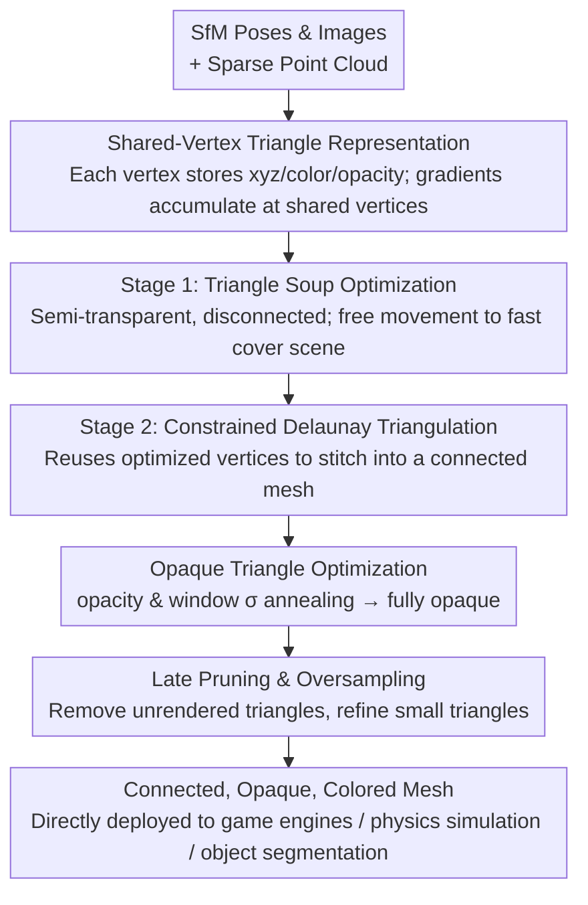

# MeshSplatting: Differentiable Rendering with Opaque Meshes

**Conference**: CVPR 2026  
**Paper**: [CVF Open Access](https://openaccess.thecvf.com/content/CVPR2026/html/Held_MeshSplatting_Differentiable_Rendering_with_Opaque_Meshes_CVPR_2026_paper.html)  
**Code**: None (Project page only: https://meshsplatting.github.io/)  
**Area**: 3D Vision  
**Keywords**: Novel View Synthesis, Differentiable Rendering, Triangle Mesh, Constrained Delaunay Triangulation, Opaque Primitives

## TL;DR
MeshSplatting reformulates the "point cloud/triangle soup" paradigm of 3DGS/triangle splatting into the end-to-end optimization of a connected, opaque, vertex-colored triangle mesh. By utilizing shared vertices, constrained Delaunay triangulation, and opacity/smoothness scheduling, it directly produces meshes compatible with game engines like Unity without post-processing. It improves PSNR on MipNeRF360/T&T by +0.69 dB while achieving 2× faster training and 2× lower GPU memory consumption.

## Background & Motivation
**Background**: 3D Gaussian Splatting (3DGS) has achieved real-time, high-fidelity novel view synthesis using millions of anisotropic Gaussian primitives, becoming the dominant paradigm. Subsequent works either improve the primitives (e.g., 2D Gaussians, generalized Gaussians, convex shapes, linear primitives, voxel fields) or convert the trained Gaussian fields into meshes (e.g., TSDF for 2DGS and RaDe-GS, Marching Tetrahedra for GOF).

**Limitations of Prior Work**: Point-based or semi-transparent primitives like Gaussians are inherently incompatible with classic graphics pipelines (such as game engines, simulators, and AR/VR), which rely on depth buffering and occlusion culling, whereas Gaussian rendering requires sorting and alpha blending. Furthermore, converting Gaussians to meshes suffers from two main drawbacks: (1) The conversion is a non-differentiable post-processing step; running geometry extraction and color baking separately inevitably degrades visual quality and increases overall pipeline time. (2) Although Triangle Splatting (Held et al.) replaces the primitives with triangles, it produces disconnected "triangle soups," and the triangles are not truly opaque after training—turning them into opaque renderings in engines severely degrades rendering quality, nor can they be used for physical simulations.

**Key Challenge**: The "differentiable and easy-to-optimize" nature required by neural rendering demands that primitives remain semi-transparent and unconstrained during early training (allowing gradients to propagate through occlusions and enabling triangles to move freely to cover the scene). Conversely, downstream graphics pipelines require the final primitives to be opaque, connected manifold meshes. These two objectives conflict at opposite ends of the optimization process.

**Goal**: Rather than relying on post-hoc reconstruction, the goal is to directly optimize a connected, opaque, and colored triangle mesh end-to-end, while preserving the visual quality and training efficiency of novel view synthesis.

**Key Insight**: Early training is better optimized using unconstrained representations, and connectivity and opacity constraints should be introduced progressively. These conflicting objectives are separated temporally using a "soup-to-mesh + opacity/smoothness annealing" schedule.

**Core Idea**: Instead of using isolated triangles or Gaussians, shared-vertex triangles are employed. The optimization begins with a semi-transparent triangle soup, which is later "stitched" into a connected mesh using constrained Delaunay triangulation. An annealing schedule for opacity and window parameters drives the triangles to fully opaque state, directly outputting game-ready meshes without post-processing.

## Method

### Overall Architecture
MeshSplatting takes SfM poses, images, and a sparse point cloud as input, and outputs a connected, opaque, vertex-colored triangle mesh. The pipeline adopts the differentiable volume rendering primitives of Triangle Splatting, but reformulates the representation and optimization into two stages. Stage 1 initializes a semi-transparent, disconnected triangle soup from the SfM point cloud and optimizes it freely to cover the scene geometry and appearance. Stage 2 applies a constrained Delaunay triangulation to the optimized triangles to restore global connectivity, followed by fine-tuning of vertex positions and appearance. Throughout both stages, adjacent triangles share vertices (gradients accumulate at shared vertices), and the opacity $o$ and window smoothness $\sigma$ are annealed to transition the triangles from "semi-transparent and easy-to-optimize" to "fully opaque and engine-compatible." Pruning is performed at the end of training to remove triangles that are never rendered.

### Key Designs

**1. Shared-Vertex Triangle Representation: Transforming "Triangle Soup" into a Differentiable Manifold Mesh**

In Triangle Splatting, each triangle $T_m$ is defined by three independent vertices $v_i\in\mathbb{R}^3$, color $c_m$, smoothness $\sigma_m$, and opacity $o_m$, without sharing vertices between triangles. This leads to two critical flaws: adjacent triangles optimize independently, resulting in cracks, and $\sigma$ and $o$ act as independent, unconstrained parameters that cannot be pushed to be fully opaque. MeshSplatting instead maintains a globally shared vertex set $V=\{v_i\}$, where each vertex $v_i=(x_i,y_i,z_i,c_i,o_i)$ stores position, color, and opacity. A triangle is represented by three vertex indices, its opacity is computed as the minimum of its three vertices' opacities $o_{T_m}=\min(o_i,o_j,o_k)$, and the interior color of the triangle is obtained via barycentric interpolation of the three vertex colors.

The key advantage of this representation lies in backpropagation: since a vertex is shared by multiple adjacent triangles, the gradients from all incident faces accumulate at that single vertex during backpropagation. This forces the vertex to update consistently with all incident triangles, establishing the physical foundation for learning manifolds and connectivity. In a triangle soup, each triangle vertex receives independent gradients, preventing them from merging. Furthermore, this representation is parameter-efficient: with Spherical Harmonics (3rd order), each vertex contains 51 parameters (48 SH + 3 position) plus 3 indices per triangle, compared to 59 parameters per 3D Gaussian.

**2. Two-Stage Optimization from Triangle Soup to Connected Mesh: Stitching with Constrained Delaunay**

Directly optimizing a mesh with strict connectivity constraints from scratch is prone to sub-optimal local minima due to over-constrained optimization and sensitivity to initialization. Leveraging the insight that unstructured representations are easier to optimize in early stages, MeshSplatting splits the optimization into two stages. Stage 1 initializes an equilateral triangle at each SfM 3D point (with scale proportional to the average distance to its three nearest neighbors, random orientation, and initial semi-transparency $o_i=0.28$). Free from connectivity and manifold constraints, each triangle moves freely like a point primitive to quickly fit the geometry and appearance of the visible scene. Note that the interpolated vertex variables within each triangle are already being optimized at this stage, rather than keeping them flat as in Triangle Splatting.

Stage 2 performs a constrained Delaunay triangulation on the optimized triangle soup. It first computes a standard Delaunay tetrahedralization, then selects the tetrahedra faces whose dual Voronoi edges intersect the surface of the triangle soup, resulting in a connected mesh that approximates the surface and locally satisfies Delaunay quality properties. Crucially, this step does not introduce new vertices or modify vertex positions; it reuses the already optimized vertices, thereby preserving the previously learned spatial accuracy and appearance. Once the connectivity is established, the vertex positions and appearance are fine-tuned, utilizing vertex sharing to accumulate gradients at shared vertices. Since Stage 1 populates the scene with a sufficiently dense set of triangles, no face/vertex division is needed here; oversampling is enabled only in the final iterations to allow small triangles to receive gradients and be optimized.

**3. Opaque Triangle Optimization: Pushing Semi-Transparency to Full Opacity via Dual Annealing**

Using strictly opaque triangles introduces optimization challenges: if the primitives are opaque from the start, gradients cannot pass through occlusions, causing optimization to stall. Therefore, the representation must remain semi-transparent during early training and transition smoothly to opacity. This is achieved via a dual-variable annealing schedule. **Opacity Scheduling**: The opacity $o$ is optimized freely for the first 5k iterations, after which it is reparameterized as $o'(o)=O_t+(1-O_t)\cdot\mathrm{sigm}(o)$, where $O_t$ is linearly ramped from 0 to 1 over time. When $O_t=0$, sigmoid maps the opacity smoothly to $[0,1]$; when $O_t=1$, all opacities are forced to 1 (fully opaque), pushing all triangles to be opaque. **Window Parameter Scheduling**: In the window function

$$I(p)=\left[\mathrm{ReLU}\frac{\phi(p)}{\phi(s)}\right]^{\sigma}$$

$\sigma$ controls the sharpness of the transition from the triangle incenter (value 1) to its boundary (value 0). MeshSplatting defines $\sigma$ as a single parameter shared across all triangles, linearly annealing it from $1.0$ (soft transition for robust early gradients) to $0.0001$ (hard sharp triangles). Unlike Triangle Splatting where $\sigma$ is optimized independently per triangle, this shared annealing strategy stabilizes early gradients while ensuring late-stage convergence to sharp, opaque triangles.

### Loss & Training
**Densification**: Inspired by 3DGS-MCMC, candidate triangles for densification are sampled based on a Bernoulli probability distribution constructed from the triangle opacities $o$. Midpoint subdivision is performed on the selected triangles (connecting edge midpoints to form 4 smaller triangles). The new midpoints are added to the vertex set, with their colors and opacities set to the average of their adjacent vertices. Thanks to connectivity, a subdivision step adds only 6 new vertices in the connected setting, compared to 12 in a triangle soup.

**Pruning**: All triangles with $o<0.2$ are pruned at the 5k-th iteration (before opacity scheduling starts), removing about 70% of the primitives. During the remaining part of Stage 1, the volume rendering blending weight $w=T\cdot o$ under each view is monitored, and occluded triangles with $w<O_t$ are pruned. Pruning is turned off during Stage 2, and a final pruning step is performed across all training views at the end of training to remove any triangles that were never rendered.

**Loss Function**: The loss is a combination of the photometric $L_1$ and $L_{D\text{-}SSIM}$ losses from 3DGS, along with opacity loss $L_o$, depth alignment loss $L_z$, normal loss $L_n$, and depth loss $L_d$:

$$L=L_{3DGS}+\beta_o L_o+\beta_z L_z+\beta_n L_n+\beta_d L_d$$

Here, the depth alignment loss $L_z=\frac{1}{N}\sum_i|z_i-z_i^*|$ aligns the predicted depth $z_i$ of each rendered vertex with the sampled rendered depth $z_i^*$. It operates on a per-vertex basis independently of local mesh connectivity (unlike connectivity-dependent regularizations such as Laplacian or normal consistency), thereby facilitating manifold generation. Monocular depth maps from Depth Anything v2 are used with scale-and-shift alignment, and normal supervision is provided by either an external normal prediction network or 2DGS self-supervised normal regularization (both are used in the experiments; pure self-supervision is used for DTU mesh quality evaluation).

**Rendering Equation**: Pixel color is accumulated in depth order over all overlapping triangles as $C(p)=\sum_n c_{T_n}o_{T_n}I(p)\prod_{i<n}(1-o_{T_i}I(p))$. Because the triangles become fully opaque by the end of training, this simplifies to $C(p)=c_{T_n}I(p)$, requiring only a single evaluation per pixel (zero over-draw) and significantly accelerating rendering.

## Key Experimental Results

Datasets: MipNeRF360, Tanks&Temples (for Novel View Synthesis - NVS), DTU (for surface reconstruction, evaluated via Chamfer distance); metrics include PSNR/LPIPS/SSIM, vertex count $|V|$, training time, GPU memory, and FPS. The task is formulated as **Mesh-Based Novel View Synthesis** (measuring the visual consistency of the reconstructed mesh rendering with reference views).

### Main Results: Mesh-based NVS (Mip-NeRF360 / T&T)

| Method | Mesh | Ready | PSNR↑ (360) | LPIPS↓ (360) | SSIM↑ (360) | \|V\|↓ (360) | PSNR↑ (T&T) | LPIPS↓ (T&T) | SSIM↑ (T&T) |
|------|------|-------|------|------|------|------|------|------|------|
| 2DGS | ✗ | ✓ | 15.36 | 0.474 | 0.498 | 2M | 14.23 | 0.485 | 0.569 |
| GOF | ✗ | ✓ | 20.78 | 0.465 | 0.573 | 33M | 21.69 | 0.326 | 0.690 |
| RaDe-GS | ✗ | ✓ | 23.56 | 0.361 | 0.668 | 31M | 20.51 | 0.344 | 0.659 |
| MiLo | ✓ | ✓ | 24.09 | 0.323 | 0.688 | 7M | 21.46 | 0.348 | 0.706 |
| Triangle Splatting† | ✓ | ✓ | 21.05 | 0.462 | 0.558 | 3M | 17.27 | 0.402 | 0.600 |
| **MeshSplatting** | ✓ | ✓ | **24.78** | **0.310** | **0.728** | **3M** | 20.52 | **0.287** | **0.745** |

> † Opaque triangle version only. "Ready" indicates that the output can be directly imported into game engines without custom rendering shaders. MeshSplatting consistently leads in LPIPS (which closely matches human perception) and SSIM. Compared to 2DGS and Triangle Splatting, it achieves a 4–10 dB PSNR improvement with a similar vertex budget. Compared to GOF, RaDe-GS, and MiLo, it secures higher SSIM and lower LPIPS with **2–10× fewer vertices**. Although GOF and MiLo show slightly higher PSNR on T&T, their SSIM is notably lower and LPIPS is higher, indicating that while their meshes contain more details, they also suffer from more artifacts, yielding poorer perceptual quality.

### Training Speed and GPU Memory (Mip-NeRF360)

| Method | Training Time↓ | FPS↑ (HD) | FPS↑ (Full HD) | GPU Memory↓ |
|------|------|------|------|------|
| GOF | 74m | OOM | OOM | 1.5GB |
| RaDe-GS | 84m | OOM | OOM | 1.1GB |
| MiLo | 106m | 170 | 160 | 253MB |
| **MeshSplatting** | **48m** | **220** | **190** | **100MB** |

> MeshSplatting trains in only 48 minutes (35–55% faster than comparable mesh-reconstruction methods) and produces a mesh of only 100MB (2.5–15× smaller). Constrained Delaunay triangulation is run only once, taking less than 2 minutes (whereas MiLo runs Delaunay at every iteration, leading to a 106m training time). On a consumer-grade M4 MacBook, rendering is ~25% faster, while GOF and RaDe-GS run out of memory (OOM).

### Ablation Study (Mip-NeRF360, relative change to Baseline)

| Configuration | PSNR | LPIPS | SSIM | Description |
|------|------|------|------|------|
| Baseline (Full) | 24.78 | 0.31 | 0.728 | Full model |
| w/o SH (pure RGB) | −2.07 | +0.06 | −0.069 | Drops ~2 PSNR; expressive color is critical for opaque meshes |
| w/o $L_d$ | +0.05 | −0.04 | +0.006 | Slight visual improvement, but geometric quality degrades |
| w/o $L_z$ | +0.02 | −0.01 | +0.002 | Same as above; depth alignment sacrifices minor visual quality for geometry |
| w/o $L_n$ | +0.10 | −0.02 | +0.004 | Same as above; normal loss yields smoother surfaces |

### Key Findings
- **Spherical Harmonics colors are crucial for maintaining visual quality in opaque meshes**: Removing SH and using pure RGB drops PSNR by ~2 dB. Since the geometry of a fully opaque, shared-vertex mesh is locked, colors can no longer compensate for local textures by placing triangles in non-physical positions, relying instead on a more expressive appearance model. This suggests that future work could benefit from neural textures to decouple geometry and appearance.
- **Trade-off between geometric regularization and visual fidelity**: Regularizations $L_d/L_z/L_n$ slightly reduce PSNR/SSIM, but significantly improve geometric accuracy and yield smoother surfaces; stronger regularization leads to smoother geometry but lower visual metrics.
- **Connectivity is successfully established** (Garden scene, Table 3): After constrained Delaunay triangulation, approximately 92% of the triangles have $\ge 3$ neighbors. After late-stage pruning, each triangle is connected to an average of ~3.7 neighbors, with isolated triangles accounting for $<2\%$, verifying that the "soup-then-stitch + late pruning" pipeline produces a genuinely connected mesh.
- **DTU Surface Reconstruction**: Under a purely self-supervised setting, MeshSplatting achieves the lowest Chamfer distance in 5 out of 15 scenes. This indicates that while designed for large-scale novel view synthesis, its geometric reconstruction quality is competitive with dedicated surface reconstruction methods.

## Highlights & Insights
- **Decoupling "optimization friendliness" and "deployability" on the timeline**: Transitioning from semi-transparent to opaque and from disconnected to connected is formulated as a progressive annealing or multi-stage process rather than a hard constraint from the start. This "loose-to-tight" scheduling strategy is transferable to any scenario where the training-friendly representation differs from the deployment-friendly representation.
- **Constrained Delaunay triangulation reuses vertices without introducing new ones**: This design preserves spatial accuracy and previously learned appearance in a single step, avoiding the non-differentiable pipeline gap of traditional reconstruction (i.e., extracting a new mesh and then re-learning colors). Running Delaunay only once (compared to MiLo's per-iteration triangulation) cuts training time in half.
- **Zero over-draw rendering simplification**: Since triangles are fully opaque after training, the volume rendering equation simplifies to a single evaluation per pixel $C(p)=c_{T_n}I(p)$. This zero over-draw formulation is the primary reason it achieves real-time speeds on consumer-grade hardware.
- **Opaque + single-triangle-per-pixel assumption unlocks downstream capabilities**: MeshSplatting directly enables physics simulation (such as using meshes as rigid-body colliders in Unity) and **training-free object segmentation** (since a pixel is covered by only one triangle, 2D masks can be associated with their corresponding triangles, eliminating the need to learn object-association fields like in 3DGS).

## Limitations & Future Work
- **Color compensation limits**: The authors acknowledge that when the geometry of a fully opaque mesh is locked, the compensation capability of Spherical Harmonics colors is limited, and strong regularization can degrade rendering quality. Future research could explore neural textures or richer appearance models to decouple geometry and appearance.
- **Reliance on SfM initialization**: Because the initialization relies on COLMAP sparse point clouds, the initial triangle soup quality can degrade in textureless or highly reflective scenes where SfM fails (though this is not analyzed in depth).
- **NVS-focused task alignment**: On the DTU dataset, MeshSplatting only achieves the best Chamfer distance in 5/15 scenes. Its geometric accuracy is competitive with, but does not completely outperform, specialized reconstruction methods.
- **Limitations of the opaque assumption**: Intrinsically semi-transparent materials such as glass, smoke, or extremely fine structures (e.g., bicycle spokes, although mentioned as resolved, or sub-pixel structures) do not fit the assumption of purely opaque triangle representations.

## Related Work & Insights
- **vs Triangle Splatting [Held et al.]**: While both utilize triangles as primitives, Triangle Splatting produces disconnected triangle soups. Its triangles are not truly opaque after training (causing quality drops when rendered opaquely in game engines), and $\sigma$ is optimized independently per triangle. MeshSplatting employs vertex sharing and constrained Delaunay triangulation to stitch a connected mesh; it also achieves fully opaque renderings using shared $\sigma$ annealing and opacity scheduling, completely outperforming the opaque† version on PSNR/SSIM/LPIPS (Table 1).
- **vs MiLo**: MiLo also integrates mesh extraction into the optimization loop. However, its colors must be learned separately, and running Delaunay triangulation at every iteration results in long training runs (106m). MeshSplatting stores colors directly on vertices, runs Delaunay only once (resulting in 48m training), and yields better perceptual quality using 2–10× fewer vertices.
- **vs 2DGS / GOF / RaDe-GS**: These methods treat mesh extraction as a **non-differentiable post-processing step** (such as TSDF, Marching Tetrahedra, or Poisson reconstruction), requiring additional optimization to bake neural colors, which introduces quality loss and high memory overhead (1.1–1.5GB for GOF/RaDe-GS, frequently leading to OOM). MeshSplatting directly optimizes a colored, opaque, connected mesh end-to-end, requiring only 100MB of GPU memory and avoiding OOM.
- **vs BakedSDF / MobileNeRF**: These methods bake or distill implicit neural fields into meshes or polygons, but they introduce additional training overhead. MeshSplatting bypasses intermediate implicit representations, optimizing explicit meshes directly.

## Rating
- Novelty: ⭐⭐⭐⭐⭐ First end-to-end method directly outputting connected, opaque, colored triangle meshes for large-scale real scenes, driven by a refined "soup-then-stitch + dual annealing" schedule.
- Experimental Thoroughness: ⭐⭐⭐⭐ Extensive evaluations on MipNeRF360/T&T/DTU, detailed analysis of speed, memory, and connectivity, though geometric accuracy on dedicated reconstruction datasets is only competitive rather than leading.
- Writing Quality: ⭐⭐⭐⭐⭐ Well-structured motivations; Table 1 effectively quantifies deployability across Mesh, Color, Connect, and Ready properties.
- Value: ⭐⭐⭐⭐⭐ Highly valuable for bridging neural rendering and classical graphics pipelines, enabling out-of-the-box engine deployment, physical simulation, and training-free segmentation.

<!-- RELATED:START -->

## Related Papers

- [\[CVPR 2026\] Parallelised Differentiable Straightest Geodesics for 3D Meshes](parallelised_differentiable_straightest_geodesics_for_3d_meshes.md)
- [\[CVPR 2026\] Hermite Radial Basis Function for Surface Reconstruction via Differentiable Rendering](hermite_radial_basis_function_for_surface_reconstruction_via_differentiable_rend.md)
- [\[NeurIPS 2025\] LinPrim: Linear Primitives for Differentiable Volumetric Rendering](../../NeurIPS2025/3d_vision/linprim_linear_primitives_for_differentiable_volumetric_rendering.md)
- [\[CVPR 2026\] Spherical Voronoi: Directional Appearance as a Differentiable Partition of the Sphere](spherical_voronoi_directional_appearance_as_a_differentiable_partition_of_the_sp.md)
- [\[CVPR 2026\] Radiance Meshes for Volumetric Reconstruction](radiance_meshes_for_volumetric_reconstruction.md)

<!-- RELATED:END -->
