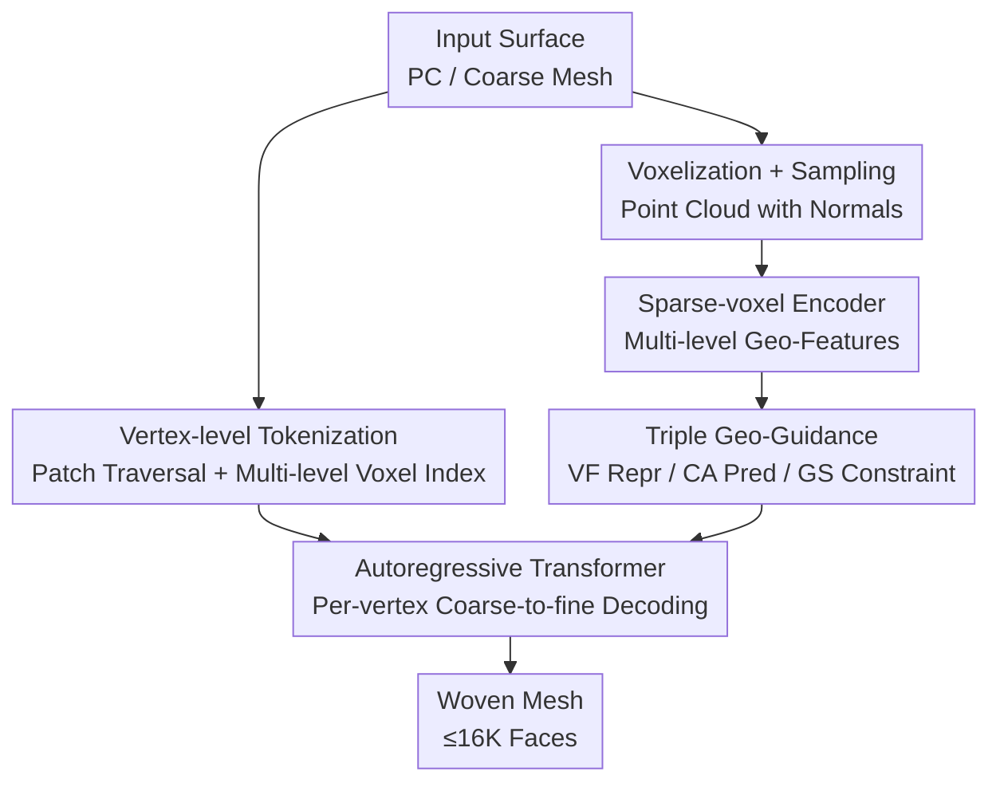

# MeshWeaver: Sparse-Voxel-Guided Surface Weaving for Autoregressive Mesh Generation

**Conference**: CVPR 2026  
**arXiv**: [2606.04688](https://arxiv.org/abs/2606.04688)  
**Code**: To be confirmed  
**Area**: 3D Vision / Autoregressive Generation / Mesh Generation  
**Keywords**: Autoregressive Mesh Generation, Vertex-level tokenization, Sparse Voxels, Surface Weaving, Geometric Guidance

## TL;DR
The authors transform autoregressive mesh generation from "coordinate-by-coordinate prediction" to "vertex-by-vertex weaving." By utilizing a multi-level sparse-voxel encoder to inject local geometry into the generation process across three levels—representation, prediction, and constraint—the method achieves an 18% tokenization compression rate, enables the generation of meshes with up to 16K faces, and significantly enhances geometric fidelity.

## Background & Motivation

**Background**: Autoregressive mesh generation (e.g., MeshGPT, MeshXL) decomposes triangular mesh faces into discrete coordinate sequences, predicting tokens sequentially like a language model to produce clean, low-poly, artist-friendly meshes. This overcomes the limitations of implicit representations (Occupancy Fields + Marching Cubes), which often produce overly dense meshes with messy topology that are difficult to use for downstream editing, deformation, or texturing.

**Limitations of Prior Work**: The mainstream "next-coordinate" paradigm faces two critical issues. First, **low tokenization efficiency**: Naive representation of an $N$-face mesh requires $9N$ tokens. Even with compression techniques like half-edge traversal in EdgeRunner/TreeMeshGPT or block-based indexing in BPT/DeepMesh, compression rates plateau around ~22%, and excessively long sequences prevent scaling to high-poly meshes. Second, **lack of geometric-aware guidance**: Generation relies solely on a global shape embedding and static vocabulary embeddings. Each prediction step lacks local surface cues, leading to accumulated errors, surface drift, and loss of detail.

**Key Challenge**: By treating the task as "shape generation conditioned on a global shape," the model is forced to "blindly guess" coordinates. However, the true strength of mesh generation should lie in "reconstructing topology on known geometry" (similar to re-topology). In this context, fine-grained local geometric priors should be available for every prediction step but are currently bottlenecked by the narrow channel of global embeddings.

**Goal**: (1) Design a more compact tokenization to shorten sequences and scale to 16K faces; (2) Enable every generation step to perceive and adhere to the local geometry of the input surface.

**Key Insight**: The authors reinterpret mesh traversal as "weaving" along a manifold—stitching topology through the surface point-by-point. The fundamental unit of weaving is naturally the vertex, not an individual coordinate.

**Core Idea**: Replace "next-coordinate prediction" with "next-vertex prediction" to shorten sequences, and utilize a hierarchical sparse-voxel encoder to inject local geometry into representation, prediction, and constraints, ensuring the generation is both structurally coherent and faithful to the underlying surface.

## Method

### Overall Architecture
MeshWeaver takes a surface (point cloud or coarse mesh) as input and outputs a clean, low-poly triangular mesh. The workflow is as follows: The surface is voxelized and sampled into a point cloud with normals, and a sparse-voxel encoder extracts multi-level (coarse-to-fine) geometric features. Simultaneously, the mesh is traversed by patches and represented as a "2D vertex token sequence" using multi-level voxel indices. The autoregressive transformer **predicts a complete vertex in a single decoding step** (rather than a single coordinate). During prediction, cross-attention focuses on corresponding sparse-voxel features for local geometry, while the occupancy structure of sparse voxels pins each vertex near the ground-truth surface. The mesh is ultimately woven point-by-point.

### Key Designs

**1. Vertex-level Tokenization: Elevating "Coordinate-by-Coordinate" to "Vertex-by-Vertex Weaving" to eliminate sequence redundancy**

The next-coordinate paradigm splits each vertex's $(x,y,z)$ into three independent tokens, requiring $9N$ tokens for an $N$-face mesh, which makes training and inference prohibitively expensive. The authors' insight is that mesh traversal is essentially "weaving" vertex-by-vertex along a manifold; thus, the modeling unit should be the vertex. They "lift" the 1D coordinate sequence into a 2D vertex sequence. For traversal, they adopt the patch heuristic from BPT: selecting the first unvisited face from a sorted list, setting the vertex connected to the most unvisited faces as the patch center $\bm{o}_i$, and ordering surrounding vertices clockwise. The mesh is thus partitioned into a sequence of local patches $\mathcal{M}=\{\bm{o}_1,\bm{v}_{11},\dots,\bm{o}_P,\bm{v}_{P1},\dots\}$, with $\mathrm{BOS}$ and $\mathrm{EOS}$ tokens for structure. By predicting a complete vertex at each step, model capacity is redirected from "redundant coordinate generation" to structural reasoning, achieving a record-low compression rate of 18%.

**2. Multi-level Vertex Representation: Making "Single-step Full Vertex Prediction" feasible with coarse-to-fine voxel indices**

The difficulty of per-vertex prediction is generating a complete 3D vertex in one step. TreeMeshGPT uses hierarchical MLP heads to predict $p(\bm{v}_i)=p(v_i^z)\cdot p(v_i^y\mid v_i^z)\cdot p(v_i^x\mid v_i^z,v_i^y)$, but this serial decomposition is unnatural given the strong coupling of coordinates. The authors use a multi-level representation inspired by block-based indexing: 3D space is partitioned into $L$ layers, with each layer $l$ subdivided by a factor $D_l$. The finest resolution $R=\prod_{l=0}^{L-1}D_l$ equals the coordinate quantization resolution (default two layers $(16,8)$, i.e., $128^3$, 7-bit). Each vertex is represented as multi-level voxel indices $\bm{v}_i=(v_i^0,\dots,v_i^{L-1})$, and decoding follows coarse-to-fine refinement $p(\bm{v}_j)=\prod_{l=0}^{L-1}p(v_j^l\mid v_j^{<l})$. This maintains the efficiency of "one vertex per step" while framing coordinate coupling as hierarchical conditional prediction.

**3. Triple Geometric Injection via Sparse Voxel Encoder: Ensuring every prediction step perceives and adheres to the local surface**

Prior paradigms compress input point clouds into a global embedding, representing coordinate tokens via shape-agnostic static vocabulary embeddings, which leads to drift. The authors introduce a sparse-voxel encoder (PointNet aggregation + shifted-window sparse attention + sparse convolution) to generate hierarchical voxel features $\mathcal{F}=\{\mathbf{F}^0,\dots,\mathbf{F}^{L-1}\}$. Geometry is injected via three complementary paths: **(i) VF (Voxel Features) as Vertex Representation**: Vertices use features retrieved from voxel indices across layers $\mathbf{e}(\bm{v}_i)=\text{Concat}(\mathbf{F}^0[v_i^0], \dots, \mathbf{F}^{L-1}[v_i^{L-1}])$ instead of static embeddings. **(ii) CA (Cross-Attention) Guided Prediction**: In each prediction head, hidden states act as queries while hierarchical sparse voxel features serve as keys/values to predict a $D_l^3$-dimensional voxel distribution. For $l>0$, attention is restricted to the sub-volume predicted in the previous layer. **(iii) GS (Generation Scaffold) via Sparse Voxels**: Sparse voxels explicitly mark occupied regions. During decoding, logits for empty voxels are set to $-\infty$, forcing every predicted vertex to stay near the surface and suppressing error accumulation.

### Loss & Training
The backbone is a 24-layer LLaMA3-style transformer (hidden 1024 + RoPE) with sparse-voxel and point cloud encoders, totaling 600M parameters. The dataset consists of 800,000 meshes (1K–16K faces) from Objaverse++, ShapeNet, 3D-Future, HSSD, and ABO. Training uses AdamW with cosine decay ($1\times10^{-4}\to1\times10^{-5}$) on 8 GPUs with a batch size of 4 per card for 200K steps (~2 weeks). Two acceleration techniques are noted: **Sub-volume pruning during training**, where cross-attention is computed only on a sampled subset of sub-volumes to reduce overhead, and **CA KV Cache**, where cross-attention keys/values in the prediction heads are cached to avoid redundant projections during decoding.

## Key Experimental Results

### Main Results
Point-cloud-conditioned mesh generation evaluated on Toys4K (4000 meshes / 105 classes). Metrics: Chamfer Distance (CD↓), Hausdorff Distance (HD↓), Normal Consistency (NC↑), and $\lVert$NC$\rVert$↑.

| Method | CD ($\times10^{-1}$)↓ | HD↓ | NC↑ | $\lVert$NC$\rVert$↑ |
|------|------|------|------|------|
| MeshAnythingV2 | 0.213 | 0.169 | 0.194 | 0.878 |
| EdgeRunner | 0.147 | 0.118 | 0.668 | 0.902 |
| BPT | 0.172 | 0.122 | 0.719 | 0.909 |
| TreeMeshGPT | 0.205 | 0.183 | 0.685 | 0.887 |
| Mesh-Silksong (Prev. SOTA) | 0.140 | 0.106 | **0.734** | 0.900 |
| **MeshWeaver (Ours)** | **0.116** | **0.087** | 0.732 | **0.914** |

CD dropped from 0.140 to 0.116, and HD from 0.106 to 0.087, indicating superior geometric alignment. NC is comparable to Mesh-Silksong, while $\lVert$NC$\rVert$ is the highest, showing the best surface orientation preservation.

Tokenization efficiency (Compression Rate = $L/(9N)$, lower is better):

| Method | Compression Rate↓ |
|------|------|
| MeshAnythingV2 | 0.46 |
| EdgeRunner | 0.47 |
| TreeMeshGPT | 0.22 |
| BPT | 0.26 |
| Mesh-Silksong | 0.22 |
| **Ours** | **0.18** |

### Ablation Study
Ablation of the three mechanisms (VF / CA / GS) on Toys4K (Table 3):

| Configuration | CD ($\times10^{-1}$)↓ | HD↓ | NC↑ | $\lVert$NC$\rVert$↑ | Description |
|------|------|------|------|------|------|
| Full Model | 0.116 | 0.087 | 0.732 | 0.914 | Full |
| w/o VF | 0.142 | 0.122 | 0.694 | 0.884 | Voxel features replaced by static embeddings |
| w/o CA | 0.146 | 0.128 | 0.681 | 0.886 | Prediction head degraded to linear classifier |
| w/o VF&CA | 0.158 | 0.138 | 0.660 | 0.865 | Removing both causes heaviest drop |
| w/o GS | 0.122 | 0.090 | 0.715 | 0.909 | Disable logit masking for empty voxels |

### Key Findings
- **VF and CA are primary and complementary for fidelity**: Removing either results in significant drops (CD 0.116 → 0.142/0.146). Removing both leads to the worst performance, proving that voxel feature representation and cross-attention guidance provide complementary geometric priors.
- **GS acts as a "safety belt" to prevent drifting**: Effective only during inference, its removal increases CD from 0.116 to 0.122. Qualitatively, it prevents "surface drift" by constraining generation to the input surface.
- **Efficiency Dividend**: The 18% compression rate allows training on complex meshes (1K–16K faces), whereas MeshAnythingV2/EdgeRunner are limited to <4K faces by their tokenization. KV caching further improves throughput by 14.5%.

## Highlights & Insights
- **Paradigm Reframing is More Impactful than Module Stacking**: Reframing "shape generation" as "re-topology / surface weaving" reopens the channel for local geometric priors that was previously closed by global embeddings.
- **"Per-vertex + Multi-level Voxel Indexing" is a perfect match**: Per-vertex prediction shortens sequences, and multi-level indexing makes single-step 3D vertex generation feasible while naturally interfacing with sparse voxel features.
- **Triple-purpose Sparse Voxels**: The same voxel structure is used for representation, cross-attention KV, and occupancy masking. The use of an occupancy mask as a "hard scaffold" (setting logits to $-\infty$) is a zero-cost trick applicable to any autoregressive task requiring alignment (e.g., layouts, sketches).
- **CA KV Cache**: Extending the KV cache concept from self-attention to cross-attention heads in the prediction layer is a practical engineering insight.

## Limitations & Future Work
- **Compression headroom remains**: Sequence length could be further reduced by adopting a BPT-style separate token set for patch centers to avoid explicit $\mathrm{BOS}$ tokens.
- **Dependency on input geometry**: The paradigm relies on a voxelizable input surface (re-topology view) and is not directly applicable to unconditional or purely text-driven generation from scratch.
- **Depth constraints**: Deeper hierarchies (e.g., $(8,4,4)$) weaken local geometric injection by shrinking the spatial support in later layers.
- **High training cost**: Two weeks on 8 GPUs for 800k meshes. Using Toys4K for evaluation ensures fairness but lacks direct comparability with historical Objaverse-subset metrics.

## Related Work & Insights
- **vs MeshGPT / MeshXL**: These pioneered the autoregressive coordinate sequence paradigm but suffer from long sequences. This work compresses tokens to 0.18 and scales to 16K faces.
- **vs EdgeRunner / TreeMeshGPT**: These use half-edge/edge-sharing for compression (~0.22) but remain coordinate-based. This work improves both compression and fidelity via vertex weaving.
- **vs BPT / DeepMesh**: This work inherits the patch traversal and block indexing logic but upgrades it to "multi-level vertex representation + sparse voxel features."
- **vs Implicit 3D Generation**: Implicit methods require Marching Cubes post-processing, often resulting in messy meshes. This work directly produces structured low-poly meshes.

## Rating
- Novelty: ⭐⭐⭐⭐⭐ "Vertex weaving" paradigm reframing + triple geometric injection is highly original.
- Experimental Thoroughness: ⭐⭐⭐⭐ Extensive ablations; however, limited to the Toys4K dataset for main results.
- Writing Quality: ⭐⭐⭐⭐⭐ Clear progression from motivation to mechanisms; excellent diagrams and explanations.
- Value: ⭐⭐⭐⭐⭐ 18% compression rate and 16K face capability significantly advance the utility of autoregressive mesh generation.

<!-- RELATED:START -->

## Related Papers

- [\[CVPR 2026\] PixARMesh: Autoregressive Mesh-Native Single-View Scene Reconstruction](pixarmesh_autoregressive_mesh-native_single-view_scene_reconstruction.md)
- [\[CVPR 2026\] FACE: A Face-based Autoregressive Representation for High-Fidelity and Efficient Mesh Generation](face_a_face-based_autoregressive_representation_for_high-fidelity_and_efficient_.md)
- [\[ICLR 2026\] Topology-Preserved Auto-regressive Mesh Generation in the Manner of Weaving Silk](../../ICLR2026/3d_vision/topology-preserved_auto-regressive_mesh_generation_in_the_manner_of_weaving_silk.md)
- [\[CVPR 2026\] DynamicTree: Interactive Real Tree Animation via Sparse Voxel Spectrum](dynamictree_interactive_real_tree_animation_via_sparse_voxel_spectrum.md)
- [\[CVPR 2026\] Faithful Contouring: Near-Lossless 3D Voxel Representation Free from Iso-surface](faithful_contouring_near-lossless_3d_voxel_representation_free_from_iso-surface.md)

<!-- RELATED:END -->
