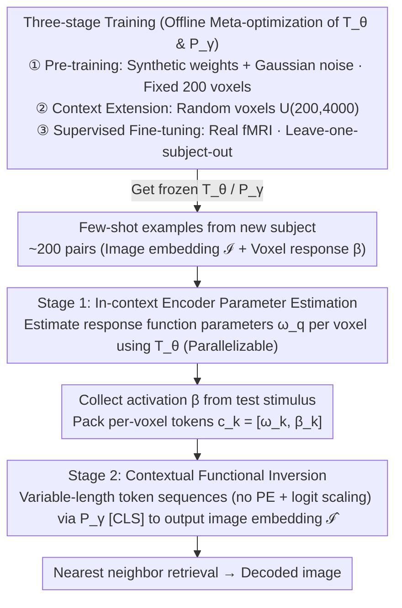

# Meta-learning In-Context Enables Training-Free Cross Subject Brain Decoding

**Conference**: CVPR 2026  
**arXiv**: [2604.08537](https://arxiv.org/abs/2604.08537)  
**Code**: [https://github.com/ezacngm/brainCodec](https://github.com/ezacngm/brainCodec)  
**Area**: 3D Vision  
**Keywords**: Brain Decoding, Meta-learning, In-Context Learning, fMRI, Cross-subject Generalization

## TL;DR

The proposed BrainCoDec framework achieves fMRI visual decoding that generalizes to new subjects without fine-tuning through two-stage hierarchical in-context learning (estimating encoder parameters for each voxel first, then performing functional inversion via cross-voxel aggregation). It improves Top-1 retrieval accuracy from MindEye2's 3.9% to 22.7%.

## Background & Motivation

1.  **Background**: fMRI-based visual decoding has made significant progress—by learning mappings from brain activity to visual semantic spaces, combined with conditional generative models, viewed images can be reconstructed from brain signals. Methods like MindEye2 have achieved high-fidelity reconstruction in single-subject settings.

2.  **Limitations of Prior Work**: Current models cannot generalize across subjects. Due to immense variations in neural signals between individuals (anatomical structure, functional organization, neural plasticity, etc.), a dedicated model must be re-trained or fine-tuned for each new subject, requiring extensive data collection and computational resources.

3.  **Key Challenge**: Differences in neural representations across subjects render mapping functions learned for one individual ineffective for another. Existing methods either rely on anatomical alignment (flatmaps) or require 1D pooling/surface learning, but all implicitly or explicitly require anatomical registration.

4.  **Goal**: Achieve zero-fine-tuning cross-subject visual decoding: adapting to a new subject using only a few examples (e.g., 200 image-brain pairs) without the need for anatomical alignment or stimulus overlap.

5.  **Key Insight**: Redefining brain decoding as a functional inversion problem of encoding models—first using in-context learning to estimate forward model parameters for each voxel (image → brain activity), then inverting this forward model to decode the image.

6.  **Core Idea**: Use a meta-optimized Transformer to learn voxel-level encoding functions for new subjects in-context, followed by functional inversion decoding through cross-voxel contextual aggregation, entirely without gradient updates.

## Method

### Overall Architecture

The core challenge BrainCoDec addresses is why brain decoding models fail when applied to different individuals. The root cause is that the tuning properties of each voxel (the smallest unit of brain activity) differ; thus, a "brain activity → image" mapping learned for one subject is invalid for another. This paper addresses this by not learning that mapping directly, but by reframing decoding as a two-step process: "build the encoding model, then invert it." Stage 1 uses in-context learning to estimate the forward response function (image → voxel activation) for each voxel of a new subject on the fly. Stage 2 feeds the response functions of all voxels, along with their activations under new stimuli, into another Transformer for cross-voxel aggregation to infer the image embedding. The entire pipeline relies on forward inference without a single gradient update, so adapting to a new subject only requires providing a few hundred "image-brain" example pairs. The two Transformers supporting this inference ($T_\theta$ for Stage 1 and $P_\gamma$ for Stage 2) are meta-optimized offline through a three-stage training process inspired by LLM paradigms. The following diagram shows the complete data flow from offline training to two-stage inference for a new subject:

### Key Designs

**1. Stage 1: In-context Encoder Parameter Estimation—Turning "understanding a voxel" into a forward inference**

The direct cause of cross-subject failure is the inability to pre-determine what visual content (faces, scenes, or edge textures) a specific voxel in a new subject is sensitive to. Following the BrainCoRL approach, a set of contextual pairs $\{(\mathcal{I}_t, \beta_{t,q})\}_{t=1}^n$ is collected for a target voxel $v_q$, where $\mathcal{I}_t$ is the image embedding (CLIP / DINO / SigLIP) and $\beta_{t,q}$ is the ground-truth response of that voxel to the $t$-th image. A meta-optimized Transformer $T_\theta$ then directly reads these examples into the response function parameters for that voxel:

$$\omega_q = T_\theta\big(\{(\mathcal{I}_t, \beta_{t,q})\}_{t=1}^n\big)$$

This step is repeated independently for all voxels of interest. It eliminates the need for fine-tuning because the information regarding "what role this voxel plays" is already encoded in the contextual examples—the model does not fit parameters but **reads** them from the examples; a new subject simply requires a different set of examples.

**2. Stage 2: Contextual Functional Inversion—Inverting multiple forward models back to an image**

Having forward functions for each voxel is insufficient; the primary goal is the reverse: given all-brain activations under a new stimulus, infer what the subject is seeing. Traditional inversion involves solving an overdetermined linear system where the number of voxels far exceeds the embedding dimensions, which is fragile and cannot correct estimation biases from the previous stage. This paper employs learned inversion: each voxel is packed into a token $c_k = [\omega_k, \beta_k]$ (its response function parameters concatenated with the current activation value). All voxel tokens form a variable-length sequence fed into Transformer $P_\gamma$, with the [CLS] token outputting the image embedding $\hat{\mathcal{I}}$. Positional encoding is intentionally omitted to ensure invariance to voxel order, and logit scaling $\alpha_{\text{scaled}} = \frac{\log(l)\cdot q\cdot k}{\sqrt{d}}$ is used to stabilize the variable-length context (where $l$ is sequence length). Learned inversion naturally handles underdetermined systems and can compensate for estimation errors from Stage 1 during aggregation.

**3. Three-stage Training Process—From synthetic noise to real fMRI**

Training this hierarchical model from scratch on real fMRI is hindered by insufficient data. The paper borrows from LLM training paradigms with three phases: **Pre-training** uses synthetic weights and Gaussian noise to simulate voxel responses with a fixed 200 contextual voxels, allowing the model to learn the basic "read examples to estimate parameters, aggregate to invert" routine on massive, low-cost signals. **Context Extension** changes the number of contextual voxels to a random sample of 200–4000, forcing the model to adapt to arbitrary input lengths. Finally, **Supervised Fine-tuning (SFT)** concludes with leave-one-subject-out cross-validation on real fMRI to bridge the domain gap between synthetic and real data. The value of this pipeline lies in acquiring large-scale training signals from cost-free synthetic data, achieving generalization through variable-length context training, and ensuring realism via final fine-tuning.

### Loss & Training

Training utilizes a hybrid cosine-contrastive loss $\mathcal{L} = \mathcal{L}_{\cos} + \alpha \mathcal{L}_{\text{infoNCE}}$, where the former maximizes the directional consistency between the reconstructed embedding and the ground truth, and the latter provides instance-level discriminability to prevent all outputs from collapsing into a single "average image." All embedding vectors are first normalized to unit vectors; evaluation is performed via nearest neighbor retrieval (Top-1/Top-5 accuracy, Mean Rank, Cosine Similarity).

## Key Experimental Results

### Main Results

**Cross-subject decoding on NSD dataset (Unseen subject, CLIP backbone):**

| Method | S1 Top-1 | S2 Top-1 | S5 Top-1 | S7 Top-1 | Mean Top-1 | Mean Top-5 |
|------|----------|----------|----------|----------|------------|------------|
| MindEye2 (w/ Anatomical Align) | 4.11% | 3.82% | 2.87% | 2.51% | 3.90% | 9.81% |
| TGBD | 1.27% | 0.56% | 0.84% | 0.39% | 0.82% | 3.09% |
| **BrainCoDec-200** | **25.5%** | **22.9%** | **23.2%** | **19.2%** | **22.7%** | **54.0%** |

**BOLD5000 Cross-scanner Generalization (Only 20 context images):**

| Backbone | Top-1 Acc | Top-5 Acc | Mean Rank | Cosine Sim |
|----------|-----------|-----------|-----------|------------|
| CLIP | 31.45±12.80% | 81.67±9.42% | 3.49±0.76 | 0.72±0.02 |

### Ablation Study

| Configuration | Cosine Sim | Description |
|------|-----------|------|
| BrainCoDec (Leave-one-out) | ~0.55 | Full model |
| BrainCoDec (No leave-out) | ~0.56 | Inclusion of target subject; minimal gain |
| Synthetic Pre-training only | ~0.25 | Large gap without real data |
| Gradient Inversion | ~0.20 | Direct optimization performs worst |

### Key Findings

-   **Significant Performance Gain**: Top-1 improved from 3.9% (MindEye2) to 22.7%, approximately a 6x gain, without anatomical alignment.
-   **High Data Efficiency**: Using only 200 context images + 4000 voxels achieves performance close to using all 9000 images.
-   **Cross-scanner Generalization**: Tested directly on 3T BOLD5000 (model trained on 7T NSD); 20 context images achieved 31.45% Top-1.
-   **Functional ROI Robustness**: Masking category-selective regions (like FFA for faces) has minimal impact on most categories, suggesting the model learns distributed representations.
-   **Explainable Attention Maps**: Final layer attention weights align highly with known functional regions (Face stimulus → FFA/EBA; Scene → PPA/OPA/RSC).
-   **Minimal Leave-one-out vs. No leave-out Gap**: Validates the true cross-subject generalization capability of the method.

## Highlights & Insights

-   **"Decoding as Encoding Inversion"**: Reconceptualizing decoding as first estimating the forward model and then inverting it utilizes the structural info of encoding models as a strong constraint.
-   **Hierarchical In-Context Learning**: Two-stage in-context learning along "stimulus" and "voxel" dimensions respectively, with clear semantics for each stage—an elegant design. The architecture of voxel-level parallelism + functional inversion aggregation naturally adapts to varying voxel counts.
-   **Synthetic Pre-training Pipeline**: Enables pre-training without real fMRI data, reducing reliance on expensive neural data. The three-stage flow matches LLM best practices.

## Limitations & Future Work

-   **Embedding-only Decoding**: Current evaluation is limited to retrieval tasks, without end-to-end generative image reconstruction (though the paper mentions IP-Adapter compatibility).
-   **Context Size Constraints**: 200 images still require approx. 20 minutes of fMRI scanning, which remains high for clinical applications.
-   **Vision Cortex Only**: Currently restricted to high-level visual cortex voxels; possibilities for whole-brain decoding are unexplored.
-   **Future Directions**: (a) End-to-end image reconstruction with generative models; (b) Reducing required context (e.g., 10-50 images); (c) Extending to EEG/MEG; (d) Exploring cross-modal decoding (video, speech).

## Related Work & Insights

-   **vs. MindEye2**: MindEye2 uses MNI anatomical alignment for cross-subject adaptation, but Top-1 is only 3.9%, far below BrainCoDec's 22.7%. The key difference is that BrainCoDec bypasses the need for anatomical alignment through functional in-context learning.
-   **vs. TGBD**: TGBD attempts template-guided decoding but reaches only 0.82% Top-1, indicating methods neglecting subject-specific info perform poorly.
-   **vs. BrainCoRL**: Stage 1 of BrainCoDec directly adopts BrainCoRL's encoder parameter estimation but innovates by adding the Stage 2 functional inversion decoder.

## Rating

-   Novelty: ⭐⭐⭐⭐⭐ 
-   Experimental Thoroughness: ⭐⭐⭐⭐⭐ 
-   Writing Quality: ⭐⭐⭐⭐⭐ 
-   Value: ⭐⭐⭐⭐⭐

<!-- RELATED:START -->

## Related Papers

- [\[NeurIPS 2025\] Meta-Learning an In-Context Transformer Model of Human Higher Visual Cortex](../../NeurIPS2025/medical_imaging/meta-learning_an_in-context_transformer_model_of_human_higher_visual_cortex.md)
- [\[AAAI 2026\] CAT-Net: A Cross-Attention Tone Network for Cross-Subject EEG-EMG Fusion Tone Decoding](../../AAAI2026/medical_imaging/cat-net_a_cross-attention_tone_network_for_cross-subject_eeg-emg_fusion_tone_dec.md)
- [\[NeurIPS 2025\] MoRE-Brain: Routed Mixture of Experts for Interpretable and Generalizable Cross-Subject fMRI Visual Decoding](../../NeurIPS2025/medical_imaging/more-brain_routed_mixture_of_experts_for_interpretable_and_generalizable_cross-s.md)
- [\[AAAI 2026\] MindCross: Fast New Subject Adaptation with Limited Data for Cross-subject Video Reconstruction from Brain Signals](../../AAAI2026/medical_imaging/mindcross_fast_new_subject_adaptation_with_limited_data_for_cross-subject_video_.md)
- [\[NeurIPS 2025\] Zebra: Towards Zero-Shot Cross-Subject Generalization for Universal Brain Visual Decoding](../../NeurIPS2025/medical_imaging/zebra_towards_zero-shot_cross-subject_generalization_for_universal_brain_visual_.md)

<!-- RELATED:END -->
