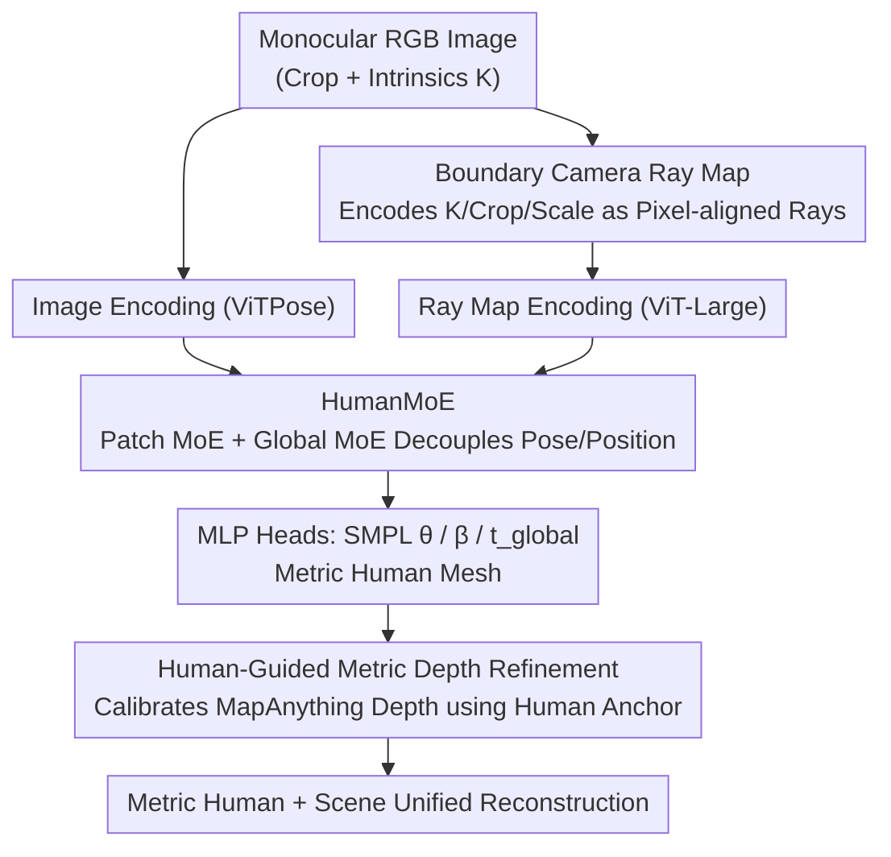

# MetricHMSR: Metric Human Mesh and Scene Recovery from Monocular Images

**Conference**: CVPR 2026  
**Paper**: [CVF Open Access](https://openaccess.thecvf.com/content/CVPR2026/html/Song_MetricHMSR_Metric_Human_Mesh_and_Scene_Recovery_from_Monocular_Images_CVPR_2026_paper.html)  
**Code**: [Project Page](https://Metaverse-AI-Lab-THU.github.com/MetricHMSR) (Provided in paper, ⚠️ subject to original link)  
**Area**: 3D Vision / Human Understanding  
**Keywords**: Human Mesh Recovery, Metric Scale, Monocular Depth, Mixture-of-Experts, Camera Ray Map

## TL;DR
MetricHMSR simultaneously recovers human SMPL meshes and 3D scenes with real physical scales (metric) from a single monocular image. The core involves explicitly encoding camera intrinsics and cropping information into the network using a "boundary camera ray map," decoupling local pose from global position via HumanMoE, and calibrating monocular depth using the recovered metric human as a geometric anchor to achieve SOTA in both human mesh recovery and metric human-scene reconstruction tasks.

## Background & Motivation

**Background**: Recovering human mesh (HMR) from a single image is a classic task. Since HMR, mainstream methods have continuously improved the accuracy of 2D alignment and local pose, but most remain at a "visually plausible" level.

**Limitations of Prior Work**: True **metric-level** reconstruction—how tall a person is and how many meters they are from the camera—is rarely addressed seriously. Early methods simplified camera projection with weak perspective assumptions, failing to recover absolute scale. Subsequent works either deviated from real imaging conditions or **coupled** local pose and global translation within the same feature set, making them difficult to separate. Another approach involves external trajectory estimation modules or direct monocular metric depth estimation (MMDE), but the former increases complexity while the latter limits the accuracy upper bound to the external depth predictor.

**Key Challenge**: Monocular depth possesses scale ambiguity, and cropping + scaling (standard HMR pre-processing) further destroys the network's ability to perceive metric information. Additionally, ViT treats all patches equally, failing to distinguish the different contributions of various body regions toward metric recovery.

**Goal**: To simultaneously regress local pose, metric body shape, and metric position within a unified network without introducing dedicated external modules, and to further align scene depth to the same physical scale.

**Key Insight**: The authors present three insights—(1) camera intrinsics and bounding box information are strongly correlated with the 3D position of the human; (2) recent foundation models (e.g., MapAnything/VGGT) prove that all 3D attributes can be learned by a unified architecture without dedicated modules; (3) feature decoupling is beneficial.

**Core Idea**: Feed the network explicit metric cues via a "boundary camera ray map," decouple local pose and global position using MoE, and use the recovered metric human as a geometric anchor to calibrate monocular depth.

## Method

### Overall Architecture
MetricHMSR consists of two main components in series: **MetricHMR** (metric human mesh recovery) + **Human-Guided Metric Depth Refinement Module** (metric scene recovery). Given an RGB image, the cropped human image and its corresponding "boundary camera ray map" are encoded using ViTPose and ViT-Large respectively, concatenated, and fed into HumanMoE (comprising Patch MoE and Global MoE). Three MLP heads then predict SMPL pose $\theta \in \mathbb{R}^{72}$, shape $\beta \in \mathbb{R}^{10}$, and global translation $t_{global} \in \mathbb{R}^3$, yielding a human mesh in metric 3D space. Subsequently, the initial depth predicted by MapAnything is passed to a UNet–ViT hybrid backbone, using the projected human mesh depth as sparse anchors for pixel-wise affine calibration to output geometrically consistent metric depth, ultimately achieving a unified reconstruction of human and scene at a real scale.

### Key Designs

**1. Boundary Camera Ray Map: Explicitly Encoding Intrinsics and Cropping into Pixel-level Metric Cues**

To address the issue where "cropping/scaling destroys metric perception and networks fail to utilize the focal length-2D position-3D position correlation," the authors introduce a camera ray representation aligned with image pixels. For the original intrinsics $K$ (focal length $f_x, f_y$, principal point $c_x, c_y$), the camera ray for pixel $(u, v)$ is $d = K^{-1}[u,v,1]$. Crucially, when an image is cropped to the bounding box top-left $(u_{bbox}, v_{bbox})$ and scaled by factor $s$, the transformed intrinsics can be written in closed-form as:

$$K' = \begin{bmatrix} f_x/s & 0 & (c_x-u_{bbox})/s \\ 0 & f_y/s & (c_y-v_{bbox})/s \\ 0 & 0 & 1 \end{bmatrix}$$

Each pixel’s ray bundle is then calculated using $K'$ and fed into the network as a "ray map" at the same resolution as the cropped image. This implicitly packs crop offsets, scale factors, and camera intrinsics into one representation, mitigating position ambiguity caused by cropping in methods like CLIFF. When intrinsics are unknown, AnyCalib is used for estimation, or focal length is approximated by the image's long side with the principal point at the center.

**2. HumanMoE: Decoupling Local Pose and Global Position with Mixture-of-Experts**

Traditional HMR uses a single dense MLP/Transformer decoder, which struggles to simultaneously express "local pose / metric shape / metric position" variations across different scenes and to decouple hierarchical image features. HumanMoE replaces the FFN in dense Transformer blocks with **Soft MoE**: each expert receives a weighted combination of tokens (rather than a hard top-K routing), making training more stable and experts easier to scale. MoE output is $\mathrm{MoE}(x)=\sum_{i=0}^{K} g_i(x)\,e_i(x)$, where $g_i$ are routing gate weights. The structure consists of 4 **route image experts** to learn specialized visual knowledge, 1 **shared image expert** for general knowledge (avoiding redundant learning of general patterns across experts), and 1 **ray expert** specifically for ray tokens.

HumanMoE is further divided into two complementary branches: **Patch MoE** (routing different body regions based on patch semantics to achieve explicit feature-level decoupling) and **Global MoE** (aggregating the full image to capture global context). Routing heatmaps of the deepest MoE layer on 3DPW show that different body joints are consistently assigned to specific experts, while the same body parts across images tend to go to the same expert, indicating **emergent semantic specialization**. To prevent routing collapse, a soft load-balancing auxiliary loss $\mathcal{L}_{aux} = \lambda K \sum_{i=1}^{K} p_i^2$ is added, where $p_i$ is the average routing probability for expert $i$ within a batch.

**3. Human-Guided Metric Depth Refinement: Using Metric Human as Geometric Anchor to Calibrate Monocular Depth**

Existing works (e.g., inpainting humans and using HMR 2.0 meshes as scale references) are limited because HMR 2.0 recovers neither metric shape nor global 3D position, allowing only global scaling. Since MetricHMR recovers a human mesh in metric 3D space, it serves as a **pixel-wise** geometric reference. Given the initial depth $z_{in}(x)$ predicted by MapAnything, a UNet–ViT hybrid backbone predicts a spatially varying affine field $(s(x), b(x))$ for calibration: $\hat{z}(x)=s(x)\,z_{in}(x)+b(x)$, where the affine field is locally adaptive but regularized to be globally smooth. To anchor the solution to absolute metrics, the human mesh is projected onto the image, and pixel-wise depths of visible surfaces form a sparse anchor map $z_{hmr}(x)$ with mask $M_a(x)$. Anchor consistency loss is applied during training. The total loss is $\mathcal{L} = \lambda_d \mathcal{L}_{depth} + \lambda_a \mathcal{L}_{anchor} + \lambda_{tv}\mathcal{L}_{tv} + \lambda_{var}\mathcal{L}_{var}$.

### Loss & Training
The training objective for MetricHMR is an **over-complete loss**: $\mathcal{L} = \lambda_{J_{2D}}\mathcal{L}_{J_{2D}} + \lambda_{J_{3D}}\mathcal{L}_{J_{3D}} + \lambda_{V_{3D}}\mathcal{L}_{V_{3D}} + \lambda_\theta \mathcal{L}_\theta + \lambda_\beta \mathcal{L}_\beta + \lambda_h \mathcal{L}_h$, supervising 2D keypoints, 3D joints, vertices, SMPL pose, SMPL shape, and height. Following the observation from VGGT that "predicting redundant/closed-form related variables during training can improve performance," an additional height supervision $\mathcal{L}_h$ is added to improve mesh regression accuracy. Training is conducted on BEDLAM, AIC, COCO, MPII, and 3DPW for 40 epochs using AdamW, batch size 64, a single A100, and a learning rate of $1\times10^{-5}$. The depth refinement network is additionally trained on PROX RGB-D.

## Key Experimental Results

### Main Results
**Global Trajectory Estimation (EMDB-2, Dynamic Camera, Predicted Extrinsics)**: MetricHMSR leads significantly among online methods and matches offline SOTA.

| Method | Paradigm | WA-MPJPE↓ | W-MPJPE↓ | RTE(%)↓ | ERVE↓ |
|------|------|-----------|----------|---------|-------|
| TRAM | Offline | 76.4 | 222.4 | 1.4 | 10.3 |
| Human3R | Online | 112.2 | 267.9 | 2.2 | - |
| WHAM | Online | 133.3 | 343.9 | 4.6 | 14.7 |
| **MetricHMSR** | Online | **72.1** | **199.5** | **1.4** | 10.6 |

> WA-MPJPE/W-MPJPE denote average root joint error (mm) in world coordinates with/without alignment for 100 frames; RTE is root translation error (%); ERVE is egocentric root velocity error (mm/frame).

**Local Pose (3DPW)**: Optimal across all three metrics.

| Method | PA-MPJPE↓ | MPJPE↓ | PVE↓ |
|------|-----------|--------|------|
| CameraHMR | 35.1 | 56.0 | 65.9 |
| PromptHMR | 35.5 | 56.9 | 67.3 |
| TRAM | 35.6 | 59.3 | 69.6 |
| **MetricHMSR** | **33.6** | **53.0** | **62.7** |

**Metric Depth (PROX)**: Refinement using the human anchor significantly outperforms direct use of MapAnything.

| Method | AbsRel↓ | MAE↓ | δ1↑ |
|------|---------|------|-----|
| Unidepth | 0.24 | 0.73 | 0.56 |
| MapAnything | 0.18 | 0.58 | 0.83 |
| **Ours** | **0.13** | **0.46** | **0.91** |

> AbsRel = Absolute Relative Error $|d^*-d|/d$; MAE = Mean Absolute Error; δ1 = % of pixels satisfying $\max(d/d^*, d^*/d)<1.25$.

### Ablation Study

| Configuration | 3DPW PA-M↓ | 3DPW MPJPE↓ | EMDB-2 W-M↓ | Description |
|------|-----------|-------------|-------------|------|
| Image only | 35.6 | 57.2 | 191.8 | Image only, no ray map or MoE |
| 0 Route Experts | 34.6 | 54.4 | 162.9 | With ray map but no route experts |
| 2 Route Experts | 34.3 | 53.8 | 153.0 | Insufficient route experts |
| **4 Route Experts (Full)** | **33.6** | **53.0** | **152.5** | Full Ray + HumanMoE config |
| 8 Route Experts | 33.9 | 53.7 | 152.8 | Extra experts provide no gain |
| 32 Route Experts | 34.2 | 53.9 | 154.8 | Slight performance drop |

> Full model W-M values from the global trajectory table (152.5 under GT extrinsics); ⚠️ cross-setting values in ablation tables follow original Tab. 6.

### Key Findings
- **Ray map provides the largest contribution**: Moving from "Image only" to adding the boundary ray map drops EMDB-2 W-MPJPE from 191.8 to 162.9, indicating explicit metric cues are critical for global position.
- **Patch MoE and Global MoE are complementary**: The paper reports that "Global MoE only" or "Patch MoE only" underperform compared to the full HumanMoE, as capturing local/global context together is mutually beneficial.
- **Expert count has a "sweet spot"**: 4 route experts are optimal; 8 or 32 experts cause a decline, suggesting capacity is not "the more the better" and excessive experts dilute specialization.

## Highlights & Insights
- **Unified encoding of camera intrinsics + crop offset + scale into a pixel-aligned ray map** using closed-form $K'$ derivation removes dependency on extra camera regression heads or trajectory modules—this "input representation instead of dedicated module" approach is transferable to any geometric task hindered by cropping pre-processing.
- **Semantic specialization in MoE emerges naturally over human body parts**: Routing heatmaps show specific joints consistently use specific experts, providing interpretable evidence for "feature-level decoupling."
- **Closing the loop by using recovered 3D humans as depth anchors**: Humans provide absolute scale, and depth refinement pulls the scene into the same metric space, allowing HMR and monocular depth tasks to benefit each other.

## Limitations & Future Work
- The authors acknowledge that the current version **does not support multi-person interaction awareness** and may fail under **severe occlusion**.
- The method is a **single-frame online** paradigm; global trajectories are formed by concatenating per-frame independent predictions, lacking cross-frame temporal optimization (which is why it matches but does not comprehensively surpass offline methods).
- Metric depth refinement depends on MapAnything for initial depth; while corrected by human anchors, regions without human coverage remain limited by the foundation model's quality.
- Future work: Scaling the metric pseudo-GT human mesh + 3D scene annotation pipeline to large-scale internet data to improve generalization.

## Related Work & Insights
- **vs CLIFF**: CLIFF first explicitly considered the impact of bounding boxes on human rotation and global position but used rough box-focal length scalar relations; MetricHMSR uses pixel-level ray maps to encode intrinsics and cropping fully, reducing position ambiguity.
- **vs TRAM / BLADE (External MMDE)**: These call ZeoDepth/DepthAnythingV2 to estimate depth for scale; their accuracy is capped by the external depth generator. This work uses the recovered metric human to calibrate depth, bypassing the depth generator's upper limit.
- **vs Human3R**: Both perform unified human-scene reconstruction, but Human3R is built on CUT3R for 4D reconstruction; this paper proves metric human mesh recovery **requires no** extra dedicated modules—a single MoE network suffices and performs better in local pose on 3DPW.

## Rating
- Novelty: ⭐⭐⭐⭐ The combination of ray map + HumanMoE + human-guided depth is very coherent, though individual components (ray representation, Soft MoE, depth refinement) are clever assemblies of existing ideas.
- Experimental Thoroughness: ⭐⭐⭐⭐ Covers local pose, global trajectory, and metric depth tasks; tested dynamic/static cameras and known/estimated intrinsics; comprehensive ablation. Lacks multi-person and heavy occlusion evaluation.
- Writing Quality: ⭐⭐⭐⭐ Clear motivation and insights, though some ablation table values are scattered and certain symbols require cross-referencing.
- Value: ⭐⭐⭐⭐ Provides a practical pipeline for generating metric pseudo-GT for in-the-wild data, with direct value for metric reconstruction in embodied/physical AI.

<!-- RELATED:START -->

## Related Papers

- [\[CVPR 2026\] OnlineHMR: Video-based Online World-Grounded Human Mesh Recovery](onlinehmr_video-based_online_world-grounded_human_mesh_recovery.md)
- [\[CVPR 2026\] ResiHMR: Residual-Limb Aware Single-Image 3D Human Mesh Recovery for Individuals with Limb Loss](resihmr_residual-limb_aware_single-image_3d_human_mesh_recovery_for_individuals_.md)
- [\[ECCV 2024\] Divide and Fuse: Body Part Mesh Recovery from Partially Visible Human Images](../../ECCV2024/3d_vision/divide_and_fuse_body_part_mesh_recovery_from_partially_visible_human_images.md)
- [\[CVPR 2025\] PromptHMR: Promptable Human Mesh Recovery](../../CVPR2025/3d_vision/prompthmr_promptable_human_mesh_recovery.md)
- [\[CVPR 2026\] Natural Human Motion Recovery by Aligning High-Order Temporal Dynamics from Monocular Videos](natural_human_motion_recovery_by_aligning_high-order_temporal_dynamics_from_mono.md)

<!-- RELATED:END -->
