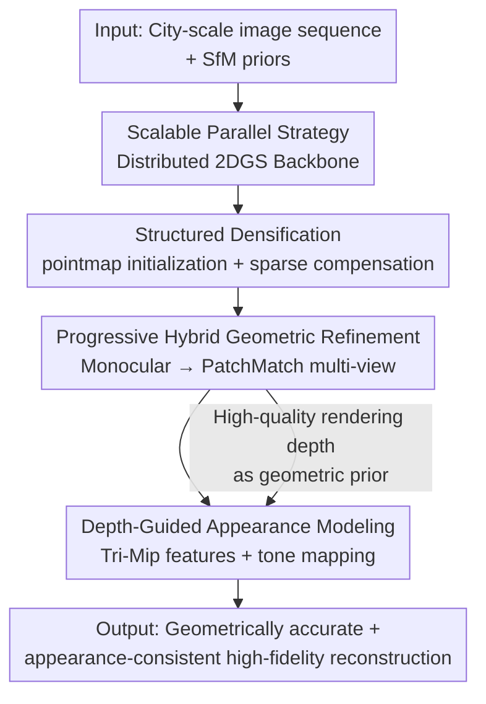

# MetroGS: Efficient and Stable Reconstruction of Geometrically Accurate High-Fidelity Large-Scale Scenes

**Conference**: CVPR 2026  
**Paper**: [CVF Open Access](https://openaccess.thecvf.com/content/CVPR2026/html/Chen_MetroGS_Efficient_and_Stable_Reconstruction_of_Geometrically_Accurate_High-Fidelity_Large-Scale_CVPR_2026_paper.html)  
**Code**: [Project Page](https://m3phist0.github.io/MetroGS)  
**Area**: 3D Vision  
**Keywords**: Large-Scale Scene Reconstruction, 2D Gaussian Splatting, Geometric Reconstruction, Appearance Decoupling, Distributed Training

## TL;DR
MetroGS uses distributed 2DGS as the backbone, combined with a trio of "point cloud densification + progressive monocular/multi-view hybrid geometric refinement + depth-guided appearance modeling" to simultaneously achieve higher geometric accuracy (F1) and rendering quality (PSNR) on city-scale large scenes, requiring only about 25% of the training time of CityGSV2.

## Background & Motivation
**Background**: 3DGS and its derivative methods (especially 2DGS which flattens 3D ellipsoids into 2D surfels, and PGSR which uses planar Gaussians) have progressed rapidly in large-scale scene reconstruction. Works like CityGS / CityGSV2 / CityGS-X have scaled 2DGS to city-scale using "block-wise parallel training." However, the optimization focus of most works is on **rendering quality**, while progress in geometric reconstruction lags relatively behind.

**Limitations of Prior Work**: The authors point out three specific shortfalls. First, the initial point clouds are too sparse in textureless or sparsely observed regions, leading to inaccurate local structure recovery, holes, and artifacts on surfaces. Second, geometric optimization strategies are immature—relying solely on single-view constraints (e.g., monocular depth) lacks cross-view consistency, while multi-view constraints often use single-scale photometric constraints or simple reprojection errors, resulting in poor adaptability and high computational overhead in large scenes with diverse structures. Third, large-scale datasets commonly suffer from inconsistent lighting and exposure; models are forced to reconcile appearance discrepancies during optimization, which in turn degrades geometric consistency.

**Key Challenge**: Under large-scale conditions, there is a tension between **geometric accuracy** and **rendering fidelity / training efficiency**—traditional multi-view consistency optimization is both expensive and difficult to stably balance both, while appearance variation couples with geometry and causes mutual interference.

**Goal**: To construct a scalable framework that preserves both geometric accuracy and rendering quality while training fast and stably in city-scale scenes. This is broken down into three sub-problems: supplementing dense initialization, performing efficient and accurate geometric refinement, and decoupling appearance from geometry.

**Key Insight**: The authors observe that "insufficient initial sampling" is one of the key bottlenecks of geometric quality, and high-quality rendering depth can conversely serve as a geometric prior for appearance modeling. Therefore, "densification, geometric refinement, and appearance decoupling" are chained into a mutually supportive pipeline.

**Core Idea**: Using distributed 2DGS as a unified backbone, the method employs a pointmap model to compensate for dense initialization, a progressive monocular-to-PatchMatch multi-view depth refinement to achieve accurate geometry, and a depth-guided Tri-Mip appearance module to strip lighting/exposure from geometry, achieving efficient, stable, large-scale, high-fidelity reconstruction.

## Method

### Overall Architecture
The input of MetroGS is a city-scale image sequence, and the output is a geometrically accurate and appearance-consistent high-fidelity reconstruction (mesh + rendering). The entire pipeline is built on a **distributed 2DGS backbone**: first, high-quality dense initial point clouds are generated using SfM priors + a pointmap model, and a sparse compensation optimization is added during the densification stage to further fill sparse areas; then, a progressive hybrid strategy of "monocular first, followed by multi-view PatchMatch" is used to refine geometric depth; concurrently, a depth-guided appearance module queries 3D-consistent spatial features using the optimized rendering depth to decouple geometry and appearance. The four components collaborate around the "same backbone representation": structural enhancement ensures there is material to optimize, geometric refinement carves the material accurately, and appearance modeling ensures the carving process is not disturbed by illumination.

### Key Designs

**1. Scalable Parallel Strategy: Extending 2DGS to Gaussian-wise distributed training to support city-scale**

Large-scale scenes cannot fit on a single GPU, which is the prerequisite for all subsequent modules. Borrowing the parallelization concept from Grendel-GS, MetroGS scales 2DGS into a "Gaussian-wise distributed training paradigm": the initial point cloud is uniformly partitioned across multiple GPUs for local Gaussian initialization, and multi-view batched training is used to distribute images evenly to each device. Utilizing the spatial locality of Gaussian splatting, each worker only fetches the subset of Gaussians it needs for communication, reducing overhead. During dynamic densification, load balancing is maintained through periodic Gaussian redistribution. In the ablation study, this component cuts the training time from 134 min to 68 min (approx. 1.97× speedup) while increasing the F1 score from 0.523 to 0.532, indicating that it is more than just an engineering speedup and positively impacts the final quality.

**2. Structured Densification: Using pointmap for initialization and sparse compensation for densification to cure holes in sparse areas**

Addressing the pain point where "initial point clouds are too sparse in weak-texture or sparsely observed areas, leading to surface holes," the authors divide the treatment into initialization and densification. In the initialization phase, an undirected image graph $G=(V,E)$ is constructed, where edge weights $w_{ij}$ represent the number of feature matches between images estimated by SfM. The graph is then partitioned into $N$ clusters ($N=$ number of GPUs) according to the normalized cut objective:

$$\text{Ncut}(A_1,\dots,A_N)=\sum_{k=1}^{N}\frac{\text{Cut}(A_k,\bar{A_k})}{\text{Vol}(A_k)}$$

This yields partitions of "strong intra-cluster connectivity and weak inter-cluster connectivity." Subsequently, the pointmap model is run in parallel on each cluster to generate dense 3D predictions. Intra-cluster images are sorted by match connectivity and processed in mini-batches. After each batch, pixel indices are used to establish a one-to-one correspondence between the dense pointmap and the SfM reconstruction, and a similarity transformation $T^*=\arg\min_{T\in\text{Sim}(3)}\lVert T\tilde{X}-\tilde{Y}\rVert_F^2$ is estimated to align the dense predictions to the SfM coordinate system. Finally, they are sampled and merged into a unified auxiliary point cloud. In the densification phase, a sparse compensation is added: Gaussians to be split are selected based on the dual criteria of "large contributing area and low local density" $G_{\text{split}}=\{G_i\mid S_i>S_{th}\wedge V_i<V_{th}\}$, where $S_i$ is the accumulated area where the Gaussian simultaneously achieves maximum contribution weight and median depth, and $V_i$ is the count of Gaussian centers within its voxel (local density). This criterion specifically targets "spatially large but sparsely neighboring" Gaussians for splitting, thereby filling gaps without over-densification.

**3. Progressive Hybrid Geometric Refinement: Lightweight monocular first, followed by PatchMatch multi-view, using depth (instead of photometry) for multi-view supervision**

Since monocular depth lacks cross-view consistency and multi-view photometric constraints are expensive and single-scale, the authors solve this with a two-stage progressive process. In the first stage (single-view), a pre-trained depth estimation model is used to obtain a monocular depth prior. After aligning the estimated inverse depth with the sparse SfM depth, the rendering inverse depth is supervised by the L1 loss $L_d$ against the estimated inverse depth, while retaining the depth-normal consistency loss $L_n$ from 2DGS. Simultaneously, observing that large-scale Gaussians introduce artifacts, blur details, and consume memory, a scale regularization $L_s=\frac{1}{|M|}\sum_{i\in M}\max(\max(s_i)-\tau_s,\epsilon)$ is added to limit the maximum Gaussian scale. The geometric loss for this stage is $L^{(1)}_{geo}=\lambda_d L_d+\lambda_n L_n+\lambda_s L_s$. After several training iterations, the process enters the second stage (hybrid multi-view): for each image, neighboring views are pre-set based on SfM priors, and PatchMatch is used between the image and neighboring views to refine the rendering depth $D_r$ using multi-scale patch iterations to accommodate objects of different scales, followed by filtering with reprojection errors against neighboring views to obtain reliable depth $D_f$. Since filtering may mistakenly delete valid regions and cause holes, monocular depth $D_m$ is reintroduced for completion—by dividing the monocular depth into blocks, and aligning each block via least squares to the corresponding filtered depth: $s^*,t^*=\arg\min_{s,t}\sum_{p\in D_f}\lVert D_f(p)-(s\cdot D_m(p)+t)\rVert^2$. Blocks with alignment errors below a threshold are retained, recovering $D_{mv}$. Finally, depth supervision is applied: $L_{mv}=\frac{1}{|D_{mv}|}\sum_{p\in D_{mv}}|D_r(p)-D_{mv}(p)|$, making the geometric loss for this stage $L^{(2)}_{geo}=\lambda_{mv}L_{mv}+\lambda_n L_n$. The key is: using **depth** instead of direct photometry for multi-view consistency ensures that rendering depth improves through training while the refined depth improves along with it; moreover, the refined depth maps are only updated at fixed intervals, saving computation.

**4. Depth-Guided Appearance Modeling: Querying Tri-Mip features using rendering depth to achieve true geometry-appearance decoupling**

Inconsistent lighting/exposure in large scenes forces the model to reconcile appearance during optimization, which corrupts geometry. Most existing appearance methods do not utilize geometric information, whereas MetroGS happens to have high-quality rendering depth to serve as a structural prior. The authors store scale-adaptive multi-resolution 3D features of the scene (which physically maintain cross-view consistency) in a Tri-Mip structure. Given the rendering depth $D_r$, the projected 3D coordinates of each pixel are used to query the Tri-Mip feature planes, yielding a structurally aligned representation $f_{Tri}(x)$. Each image is also assigned a learnable appearance embedding $l_i\in\mathbb{R}^d$ to capture global illumination/exposure. These two are concatenated and passed through a lightweight MLP tone mapper $M(x)=F_\theta([f_{Tri}(x);l_i])$, which is used to modulate the rendered image $I^r_i$ to obtain the final tone/lighting-consistent result $I^t_i$. The appearance loss is $L_{app}=\lambda L_1(I^t_i,I_i)+(1-\lambda)L_{D\text{-}SSIM}(I^r_i,I_i)$. Since the appearance queries are anchored on accurate depths, the appearance module only needs to focus on color/lighting variations independent of geometry, steadily leaving geometry to the geometric module—this is the true decoupling enabled by "depth guidance."

### Loss & Training
Geometry and appearance are optimized jointly with the total loss $L_{total}=L_{geo}+L_{app}$, where $L_{geo}$ switches between $L^{(1)}_{geo}$ (single-view) and $L^{(2)}_{geo}$ (multi-view) according to the training phase. Experiments are conducted on 4× RTX 3090 GPUs, and mesh extraction follows the "median depth + TSDF fusion" pipeline of 2DGS.

## Key Experimental Results

### Main Results
On three scenes from the real-world city dataset GauU-Scene, MetroGS ranks first on most metrics. Compared to CityGSV2, the average PSNR increases by +0.88 dB and F1 increases by +0.033.

| Scene (GauU-Scene) | Metric | MetroGS | CityGSV2 | 2DGS |
|------|------|------|----------|------|
| Russian Building | PSNR↑ / F1↑ | 24.94 / 0.585 | 24.12 / 0.544 | 23.77 / 0.531 |
| Residence | PSNR↑ / F1↑ | 24.51 / 0.494 | 23.57 / 0.467 | 22.24 / 0.458 |
| Modern Building | PSNR↑ / F1↑ | 27.07 / 0.524 | 25.84 / 0.492 | 25.77 / 0.485 |

On the synthetic dataset MatrixCity, the F1 advantage is more pronounced (averaging about 0.11 higher than CityGSV2), especially with a substantial lead in geometric recall R:

| Scene (MatrixCity) | Metric | MetroGS | CityGSV2 | CityGS-X |
|------|------|------|----------|----------|
| Aerial | F1↑ (P / R) | 0.677 (0.572 / 0.828) | 0.556 (0.441 / 0.752) | 0.581 (0.444 / 0.840) |
| Street | F1↑ (P / R) | 0.607 (0.480 / 0.828) | 0.503 (0.376 / 0.759) | OOM |

On the Street scene, CityGS-X directly encounters an OOM (Out Of Memory) error, while MetroGS still delivers stable output, demonstrating the scalability of the distributed backbone.

### Ablation Study
Component-wise ablation on the Russian Building scene (the base is a customized 2DGS):

| Configuration | PSNR↑ | F1↑ | #G(M) | T(min) | Description |
|------|-------|-----|-------|--------|------|
| Base | 23.88 | 0.523 | 4.55 | 134 | Customized 2DGS baseline |
| Base + Para. | 24.35 | 0.532 | 7.30 | 68 | Add parallelization: F1↑ and nearly 2× training speedup |
| w/o Ini. | 24.84 | 0.577 | 7.51 | 98 | Remove pointmap initialization, F1 drops by 0.008 |
| w/o Spa. | 24.88 | 0.583 | 8.02 | 104 | Remove sparse compensation, drops by 0.002 (minor impact) |
| w/o Geo. | 24.83 | 0.564 | 8.99 | 89 | Remove entire geometric refinement, F1 drops the most (0.021) |
| w/o Mul. | 24.87 | 0.571 | 8.17 | 87 | Remove multi-view refinement |
| w/o Ali. | 24.86 | 0.580 | 8.18 | 101 | Remove alignment & recovery operations |
| w/o App. | 24.46 | 0.562 | 8.29 | 99 | Remove appearance modeling, PSNR drops by 0.48 |
| w/o Tri. | 23.96 | 0.569 | 8.08 | 95 | Remove Tri-Mip, PSNR further drops to 23.96 |
| Full Model | 24.94 | 0.585 | 8.20 | 106 | Full model |

### Key Findings
- **Geometric refinement (w/o Geo.) contributes the most to F1**: Removing the entire module causes the F1 score to drop from 0.585 to 0.564, which is the largest decline in geometric metrics among all configurations, proving that progressive depth refinement is the main engine of geometric accuracy.
- **pointmap initialization > sparse compensation**: Removing initialization (w/o Ini.) leads to a noticeable performance drop, while removing sparse compensation (w/o Spa.) shows only a slight decline, and the scale of the drops for both is directly related to the reduction in the final reconstructed Gaussian count.
- **Appearance modeling primarily rescues rendering and depends on geometry**: Removing appearance (w/o App.) drops the PSNR by 0.48; further removing Tri-Mip (w/o Tri.) drops the PSNR to 23.96, indicating that appearance modeling must be geometry-aware to be effective, which echoes the design motivation of depth guidance.
- **Parallelization is more than just acceleration**: Base→Base+Para. nearly halves the training time while slightly lifting the F1 score, representing a win-win for efficiency and quality.

## Highlights & Insights
- **"Using depth instead of photometry for multi-view consistency" is clever**: Rendering depth self-improves with training, which in turn improves the refined depth, and updates can be scheduled at intervals to save computation—transforming multi-view constraints from expensive photometric optimization to more stable and economical depth supervision.
- **Geometry and appearance serve as mutual priors**: High-quality rendering depth feeds back into the appearance query, and appearance decoupling prevents the geometry from being polluted by lighting, forming a positive feedback loop—this is the most "aha!" closed-loop design of this paper.
- **The dual criteria for sparse compensation are transferable**: The criterion for selecting Gaussians to split based on "large contributing area × low local density" can be generalized to other GS tasks requiring selective densification, avoiding mindless global densification.
- **The combination of PatchMatch multi-scale patches + monocular completion**: First, reliable depth is obtained using strict geometric consistency, and then monocular priors are used to restore valid regions that were erroneously filtered out. This balances accuracy and completeness, presenting a practical recipe for handling post-filtering holes.

## Limitations & Future Work
- The entire framework is chained together by four modules, with numerous components and hyperparameters (multiple sets of thresholds like $\lambda$, $\tau_s$, $S_{th}$, $V_{th}$), making the reproduction and tuning costs relatively high.
- It relies on external pre-trained models (pointmap model, monocular depth estimator) whose quality directly affects initialization and monocular depth; the paper does not fully analyze sensitivity to these priors. ⚠️ Subject to the original text.
- The evaluation is concentrated on two classes of city-scale data (GauU-Scene and synthetic MatrixCity), leaving the robustness on larger geographical spans or dynamic object scenes (pedestrians/traffic flow) unaddressed.
- Sparse compensation provides a relatively small gain in the ablation study (only +0.002 in F1), suggesting a lower cost-performance ratio compared to other modules, so whether it is worth keeping can be further weighed.

## Related Work & Insights
- **vs CityGSV2**: Also adopts the block-partitioning/parallelization + 2DGS route and established a large-scene geometric benchmark, but only uses relatively simple geometric optimization; MetroGS uses progressive monocular-to-PatchMatch multi-view refinement to align geometry accurately, with a training time about 25% of theirs, leading comprehensively across most metrics.
- **vs CityGS-X**: Supports multi-GPU parallel rendering and batch-level multi-task joint optimization of geometry and appearance, but encounters OOM on the MatrixCity street scene; MetroGS's Gaussian-wise distributed backbone is more efficient and stable, still achieving a 0.607 F1 on the street scene.
- **vs 2DGS / PGSR**: These are fundamental representations for object-level surface reconstruction, lacking stability when directly migrated to large scenes; MetroGS overlays large-scene targeted structural densification, geometric refinement, and appearance decoupling on top of the 2DGS backbone.

## Rating
- Novelty: ⭐⭐⭐⭐ Most modules are combinations of existing techniques (pointmap/PatchMatch/Tri-Mip), but the closed-loop design of "depth-guided appearance decoupling + progressive depth refinement" has clever ingenuity.
- Experimental Thoroughness: ⭐⭐⭐⭐ Multiple scenes across two datasets + fine-grained component-wise ablation, comprehensive across the three dimensions of geometry, rendering, and efficiency.
- Writing Quality: ⭐⭐⭐⭐ Clear structure with proper formulas and illustrations; the transition between motivation, methodology, and ablation is smooth.
- Value: ⭐⭐⭐⭐ Simultaneously improves quality and speed in large-scale high-fidelity reconstruction, possessing practical value for downstream applications like surveying, autonomous driving, and AR/VR.

<!-- RELATED:START -->

## Related Papers

- [\[ICLR 2026\] UrbanGS: Efficient and Scalable Architecture for Geometrically Accurate Large-Scale Urban Gaussian Splatting](../../ICLR2026/3d_vision/urbangs_efficient_and_scalable_architecture_for_geometrically_accurate_large-sce.md)
- [\[CVPR 2026\] LATTICE: Democratize High-Fidelity 3D Generation at Scale](lattice_democratize_high-fidelity_3d_generation_at_scale.md)
- [\[CVPR 2026\] FSFSplatter: Geometrically Accurate Reconstruction with Free Sparse-view Images within 2 minutes](fsfsplatter_geometrically_accurate_reconstruction_with_free_sparse-view_images_w.md)
- [\[CVPR 2026\] CaT-GS: Efficient 3DGS Rendering for Large-Scale Scenes with Inter-frame Caching and Tile Scheduling](cat-gs_efficient_3dgs_rendering_for_large-scale_scenes_with_inter-frame_caching_.md)
- [\[CVPR 2026\] FACE: A Face-based Autoregressive Representation for High-Fidelity and Efficient Mesh Generation](face_a_face-based_autoregressive_representation_for_high-fidelity_and_efficient_.md)

<!-- RELATED:END -->
