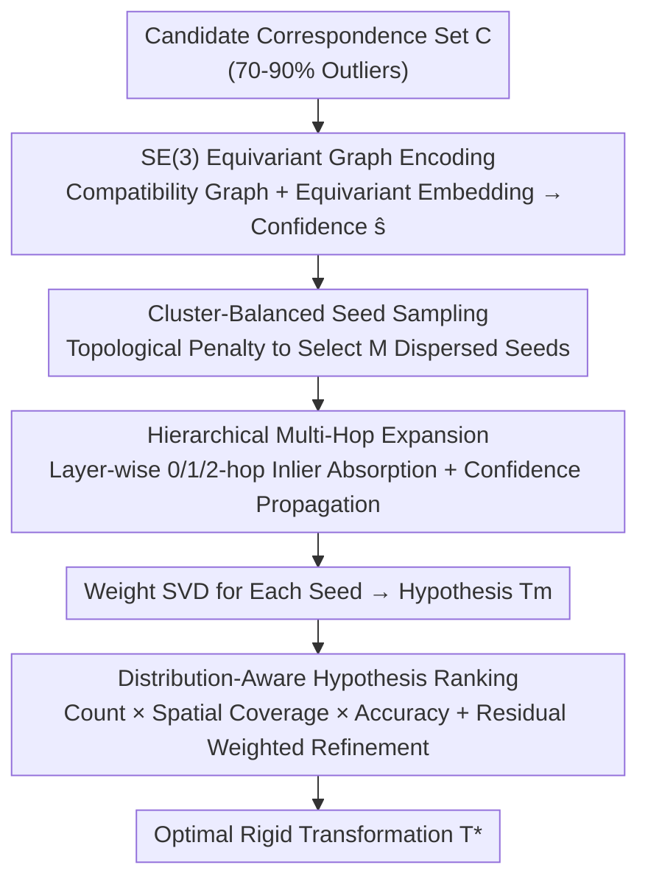

# MHopReg: Efficient Hierarchical Multi-Hop Graph Search for Point Cloud Registration

**Conference**: CVPR 2026  
**Paper**: [CVF Open Access](https://openaccess.thecvf.com/content/CVPR2026/html/Wu_MHopReg_Efficient_Hierarchical_Multi-Hop_Graph_Search_for_Point_Cloud_Registration_CVPR_2026_paper.html)  
**Code**: Not released  
**Area**: 3D Vision  
**Keywords**: Point Cloud Registration, Outlier Removal, Compatibility Graph, Multi-Hop Search, SE(3) Equivariance

## TL;DR
MHopReg reformulates correspondence-based outlier removal for point cloud registration as a "hierarchical multi-hop graph search": it first predicts correspondence confidence using SE(3) equivariant graph encoding, then ensures coverage of fragmented inliers via cluster-balanced seed sampling, expands inliers layer-by-layer from seeds along the compatibility graph, and finally selects the optimal transformation using distribution-aware ranking that considers both geometric consistency and spatial coverage. It achieves a balance between accuracy and efficiency in low-overlap and large-scale scenarios.

## Background & Motivation

**Background**: Point cloud registration (a fundamental problem in robotics, SLAM, autonomous driving, and 3D reconstruction) typically involves establishing a set of candidate correspondences through feature matching and then estimating the rigid transformation by removing outliers. Modern feature matchers still produce 70–90% outliers in challenging scenarios, making outlier removal the decisive step for successful registration.

**Limitations of Prior Work**: Existing outlier removal methods fall into two categories, each with critical weaknesses. In the **geometric category**, graph-based searches using spatial consistency (e.g., maximal clique enumeration in MAC) can capture fine-grained structures but are limited by NP-hard complexity, making them extremely inefficient for large-scale correspondences. The **learning category** (e.g., PointDSC, VBReg) treats outlier removal as a classification problem, performing one-step non-local searches in the global feature space using top-K high-confidence seeds. However, when the outlier rate exceeds 90% and inliers are **fragmented into topological islands**, it is difficult for initial seeds to retrieve those highly dispersed locally consistent subsets.

**Key Challenge**: In low-overlap scenarios, inliers are sparse and fragmented, causing traditional one-step global searches to fail in capturing them fully. Conversely, in large-scale scenes, the massive number of correspondences demands a strict trade-off between accuracy and efficiency. Attempting to bridge topological fractures in a single step either introduces a flood of outliers—causing the signal-to-noise ratio to collapse—or leads to a complexity explosion.

**Goal**: To design an outlier removal method capable of handling dispersed inliers in low-overlap settings while avoiding the high complexity of large-scale one-step global searches.

**Key Insight**: Instead of searching the entire global space in one step, inlier discovery should be decomposed into a **multi-resolution, hop-by-hop** progressive trusted region expansion—safely incorporating inliers ring by ring from high-confidence seeds.

**Core Idea**: Replace "one-step global search" with "hierarchical multi-hop graph expansion," coupled with seed sampling that ensures coverage of fragmented clusters and distribution-aware ranking to prevent degeneration.

## Method

### Overall Architecture
MHopReg is a hierarchical expansion pipeline consisting of four concatenated modules. The input is a set of candidate correspondences $C=\{c_k=(x_k,y_k)\}$ obtained from feature matching. ① **SE(3) Equivariant Graph Encoding** first constructs a compatibility graph, learns equivariant embeddings, and predicts an inlier confidence $\hat{s}_i$ for each correspondence. ② **Cluster-Balanced Seed Sampling** uses these confidence scores to select $M$ spatially dispersed seeds across different graph clusters, ensuring coverage of fragmented low-overlap regions. ③ **Hierarchical Multi-Hop Expansion** allows each seed to progressively discover inliers layer-by-layer (0-hop anchor → 1-hop strong structural neighbors → 2-hop extended neighborhood) along the edges of the graph, generating several transform hypotheses. ④ **Distribution-Aware Hypothesis Ranking** jointly considers the number of inliers, spatial distribution, and alignment accuracy to score, refine, and select the optimal transformation.

### Key Designs

**1. SE(3) Equivariant Graph Encoding: Predicting Confidence with Equivariant Embeddings**

Traditional correspondence feature learning uses general operators, ignoring the intrinsic properties of 3D rigid transformations. This work treats each correspondence as a graph node and encodes spatial compatibility into edges. An edge in the compatibility graph $G=(V,E)$ is established only when two constraints are met: distance compatibility $\Delta d_{ij}=|\,\|x_i-x_j\|_2-\|y_i-y_j\|_2\,|<\epsilon_d$ and normal angle compatibility $\Delta\theta_{ij}<\epsilon_\theta$. To ensure features are both translation-invariant and rotation-equivariant, the coordinates are first centered as $\Delta x_i=x_i-\bar{x}$ for translation invariance, and nodes are initialized as $h_i^{(0)}=\mathrm{MLP}([\Delta x_i;\Delta y_i])$. During message passing, relative positions $r_{ij}=x_j-x_i$ are encoded using **spherical harmonics** $\mathcal{Y}(r_{ij})$ to ensure rotation equivariance:

$$h_i^{(\ell+1)} = h_i^{(\ell)} + \sum_{j:(c_i,c_j)\in E} \mathrm{MLP}\big([h_j^{(\ell)}; \mathcal{Y}(r_{ij})]\big)$$

By explicitly decoupling translation invariance and rotation equivariance, the learned embeddings strictly preserve SE(3) geometric properties. Inlier confidence $\hat{s}_i=\sigma(\mathrm{MLP}(\tilde{h}_i^{(L)}))$ is then derived for each correspondence to support subsequent seed selection.

**2. Cluster-Balanced Seed Sampling: Forcing Coverage Across Fragmented Clusters**

Existing methods use spatial non-maximum suppression (NMS) to physically disperse seeds. However, in low-overlap cases, true inliers fragment into topologically isolated "islands" in the graph. Spatial NMS ignores graph topology and tends to cluster seeds within a single dominant island, missing fragmented valid inliers. This method first obtains a candidate set $S_{nms}$ via NMS with radius $r_{nms}$, then introduces an **iterative topological penalty**. Starting from an empty set, the score of each candidate $c_k$ is discounted based on its shortest path distance to already selected seeds:

$$\text{score}_k^{(t)} = \hat{s}_k - \lambda\cdot\max_{c_j\in S_{t-1}}\exp\Big(-\frac{d_G(c_k,c_j)^2}{2\sigma_G^2}\Big)$$

where $d_G$ is the shortest hop distance on the compatibility graph. This kernel heavily suppresses candidates topologically close to selected seeds. Each time a seed is chosen, the sampling probability for the entire cluster is dynamically lowered, greedily selecting the highest score until $M$ seeds are collected. This forces seeds to be distributed across different topological islands, providing a globally representative start for multi-hop search.

**3. Hierarchical Multi-Hop Expansion: Safely Absorbing Inliers from Seeds**

To address the issue where one-step global or 1-hop searches collapse the signal-to-noise ratio by absorbing too many outliers in fragmented scenes, this work models search as a **progressive trusted region expansion**. For each seed $s_m$, a hypothesis is constructed. The 0-hop base layer contains only the seed $L_m^0=\{s_m\}$. Higher layers $\ell\in\{1,2\}$ expand iteratively along graph edges: the candidate layer $C_m^\ell$ consists of correspondences connected to the previous layer $L_m^{\ell-1}$ that have not yet been assigned. The **1-hop layer** first retrieves top-$k_1$ candidates ($k_1=\lceil\sqrt{N}\log N\rceil$) via feature cosine similarity, performs power iteration on their induced subgraph to extract the principal eigenvector for the top-$k_2$ candidates ($k_2=\lceil\log_2 N\rceil$), and applies strict geometric verification ($\Delta d<\epsilon_d$ and $\Delta\theta<\epsilon_\theta$) before inclusion. The **2-hop layer** uses direct geometric verification for local search since spectral signals decay with topological distance. Simultaneously, **confidence propagates along trusted parent nodes**: $\tilde{s}_c^{(\ell)}=\alpha\hat{s}_c+(1-\alpha)\max_{p\in P_c^{(\ell-1)}}\tilde{s}_p^{(\ell-1)}$, allowing high-confidence regions to stabilize reliable topological paths and suppress isolated outliers. Weighted SVD using the propagated confidence scores as weights produces the transformation $T_m$.

**4. Distribution-Aware Hypothesis Ranking: Resisting Degradation with Spatial Coverage**

Traditional methods rank hypotheses solely by Inlier Count (IC). However, in partial overlap, dense false positive clusters caused by repetitive local structures can produce deceptively high ICs, misleading the algorithm into selecting geometrically degenerate alignments. This paper proposes a quality score balancing quantity and **spatial coverage**. For each hypothesis, the set of valid global inliers $V_m=\{c_i\mid\|R_m x_i+t_m-y_i\|_2<\tau_d\}$ is first identified, and the score is calculated as:

$$Q(T_m)=\text{IC}(T_m)\cdot\Big(1-\exp(-\tfrac{\sigma_{dist}^m}{\tau_\sigma})\Big)\cdot\Big(1+\tfrac{\tau_d}{\bar{d}_m+\epsilon}\Big)$$

where $\sigma_{dist}^m$ represents the spatial dispersion of source inliers around their centroid, and $\bar{d}_m$ is the mean residual. The exponential term heavily penalizes spatially concentrated degenerate configurations, while the precision term rewards tighter local alignment. Finally, top-K hypotheses undergo **residual-weighted Procrustes refinement**, where huge-residual correspondences are soft-downweighted using Gaussian weights $w_i^m=\exp(-\|R_m x_i+t_m-y_i\|_2^2/2\tau_d^2)$. The optimal transformation is selected by recalculating $Q(\hat{T}_m)$ after convergence.

## Key Experimental Results

### Main Results
**3DMatch (Indoor, Standard Overlap)**: Achieves the highest registration recall and optimal rotation error using FPFH descriptors, with a runtime of only 0.10s (comparable to PointDSC/FastMAC and significantly faster than MAC's 5.54s).

| Method | FPFH RR↑ | FPFH RE↓ | FCGF RR↑ | FCGF RE↓ | Time(s) |
|------|----------|----------|----------|----------|---------|
| PointDSC | 77.57 | 2.18 | 92.85 | 2.08 | 0.10 |
| MAC | 83.90 | 2.11 | 93.72 | 2.07 | 5.54 |
| PCRegen | 88.48 | 1.70 | 93.96 | 1.75 | - |
| **Ours** | **88.56** | **1.67** | **93.96** | **1.70** | **0.10** |

> RR = Registration Recall; RE = Rotation Error (°); TE = Translation Error (cm).

**3DLoMatch (Indoor, 10–30% Low Overlap)**: Consistently leads across three descriptor types, achieving the highest registration recall on this dataset.

| Descriptor | Method | RR↑ | RE↓ | IP↑ | F1↑ |
|--------|------|-----|-----|-----|-----|
| FCGF | VBReg | 58.30 | 3.32 | 47.24 | 51.26 |
| FCGF | **Ours** | **61.59** | **3.23** | **48.12** | **52.19** |
| Predator | PCRegen | 72.04 | - | - | - |
| Predator | **Ours** | **72.19** | **3.15** | **64.02** | **64.16** |
| GeoTrans | MAC | 78.91 | - | - | - |
| GeoTrans | **Ours** | **79.48** | **2.66** | **65.18** | **70.52** |

> IP/IR = Inlier Precision/Recall; ⚠️ Some missing baseline values are based on the original Table 2.

### Ablation Study

| Observation | Data | Description |
|------|------|------|
| Multi-hop Refinement | Inlier ratio 1.7%→56.51%→96.86% (3 hops) | Outliers reduced from 3431 to 2 (99.94%); inlier ratio Gain 57× |
| Extreme Low Overlap (19.7%) | Inlier ratio 3.61%→36.3%→98.32% | Outliers 2722→6 (103×); final RE 0.01m / TE 0.003m |
| KITTI (Large-scale Outdoor) | FCGF RR 98.74%, RE 0.30°, TE 17.73cm | Optimal across all metrics; 0.13s is faster than SC2-PCR's 0.31s |

### Key Findings
- **Hop-by-hop expansion is key to Signal-to-Noise Ratio**: Inlier ratios can jump from single digits to over 96% by the 2nd hop. This filters out the flood of outliers that one-step searches would ingest, which is the core of success in low-overlap scenarios.
- **Robustness across descriptors**: It consistently improves performance for both weak handcrafted features (FCGF) and strong learned features (Predator/GeoTransformer), indicating that the multi-hop mechanism is insensitive to feature quality.
- **Accuracy-Efficiency Win-Win**: While leading in RR on 3DMatch/KITTI, its runtime remains on par with the fastest learning methods, avoiding the complexity explosion of MAC-style maximal clique enumeration.

## Highlights & Insights
- **Reframing outlier removal from "one-step global search" to "multi-resolution trusted region expansion"**: Organizing search by topological distance rather than pure spatial distance aligns perfectly with the nature of fragmented inliers in low-overlap scenes.
- **Cluster-balanced seed sampling solves the blind spot of spatial NMS**: The insight that "spatial proximity $\neq$ graph proximity" explains why traditional seeds miss fragmented inliers.
- **Distribution-aware ranking against degeneration**: Incorporating spatial coverage into the quality score directly addresses the classic failure mode where "repetitive structures inflate inlier counts to deceive the ranking," an idea transferable to any hypothesis-and-verification framework.

## Limitations & Future Work
- The pipeline contains many hyperparameters ($\epsilon_d,\epsilon_\theta,\lambda,\sigma_G,k_1,k_2,\alpha,\tau_\sigma,\tau_d$, etc.). Thresholds need tuning for different scenarios, and sensitivity analysis is not fully detailed.
- Hops are fixed at 0/1/2 layers. The necessity of adaptive hop counts for ultra-low overlap or massive scales is not explored.
- It still relies on external feature matchers for candidate correspondences. If matchers fail in textureless or highly symmetric scenes, the removal stage is powerless.
- On KITTI with FPFH descriptors, translation error (8.70cm) was higher than SC2-PCR (5.36cm), showing it is not universally superior in all outdoor configurations.

## Related Work & Insights
- **vs MAC / FastMAC**: MAC models outlier removal as maximal clique enumeration, which captures fine structures but is inefficient for large inputs due to NP-hard complexity. MHopReg uses hop-wise expansion to avoid exhaustive search, achieving similar accuracy one to two orders of magnitude faster.
- **vs PointDSC / VBReg**: These use top-K seeds for one-step non-local searches, where spatial consistency signals blur when outliers exceed 90%. MHopReg uses cluster-balanced sampling and multi-hop propagation specifically to handle fragmented inliers, resulting in significantly higher RR on 3DLoMatch.
- **vs SC2-PCR**: Second-order spatial consistency spectral ranking is a strong baseline, but spectral signals decay over long topological distances. This work switches to pure geometric verification for the 2-hop layer and uses distribution-aware ranking as a fallback for degeneration.

## Rating
- Novelty: ⭐⭐⭐⭐ The combination of "hierarchical multi-hop expansion + topological penalty seeds + distribution-aware ranking" is novel and highly targeted.
- Experimental Thoroughness: ⭐⭐⭐⭐ Indoor/outdoor, low-overlap, and multiple descriptors were tested; excellent visualization of progress, though some hyperparameter ablations are missing.
- Writing Quality: ⭐⭐⭐⭐ The logic from motivation to method is smooth, and equations are comprehensive.
- Value: ⭐⭐⭐⭐ Achieving the highest recall on 3DLoMatch while maintaining real-time speed is highly valuable for robust registration in SLAM/reconstruction.

<!-- RELATED:START -->

## Related Papers

- [\[CVPR 2026\] SuP: Sub-cloud Driven Point Cloud Registration](sup_sub-cloud_driven_point_cloud_registration.md)
- [\[CVPR 2026\] C-GenReg: Training-Free 3D Point Cloud Registration by Multi-View-Consistent Geometry-to-Image Generation with Probabilistic Modalities Fusion](c-genreg_training-free_3d_point_cloud_registration_by_multi-view-consistent_geom.md)
- [\[ECCV 2024\] Equi-GSPR: Equivariant SE(3) Graph Network Model for Sparse Point Cloud Registration](../../ECCV2024/3d_vision/equi-gspr_equivariant_se3_graph_network_model_for_sparse_point_cloud_registratio.md)
- [\[CVPR 2026\] Generalized-CVO: Fast and Correspondence-Free Local Point Cloud Registration with Second Order Riemannian Optimization](generalized-cvo_fast_and_correspondence-free_local_point_cloud_registration_with.md)
- [\[ICCV 2025\] TurboReg: TurboClique for Robust and Efficient Point Cloud Registration](../../ICCV2025/3d_vision/turboreg_turboclique_for_robust_and_efficient_point_cloud_registration.md)

<!-- RELATED:END -->
