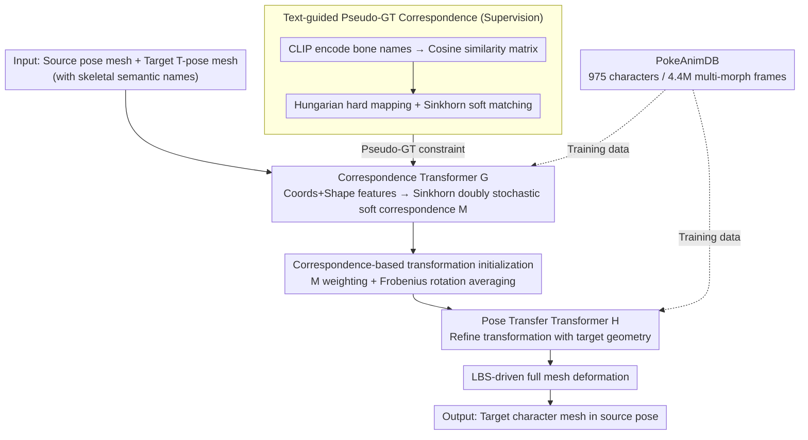

# MimiCAT: Mimic with Correspondence-Aware Cascade-Transformer for Category-Free 3D Pose Transfer

**Conference**: CVPR 2026  
**arXiv**: [2511.18370](https://arxiv.org/abs/2511.18370)  
**Code**: [https://mimicat3d.github.io/](https://mimicat3d.github.io/) (Project Page)  
**Area**: 3D Vision  
**Keywords**: 3D Pose Transfer, Cross-Category Transfer, Soft Correspondence, Cascade Transformer, Large-scale Motion Dataset

## TL;DR
This paper proposes MimiCAT, a cascaded Transformer framework that learns flexible many-to-many soft correspondences via semantic keypoint labels. Combined with PokeAnimDB, a million-scale multi-category motion dataset, it achieves high-quality 3D pose transfer across categories (e.g., humanoid to quadruped/bird) for the first time.

## Background & Motivation

1.  **Background**: 3D pose transfer aims to apply the pose of a source character to a target character while preserving the target's geometric features and the source's pose information. Existing methods are mostly limited to characters with similar structures (e.g., humanoid to robot) and achieve transfer by learning one-to-one correspondences at the keypoint or vertex level.

2.  **Limitations of Prior Work**: When the body structures of source and target characters differ significantly (e.g., humanoid to bird), one-to-one mapping fails completely. For instance, how should limbs map to two wings? Furthermore, existing methods primarily rely on human motion datasets (e.g., AMASS), which often lead to unnatural out-of-distribution deformations on non-humanoid characters.

3.  **Key Challenge**: Different categories of characters possess distinct skeletal structures, keypoint counts, and rotation patterns. Traditional one-to-one keypoint mapping cannot represent these complex many-to-many correspondences. Additionally, there is a lack of large-scale datasets containing animations for diverse character types.

4.  **Goal**: (a) How to establish flexible correspondences between characters with significant structural differences? (b) How to obtain sufficiently diverse cross-category motion data to train the model? (c) How to ensure the generated pose transformations are physically plausible?

5.  **Key Insight**: It is observed that skeletal keypoints of characters usually carry semantic labels (e.g., "limbs" can correspond to human "arms" and bird "wings"). Utilizing this semantic information bypasses the need for manual correspondence labeling; CLIP is used to encode text labels to generate many-to-many soft correspondence pseudo-labels.

6.  **Core Idea**: Achieving true cross-category 3D pose transfer through semantic keypoint label-driven soft correspondence learning, a shape-aware cascaded Transformer, and a million-scale multi-category motion dataset.

## Method

### Overall Architecture
The core problem MimiCAT addresses is how to "translate" the source pose to a target when structures differ vastly (Humanoid → Bird). The input consists of a source character mesh in a specific pose and a target character mesh in T-pose. The output is the target mesh deformed into the source pose.

The process is divided into two stages executed by two consecutive Transformers. Stage I trains the **Correspondence Transformer $\mathcal{G}$**, which calculates a soft correspondence matrix between the source and target keypoint sets—not a "who-to-who" hard match, but a many-to-many probability distribution. Stage II freezes $\mathcal{G}$ and trains the **Pose Transfer Transformer $\mathcal{H}$**. The soft correspondence matrix is used to roughly map source rotations/translations to target keypoints for initial transformations. $\mathcal{H}$ then refines these transformations based on the target's own geometry. Finally, Linear Blend Skinning (LBS) applies these transformations to drive the entire mesh. Supervision for correspondences comes from pseudo-ground truth generated by text semantic labels, requiring no manual labeling. Multi-category training data is provided by the self-created PokeAnimDB.

### Key Designs

**1. PokeAnimDB: A Million-Scale Multi-Morphology Dataset for Cross-Category Training**

The first barrier to cross-category transfer is data rather than models. Common datasets like Mixamo or AMASS are either humanoid-only or limited in variety, failing to teach models how non-humanoid structures like "wings" or "fins" move. The authors collected 975 characters spanning humanoids, quadrupeds, birds, reptiles, fish, and insects, resulting in 28,809 artist-designed animation sequences totaling ~4.4 million frames. Each character is remeshed to 5,000 faces, skeletal animations are stored as .bvh, and semantic bone names are preserved—which is crucial for the text-guided supervision. This is currently the largest motion library for multi-category 3D characters.

**2. Text-guided Pseudo-GT Correspondence: Bone Names as Cross-Category Bridges**

Training the correspondence Transformer requires "correct correspondences," but manual cross-category labeling is expensive and ambiguous. The authors leverage bone semantic names (e.g., `left_arm`, `right_wing`, `tail`) which naturally encode body part semantics. CLIP is used to encode these into text features to compute a cosine similarity matrix $\mathbf{S}_{\cos}$ between source and target keypoints. Two pseudo-ground truths are generated: a one-to-one hard mapping $\mathbf{M}_{\text{hung}}$ via the Hungarian algorithm (ensuring anchor points) and a many-to-many soft mapping $\mathbf{M}_{\text{sink}}$ via Sinkhorn normalization (allowing "limbs" to be distributed between "arm" and "wing"). Both constrain $\mathcal{G}$ to maintain flexibility without losing certainty.

**3. Correspondence Transformer $\mathcal{G}$: Shape-Aware Estimation of Soft Correspondences**

The challenge for $\mathcal{G}$ is outputting flexible matches between keypoint sets of different lengths. It first encodes keypoint coordinates into tokens $g_{\mathbf{C}}$ and mesh geometric features into shape tokens $g_{\mathbf{M}}$ using a pre-trained 3D shape encoder. These are concatenated and passed through Transformer blocks to obtain shape-aware representations $\mathbf{g}^{\text{src}}$ and $\mathbf{g}^{\text{tgt}}$. Unlike GNNs, which rely on skeletal connectivity and struggle with cross-category topological differences, this approach uses coordinates and shape features for better generalization. Similarity is given by a learnable affine matrix $\mathbf{A}$:

$$\mathbf{S} = \exp\!\big(\mathbf{g}^{\text{src}\top}\mathbf{A}\,\mathbf{g}^{\text{tgt}}\big)$$

This is normalized into a doubly stochastic matrix $\mathbf{M}$ via Sinkhorn iterations, where $\mathbf{M}_{i,j}$ represents the probability of matching source keypoint $i$ to target keypoint $j$. Doubly stochasticity allows one source point to be distributed across multiple target points, offering more flexibility than one-to-one mapping.

**4. Correspondence-Based Transformation Initialization: Frobenius Solution for Rotation Averaging**

With soft correspondence $\mathbf{M}$, the most direct approach is to weight and average source keypoint transformations onto target points. While translation and position can be linearly averaged, **rotations cannot**. Weighted sums of quaternions yield non-unit quaternions and suffer from sign ambiguity ($\mathbf{q}$ and $-\mathbf{q}$ represent the same rotation), leading to distortion. The authors adopt rotation averaging based on Frobenius norm minimization. The initial rotation for target point $j$ is the eigenvector corresponding to the largest eigenvalue of the weighted covariance matrix:

$$\mathbf{R}_j = \sum_i \mathbf{M}_{i,j}\,\mathbf{q}_i\mathbf{q}_i^\top$$

This ensures the resulting rotation is mathematically valid and unit-normalized, avoiding the ill-conditioned nature of naive averaging.

**5. Pose Transfer Transformer $\mathcal{H}$: Geometry-Aware Transformation Refinement**

Initialization only provides a "rough" transfer without considering the target's specific geometric constraints (e.g., a bird's joint limits differ from a human's). $\mathcal{H}$ performs refinement: it first encodes source deformation as a feature difference $\delta_\mathbf{f} = \mathbf{f}_{\mathbf{V}^{\text{src}}} - \mathbf{f}_{\bar{\mathbf{V}}^{\text{src}}}$, injecting it into the target representation via cross-attention. Keypoint tokens are formed by concatenating target keypoint positions, query positions, and initial transformations. The Transformer blocks fuse these, and an MLP decodes final transformation parameters for each keypoint to drive LBS.

### Loss & Training

**Stage I**: Trains Correspondence Transformer $\mathcal{G}$ optimizing a Frobenius loss $\mathcal{L}_{\text{forb}} = \|\mathbf{S} - \mathbf{S}_{\cos}\|_2^2 + \|\mathbf{M} - \mathbf{M}_{\text{sink}}\|_2^2 + \|\mathbf{M} - \mathbf{M}_{\text{hung}}\|_2^2$, aligning predicted similarity with text-based similarity, soft pseudo-GT, and hard pseudo-GT.

**Stage II**: Freezes $\mathcal{G}$ and trains $\mathcal{H}$ using cycle-consistency. The reconstruction loss $\mathcal{L}_{\text{rec}} = \|\hat{\mathbf{V}}^{\text{src}} - \mathbf{V}^{\text{src}}\|_2^2$ ensures that transferring and then back-transferring restores the source. A pose prior regularization $\mathcal{L}_{\text{reg}}$ uses a pre-trained matrix-Fisher distribution model to constrain rotations. Feature consistency loss $\mathcal{L}_{\text{feat}}$ ensures high-level geometric consistency. During inference, an additional ARAP (As-Rigid-As-Possible) optimization is performed to enhance mesh smoothness.

## Key Experimental Results

### Main Results

| Setup | Method | PMD↓ (×100) | ELS↑ |
|------|------|-------------|------|
| H2H (Humanoid-to-Humanoid) | NPT | 6.334 | 0.842 |
| H2H | CGT | 5.687 | 0.887 |
| H2H | SFPT | 3.616 | 0.888 |
| H2H | TapMo | 5.078 | 0.877 |
| H2H | **MimiCAT** | **3.570** | **0.923** |
| CCT (Cross-Category) | NPT | 9.889 | 0.260 |
| CCT | CGT | 6.314 | 0.744 |
| CCT | SFPT | 4.312 | 0.913 |
| CCT | TapMo | 4.883 | 0.922 |
| CCT | **MimiCAT** | **4.264** | **0.927** |

### Ablation Study

| Configuration | PMD↓ (H2H) | PMD↓ (CCT) | Description |
|------|-----------|-----------|------|
| Full MimiCAT | 3.570 | 4.264 | Complete model |
| A1: w/o Rotation Avg (Eq.4) | 4.439 | 4.524 | Naive averaging leads to orientation ambiguity |
| A2: w/o Pose Prior (Eq.8) | 4.161 | 4.655 | Lack of prior leads to unnatural deformation |
| A3: w/o Text Supervision (Eq.5) | 4.268 | 4.612 | Using hierarchical correspondence yields inaccurate mapping |

### Key Findings
- Rotation initialization (Eq.4) is critical for cross-category transfer; removing it increases CCT PMD from 4.264 to 4.524.
- Pose prior regularization (Eq.8) prevents joint distortion and self-intersection, with its absence causing the largest increase in cross-category PMD (4.655).
- Text-guided semantic correspondence outperforms heuristic hierarchical algorithms, which tend to create wrong matches (e.g., matching a dog's hind leg to a human arm).
- The model can be integrated zero-shot into existing text-to-motion systems (e.g., MLD, T2M-GPT) to generate animations for arbitrary characters.

## Highlights & Insights
- **Semantic Label-driven Soft Correspondence**: Cleverly leverages skeletal text names + CLIP encoding for cross-category alignment, eliminating manual labeling and supporting many-to-many matches. This concept is transferable to other cross-domain alignment tasks.
- **Frobenius Rotation Averaging**: Solves the mathematical ill-conditioning of quaternion averaging, a technique valuable for any 3D task involving rotation aggregation.
- **Million-scale Diversity Dataset**: PokeAnimDB covers 4.4 million frames across 975 characters, serving as the largest multi-category 3D character motion dataset.

## Limitations & Future Work
- Dependent on the quality of pre-trained rigging models (RigNet); skeletal prediction may fail for extremely non-standard characters.
- "Plausibility" in cross-category transfer lacks a clear definition; evaluation metrics (like cycle consistency) serve as proxies.
- Inference still requires ARAP optimization to ensure mesh quality, increasing computational overhead.
- Copyright and licensing issues for data sources are not fully addressed.

## Related Work & Insights
- **vs SFPT**: SFPT uses a fixed count of handle points for one-to-one mapping, failing in cross-category scenarios with varying keypoint counts. MimiCAT naturally supports variable-length keypoints.
- **vs TapMo**: TapMo is also handle-based and restricted by one-to-one correspondence assumptions. MimiCAT significantly outperforms it in cross-category setups.
- **vs NPT/CGT**: These methods are designed for similar topologies and suffer severe performance degradation in cross-category scenarios.

## Rating
- Novelty: ⭐⭐⭐⭐ First systematic solution for category-free 3D pose transfer with sound soft correspondence and cascaded Transformer design.
- Experimental Thoroughness: ⭐⭐⭐⭐ Evaluated on both intra-category and cross-category tasks with complete ablations and downstream applications.
- Writing Quality: ⭐⭐⭐⭐ Clear structure, detailed methodology, and rich illustrations.
- Value: ⭐⭐⭐⭐ The new dataset and method significantly advance the field of 3D animation and character transfer.

<!-- RELATED:START -->

## Related Papers

- [\[CVPR 2026\] Generalizable Structure-Aware Keypoint Correspondence for Category-Unified 3D Single Object Tracking](generalizable_structure-aware_keypoint_correspondence_for_category-unified_3d_si.md)
- [\[CVPR 2026\] UniCorrn: Unified Correspondence Transformer Across 2D and 3D](unicorrn_unified_correspondence_transformer_across_2d_and_3d.md)
- [\[CVPR 2026\] ManifoldNeuS: Manifold-aware View Optimizability for Pose-Free Neural Surface Reconstruction](manifoldneus_manifold-aware_view_optimizability_for_pose-free_neural_surface_rec.md)
- [\[CVPR 2026\] AeroGS: Scale-Aware Gaussian Splatting for Pose-Free Dynamic UAV Scene Reconstruction](aerogs_scale-aware_gaussian_splatting_for_pose-free_dynamic_uav_scene_reconstruc.md)
- [\[CVPR 2026\] SCAPO: Self-Supervised Category-Level Articulated Pose Estimation from a Single 3D Observation](scapo_self-supervised_category-level_articulated_pose_estimation_from_a_single_3.md)

<!-- RELATED:END -->
