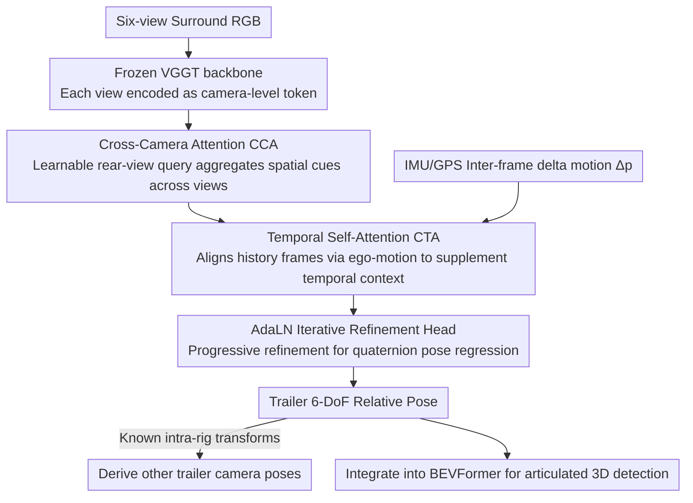

# Mind the Hitch: Dynamic Calibration and Articulated Perception for Autonomous Trucks

**Conference**: CVPR 2026  
**arXiv**: [2603.23711](https://arxiv.org/abs/2603.23711)  
**Code**: To be open-sourced (the paper claims to release datasets, devkits, and source code)  
**Area**: 3D Vision / Autonomous Driving  
**Keywords**: Autonomous Trucks, Dynamic Calibration, Articulated Perception, Trailer Pose Estimation, BEV Detection

## TL;DR

Ours proposes the dCAP framework, which achieves real-time 6-DoF relative pose estimation between the tractor and trailer in articulated autonomous trucks via Transformer-based cross-view and temporal attention mechanisms. It is integrated into BEVFormer to enhance 3D object detection performance under articulated motion (translation error 0.452m, rotation error 0.042 rad).

## Background & Motivation

1. **Background**: Autonomous driving is primarily designed for rigid vehicles (e.g., sedans, SUVs), where sensor calibration assumes fixed extrinsic parameters. Perception models like BEVFormer and datasets like nuScenes or Waymo are based on the rigid body assumption.

2. **Limitations of Prior Work**: Articulated trucks involve a fifth-wheel coupling between the tractor and trailer, forming an articulated structure. This leads to: (a) sensor extrinsics varying over time; (b) continuous calibration drift due to suspension movement, load changes, and braking pitch; (c) the tractor and trailer potentially belonging to different companies, where one tractor may connect to multiple trailers.

3. **Key Challenge**: Existing multi-view perception systems (e.g., BEVFormer) assume a fixed baseline. When the articulation angle changes, epipolar geometry drifts, making static calibration obsolete within milliseconds. Traditional SfM methods (e.g., COLMAP) fail under conditions of weak parallax, repetitive textures, and rolling shutter effects.

4. **Goal**: (a) Continuously estimate the 6-DoF pose of the trailer relative to the tractor online; (b) maintain robustness in large-angle articulation and occlusion scenarios; (c) integrate dynamic calibration into downstream 3D detection.

5. **Key Insight**: Leverage the structural priors of articulated trucks—the tractor and trailer are individually rigid; only the inter-rig transformation varies over time. This significantly simplifies the problem: only the pose of one rear trailer camera needs to be predicted, while the poses of the other two trailer cameras are derived via known intra-rig transforms.

6. **Core Idea**: Use an end-to-end Transformer to directly regress the dynamic pose of the trailer, combining cross-view spatial attention and temporal self-attention to achieve articulation-aware online calibration.

## Method

### Overall Architecture

dCAP addresses a problem often masked by the rigid body assumption: the tractor and trailer are articulated via a fifth wheel, causing the extrinsic parameters of rear-mounted trailer cameras to drift constantly due to steering, suspension, and loading. The 6-DoF pose relative to the tractor must be estimated frame-by-frame. The pipeline operates as follows: first, a **frozen VGGT backbone** encodes six-view surround RGB images into camera-level tokens; these tokens enter a lightweight decoder, first aggregating spatial cues across six views via **Cross-Camera Attention (CCA)**, then completing temporal information by aligning historical frames with ego-motion through **Temporal Self-Attention (CTA)**; finally, an **AdaLN-modulated iterative refinement head** gradually refines the aggregated features into a pose represented by quaternions. A key simplification comes from structural priors—the tractor and trailer are internally rigid, and only the inter-rig transformation changes. Thus, the model only needs to predict the pose of one rear camera, with the others derived from known intra-rig transforms. The accompanying STT4AT dataset (based on CARLA) is used for training and evaluation.

### Key Designs

**1. Cross-Camera Attention (CCA): Surfacing trailer pose cues from the most informative views**

Trailer pose evidence is not concentrated in a single camera—the front camera sees the trailer top, side cameras catch the articulation area, and only the rear camera faces the trailer body. No single view is sufficient. CCA introduces a **learnable rear-camera query** $Q$, which actively selects relevant information from the six camera tokens via multi-head cross-attention: $Q' = \text{MHA}(Q, \{T_i\}_{i=1}^6, \{T_i\}_{i=1}^6)$. To preserve the spatial identity of which token comes from which camera, camera-indexed positional encodings are added. The result is then fused with the original rear token using a residual connection. Rather than passively concatenating features, the model adaptively gathers evidence from the views that see the trailer most clearly, resulting in optimal rotation error (RRA 0.048) in scenarios with low articulation and clear geometric correspondence.

**2. Temporal Self-Attention (CTA): Using ego-motion to align previous frame cues for blind-spot recovery**

In high-articulation scenarios like sharp or U-turns, the trailer is often occluded by itself or the environment, making single-frame spatial information insufficient for localization. CTA "rectifies" historical cues: first, inter-frame ego-motion $\Delta p_t = (\Delta x, \Delta y, \Delta \psi)$ is calculated via IMU/GPS and projected into feature space to align the previous frame's tokens:

$$\tilde{T}_{t-1} = T_{t-1} + W_\Delta \Delta p_t + b_\Delta$$

The current global token then performs temporal self-attention $G'_t = G_t + \text{MHA}(G_t, \tilde{T}_{t-1}, \tilde{T}_{t-1})$ on aligned historical tokens (queue length = 3). The key is "pose-aware" alignment—using raw historical features would introduce drift due to ego-vehicle movement. Compensating by $\Delta p_t$ before fusion prevents this, enabling CTA to reduce translation error by 36.8% during U-turns, effectively covering CCA’s weaknesses at large angles.

**3. AdaLN-modulated Iterative Refinement Head: Treating pose regression as progressive optimization**

Pose estimation is fundamentally more like iterative optimization than single-shot regression; one-step prediction often underfits large angles. The refinement head uses $L$ stacked Transformer blocks to repeatedly correct the current estimate. Each block uses the current pose embedding to predict a set of modulation parameters $(\alpha, \beta, \gamma)$ for AdaLN + affine modulation + gated residuals:

$$\hat{x} = \gamma \odot \big(\text{AdaLN}(x) \odot (1+\beta) + \alpha\big) + x$$

The final MLP head outputs the 6-DoF pose in quaternion form over 3 iterations. Each step allows the model to adjust feature processing based on the current estimate, similar to the iterative updates in RAFT, leading to more stable convergence at large articulation angles.

### Loss & Training

- Combined Loss: $L = w_{\text{trans}} L_{\text{trans}} + w_{\text{rot}} L_{\text{rot}}$, with both weights set to 1.0.
- Both translation and rotation losses use the $\ell_1$ norm.
- Adam optimizer, learning rate $1 \times 10^{-4}$, batch size 4, trained for 24 epochs.
- The encoder is fully frozen; only decoder components (CCA, CTA, refinement head) are trained.
- Training completed on a single NVIDIA RTX A6000.

## Key Experimental Results

### Main Results

**STT4AT Trailer Pose Estimation Results:**

| Method | $\Delta_T$↓ | $\Delta_x$↓ | $\Delta_y$↓ | $\Delta_z$↓ | RRA↓ |
|------|------------|------------|------------|------------|------|
| Static Calibration | 1.284 | 0.210 | 1.120 | 0.356 | 0.148 |
| VGGT | 6.040 | 2.761 | 3.082 | 3.634 | 0.309 |
| DUSt3R | 8.625 | 4.664 | 5.080 | 2.953 | 0.578 |
| GNSS-IMU KF | 1.379 | 0.309 | 1.116 | 0.431 | 0.129 |
| **dCAP (Ours)** | **0.452** | **0.061** | **0.421** | **0.085** | **0.042** |

**BEVFormer 3D Object Detection Results:**

| Method | AP↑ | NDS↑ | ATE↓ | AOE↓ |
|------|-----|------|------|------|
| Static Calibration | 0.058 | 0.033 | 0.734 | 0.153 |
| VGGT | 0.033 | 0.031 | 0.671 | 0.202 |
| dCAP (Ours) | **0.103** | **0.036** | **0.675** | **0.116** |
| GT (Upper Bound) | 0.129 | 0.039 | 0.513 | 0.105 |

### Ablation Study

| Config | $\Delta_T$↓ | RRA↓ | Description |
|------|------------|------|------|
| w/o CCA, w/o CTA | 0.632 | 0.073 | Baseline |
| w/ CCA only | 0.505 | 0.048 | Best rotation error (Spatial) |
| w/ CTA only | 0.452 | 0.058 | Best translation error (Temporal) |
| w/ CCA + CTA | 0.452 | 0.042 | Best in both metrics |

**Scenario Analysis (CCA vs CTA):**

| Scenario | CCA $\Delta_T$ | CTA $\Delta_T$ | CTA Relative Gain |
|------|----------------|----------------|-------------|
| Straight | 0.517 | 0.459 | -11.2% |
| Roundabout | 0.675 | 0.475 | -29.6% |
| U-turn | 1.117 | 0.706 | -36.8% |
| Multi-turn | 0.361 | 0.423 | +17.2% (CCA better) |

### Key Findings

- **CCA and CTA are complementary**: CCA excels in low-articulation scenarios (dominated by spatial geometric correspondence), while CTA performs exceptionally in high-articulation scenes (translation error reduced by 36.8% in U-turns).
- **VGGT/DUSt3R fail in truck scenarios**: Translation errors of 6-8m are significantly worse than static calibration (1.28m) due to weak parallax, repetitive textures, and close-range occlusion.
- **COLMAP fails to initialize**: Lack of valid initial image pairs results in immediate failure.
- **dCAP approaches GT upper bound**: AP 0.103 vs GT 0.129 (a 20% gap), indicating dynamic calibration is key to solving articulated perception.
- **Overall AP remains low**: This is expected as BEVFormer was designed for rigid vehicles; the combination of high-mounted cameras and moving trailer cameras exceeds its design assumptions.

## Highlights & Insights

- **Value of Problem Definition**: This is the first systematic study of articulated perception in autonomous trucks, providing a complete problem formalization, dataset, method, and evaluation framework. This addresses an urgent industrial need often overlooked by academia.
- **Leveraging Structural Priors**: Using the "rigid intra-rig, variable inter-rig" constraint simplifies the problem—estimating only one camera pose and deriving the rest via known transforms is much more efficient than general SfM.
- **Complementary Analysis of CCA/CTA**: Detailed scenario analysis reveals how spatial and temporal attention complement each other under different maneuvers, providing valuable design guidance for multi-module systems in autonomous driving.

## Limitations & Future Work

- **Simulation Data Limitations**: STT4AT is based on the CARLA simulator. Real-world challenges such as lighting variations, weather conditions, and sensor noise may pose additional difficulties.
- **BEVFormer Architecture Constraints**: Current AP is still low (0.103), partly because BEVFormer is not tailored for articulated vehicles. Dedicated articulation-aware detection architectures are needed.
- **Sensor Dependency**: Reliable GPS-IMU data is required for ego-motion information, which may be affected in GPS-denied environments (tunnels, urban canyons).
- **Future Directions**: (a) Collect real truck data to validate sim-to-real transfer; (b) design Specialized articulated BEV detectors to replace BEVFormer; (c) explore vision-only ego-motion estimation to replace GPS-IMU.

## Related Work & Insights

- **vs TruckV2X**: TruckV2X assumes oracle relative poses are known, which is unrealistic. dCAP provides practically viable online pose estimation.
- **vs VGGT/DUSt3R**: These general 3D reconstruction methods fail in articulated truck scenarios (6-8m error), proving that general methods cannot replace domain-specific designs.
- **vs UniCal/CaLiV**: These calibration methods assume fixed sensor geometry and are inapplicable to the dynamic calibration of articulated systems.

## Rating

- Novelty: ⭐⭐⭐⭐ The problem definition is very new (first dynamic calibration for articulated trucks), though method components (Transformer + Attention) are standard.
- Experimental Thoroughness: ⭐⭐⭐⭐ Comprehensive baseline comparisons and detailed ablation studies (including scenario-level analysis), but lacks real-world data validation.
- Writing Quality: ⭐⭐⭐⭐ Clear problem definition, detailed dataset descriptions, and well-structured methodology.
- Value: ⭐⭐⭐⭐ Fills a gap in articulated perception for autonomous trucks; the STT4AT dataset has independent value to the community.

<!-- RELATED:START -->

## Related Papers

- [\[CVPR 2026\] LiDAS: Lighting-driven Dynamic Active Sensing for Nighttime Perception](lidas_lighting-driven_dynamic_active_sensing_for_nighttime_perception.md)
- [\[CVPR 2026\] Perception Characteristics Distance: Measuring Stability and Robustness of Perception System in Dynamic Conditions under a Certain Decision Rule](perception_characteristics_distance_measuring_stability_and_robustness_of_percep.md)
- [\[CVPR 2026\] DynamicVGGT: Learning Dynamic Point Maps for 4D Scene Reconstruction in Autonomous Driving](dynamicvggt_learning_dynamic_point_maps_for_4d_scene_reconstruction_in_autonomou.md)
- [\[CVPR 2026\] LiREC-Net: A Target-Free and Learning-Based Network for LiDAR, RGB, and Event Calibration](lirec-net_a_target-free_and_learning-based_network_for_lidar_rgb_and_event_calib.md)
- [\[CVPR 2026\] Query2Uncertainty: Robust Uncertainty Quantification and Calibration for 3D Object Detection under Distribution Shift](query2uncertainty_robust_uncertainty_quantification_and_calibration_for_3d_objec.md)

<!-- RELATED:END -->
