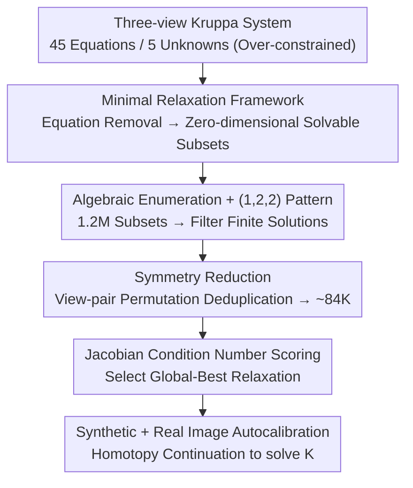

# Minimal Constraint Relaxation for Multiview Autocalibration

**Conference**: CVPR 2026  
**Paper**: [CVF Open Access](https://openaccess.thecvf.com/content/CVPR2026/html/Kosaka_Minimal_Constraint_Relaxation_for_Multiview_Autocalibration_CVPR_2026_paper.html)  
**Code**: Available (The paper claims open source on GitHub, specific address not provided ⚠️)  
**Area**: 3D Vision / Multiview Geometry / Camera Autocalibration  
**Keywords**: Autocalibration, Kruppa equations, Minimal problems, Constraint relaxation, Homotopy continuation

## TL;DR
Addressing the long-standing issue where the three-view Kruppa autocalibration equations are over-constrained (45 equations for 5 unknowns), leading to no solution or ill-conditioned results, this paper proposes a "minimal relaxation" framework. By systematically retaining only a subset of equations and using symbolic computation with numerical homotopy continuation to exhaustively search all subsets yielding finite solutions, the authors identify a unique feasible $(1,2,2)$ selection pattern. An offline "Global-Best" relaxation is then selected based on Jacobian condition numbers. This approach proves more robust and accurate than classic Kruppa formulas and recent branch-and-bound methods on both synthetic and real data.

## Background & Motivation
**Background**: Camera autocalibration is a classic problem of recovering camera intrinsic parameters from uncalibrated images using only image correspondences. A primary branch involves Kruppa equations, which relate the fundamental matrix $F$ between view pairs to the Dual Image of the Absolute Conic (DIAC, denoted as $\omega^*=KK^\top$). The advantage of this approach is its independence from scene geometry and its purely algebraic nature.

**Limitations of Prior Work**: When combining Kruppa relations from three view pairs, the resulting system is severely over-constrained with **45 bilinear equations and only 5 unknowns (parameters of the DIAC)**. Under noisy real-world data, this system is almost certainly inconsistent. Simply removing equations to form a square system often results in unstable or meaningless solutions. There has long been a lack of systematic answers regarding which equations to remove to ensure both a finite number of geometrically valid solutions and numerical stability.

**Key Challenge**: An over-constrained system must be "reduced to a solvable dimension," but the combinatorial space for **how to remove equations** is enormous ($\binom{45}{5}\approx 1.2\text{M}$). Furthermore, most removals lead to degenerate solution sets (positive dimension) or ill-conditioning. Algebraic minimality and numerical stability (condition number) are two different dimensions; past methods relied either on RANSAC-style random sampling or least squares with initial guesses, without thoroughly characterizing which subsets are inherently solvable and well-posed.

**Goal**: To decompose the constraint selection problem of the three-view Kruppa system into two questions: (1) Which subsets of equations yield a zero-dimensional (finite) solution set? (2) Among these solvable subsets, which is numerically the most stable?

**Key Insight**: Borrowing the language of "minimal problems" from algebraic geometry, the authors formalize equation removal as "minimal relaxation." They use computational algebra systems (Macaulay2) for symbolic Gröbner basis calculations and numerical homotopy to exhaustively determine the dimension and degree across the entire combinatorial space.

**Core Idea**: Replace "random sampling for equation removal" with "systematic enumeration + algebraic determination + condition number scoring." First, use symbolic/numerical methods to find all zero-dimensional relaxations; then, score each relaxation offline using Jacobian condition numbers to identify a noise-robust Global-Best relaxation.

## Method

### Overall Architecture
The method is essentially an offline analysis pipeline designed to "stepwise narrow the search space." Starting from the complete over-constrained system of 45 Kruppa equations, it first enumerates all subsets reduced to 5 equations (approx. 1.2M), using algebraic tools to filter out those with positive-dimensional (infinite) solution sets, leaving only zero-dimensional solvable ones. Next, view-pair permutation symmetry is used to remove essentially equivalent duplicates, compressing the space from ~1.2M to ~84K. Finally, the Jacobian condition number $\kappa(J_x)$ is estimated for each remaining relaxation, and the one with the smallest condition number (least sensitive to noise) is selected as the Global-Best for online autocalibration on synthetic and real images. This pipeline is run offline once on synthetic data, and the selected relaxation is subsequently used for real data without modification.

### Key Designs

**1. Minimal Relaxation Framework: Formalizing "Equation Removal" as a Decidable Minimal Problem**

This step addresses the problem of "how to legitimately remove equations from an over-constrained system." The authors define minimality using the "problem-solution manifold" $Z_{P,X}\subseteq P\times X$ and the projection $\pi:Z_{P,X}\to P$. A problem is minimal if and only if $\pi$ is a dominant map (its image is dense in the problem space) and the general fiber $\pi^{-1}(p)$ is finite and non-empty, with its degree $\deg(\pi)=|\pi^{-1}(p)|$ representing the number of complex solutions. For Kruppa, the problem space consists of compatible fundamental matrix triplets, and the unknown space is $X=\mathbb{C}^5\ni\omega^*$. A subset $F\subset G$ is a **minimal relaxation** if it defines a minimal problem-solution manifold near a general point, which is equivalent to the Jacobian being full rank $\mathrm{rank}\big(\partial F/\partial x\big|_{(p_0,x_0)}\big)=n$ ($n=\dim X=5$) at the ground truth solution $x$. Unlike prior work [6] that allows "squaring-up" via linear combinations or introducing slack variables, this paper uses only the simplest relaxation—"dropping equations"—as squaring-up destroys sparsity and introduces unrelated variables that obscure geometric structure.

**2. Algebraic Enumeration and $(1,2,2)$ Pattern: Determining Solvability Once and for All**

The difficulty lies in the fact that $\binom{45}{5}\approx1.2\text{M}$ subsets are too many to evaluate numerically one by one. Kruppa constraints come from all $2\times2$ minors of the matrix $C_i\in\mathbb{R}^{6\times2}$ for each view pair (total $\binom{6}{2}=15$ per pair), totaling 45 equations. The authors group relaxations into patterns $(a,b,c)$ ($a+b+c=5$, $0\le a,b,c\le5$) based on how 5 equations are distributed across three view pairs. Using Macaulay2 to calculate the ideal dimension via symbolic Gröbner bases, followed by Jacobian rank tests and numerical monodromy to find the degree, the conclusion is clear: **only the $(1,2,2)$ family of patterns consistently yields zero-dimensional (finite) solution sets**. Other patterns degenerate into positive dimensions. Only about 10% of the 1.2 million subsets are truly minimal. Furthermore, symbolic computation in the quotient ring of the 9-dimensional $F$ revealed exactly 9 "dependent pairs" of minors. These pairs correspond one-to-one with all under-constrained (positive dimension) cases, providing a complete "algebraic dependence ↔ dimensional degeneracy" explanation. The degree of the $(1,2,2)$ family is only 18 / 24 / 32, significantly lower than the thousands of roots in previous formulas [6], making homotopy solving much cheaper.

**3. Symmetry Reduction: Removing Essential Duplicates via Permutation Equivalence**

Even after isolating zero-dimensional relaxations, 138,240 candidates remain. The authors noted that when the same $(1,2,2)$ pattern is realized by different view pairs (e.g., $(1,2,2)\to(2,1,2)\to(2,2,1)$ permutations, or swapping two-constraint subsets while fixing the single-constraint pair), these relaxations are algebraically equivalent, representing only a relabeling of variables and parameters. By utilizing these two types of permutation symmetries, the search space is compressed from ~1.2M to ~84K permutation-inequivalent minimal relaxations, clearing the path for individual condition number scoring.

**4. Jacobian Condition Number Scoring and Global-Best: Final Screening via Numerical Sensitivity**

Algebraic minimality only guarantees "finite solutions," not numerical stability, which is critical under real noise. For each relaxation, the authors calculate the condition number $\kappa(J_x)=\sigma_{\max}(J_x)/\sigma_{\min}(J_x)$ of the Jacobian $J_x=\partial F/\partial x\in\mathbb{R}^{5\times5}$ at the ground truth solution as a proxy for sensitivity to parameter perturbations. Since homotopy continuation eventually solves linear systems with $J_x$ as coefficients, $\kappa(J_x)$ directly limits the maximum achievable precision of any numerical method. Across 84K relaxations tested on 100 random scenes, they found a strong positive correlation between $\kappa(J_x)$ and the cumulative mean relative parameter error (sum mpe): relaxations with $\kappa(J_x)<10^5$ consistently kept errors below $10^{-8}$. By aggregating errors across noise levels and random seeds, a single **Global-Best** relaxation is identified and used for all subsequent real-image experiments.

### Loss & Training
This work utilizes algebraic geometry and numerical analysis; there are no learnable parameters or training losses. In the solving phase, `HomotopyContinuation.jl` in Julia is used for polyhedral homotopy, tracking 32 paths for both Kruppa and Global-Best (alternatively, 18 or 24 paths using monodromy-initialized parameter homotopy). For real data, a 6-point solver is used within an MSAC framework to estimate fundamental matrix triplets, iterating up to 200 times to select the result with the minimum reprojection error.

## Key Experimental Results

### Main Results
On real multiview datasets (Strecha SfM-eval, CVLAB-EPFL strecha08, COLMAP colmap-public), intrinsic parameters were estimated using a 6-point solver within the MSAC framework, reporting relative errors. Global-Best consistently outperformed classic Kruppa:

| Dataset | Classic Kruppa | Ours (Global-Best) | Conclusion |
|---------|----------------|--------------------|------------|
| SfM-eval | Higher error | Significantly lower | Substantial improvement |
| colmap-public | Higher error | Significantly lower | Substantial improvement |
| strecha08 | Moderate error | Slightly lower & consistent | Stable minor improvement |
| Fountain P11 | Comparable | Comparable | Exception; both are close |

Synthetic experiments: Image size $640\times480$, pixel noise $\sigma\in[0,1]$, with 100 random seeds for 6/7/8 point configurations. Across all configurations and noise levels, the mean projection error for Global-Best was lower than the Kruppa baseline with smaller variance, indicating higher robustness. Metrics included normalized errors for intrinsics: focal length error $\Delta f_g$, principal point error $\Delta_{uv}$, and skew error $\Delta_s$.

### Ablation Study (Dimension/Degree Enumeration)
Statistics of solution set dimension $\dim V(F)$ and degree $\mathrm{Deg}$ by relaxation pattern (Selection from Table 1):

| Relaxation Pattern | $\dim V(F)$ | Degree | Occurrences | Note |
|--------------------|-------------|--------|-------------|------|
| $(1,2,2)$ | 0 | 18 | 91,250 | Only family always zero-dim |
| $(1,2,2)$ | 0 | 24 | 42,130 | Same family, higher degree |
| $(1,2,2)$ | 0 | 32 | 4,860 | Same family, highest degree |
| $(1,1,3)$ | 1 | 12 | 64,350 | Degenerates to pos. dim |
| $(0,0,5)$ | 3 | 3 | 2,922 | Severely under-constrained |

### Key Findings
- **Only $(1,2,2)$ patterns are solvable**: All other distribution patterns yield positive-dimensional (infinite) solution sets. Approximately 10% of 1.2 million subsets are minimal, narrowing the choice of "which equations to drop" to a specific combinatorial pattern.
- **One-to-one mapping between algebraic dependence and dimension degeneracy**: Nine "dependent minor pairs" explain all under-constrained cases in the table (e.g., pairs in the 2nd/3rd view pair → dim 1; both appearing → dim 2), providing a closed-loop mechanical explanation.
- **Condition number is a reliable proxy for stability**: Relaxations with $\kappa(J_x)<10^5$ show stable errors below $10^{-8}$. The strong correlation between $\kappa$ and sum mpe allows offline scoring to predict online accuracy.
- **Much lower degree than prior work**: The degree for the $(1,2,2)$ family is only 18/24/32, compared to the thousands of roots in previous general formulations [6], making the solver more efficient.
- **BnB is incompatible with Kruppa**: Branch-and-bound (BnB) methods [28] require DIAC $\omega^*$ to be positive definite for Cholesky decomposition. Real noise often violates this, leading to intrinsic errors in the thousands; thus, BnB is relegated to supplementary comparisons.

## Highlights & Insights
- **Treating "equation removal" as an enumerable, decidable algebraic problem**: By using the language of minimal problems and solution manifolds, the authors transform an empirical engineering task into a systematic process of "enumeration → dimension check → degree calculation." Characterizing the entire 1.2M space is a major methodological contribution.
- **Algebraic minimality $\neq$ Numerical stability**: Ensuring finite solutions via symbolic/numerical methods followed by ensuring well-posedness via Jacobian condition numbers represents a "solvability first, stability second" filtering strategy. This logic is transferable to other over-constrained minimal problems like pose or homography estimation.
- **Offline selection for online use**: Global-Best is selected on synthetic data and successfully deployed to real data, avoiding the uncertainty of online random sampling for equation removal—a highly practical engineering paradigm.
- **Reusable trick**: Using "dependent minor pair" criteria to quickly identify under-constrained subsets is much cheaper than running Gröbner bases for every subset, offering a blueprint for pre-screening other multiview minimal problems.

## Limitations & Future Work
- **Strong geometric assumptions**: The method assumes three views and constant intrinsics ($K$). Generalization to zooming/variable intrinsics or more views (as in [23,38] using non-linear least squares) is not directly covered.
- **Empirical optimality of Global-Best**: The scoring and final selection are empirical (as noted by the authors). Whether this remains optimal under significantly different data distributions or noise models needs further verification.
- **Scale of real experiments**: Evaluation was limited to three SfM/MVS datasets and a 6-point solver. High-resolution real images scale absolute errors proportionally, making absolute values difficult to compare directly across datasets.
- **Future directions**: Replacing condition number scoring with indices more robust to noise distributions, extending the framework to other algebraic formulas (e.g., DAQ or modulus constraints), or combining Global-Best initialization with local refinement or BnB global optimality.

## Related Work & Insights
- **vs. Classic Kruppa [24]**: The classic method uses SVD parameterization of the fundamental matrix and solves 5 of 6 Kruppa equations. This paper treats Kruppa algebraically and selects the best $(1,2,2)$ relaxation, yielding better accuracy and stability.
- **vs. Kruppa-BnB [28]**: BnB performs inlier maximization for global optimality but fails under real noise when DIAC is not positive definite. This paper's Global-Best approach is simpler and more robust.
- **vs. Prior HC Relaxations [6]**: This work adopts the "minimal relaxation" concept but strictly uses equation dropping, resulting in systems with degrees of only 18/24/32—much smaller than the 2985 roots in general cases, allowing for more efficient solvers.
- **vs. DAQ / Modulus Constraints [25]**: Since DIAC is the conic envelope of DAQ, DAQ formulas often decompose into first solving for DIAC. This paper pushes the constraint selection for DIAC to its limit.

## Rating
- Novelty: ⭐⭐⭐⭐⭐ First exhaustive symbolic-numerical characterization of constraint selection for three-view Kruppa, identifying $(1,2,2)$ as the only solvable pattern.
- Experimental Thoroughness: ⭐⭐⭐⭐ Sufficient validation on synthetic and three real datasets, though the variety of solvers and real-world scale could be broader.
- Writing Quality: ⭐⭐⭐⭐ Rigorous algebraic derivation and clear structure, though many details are deferred to supplementary materials.
- Value: ⭐⭐⭐⭐ Provides a reusable framework and a "ready-to-use" Global-Best relaxation for autocalibration, highly applicable in engineering.

<!-- RELATED:START -->

## Related Papers

- [\[CVPR 2026\] Ego-1K: A Large-Scale Multiview Video Dataset for Egocentric Vision](ego-1k_--_a_large-scale_multiview_video_dataset_for_egocentric_vision.md)
- [\[CVPR 2026\] MVGGT: Multimodal Visual Geometry Grounded Transformer for Multiview 3D Referring Expression Segmentation](mvggt_multimodal_visual_geometry_grounded_transformer_for_multiview_3d_referring.md)
- [\[CVPR 2026\] HyperMVP: Hyperbolic Multiview Pretraining for Robotic Manipulation](hyperbolic_multiview_pretraining_for_robotic_manipulation.md)
- [\[CVPR 2026\] Dynamic Black-hole Emission Tomography with Physics-informed Neural Fields](dynamic_black-hole_emission_tomography_with_physics-informed_neural_fields.md)
- [\[CVPR 2026\] Neural Dynamic GI: Random-Access Neural Compression for Temporal Lightmaps in Dynamic Lighting Environments](neural_dynamic_gi_random-access_neural_compression_for_temporal_lightmaps_in_dyn.md)

<!-- RELATED:END -->
