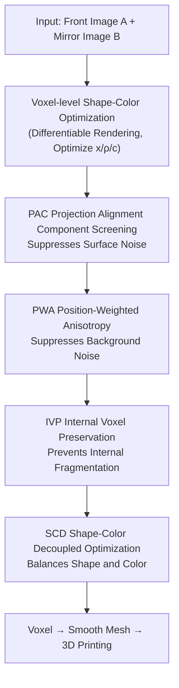

# Mirror Illusion Art

**Conference**: CVPR 2026  
**Paper**: [CVF Open Access](https://openaccess.thecvf.com/content/CVPR2026/html/Zhu_Mirror_Illusion_Art_CVPR_2026_paper.html)  
**Code**: https://github.com/zxp555/AutoMIA  
**Area**: 3D Vision / Inverse Graphics / Computational Design  
**Keywords**: Mirror Illusion, Inverse Design, 3D Voxel Optimization, Joint Shape-Color Optimization, 3D Printing

## TL;DR
This paper proposes AutoMIA: given two 2D target images ("front view" and "mirror reflection"), it automatically optimizes a 3D-printable voxel model that satisfies both shape and color constraints. This allows the same object to present two seemingly completely different patterns before and after the mirror. The design is completed in approximately 76 seconds with 2.6 GB VRAM on a single RTX 3090.

## Background & Motivation

**Background**: Optical illusion art is categorized into 2D (e.g., Hybrid Images, Visual Anagrams) and 3D (e.g., Shadow Art, Multi-View Wire Art). This paper focuses on a new 3D illusion—"Mirror Illusion Art": a 3D object placed before a mirror where the object itself and its reflection appear as two unrelated items.

**Limitations of Prior Work**: Existing approaches are cumbersome. First, Sugihara's topological method relies heavily on manual intuition and complex mathematical derivations, making it difficult for beginners, and it only optimizes shape without color support. Second, adapting Shadow Art methods also limits optimization to shape; since they focus on "projected shadows" rather than object geometry, they often produce non-smooth, incomplete 3D objects that are visually poor and difficult to print.

**Key Challenge**: Mirror illusion is an under-constrained inverse problem—deriving a 3D object from "two non-orthogonal target views." The supervision signals only constrain the surface, not the interior, and signals from the two views interfere with each other. The authors summarize these interferences into four types of defects: **surface noise** (supervision from one view introduces noise into the reconstruction of the other), **background noise** (stray voxels appearing in mid-air far from the surface), **internal fragmentation** (lack of supervision for internal voxels leads to zero density and structural disconnection), and **shape-color imbalance** (satisfying only shape or color, or color "leakage" between views).

**Goal**: To create a fully automated pipeline for joint shape-color optimization of mirror illusion art that produces physically printable results while suppressing the four aforementioned defects.

**Key Insight**: Formulation of the problem as a differentiable rendering task to minimize the difference between projections from two views and target images. It jointly optimizes the position, density (opacity), and color of each voxel in a 3D representation, incorporating four stabilization mechanisms to address each defect type.

**Core Idea**: Building on voxel-level joint shape-color optimization, the PAC, PWA, IVP, and SCD mechanisms are used to eliminate surface noise, background noise, internal fragmentation, and shape-color imbalance, respectively, stabilizing the under-constrained inverse problem into a high-quality, printable solution.

## Method

### Overall Architecture
The goal of AutoMIA is to reconstruct a 3D object $V$ such that its direct view $C_{\text{direct}}$ resembles target $A$ and its mirror reflection $C_{\text{mirror}}$ resembles target $B$. The optimization objective is:

$$\min_V \big(\Phi(\mathrm{R}(V,\theta_{\text{direct}}),A)+\Phi(\mathrm{R}(V,\theta_{\text{mirror}}),B)\big),$$

where $\mathrm{R}$ is the differentiable renderer, $\theta_{\text{direct}}/\theta_{\text{mirror}}$ are the two viewing angles, and the similarity $\Phi$ comprises shape loss $L_{\text{shape}}$ (BCE between target and projected masks) and color loss $L_{\text{color}}$ (L1 between target and projected colors). The object is represented by a set of voxels $V=\{(x_i,\rho_i,c_i)\}$, where coordinates $x_i$, density $\rho_i\in[0,1]$, and color $c_i$ are jointly optimized.

The pipeline processes input images through differentiable rendering on a $128^3$ voxel grid, applying PAC, PWA, IVP, and SCD mechanisms, followed by converting voxels to a smooth mesh for 3D printing.

### Key Designs

**1. PAC (Projection Alignment Component screening): Removing stray surface components via projection consistency**

To address "surface noise," PAC groups "face-connected" voxels into $K$ connected components $S_k$. For each component, projection masks $M_k^{\text{direct}}$ and $M_k^{\text{mirror}}$ are rendered. An alignment score measures consistency with target masks $M_A$ and $M_B$:

$$l_k=\alpha\,\mathrm{IoU}(M_k^{\text{direct}},M_A)+\beta\,\mathrm{IoU}(M_k^{\text{mirror}},M_B)-\gamma\big(O(M_k^{\text{direct}},M_A)+O(M_k^{\text{mirror}},M_B)\big),$$

where $\mathrm{IoU}$ rewards projections falling within the target, and $O(X,Y)=|X\cap(1-Y)|/|X|$ penalizes the ratio of projections exceeding the target boundary. Components with $l_k < \tau$ are removed iteratively during optimization, ensuring a smoother surface.

**2. PWA (Position-Weighted Anisotropy): Distance-weighted penalty for noise**

Addressing "background noise," PWA applies a distance-adaptive weight to each pixel on the projection plane. The further a pixel is from the target mask, the higher the penalty. Given Euclidean distances $d_{\max}(u)$ and $d_{\min}(u)$ from pixel $u$ to the target mask $M$, the weight is defined as:

$$w(u)=1+(w_{\max}-1)\cdot\Big(\frac{d_{\min}(u)}{d_{\max}(u)}\Big)^q,$$

where $q$ controls distance gain and $w_{\max}$ is the upper bound. Multiplying $w(u)$ into the shape loss heavily penalizes background voxels far from the target.

**3. IVP (Internal Voxel Preservation): Density floors for internal voxels to prevent collapse**

To prevent "internal fragmentation," IVP defines "solid voxels" as those with density $\rho(x) > \gamma$. A $k\times k\times k$ kernel $\Omega$ slides over the object; a voxel is identified as an "internal voxel" only if all voxels within the kernel are solid:

$$m(x)=\mathbb{1}\Big[\frac{1}{|\Omega|}\sum_{y\in\Omega(x)}o(y)=1\Big].$$

A density floor $\rho_{\min}$ is applied to all internal voxels to ensure structural connectivity for 3D printing.

**4. SCD (Shape-Color Decoupled optimization): Three-stage scheduling**

Addressing "shape-color imbalance," SCD divides the optimization timeline $[0,T]$ into three phases: shape-only ($0\le t<t_1$), joint shape-color ($t_1\le t<t_2$), and color-only refinement ($t_2\le t\le T$). The total loss is:

$$L_{\text{total}}=w_s(t)\cdot L_{\text{shape}}+w_c(t)\cdot L_{\text{color}},$$

where $w_s(t)$ is 1 for $t<t_2$ and 0 thereafter, while $w_c(t)$ is 0 initially, $\lambda\in(0,1)$ in the middle, and 1 in the final stage. This avoids color interference before the geometry stabilizes.

### Loss & Training
The base includes shape BCE loss $L_{\text{shape}}$ and color L1 loss $L_{\text{color}}$. PWA integrates distance weights into $L_{\text{shape}}$, and SCD schedules these via time-varying weights. Resolution is $128^3$ using PyTorch3D. PAC and IVP are applied iteratively during the optimization loop.

## Key Experimental Results

### Main Results
Evaluated on the custom Mirror-2D dataset (1,200 images across letters, numbers, characters, emojis, etc.). Metrics: **SS** (Shape Score, 0–1, higher is better), **CS** (Color Score, 0–1, lower is better per original text description of color error), **NL** (Noise Level, 0–1, lower is better), and **SL** (Smooth Level, 0–1, higher is better).

| Method | SL ↑ | NL ↓ | SS ↑ | Time ↓ | VRAM ↓ |
|------|------|------|------|--------|--------|
| SA | 0.827 | 0.507 | 0.499 | 50s | 2.5 GB |
| SAR | 0.834 | 0.120 | 0.668 | 140s | 3.3 GB |
| **Ours** | **0.989** | **0.049** | **0.931** | 76s | 2.6 GB |

AutoMIA outperforms baselines significantly: SS improved from 0.668 to 0.931, NL dropped to 0.049, and SL reached 0.989. Despite the four mechanisms, efficiency remains comparable to the lightweight SA and faster than SAR, while providing color reconstruction (which baselines lack).

### Ablation Study

| Config | SL ↑ | NL ↓ | SS ↑ | CS ↓ | Description |
|------|------|------|------|------|------|
| Full (Ours) | 0.989 | 0.049 | 0.931 | 0.018 | Full Model |
| − PAC | 0.910 | 0.248 | 0.629 | 0.323 | Without PAC, CS degrades heavily |
| − PWA | 0.822 | 0.373 | 0.790 | 0.034 | Without PWA, SL/NL worsen |
| − IVP | 0.979 | 0.050 | 0.748 | 0.021 | Without IVP, SS drops |
| − SCD | 0.755 | 0.101 | 0.548 | 0.050 | Without SCD, SS/SL decline |

### Key Findings
- Each mechanism targets specific defects but provides global benefits: PAC significantly impacts color consistency, while IVP is crucial for shape scores.
- Mechanisms are mutually beneficial: smoother surfaces and reduced noise facilitate better color refinement.
- Physical implementation was verified by 3D printing 6 representative objects, which successfully transitioned from digital models to physical reality under standard lighting.
- A viewing angle constraint $\theta_1 < \Theta < \theta_2$ was derived, where too small an angle hides the back and too large an angle exposes it directly, breaking the illusion.

## Highlights & Insights
- Formulated mirror illusion as a "dual non-orthogonal view inverse graphics" problem and precisely diagnosed four types of defects, providing design-specific solutions.
- PAC's "connected component screening" is a reusable trick for under-constrained inverse problems; filtering by connectivity is more robust than per-pixel denoising.
- IVP provides a lightweight connectivity prior for voxel reconstruction where only surface supervision is available.
- SCD's three-stage scheduling acts as a curriculum for multi-objective optimization, preventing premature color signals from biasing geometric convergence.

## Limitations & Future Work
- Input images $A$ and $B$ must have similar widths to avoid signal conflicts.
- Image resolution should not exceed voxel resolution to prevent high-frequency artifacts.
- The illusion depends on specific viewing angles, posing a challenge for user placement robustness.
- Future work includes adaptive resolution voxels and incorporating viewing angle constraints directly into the optimization.

## Related Work & Insights
- **vs Shadow Art (SA/SAR)**: These focus on orthogonal projections and ignore internal geometry, leading to noise and fragmentation in mirror settings. AutoMIA outperforms them in quality and manufacturability by adding color and connectivity constraints.
- **vs Sugihara Topology**: Sugihara's methods are manual and lack color. AutoMIA provides a fully automated, quantifiable, joint shape-color pipeline.
- **vs 2D Illusions**: While 2D methods use multi-scale or generative priors, they are often time-consuming or stochastic. AutoMIA produces stable, 3D-printable physical objects.

## Rating
- Novelty: ⭐⭐⭐⭐⭐ 
- Experimental Thoroughness: ⭐⭐⭐⭐ 
- Writing Quality: ⭐⭐⭐⭐ 
- Value: ⭐⭐⭐⭐ 

<!-- RELATED:START -->

## Related Papers

- [\[CVPR 2026\] ART: Articulated Reconstruction Transformer](art_articulated_reconstruction_transformer.md)
- [\[CVPR 2026\] FF3R: Feedforward Feature 3D Reconstruction from Unconstrained Views](ff3r_feedforward_feature_3d_reconstruction_from_unconstrained_views.md)
- [\[CVPR 2026\] CUBE: Representing 3D Faces with Learnable B-Spline Volumes](cube_bspline_3d_faces.md)
- [\[CVPR 2026\] CGHair: Compact Gaussian Hair Reconstruction with Card Clustering](cghair_compact_gaussian_hair_reconstruction_with_card_clustering.md)
- [\[CVPR 2026\] Chorus: Multi-Teacher Pretraining for Holistic 3D Gaussian Scene Encoding](chorus_multi-teacher_pretraining_for_holistic_3d_gaussian_scene_encoding.md)

<!-- RELATED:END -->
