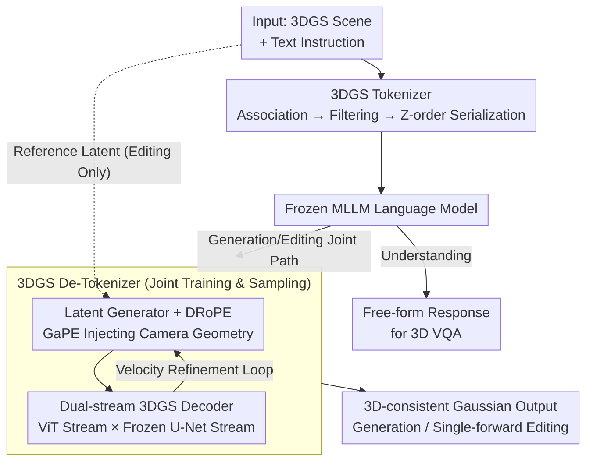

# MLLMSplat: A 2D MLLM-Powered Framework for 3D Gaussian Splatting Understanding, Generation, and Editing

**Conference**: CVPR 2026  
**Paper**: [CVF Open Access](https://openaccess.thecvf.com/content/CVPR2026/html/Xiu_MLLMSplat_A_2D_MLLM-Powered_Framework_for_3D_Gaussian_Splatting_Understanding_CVPR_2026_paper.html)  
**Code**: None  
**Area**: 3D Vision / Multimodal VLM  
**Keywords**: 3D Gaussian Splatting, Multimodal Large Model, 3DGS tokenizer, Latent Diffusion, Feedforward Editing

## TL;DR
MLLMSplat integrates an off-the-shelf 2D Multimodal Large Language Model (OmniGen2) into 3DGS with almost frozen weights. It employs a training-free 3DGS tokenizer to enable scene **understanding**, utilizes a dual rotary position encoding and a dual-stream decoder to guide its 2D latent diffuser for 3D-consistent Gaussian **generation**, and transfers image-editing capabilities to single-forward 3DGS **editing** via a novel view extrapolation proxy task, achieving SOTA across all three tasks.

## Background & Motivation

**Background**: 3D Gaussian Splatting (3DGS) has emerged as the mainstream representation for 3D scenes, with its understanding, generation, and editing paradigms evolving rapidly. Meanwhile, 2D Multimodal Large Language Models (MLLMs) have successfully unified understanding, generation, and editing into a single model with remarkable results.

**Limitations of Prior Work**: However, the three paradigms in 3DGS are still restricted to sub-optimal levels. Understanding is limited to **low-level perception** such as computing similarities between language features and text queries for segmentation, failing to support complex linguistic reasoning. Generation produces **low-quality**, domain-restricted results. Editing relies on iterative, **low-efficiency** workflows like using InstructPix2Pix to edit multiple views repeatedly and then optimizing the underlying Gaussians. All three lag significantly behind their 2D counterparts.

**Key Challenge**: Adapting mature 2D MLLM capabilities to 3DGS faces three major obstacles: (1) Directly rendering 3DGS into multi-view images and passing them through the native MLLM tokenizer discards spatial structures and introduces cross-view inconsistency, while training a dedicated 3DGS tokenizer is prohibitively expensive and locks the representation to a specific model's token space. (2) Existing methods that extend 2D diffusers to 3DGS (such as concatenating raymaps) disrupt 2D generation priors, sever connections with autoregressive language models, and suffer from insufficient 3D consistency. (3) No large-scale 3D editing dataset exists, making it difficult to train feedforward editing models.

**Goal**: To adapt 2D MLLMs to 3DGS with **minimal modification and minimal training cost**, equipping them with high-level understanding, high-quality generation, and highly efficient editing capabilities simultaneously.

**Key Insight**: Since the "understanding-generation-editing" pipeline of MLLMs is unified, solving the first two problems (how to comprehend 3DGS and how to output 3D-consistent Gaussians from the diffuser) should naturally allow the editing capability to be transferred "for free," without requiring any 3D editing datasets.

**Core Idea**: Equipping the MLLM with two plug-and-play "translation adapters": a **3DGS tokenizer** (translating Gaussians into tokens within the MLLM feature space, training-free) and a **3DGS de-tokenizer** (non-intrusively translating the diffused latent variables of the MLLM back into 3D-consistent Gaussians). With both in place, editing capabilities are naturally unlocked.

## Method

### Overall Architecture
MLLMSplat is designed around a frozen 2D MLLM (OmniGen2, which uses Qwen2.5-VL-3B as the understanding backbone and a FLUX-like 4B diffusion Transformer as the generation backbone) with two lightweight adapters integrated at its input and output. **Understanding**: The 3DGS tokenizer renders the Gaussian scene into multiple views and then reverses the rendering operation to back-project 2D visual features onto the individual Gaussians. The resulting features are filtered and serialized into a 1D sequence of tokens, which is then fed into the language model along with text tokens to generate free-form responses. **Generation**: The 3DGS de-tokenizer takes conditioning signals from the language model and feeds them to the diffusion Transformer. A Dual Rotary Position Encoding (DRoPE) mechanism enforces multi-view geometric consistency. The multi-view latents are then decoded into pixel-aligned Gaussians (splatter images) via a dual-stream VAE decoder. The generator and decoder are jointly trained and sampled. **Editing**: The clean latent representation of the input 3DGS is provided as a reference to the generator. By utilizing a "novel view extrapolation" proxy task for execution-stage fine-tuning, the model preserves low-level details of the non-edited regions while modifying target areas in a single forward pass.

### Key Designs

**1. Training-free, Model-agnostic 3DGS Tokenizer: Back-projecting 2D Features into Gaussians via Inverse Rendering**

The pain point is straightforward: directly feeding rendered images into the MLLM's native tokenizer yields view-independent features that fail to align across views, causing incorrect spatial reasoning. However, training a separate 3DGS tokenizer is expensive and less general. The authors' approach is to exploit the fact that 3DGS rendering is itself an invertible weighted process, enabling back-projecting of 2D features into view-consistent Gaussian features without any training. This process comprises three steps:
*   **Association**: Recall that alpha-blending rendering computes pixel color as $C_k = \sum_{i=1}^{N} c_i \alpha_{ik}\prod_{j=1}^{i-1}(1-\alpha_{jk}) = \sum_{i=1}^{N} c_i w_{ik}$, where $w_{ik}$ is the contribution weight of Gaussian $G_i$ to pixel feature $f_k$. Consequently, the final feature of each Gaussian is the weighted average across views based on contribution weights: $g_i = \frac{\sum_k w_{ik} f_k}{\sum_k w_{ik}}$.
*   **Filtering and Downsampling**: Gaussians with a total contribution (the denominator of the previous equation) below a threshold $\tau$ (which have almost no semantic influence) are discarded, vastly reducing the quantity. If the count still exceeds the MLLM context capacity, Farthest Point Sampling (FPS) is applied, using a distance metric that considers both geometry and semantics: $d(G_i,G_j)=2-\mathrm{RBF}(\Delta\mu^\top\Sigma^{-1}\Delta\mu)-\frac{g_i^\top g_j}{\|g_i\|\|g_j\|}$, where the first term is the Mahalanobis distance transformed by an RBF kernel and the second is the feature cosine dissimilarity.
*   **Serialization**: A 1D sequence of Gaussian features is constructed using a Z-order space-filling curve to preserve spatial locality, and then fed into the language model along with the text tokens.

The elegance of this approach lies in the fact that the aggregated features represent a view-consistent "one feature per Gaussian" depiction, which supports global scene understanding better than view-by-view features. Moreover, because it does not modify the weights of the MLLM, any future, more powerful MLLMs can benefit from it directly.

**2. DRoPE / GaPE: Embedding Camera Geometry into Attention Relative Position Encodings without Disrupting Generation Priors**

The first obstacle on the generation side is multi-view consistency. While diffusion Transformers can achieve multi-view generation via cross-view global self-attention, they lack strict geometric consistency. The mainstream method to address this is to concatenate camera raymaps along the channel dimension to the input. However, this shifts the input distribution away from the pre-trained domain, destroying pre-training capabilities and forcing heavy weight tuning.

The authors instead inject camera geometry as **relative position encodings** in the attention mechanism. The Multimodal Rotary Position Encoding (MRoPE) frequently used in MLLMs splits positions into "unit-level" (marking each text token or treating all tokens of an image as a single multimodal unit) and "intra-unit" (row-column coordinates within the image). The authors replace only the unit-level 1D RoPE with the Geometry-aware Position Encoding (GaPE).

Given camera intrinsic $K_i$ and extrinsic $[R_i\,|\,t_i]$, the projection matrix is constructed as:

$$P_i=\begin{bmatrix}K_iR_i & K_it_i \\ 0 & 1\end{bmatrix}$$

The query/key are then transformed by the geometric matrices before computing the dot product:

$$\langle q_i^{\text{GaPE}}, k_j^{\text{GaPE}}\rangle = \langle P_i^\top q_i, P_j^{-1} k_j\rangle = q_i^\top P_i P_j^{-1} k_j$$

Since $P_iP_j^{-1}$ matches the transformation between the image spaces of camera $i$ and $j$, the attention score explicitly encodes the geometric relationship of the two frustums. This is a relative encoding (invariant to global coordinate systems) and introduces no additional learnable parameters. GaPE is only applied to **cross-view** attention, while text-related and intra-view attention still use standard 2D RoPE (which are equivalent within a view), unifying both positional encodings in a single attention computation (i.e., a dual-space DRoPE) and requiring only fine-tuning of the attention layers. Consequently, the generator more faithfully inherits pre-trained generation priors to output 3D-consistent latents. In the ablation study, replacing DRoPE with concatenated Plücker coordinates caused the FID to jump from 50.07 to 67.34, representing the most significant performance drop.

**3. Dual-stream 3DGS Decoder + Velocity Refinement Loop with Joint Training and Sampling**

Converting the MLLM's U-Net-based single-image VAE decoder to decode multi-view splatter images is non-trivial. Prior works only modified the input/output convolutional layers or tacked on cross-view attention/multi-view Transformers, failing to fully leverage the pre-trained VAE priors and lacking sufficient cross-view geometric consistency.

The authors utilize a **dual-stream** architecture: the ViT stream applies self-attention to latent variables across all views, while a frozen U-Net stream extracts multi-scale features for each view independently. These patchified features are injected into the ViT stream across multiple stages via cross-attention. Finally, a DPT head un-patches, fuses features from different ViT stages, and upsamples them to predict pixel-aligned Gaussians (splatter images). The ViT stream attention uses the same positional encodings as the diffusion Transformer (GaPE + 2D RoPE shared equally across channels).

Training follows Rectified Flow: using linear interpolation in the latent space $x_t = t x_1 + (1-t)x_0$, the generator predicts the instantaneous velocity $u_t=G(x_t,t,y)$ and computes $\mathcal{L}_{\text{latent}}$ against the ground-truth velocity $v_t = x_1-x_0$. Simultaneously, the clean latent estimated in one step, $z_1 = x_t+(1-t)u_t$, is decoded into Gaussians, which are then differentiably rendered into input views and interpolated novel views $\hat{I}=R(D(z_1,V_i),[V_i,V_n])$ to compute rendering loss $\mathcal{L}_{\text{render}}$. The overall objective is:

$$\mathcal{L}=\mathbb{E}_t[\mathcal{L}_{\text{latent}}(u_t,v_t)+\omega(t)\mathcal{L}_{\text{render}}(\hat{I},I)]$$

where the weight $\omega(t)=(1-t)^\gamma$ biases training towards low-noise steps, stabilizing high-noise training.

Sampling is even more ingenious: in early steps, the decoder is turned off and the ODE is integrated using Euler's method. In later steps (starting from step 30 out of 50), a **self-refinement loop** is activated. The decoded Gaussians are rendered at the input views, and re-encoded by the VAE encoder to obtain a refined latent:

$$\tilde{z}_1=E(R(D(z_1,V_i),V_i))$$

This refined latent is then used to compute a corrected velocity $\tilde{u}_t=\frac{\tilde{z}_1-x_t}{1-t}$ to replace the original velocity. Because an explicit 3DGS representation is obtained at intermediate steps (providing view controllability and guaranteeing 3D consistency), it pulls inconsistent views in generated latents back into alignment, reducing ghosting and distortion. Disabling the dual-stream (w/o DualS) or the velocity refinement loop (w/o VelRe) both significantly degrade the FID in ablation experiments.

**4. Recasting Novel View Extrapolation as a Proxy Task to Transfer Image Editing to 3DGS Editing with Zero Editing Data**

With understanding and generation established, editing could theoretically be performed directly—comprehending the input 3DGS along with edit instructions, and generating the edited 3DGS. However, because the tokenizer mostly captures high-level semantics, it cannot preserve high-fidelity details in unedited regions.

The authors feed the VAE features (clean latents) of the input Gaussians into the generator as a reference to maintain low-level visual fidelity. They design a proxy task to fine-tune the generator to accept this extra input: since no 3D editing dataset exists, **novel view extrapolation** is recast as the proxy task for text editing, as both require "complying with MLLM conditions while referring to VAE features."

During training, a reference view is randomly selected to extrapolate to the target view. The target view's latent is noisy, the reference view's latent remains clean, and the reference view is excluded from the loss calculation and the input to the 3DGS decoder. At inference, the input 3DGS is rendered from the same perspective as the conditioning camera of the diffusion Transformer and encoded as reference latents that remain clean throughout. This reference mechanism also constrains the coordinate system consistency of the edited 3DGS, compressing the entire editing pipeline into a single forward pass and bypassing the tedious multi-view iterative editing and optimization cycles of traditional methods.

### Loss & Training
$\mathcal{L}_{\text{latent}}$ is the MSE in latent space; $\mathcal{L}_{\text{render}}$ combines MSE and LPIPS in image space (balancing photometric and perceptual fidelity). Training is executed in two stages: first, pre-training the decoder $D$ using clean latents $x_1$ with $\mathcal{L}_{\text{render}}$ to accelerate convergence, followed by joint fine-tuning of the generator $G$ and decoder $D$. The entire understanding module and most of the generative components are frozen, training only the attention layers in the diffusion Transformer and the newly introduced 3DGS decoder. Key hyperparameters: filtering threshold $\tau=0.1$, decay factor $\gamma=2$, activation of the self-refinement loop at step 30/50. RealEstate10K and DL3DV-10K scene-level datasets are used for training, with text prompts generated by LLaVA-Video-7B.

## Key Experimental Results

### Main Results

**3DGS Understanding** (zero-shot 3D VQA, approx. 1.5 million Gaussians per scene):

| Dataset | Metric | Native Tokenizer | + Ours (3DGS Tokenizer) | Gain |
|--------|------|----------------|------------------|------|
| ScanQA | CIDEr ↑ | 55.85 (Qwen2.5-VL-3B) | 62.69 | +6.84 |
| ScanQA | BLEU-4 ↑ | 4.53 (Qwen2.5-VL-3B) | 8.43 | +3.90 |
| ScanQA | CIDEr ↑ | 87.05 (LLaVA-Video-7B) | 93.71 | +6.66 |
| SQA3D | EM ↑ | 50.01 (LLaVA-Video-7B) | 53.49 | +3.48 |

> Under the same token budget, the training-free Gaussian tokenizer consistently outperforms the native MLLM tokenizer across both backbones, with zero extra training cost and perfect model-agnosticism.

**3DGS Generation** (hold-out text prompts):

| Method | RealEstate10K FID ↓ | RealEstate10K CLIP ↑ | DL3DV-10K FID ↓ | DL3DV-10K CLIP ↑ |
|------|---------------------|----------------------|-----------------|-------------------|
| Director3D | 65.87 | 22.69 | 71.40 | 23.65 |
| SplatFlow | 82.91 | 19.91 | 84.74 | 21.48 |
| Prometheus | 63.40 | 23.36 | 64.18 | 24.51 |
| **Ours** | **50.07** | **25.79** | **53.67** | **27.68** |

**3DGS Editing** (5 edit categories × 10 scenes):

| Method | CLIP-Sim ↑ | CLIP-Dir ↑ | Avg. Time ↓ |
|------|-----------|-----------|-----------|
| DGE | 24.38 | 15.38 | 100s |
| **Ours** | **26.91** | **22.40** | **25s** |

> Editing not only achieves higher quality but compresses the processing time from 100s to 25s (a 4× speedup) via a single forward pass, while preserving low-level details in unedited regions.

### Ablation Study
(3DGS Generation, FID / CLIP)

| Configuration | RealEstate10K FID ↓ | RealEstate10K CLIP ↑ | Description |
|------|---------------------|----------------------|------|
| Full | 50.07 | 25.79 | Full Model |
| w/o DRoPE | 67.34 | 22.37 | Replaced with MRoPE concatenated with Plücker coordinates, resulting in the most severe performance drop. |
| w/o DualS | 53.69 | 24.91 | Dual-stream degraded to single-stream decoder. |
| w/o VelRe | 58.21 | 24.02 | Deactivated self-refinement loop during sampling. |

### Key Findings
- **DRoPE contributes the most**: Removing it deteriorates the FID from 50.07 to 67.34. This validates the premise that concatenating camera embeddings shifts the pre-trained input distribution, forcing drastic weight tuning and losing pre-trained generative priors—embedding geometry into relative attention encodings is the key.
- **Velocity refinement is more critical than the dual-stream decoder**: The drop with w/o VelRe (58.21) is more severe than with w/o DualS (53.69). This indicates that using an explicit 3DGS (view-controlled and inherently 3D-consistent) to pull back the latent during intermediate sampling steps is more effective at resolving ghosting and distortions than structural improvements to the decoder itself.
- **Winning with less data**: Ours comprehensively outperforms baselines despite using a smaller training dataset, illustrating that the value lies in efficiently transferring the powerful priors of single-image generation models rather than raw scaling.

## Highlights & Insights
- **"Reversible rendering" is the fulcrum for the training-free tokenizer**: The contribution weight $w_{ik}$ from alpha blending is utilized both for back-projecting 2D features into Gaussians (association) and directly as importance scores for filtering (the denominator, representing total contribution). Reusing this single definition is elegant and achieves zero training.
- **Formulating camera geometry as relative positional encodings rather than additional input channels** is the most transferable concept in this paper: $P_iP_j^{-1}$ explicitly models inter-frustum transitions, remains invariant to global coordinate frames, and adds zero parameters. This design is highly beneficial for any work wishing to inject geometric conditions into a pre-trained diffuser without violating pre-training priors.
- **The "generator-decoder" self-refinement loop during sampling** is ingenious: it utilizes the explicit 3DGS (naturally 3D-consistent) at intermediate steps to correct the velocity predictions of the latent generator, transforming "decoding" from a passive endpoint into an active consistency regularizer.
- **Recasting novel view extrapolation as a proxy task for editing** sidesteps the bottleneck of nonexistent 3D editing datasets. By capturing the shared property that "both must comply with MLLM conditions and refer to VAE features," the model successfully transfers 2D editing capabilities to 3D with zero editing data.

## Limitations & Future Work
- **Reliance on rendering multi-view inputs**: The understanding module requires rendering 16 views (640×480) before feature aggregation, which is sensitive to rendering coverage. Gaussians in sparse views or occluded regions might not acquire reliable features.
- **Trade-off between token capacity and downsampling**: Once the context limit of the MLLM is exceeded, FPS downsampling becomes necessary. For large scenes (~1.5 million Gaussians), serialization and downsampling may lose fine-grained semantics. The authors acknowledge that the tokenizer favors high-level semantics, requiring auxiliary VAE features to preserve unedited region details.
- **Limited evaluation scale for generation and editing**: Generation is only compared to three feedforward baselines, and editing is evaluated on 10 scenes × 5 categories, limited to comparison with DGE (the authors claim only DGE yields visible edit effects in sparse-view settings). The scope remains narrow, lacking stress-tests for longer instructions or major geometric modifications.
- **Coupling to a specific MLLM stack**: The implementation is tailored to OmniGen2 + Qwen2.5-VL-3B + FLUX-like diffusers. The dual-stream / relative coordinate adaptations of the de-tokenizer are coupled to this stack, necessitating significant re-engineering for alternative backbones (while the tokenizer remains model-agnostic).

## Related Work & Insights
- **vs Director3D / SplatFlow / Prometheus (feedforward text-to-3DGS)**: These approaches often concatenate raymaps or Plücker coordinates to inject camera parameters when extending 2D diffusers to 3DGS, which disrupts generative priors and yields insufficient 3D consistency. Ours encodes geometry via relative attention embeddings with DRoPE, introduces a dual-stream decoder, and applies sampling-stage velocity refinement, yielding consistently superior FID/CLIP scores while utilizing smaller training datasets.
- **vs 3DGS Understanding (Feature Distillation, e.g., LangSplat series)**: These distill CLIP, DINO, or SAM features into 3DGS, which is inherently restricted to low-level perception (e.g., segmenting by calculating similarities with text queries). In contrast, ours tokenizes 3DGS into the MLLM embedding space, supporting free-form linguistic reasoning (3D VQA) for high-level understanding.
- **vs Iterative Editing (e.g., DGE)**: Traditional methods rely on InstructPix2Pix to repeatedly edit multiple views and optimize the underlying Gaussians, which is slow and cumbersome. This work leverages a proxy task to collapse editing into a single forward pass, yielding 4× acceleration without requiring a 3D editing dataset.

## Rating
- Novelty: ⭐⭐⭐⭐⭐ The first unified framework to systematically adapt 2D MLLMs to 3DGS understanding, generation, and editing. The training-free tokenizer, GaPE, velocity refinement, and proxy editing task are all highly ingenious.
- Experimental Thoroughness: ⭐⭐⭐⭐ All three tasks are evaluated with thorough ablation studies, though baselines and scene scales for generation and editing are somewhat limited.
- Writing Quality: ⭐⭐⭐⭐⭐ The three key problems are derived step-by-step, with clear connections between methods and motivations, and comprehensive formulas.
- Value: ⭐⭐⭐⭐⭐ Provides a reusable paradigm for advancing 3DGS through the lens of MLLMs. GaPE and the training-free tokenizer are particularly easy to migrate.

<!-- RELATED:START -->

## Related Papers

- [\[CVPR 2026\] SketchFaceGS: Real-Time Sketch-Driven Face Editing and Generation with Gaussian Splatting](sketchfacegs_real-time_sketch-driven_face_editing_and_generation_with_gaussian_s.md)
- [\[CVPR 2026\] ExtrinSplat: Decoupling Geometry and Semantics for Open-Vocabulary Understanding in 3D Gaussian Splatting](extrinsplat_decoupling_geometry_and_semantics_for_open-vocabulary_understanding_.md)
- [\[CVPR 2026\] Seele: A Unified Acceleration Framework for Real-Time Gaussian Splatting on Mobile Devices](seele_a_unified_acceleration_framework_for_real-time_gaussian_splatting_on_mobil.md)
- [\[CVPR 2026\] Urban-GS: A Unified 3D Gaussian Splatting Framework for Compact and High-Fidelity Aerial-to-Street Reconstruction](urban-gs_a_unified_3d_gaussian_splatting_framework_for_compact_and_high-fidelity.md)
- [\[CVPR 2026\] Uni3R: Unified 3D Reconstruction and Semantic Understanding via Generalizable Gaussian Splatting from Unposed Multi-View Images](uni3r_unified_3d_reconstruction_and_semantic_understanding_via_generalizable_gau.md)

<!-- RELATED:END -->
