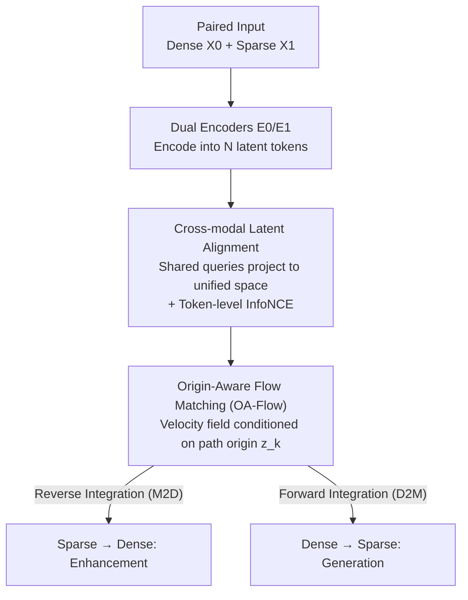

# mmWaveFlow: Unified Enhancement and Generation of mmWave Human Point Clouds

**Conference**: CVPR 2026  
**Paper**: [CVF Open Access](https://openaccess.thecvf.com/content/CVPR2026/html/Su_mmWaveFlow_Unified_Enhancement_and_Generation_of_mmWave_Human_Point_Clouds_CVPR_2026_paper.html)  
**Code**: https://github.com/suchang-99/mmWaveFlow  
**Area**: 3D Vision / Point Cloud Generation / Flow Matching  
**Keywords**: mmWave Point Clouds, Flow Matching, Point Cloud Enhancement, Cross-modal Alignment, Human Perception

## TL;DR
The tasks of "densifying sparse mmWave point clouds" and "generating mmWave point clouds from dense ones" are unified as a single **reversible transport** between dense and sparse distributions. By learning this transport path via flow matching, and addressing the challenges of asymmetric distributions and path crossing through a cross-modal latent space alignment and an origin-aware module, a single model achieves SOTA performance in both enhancement and generation tasks across three datasets.

## Background & Motivation

**Background**: Millimeter-wave (mmWave) radar is becoming a popular sensing modality for non-contact human perception (pose estimation, action recognition, human mesh recovery) due to its privacy-preserving nature (relative to cameras), low cost (relative to LiDAR), and robustness to lighting and weather conditions. However, it suffers from two inherent defects: point clouds are **sparse and noisy** (often only a dozen points per frame), and large-scale labeled data is extremely scarce.

**Limitations of Prior Work**: To mitigate these issues, the community has pursued two independent paths. One is **enhancement**: using diffusion models to complement sparse mmWave point clouds into LiDAR-level dense point clouds. Most such methods target scene-level tasks in autonomous driving and are unfriendly to fine-grained human shapes; they typically sample from Gaussian noise and treat mmWave data only as a conditioning signal, discarding the structural information of the mmWave point cloud itself. The other is **generation**: using physical simulations to simulate mmWave signals from human meshes to create data. This relies on high-fidelity 3D meshes, limiting scalability and diversity while introducing a sim-to-real gap.

**Key Challenge**: Enhancement (sparse $\to$ dense) and generation (dense $\to$ sparse) are treated as two independent tasks requiring two separate models. The authors argue that they are essentially the same thing—a **bi-directional mapping between dense and sparse point cloud distributions**. If a reversible transport exists where the forward pass represents enhancement and the reverse represents generation, one model could handle both.

**Goal**: To learn a reversible transport $\phi$ connecting the dense distribution $p_0$ and the sparse distribution $p_1$, such that $\phi(X_0,\varnothing)\approx X_1$ (generation) and $\phi(\varnothing,X_1)\approx X_0$ (enhancement), where $\varnothing$ is a direction placeholder.

**Key Insight**: Flow matching naturally learns a reversible ODE velocity field connecting **arbitrary distributions**, enabling bi-directional transport via forward and backward integration. This perfectly satisfies the "bi-directional mapping" requirement without needing to start from Gaussian noise as in diffusion.

**Core Idea**: To directly connect the latent representations of dense and sparse point clouds using flow matching to learn a reversible transport path. To ensure effective learning, the model must overcome two hurdles: geometric asymmetry between the two ends (dense vs. sparse) and path crossing. This leads to the two core modules proposed in the paper.

## Method

### Overall Architecture
The framework of mmWaveFlow consists of a two-stage "**cross-modal VAE backbone + latent space flow matching**." Given a pair of point clouds $(X_0, X_1)$ (where $X_0$ is dense from RGB-D/LiDAR/SMPL-X, and $X_1$ is sparse from mmWave radar) collected at the same time for the same person, two encoders $E_0, E_1$ with identical structures but independent parameters encode them into $N$ latent tokens of dimension $D$. Since point clouds are unordered and tokens are not naturally aligned, a set of **shared learnable queries** projects both modalities into a unified semantic space via cross-attention to obtain aligned latent representations $z_0, z_1$. Decoders $D_0, D_1$ are then used to reconstruct the latent representations back into point clouds. The **flow matching module** resides on top of this, learning a reversible velocity field between the latent distributions $z_0$ and $z_1$, and eliminating path crossing through **origin-aware** modification. During inference, forward ODE integration transforms dense to sparse (D2M generation), while backward integration transforms sparse to dense (M2D enhancement), using the same set of parameters.

### Key Designs

**1. Unified Reversible Transport: Merging Enhancement and Generation into One Flow Path**

This is the core premise. Flow matching constructs a path from source to target via linear interpolation $z_t = t\,z_1 + (1-t)\,z_0$, and a neural velocity field $v_\theta(z_t,t)$ is trained to fit the ground truth velocity $\hat{v}_t = \mathrm{d}z_t/\mathrm{d}t = z_1 - z_0$. Once learned, $v_\theta$ defines a reversible continuous flow between $p_0$ and $p_1$: $z_1 = z_0 + \int_0^1 v_\theta(z_t,t)\,\mathrm{d}t$. Forward integration transports dense to sparse (generation), and backward integration transports sparse to dense (enhancement). Unlike diffusion or CrossFlow approaches that start from Gaussian noise and use the other modality as a condition, this method uses **two real data distributions** as source and target, gaining bi-directional capability from one training pass.

**2. Cross-modal Latent Alignment: Matching Unordered Point Cloud Tokens**

Linear interpolation in flow matching is performed **element-wise**, implicitly assuming that source and target tokens are one-to-one aligned. However, point clouds are unordered; a token at the same index might correspond to different body parts across samples, and alignment between dense and sparse ends is even more difficult. Misalignment causes interpolation to mix unrelated local features, contaminating the velocity field supervision. The paper aligns them at two levels: **dimensionality alignment** using a VAE to encode varying numbers of points into a fixed $N=32$ tokens, and **semantic alignment** using shared queries $q\in\mathbb{R}^{M\times D}$ ($M=16$) to project $f_0, f_1$ into a unified space via cross-attention and shared self-attention layers to obtain $z_0, z_1$. To ensure stability, a token-level InfoNCE loss is added:

$$ \mathcal{L}_{\text{align}} = -\frac{1}{BM}\sum_{i=1}^{B}\sum_{k=1}^{M}\log\frac{\exp\big(s(z_{0,i}^k, z_{1,i}^k)/\tau\big)}{\sum_{j=1}^{B}\exp\big(s(z_{0,i}^k, z_{1,j}^k)/\tau\big)}, $$

where $s(\cdot,\cdot)$ is cosine similarity and $\tau$ is temperature. Unlike CrossFlow/FlowTok which rely on a strong pre-trained encoder as a semantic anchor, mmWave lacks large-scale pre-training, requiring a **jointly learned** shared space from scratch.

**3. Origin-Aware Flow Matching (OA-Flow): Eliminating Path Crossing**

Previous works suggest that after replacing a Gaussian source $p_0(z)$ with a conditional source $p_0(z \mid c)$, the condition $c$ is absorbed, and one only needs a **condition-free** velocity field $v(z_t, t)$. The authors observe that this leads to **latent path crossing**: linear trajectories of different paired samples in high-dimensional space may pass through the same intermediate state $z_t$, causing the velocity field to receive contradictory supervision and learn an "average direction," leading to bias and integration failure. The solution is to **condition the velocity field on the path origin**:

$$ \mathcal{L}_{\text{Flow}} = \mathrm{MSE}\big(v_\theta(z_t,t,z_k),\,\hat{v}_t\big),\quad k\sim\mathrm{Bernoulli}(0.5), $$

where $z_k$ is randomly selected as $z_0$ or $z_1$ with equal probability. This symmetric conditioning allows the model to handle both forward and backward flows while retaining the information of "where I came from," providing unambiguous guidance at crossing points.

### Loss & Training
The VAE uses Chamfer Distance (CD) + Earth Mover's Distance (EMD) reconstruction loss plus KL regularization: $\mathcal{L}_{\text{VAE}} = \sum_{i=0}^{1}\big[\mathrm{CD}(\mathcal{D}_i(z_i),X_i) + \mathrm{EMD}(\mathcal{D}_i(z_i),X_i) + \lambda_{\text{KL}}\,\mathrm{KL}(\mathcal{N}(\mu_{z_i},\sigma_{z_i}^2)\,\|\,\mathcal{N}(0,1))\big]$. The total objective is $\mathcal{L} = \lambda_{\text{VAE}}\mathcal{L}_{\text{VAE}} + \lambda_{\text{Flow}}\mathcal{L}_{\text{Flow}} + \lambda_{\text{align}}\mathcal{L}_{\text{align}}$, with weights $\lambda_{\text{VAE}}=50, \lambda_{\text{Flow}}=1, \lambda_{\text{align}}=0.1, \lambda_{\text{KL}}=10^{-5}$. Training is two-staged: first jointly training VAE and OA-Flow, then freezing the VAE after reconstruction loss plateaus to continue training OA-Flow. Gradient surgery (PCGrad) is used during the joint stage to mitigate gradient conflicts.

## Key Experimental Results

### Main Results
Evaluation is conducted on three datasets representing different dense point cloud sources: mmBody (depth camera), MM-Fi (accumulated frames), and mRI (SMPL-X simulation). Two tasks: D2M (dense $\to$ mmWave generation) and M2D (mmWave $\to$ dense enhancement). Metrics are L2 Chamfer Distance (CD, cm) and Earth Mover's Distance (EMD, cm). **Mean Rank (MR)** is also used.

| Model | mmBody D2M CD | mmBody M2D CD | MM-Fi D2M CD | MM-Fi M2D CD | mRI D2M CD | mRI M2D CD | MR |
|------|------|------|------|------|------|------|------|
| mmPoint | 1.45 | 1.09 | 3.27 | 0.81 | 3.14 | 0.89 | 3.22 |
| RadarHD | 3.95 | 1.59 | 4.57 | 1.55 | 4.27 | 1.24 | 5.44 |
| RadarDiff | 1.61 | 1.09 | 3.52 | 0.84 | 3.15 | 0.98 | 3.89 |
| LiDiff | 6.47 | 1.16 | 9.12 | **0.66** | 9.03 | 0.84 | 5.11 |
| Tiger | 1.32 | 1.02 | 2.90 | 0.77 | 2.35 | 0.81 | 2.11 |
| **mmWaveFlow** | **1.17** | **0.95** | **2.69** | 0.75 | **2.12** | **0.72** | **1.11** |

mmWaveFlow's MR=1.11 is significantly better than the runner-up Tiger (2.11), ranking as the top performer in almost all metrics.

### Key Findings
- **Synergy between modules**: Removing both latent alignment and OA-Flow leads to a larger performance drop than removing either individually, indicating they mutually enhance each other.
- **Path crossing exists**: Empirical analysis confirms that potential path crossings occur across all three datasets and vary with $t$, validating the hypothesis that high-dimensional paths do cross.
- **Scalability**: The framework generalizes to scene-level tasks (ColoRadar), outperforming RadarDiff and RadarHD without architectural changes beyond VAE dimensions.

## Highlights & Insights
- **Unified Perspective**: Viewing enhancement as the inverse of generation is elegant. Using flow matching's bi-directional nature saves the engineering burden of training separate models for each direction.
- **Fixing Condition-free Flow Matching**: The revelation that conditions are not purely "absorbed" in conditional sources and that path crossing causes integration failure is a transferable insight for any cross-modal flow matching task using non-Gaussian sources.
- **Latent Alignment for Unordered Data**: The use of shared queries and token-level InfoNCE to create a shared semantic space from scratch is an effective solution for modalities without large-scale pre-trained encoders.

## Limitations & Future Work
- **Reliance on Paired Data**: Training requires paired dense-sparse point clouds, which, while easier to collect than some modalities, still limits application in purely unpaired scenarios.
- **Fixed Point/Token Count**: Subsampling/padding to 512 points and fixing VAE tokens to 32 may limit the expression of high-density scene details.
- **Efficiency Trade-offs**: The paper does not deeply analyze whether a single bi-directional model is slightly inferior to a specialized un-directional model in a specific direction.

## Related Work & Insights
- **vs. Diffusion (RadarDiff / RadarHD)**: These start from Gaussian noise and treat mmWave as a condition, often focusing on BEV projections for driving. mmWaveFlow uses reversible transport for fine-grained human geometry.
- **vs. Physical Simulation (mmGPE / RF-Diffusion)**: Simulation relies on high-fidelity meshes and complex scattering models. mmWaveFlow uses a data-driven approach to bypass physical modeling hurdles and sim-to-real gaps.

## Rating
- Novelty: ⭐⭐⭐⭐⭐ 
- Experimental Thoroughness: ⭐⭐⭐⭐ 
- Writing Quality: ⭐⭐⭐⭐ 
- Value: ⭐⭐⭐⭐ 

<!-- RELATED:START -->

## Related Papers

- [\[CVPR 2026\] Human Geometry Distribution for 3D Animation Generation](human_geometry_distribution_for_3d_animation_generation.md)
- [\[CVPR 2026\] Vista4D: Video Reshooting with 4D Point Clouds](vista4d_video_reshooting_with_4d_point_clouds.md)
- [\[CVPR 2026\] Photo3D: Advancing Photorealistic 3D Generation through Structure-Aligned Detail Enhancement](photo3d_advancing_photorealistic_3d_generation_through_structure-aligned_detail_.md)
- [\[CVPR 2026\] Ghosts in the Point Clouds: De-glaring LiDAR in the Transient Domain](ghosts_in_the_point_clouds_de-glaring_lidar_in_the_transient_domain.md)
- [\[CVPR 2026\] PointINS: Instance-Aware Self-Supervised Learning for Point Clouds](pointins_instance-aware_self-supervised_learning_for_point_clouds.md)

<!-- RELATED:END -->
