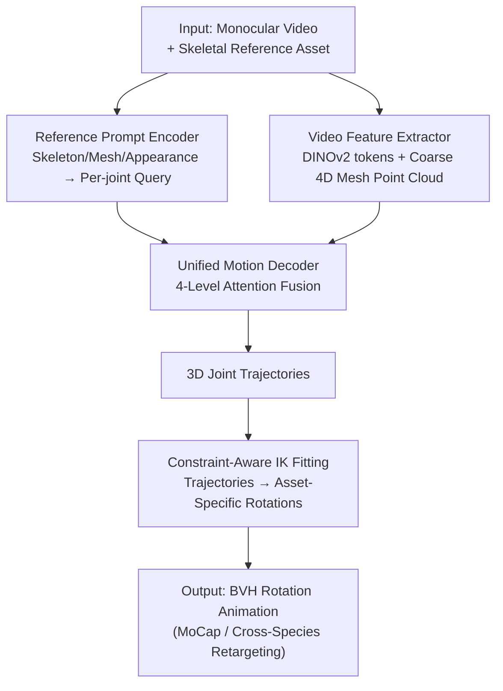

# MoCapAnything: Unified 3D Motion Capture for Arbitrary Skeletons from Monocular Videos

**Conference**: CVPR2026  
**arXiv**: [2512.10881](https://arxiv.org/abs/2512.10881)  
**Code**: https://animotionlab.github.io/MoCapAnything/ (Project Page)  
**Area**: 3D Vision / Motion Capture  
**Keywords**: Category-Agnostic MoCap, Arbitrary skeleton, Monocular video, Inverse Kinematics, Cross-species retargeting

## TL;DR
Given a monocular video and an arbitrary 3D skeletal asset (human/animal/robot/toy) as a prompt, MoCapAnything first predicts per-joint 3D trajectories and then solves for the asset's specific skeleton rotation (e.g., BVH) using constraint-aware Inverse Kinematics (IK). This achieves unified motion capture and cross-species retargeting across heterogeneous skeletons, reducing the MPJPE of unseen species from 7.42cm to 1.76cm on Truebones Zoo.

## Background & Motivation
**Background**: Monocular motion capture is a foundation for content creation, yet mainstream pipelines are mostly "locked" to a single species or template. Human-centric methods regress SMPL/SMPL-X parameters (HMR, VIBE, HMR2.0, etc.), which only work within fixed human topologies. Animal-centric methods are largely based on SMAL, covering only a few quadrupeds. While Category-Agnostic Keypoint Estimation (CAPE) can generalize to new categories using support examples, it only produces 2D static keypoints, far from driveable 3D animations.

**Limitations of Prior Work**: In production, creators need to retarget human/animal movements to non-biological skeletons (robots, mechas, toys, articulated props), drive large batches of heterogeneous assets in games, animate virtual avatars/VTubers with frequent topology changes, or quickly skeletonize IP characters. These scenarios require a "load-and-use" asset capability, whereas existing methods often require rebuilding a parametric model for almost every new species encountered.

**Key Challenge**: Rotations are quantities defined within the asset's local coordinate system. Since rest poses vary across assets, **direct regression of joint angles across heterogeneous skeletons is highly fragile**. Monocular evidence itself is under-constrained (depth and camera motion entangle with local rotations). Furthermore, a modal gap exists between dense RGB features and "point-cloud-like" joint spaces, where hard alignment leads to precision loss.

**Goal**: Formalize a new task, CAMoCap (Category-Agnostic Motion Capture) — input a monocular video $V=\{I_t\}_{t=1}^T$ and an arbitrary skeletal asset $A=(\mathcal{M},\mathcal{S},\mathcal{I}_A)$, and output a per-frame joint rotation sequence $\{\mathbf{R}_t\}$ that directly drives $A$, where $R_{t,j}\in\mathrm{SO}(3)$.

**Core Idea**: Instead of directly regressing asset-specific rotations, motion recovery is **factorized** into "first estimating asset-agnostic, geometrically learnable 3D joint trajectories, then translating trajectories into asset-specific rotations via lightweight IK." The method introduces a **reference prompt** to inject target skeleton information and employs a **coarse 4D mesh** as an auxiliary modality to bridge the gap between RGB and joint spaces.

## Method

### Overall Architecture
MoCapAnything is a reference-guided, factorized framework. The input consists of a monocular video and a skeletal reference asset (mesh/skeleton/appearance atlas). The output is a rotation animation under the asset's own rig convention. The key decision is to **split the problem in half**: the first half uses three learnable modules to collaboratively predict 3D joint trajectories $\{\widehat{\mathbf{x}}_{t,j}\}$, while the second half uses a training-free lightweight IK stage to resolve trajectories into rotations $\{R_{t,j}\}$. Trajectories are geometric, shareable across skeletons, and continuous in time, making them more stable than direct angle regression. The rotations are finalized by IK, which respects hierarchies, bone lengths, joint limits, and temporal smoothness.

Specifically, the reference asset is distilled into per-joint queries via a **Reference Prompt Encoder**. The video is processed by a **Video Feature Extractor** to extract DINOv2 visual tokens and a coarse 4D deformation mesh point cloud. Both are fed into a **Unified Motion Decoder**, which uses a multi-branch attention structure to fuse visual, structural, and geometric cues to output 3D joint coordinates frame-by-frame. Finally, **IK Fitting** converts coordinates into asset-specific rotations. Since the reference asset and video subject can be identical or different, this pipeline naturally supports both motion capture (same skeleton) and retargeting (different skeletons).

### Key Designs

**1. Reference Prompt Encoder: Distilling arbitrary assets into per-joint queries with target skeletal priors**

The encoder addresses the problem of how the model identifies the target skeleton. It fuses three modalities of the reference asset into per-joint queries $Q=\{\mathbf{q}_j\}_{j\in\mathcal{J}}$. Each joint $j$ starts with an initial query $\mathbf{q}_j^{(0)}=\mathbf{W}_p[\mathrm{pe}(\mathbf{x}_j);\mathbf{e}_{\text{name}}(\ell(j))]+\mathbf{b}_p$ derived from coordinate sinusoidal positional encoding and optional joint name embeddings. This passes through $L$ fusion blocks, each performing three tasks: (i) Graph Multi-Head Self-Attention (Graph-MHA) with **skeleton topological bias**, where $\mathrm{Attn}(\mathbf{q}_i,\mathbf{q}_j)\propto \tfrac{\langle\mathbf{W}_Q\mathbf{q}_i,\mathbf{W}_K\mathbf{q}_j\rangle}{\sqrt d}+\mathbf{B}_{ij}$ and $\mathbf{B}_{ij}=f_{\text{topo}}(\mathcal{E},i,j)$ is calculated from skeletal edges and kinematic distances to propagate messages along the kinematic tree; (ii) Cross-attention with mesh samples $\{\mathbf{g}_u\}$ to learn implicit skinning relationships between joints and local surface geometry; (iii) Cross-attention with frozen DINOv2 tokens of the appearance atlas to resolve ambiguities in symmetric or similar parts. Binary masks $\mathbf{m}$ zero out padding for variable joint counts, making the encoder invariant to the absolute number of joints.

**2. Video Feature Extractor: Bridging RGB and point-cloud joint spaces with coarse 4D deformation meshes**

Directly regressing point-cloud joints from dense RGB tokens causes precision loss due to modal mismatch. The authors use two complementary streams: a visual stream encoding dense tokens $\mathbf{A}_t$ per frame via a frozen DINOv2 for appearance/texture cues, and a geometric stream using off-the-shelf image-to-3D reconstructors to convert the video into a coarse deformation surface sequence $\widehat{\mathcal{M}}=\{\widehat{\mathcal{M}}_t\}$. Each frame is downsampled to $U=1024$ points $(\mathbf{p}_{t,u},\mathbf{n}_{t,u})$ and embedded as $\mathbf{g}_{t,u}=\mathbf{W}_m[\mathrm{pe}(\mathbf{p}_{t,u});\mathbf{n}_{t,u};\mathrm{pe}(t)]$. These 4D mesh tokens are isomorphic to the mesh features in the Reference Prompt Encoder, carrying topological/geometric signals and matching the point-cloud structure of joints. This acts as a "bridge" between RGB and joint space.

**3. Unified Motion Decoder: 4-level attention fusing structural, visual, and geometric cues**

The decoder processes per-joint queries tiled over time with temporal encoding and masks. Each layer executes four levels of attention: (i) **Intra-frame Graph Self-Attention** with topological bias $\mathcal{E}$ to ensure updates follow the kinematic tree and local limb coupling; (ii) **Temporal Video Cross-Attention** to sample visual tokens for each joint within a sliding window across adjacent frames, supplementing details under occlusion or motion blur; (iii) **Temporal Point Cloud Cross-Attention** to aggregate geometric evidence from 4D mesh sliding windows, resolving depth/self-occlusion and capturing non-rigid deformations; (iv) **Per-joint Temporal Self-Attention** to mix past/future states of each joint along the time axis, enforcing long-range consistency and suppressing jitter. A lightweight MLP head then outputs per-frame joint coordinates $\widehat{\mathbf{x}}_{t,j}\in\mathbb{R}^3$.

**4. Constraint-Aware IK Fitting: Translating trajectories into asset-specific rotations without training**

This stage enables the "trajectory-to-rotation" translation essential for CAMoCap. It consists of two phases: first, a per-frame **Geometric IK Initialization** aligns rest-pose bones with observed joint positions along kinematic chains, providing stable, hierarchy-respecting rotation estimates in closed form. Second, a small-scale **Differentiable IK Optimization** refines result by minimizing the discrepancy between Forward Kinematics (FK) reconstructed joints and predicted 3D positions, regularizing the solution toward the geometric initialization and using the previous frame as a warm-start for temporal stability.

### Loss & Training
The training only supervises joint positions using a masked L1 regression loss:
$$\mathcal{L}_{\text{pos}}=\frac{1}{\sum_{t}\sum_j m_j}\sum_{t=1}^{T}\sum_j m_j\,\big\|\widehat{\mathbf{x}}_{t,j}-\mathbf{x}_{t,j}\big\|_1.$$
**No rotation space loss or explicit temporal loss is applied** during training; the network predicts positions, and rotations are handled by the IK stage. Training data consists of 978 sequences from Truebones Zoo (plus 1000 Objaverse samples for humanoid rigs). The configuration uses 4 encoder layers and 12 decoder layers.

## Key Experimental Results

### Main Results
Evaluation of 3D keypoints on Truebones Zoo-test (60 sequences categorized into Seen / Rare / Unseen). Baselines were retrained on the same dataset with unified skeletal representations. Units are in cm (lower is better).

| Species Tier | Metric | Ours | GLoT (Next Best) | VIBE | ViTPose |
| :--- | :--- | :--- | :--- | :--- | :--- |
| Seen | MPJPE ↓ | **1.06** | 3.98 | 4.46 | 9.19 |
| Seen | MPJVE ↓ | **0.44** | 1.37 | 0.83 | 1.73 |
| Rare | MPJPE ↓ | **1.28** | 3.58 | 4.03 | 9.33 |
| Unseen | MPJPE ↓ | **1.76** | 7.42 | 8.72 | 23.37 |
| Unseen | MPJVE ↓ | **0.36** | 2.18 | 0.95 | 2.15 |

Ours leads across all tiers, with the gap widening significantly for unseen species: MPJPE is reduced from GLoT's 7.42 to 1.76 (approx. 76% reduction), indicating a structural advantage in generalization rather than dataset overfitting.

### Ablation Study

| Configuration | Seen MPJPE | Rare MPJPE | Unseen MPJPE | Description |
| :--- | :--- | :--- | :--- | :--- |
| Full model | 1.06 | 1.28 | 1.76 | Full model |
| w/o image | 1.34 | 1.56 | 2.85 | Remove appearance atlas encoding + CA |
| w/o mesh | 1.88 | 2.25 | 3.16 | Remove mesh features from reference/video |
| w/o GMHA | 1.08 | 1.49 | 1.82 | Remove skeletal graph self-attention |

### Key Findings
- **The mesh branch contributes the most**: Removing mesh features increases MPJPE on unseen species from 1.76 to 3.16, confirming that bridging modalities via 4D meshes is axial for cross-species generalization.
- **Appearance and Graph Attention are vital for Rare/Unseen**: Removing them (w/o image/GMHA) results in negligible drops on seen species but significant degradation on unseen species.
- **Increasing depth shows diminishing returns**: Moving from 1 to 12 decoder layers reduces unseen MPJPE from 2.18 to 1.76, but increasing encoder layers further (4/16) yielded limited benefits.

## Highlights & Insights
- **Factorization is core to stability**: Replacing "fragile cross-asset rotation regression" with "geometrically shareable 3D trajectory regression + training-free IK" bypasses the ill-posed nature of angle regression across varied rest poses.
- **Using coarse 4D meshes as a "Modality Bridge" is clever**: Instead of forcing RGB tokens to match joints, reconstructing a cheap deformation point cloud allows the geometric structure to align with the joint's point-cloud nature.
- **Per-joint query + mask enables "One Model for Any Skeleton"**: Using binary masks for padding joints makes the model invariant to the absolute joint count, which is the engineering key to prompting arbitrary rigs.

## Limitations & Future Work
- **Dependency on 4D Reconstruction quality**: The geometry stream relies on a pre-trained image-to-3D reconstructor. Quantitative evaluations used GT mesh to isolate performance; actual in-the-wild accuracy will be bounded by reconstruction quality.
- **Rotation Evaluation moved to Appendix**: The main text focuses on 3D keypoints; quantitative rotation-level errors are only detailed in the supplementary material.
- **Small Test Set**: The test set contains only 60 sequences. While Truebones Zoo is animal-heavy, humanoid/non-biological rig evaluation relies largely on qualitative Objaverse demos.
- **Improvements**: Future work could make IK end-to-end differentiable for joint training with rotation losses or introduce physical/contact constraints to further reduce jitter.

## Related Work & Insights
- **vs. SMPL/SMPL-X MoCap (HMR, VIBE)**: These regress fixed human template parameters and fail on other species; Ours uses reference prompts and trajectory factorization to support arbitrary skeletons.
- **vs. SMAL-based Animal MoCap**: SMAL is species-specific; Ours generalizes via skeleton/mesh/appearance prompts without needing per-species parametric models.
- **vs. CAPE (Pose Anything, CapeX)**: CAPE is category-agnostic but limited to 2D static points; Ours advances to 3D trajectories and driveable rotation animations.
- **vs. Direct Rotation Regression**: The authors demonstrate that direct angle regression is fragile due to parameterization ambiguity and poor temporal consistency in monocular settings, justifying the two-stage "Trajectory → IK" approach.

## Rating
- Novelty: ⭐⭐⭐⭐⭐ Formalizes the CAMoCap task and provides the first unified framework for heterogeneous skeletons.
- Experimental Thoroughness: ⭐⭐⭐⭐ Solid three-tier generalization and multiple ablations, though test scale is small and rotation metrics are supplementary.
- Writing Quality: ⭐⭐⭐⭐ Clear motivation, challenge analysis, and modular division.
- Value: ⭐⭐⭐⭐⭐ Directly addresses pains in gaming/virtual production and IP character animation.

<!-- RELATED:START -->

## Related Papers

- [\[CVPR 2026\] Learning Explicit Continuous Motion Representation for Dynamic Gaussian Splatting from Monocular Videos](learning_explicit_continuous_motion_representation_for_dynamic_gaussian_splattin.md)
- [\[CVPR 2026\] Natural Human Motion Recovery by Aligning High-Order Temporal Dynamics from Monocular Videos](natural_human_motion_recovery_by_aligning_high-order_temporal_dynamics_from_mono.md)
- [\[ICLR 2026\] SMAGA: Secondary Motion-Aware 3D Clothed Gaussian Avatars from Monocular Videos](../../ICLR2026/3d_vision/smaga_secondary_motion-aware_3d_clothed_gaussian_avatars_from_monocular_videos.md)
- [\[CVPR 2026\] NeoVerse: Enhancing 4D World Model with in-the-wild Monocular Videos](neoverse_enhancing_4d_world_model_with_in-the-wild_monocular_videos.md)
- [\[CVPR 2026\] RHINO: Reconstructing Human Interactions with Novel Objects from Monocular Videos](rhino_reconstructing_human_interactions_with_novel_objects_from_monocular_videos.md)

<!-- RELATED:END -->
