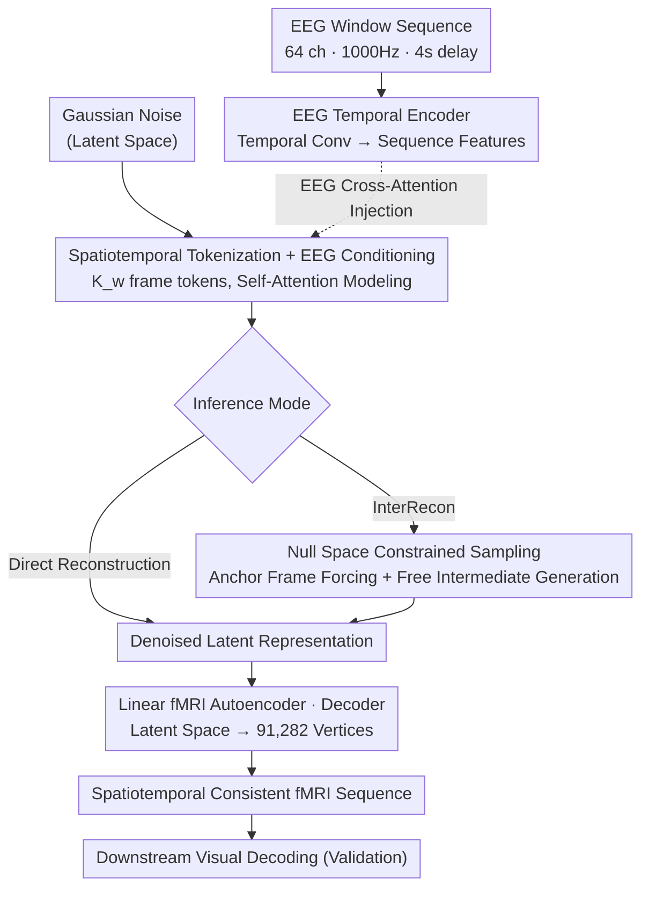

# Modeling Spatiotemporal Neural Frames for High Resolution Brain Dynamics

**Conference**: CVPR 2026  
**arXiv**: [2603.24176](https://arxiv.org/abs/2603.24176)  
**Code**: None  
**Area**: 3D Vision  
**Keywords**: EEG-to-fMRI, Diffusion Model, Spatiotemporal Modeling, Interim Frame Reconstruction, Visual Decoding

## TL;DR

This work proposes an EEG-conditioned fMRI reconstruction framework based on a Diffusion Transformer. By modeling brain activity as a sequence of spatiotemporal neural frames rather than independent snapshots, it achieves spatio-temporally consistent fMRI reconstruction at cortical vertex-level resolution. Furthermore, it supports intermediate frame interpolation via null space sampling, with functional information preservation validated through downstream visual decoding tasks.

## Background & Motivation

1. **Background**: fMRI provides high spatial resolution cortical representations but is expensive to acquire; EEG provides millisecond temporal resolution but low spatial precision. EEG-to-fMRI translation aims to leverage their complementarity to infer fMRI-level spatial patterns from EEG.
2. **Limitations of Prior Work**: (1) ROI-level methods (e.g., NeuroBOLT) can model temporal continuity but lack spatial resolution; (2) Voxel/cortical-level methods (CNN-TC, CATD, etc.) achieve high spatial fidelity but reconstruct frames independently, lacking temporal consistency; (3) Evaluation relies solely on low-level metrics like MSE/SSIM, failing to determine if the reconstructed fMRI retains functional neural information.
3. **Key Challenge**: It is difficult to simultaneously achieve high spatial resolution and temporal continuity—independent reconstruction ensures spatial precision but leads to inter-frame artifacts, while sequence modeling ensures temporal continuity but is often limited by spatial granularity.
4. **Goal**: To reconstruct temporally continuous and consistent fMRI frame sequences at a high spatial resolution of 91,282 cortical vertices.
5. **Key Insight**: Modeling brain activity as evolving spatiotemporal neural frames (rather than independent snapshots), using a Diffusion Transformer to simultaneously model vertex-level spatial details and inter-frame temporal dependencies.
6. **Core Idea**: An EEG-guided Diffusion Transformer generates spatio-temporally consistent fMRI sequences, with null space constrained sampling enabling intermediate frame reconstruction.

## Method

### Overall Architecture

Input: A time-aligned EEG window sequence $\mathbf{S}$ (64 channels, 1000Hz, 4s delay relative to fMRI). Output: An fMRI sequence $\mathbf{X} \in \mathbb{R}^{K_w \times N_v}$ of $K_w$ frames ($N_v=91282$ cortical vertices). Mechanism: EEG features are extracted via a temporal encoder; a linear fMRI autoencoder compresses vertex-level frames into a low-dimensional latent space; the Diffusion Transformer performs EEG-conditioned denoising in the latent space; and a linear decoder restores the vertex-level fMRI. During inference, two modes are supported: direct reconstruction and null space constrained intermediate frame reconstruction (InterRecon), the latter of which uses a modified sampling strategy with the same weights.

### Key Designs

**1. Spatiotemporal Tokenization and EEG Conditioning: Modeling Inter-frame Dependencies via Self-Attention**

Prior voxel/cortical-level methods reconstruct frames independently, where each frame is an isolated prediction without temporal constraints, leading to jitter and temporal artifacts. This work treats the $K_w$-frame fMRI sequence as a whole, tokenizing it into $(K_w \times N_v)$ vertex-level tokens, each with a temporal position encoding. Consequently, the self-attention mechanism naturally establishes relationships across both spatial (different vertices within a frame) and temporal (the same vertex across different frames) dimensions. EEG features, encoded by temporal convolutions, are injected into vertex tokens via cross-attention at every Transformer layer, guiding the spatial evolution using millisecond-level temporal information.

**2. Null Space Constrained Sampling (InterRecon): Decoupling Observations and Generation**

In real fMRI acquisition, frames may be missing or corrupted. Standard diffusion generation cannot guarantee that "known" anchor frames strictly match observations. This work frames sparse observation as a linear measurement $\mathbf{y} = \mathbf{A}\mathbf{X}$, where $\mathbf{A} = \text{diag}(m_1,...,m_{K_w})$ is a binary mask for anchor frames. During each reverse diffusion step, the denoised estimate $\mathbf{x}_{0|n}$ is decomposed into range space and null space components:

$$\hat{\mathbf{x}}_{0|n} = \mathbf{A}^\dagger \mathbf{y} + (\mathbf{I} - \mathbf{A}^\dagger \mathbf{A})\mathbf{x}_{0|n}$$

The first term $\mathbf{A}^\dagger \mathbf{y}$ "pins" anchor frames to the observed values, ensuring an exact match. The second term $(\mathbf{I} - \mathbf{A}^\dagger \mathbf{A})$ retains only the null space component, allowing intermediate frames to be freely generated by the model. This strategy uses the same model checkpoints as direct reconstruction, serving both as a completion tool and an internal test for temporal consistency.

**3. Linear fMRI Autoencoder: Preserving Null Space Decomposition in Latent Space**

Directly feeding 91,282-dimensional fMRI vertices into a Diffusion Transformer is computationally prohibitive. However, non-linear autoencoders break the linear relationship $\mathbf{A}^\dagger \mathbf{A}$ required for the range-null space decomposition. The authors deliberately utilize linear MLP layers for encoding and decoding to map frames to a lower-dimensional latent representation ($d \ll N_v$). This trade-off ensures that the null space projection holds exactly in the compressed space, allowing InterRecon to be performed efficiently without reverting to the high-dimensional space.

### Loss & Training

- Denoising Score Matching Loss: $\mathcal{L}_{\text{diff}} = \mathbb{E}[\|\epsilon - \epsilon_\theta(\mathbf{x}^{(n)}, n, \mathbf{h}_\text{EEG})\|^2]$
- Diffusion Parameters: 1000 timesteps, linear noise schedule; DDIM with 50 steps for inference.
- Model: 6-layer Transformer, 8-head attention, hidden dimension 1024.
- Training: AdamW, lr=$1\times10^{-4}$, batch=32, 200 epochs, single A100 GPU.
- Trained within-subject using an 80/20 split; the test set contains unseen video segments.

## Key Experimental Results

### Main Results

Dynamic fMRI frame reconstruction (average of 6 subjects, sequence length of 10, whole-brain):

| Method | MSE ↓ | r ↑ | Cos ↑ |
|------|-------|-----|-------|
| CNN-TC | 0.315 | 0.804 | 0.824 |
| CNN-TAG | 0.309 | 0.810 | 0.829 |
| E2FNet | 0.297 | 0.819 | 0.836 |
| E2FGAN | 0.290 | 0.822 | 0.839 |
| **Ours** | **0.277** | **0.824** | **0.849** |

Visual cortex (V1) sub-region (10 frames): MSE 0.193, r 0.834, Cos 0.887.

### Ablation Study

Comparison of Intermediate Frame Reconstruction (InterRecon):

| Method | MSE ↓ | r ↑ | Cos ↑ |
|------|-------|-----|-------|
| Linear interpolation | 0.280 | 0.830 | 0.851 |
| Ours w/o null space | 0.272 | 0.839 | 0.852 |
| **Ours w/ null space** | **0.250** | **0.852** | **0.865** |

Null space constraints provided comprehensive improvements: MSE decreased by 8.1%, r increased by 1.5%, and Cos increased by 1.5%.

### Key Findings

- **Temporal Robustness**: When increasing sequence length from 3 to 30 frames, whole-brain MSE for this method remained stable (0.282 to 0.281), while CNN-TC deteriorated from 0.302 to 0.322. This demonstrates that joint spatiotemporal modeling effectively captures long-range temporal dependencies.
- **Superior Performance in Functional Regions**: Reconstruction metrics in the visual and auditory cortices were significantly better than the whole-brain average, consistent with neuroscience expectations for a movie-watching task.
- **Visual Decoding Validation**: Using the CineSync-f decoder to generate videos from reconstructed fMRI, the model successfully recovered coarse semantic structures (people, poses, scene layouts), proving that reconstructed fMRI preserves functional neural representations.
- Null space sampling requires no retraining; it uses the exact same checkpoints as direct reconstruction by only altering the sampling strategy.

## Highlights & Insights

- **Spatiotemporal Frame Paradigm Shift**: Shifting fMRI reconstruction from "frame-independent" to "sequence modeling" is a conceptually significant move. Unified modeling of time and space via self-attention captures more complete neural dynamics than prior purely spatial methods.
- **Dual Value of Null Space Sampling**: It serves as a practical tool for missing frame completion and an intrinsic evaluation of temporal consistency—validating if the model has learned true temporal dependencies without needing additional metrics.
- **Strategic Constraint of Linear Autoencoder**: Trading expressiveness for mathematical properties (maintaining linearity) is an elegant engineering decision that ensures null space decomposition holds exactly in latent space.

## Limitations & Future Work

- **Within-subject Training**: Models are currently trained per subject and do not generalize across subjects. Cross-subject modeling would require robust anatomical or functional alignment.
- **Fixed EEG-fMRI Delay**: A fixed 4s delay is used, but hemodynamic delays vary across brain regions and time. A learnable alignment module could be introduced.
- Limited expressivity of linear autoencoders; semi-nonlinear designs that maintain null space properties could be explored.
- Quantitative evaluation of downstream visual decoding is currently limited to qualitative visualization.

## Related Work & Insights

- **vs NeuroBOLT**: ROI-level modeling inherently has temporal consistency but low spatial resolution (hundreds of regions vs 91,282 vertices). This work fills the gap of "high spatial resolution + temporal consistency."
- **vs CATD**: CATD translates cortical fMRI but performs frame-independent reconstruction. This work proves that serialized modeling outperforms frame-wise methods in both whole-brain and functional regions.
- **vs Image Diffusion Models**: Borrowing DiT and null space sampling concepts and applying them to high-dimensional spatiotemporal neuroimaging data demonstrates the potential of diffusion models in scientific data modeling.

## Rating

- Novelty: ⭐⭐⭐⭐ Redefines fMRI reconstruction as a spatiotemporal sequence generation problem; utilizes null space sampling for zero-shot interpolation.
- Experimental Thoroughness: ⭐⭐⭐⭐ Comprehensive validation across frame lengths, brain regions, baselines, and downstream decoding, though limited to 6 subjects on a single dataset.
- Writing Quality: ⭐⭐⭐⭐ Rigorous mathematical derivation and clear method description, though slightly biased towards machine learning.
- Value: ⭐⭐⭐⭐ Provides a new paradigm for multimodal neuroimaging modeling, though the application remains niche.

<!-- RELATED:START -->

## Related Papers

- [\[CVPR 2026\] LiteSense: Lifting Lightweight ToF with RGB for High-Resolution Metric Depth Estimation](litesense_lifting_lightweight_tof_with_rgb_for_high-resolution_metric_depth_esti.md)
- [\[CVPR 2026\] Confidence-Guided Multi-Scale Aggregation for Sparse-View High-Resolution 3D Gaussian Splatting](confidence-guided_multi-scale_aggregation_for_sparse-view_high-resolution_3d_gau.md)
- [\[CVPR 2026\] Hyper-PCN: Hypergraph-Based Point Cloud Completion via High-Order Correlation Modeling](hyper-pcn_hypergraph-based_point_cloud_completion_via_high-order_correlation_mod.md)
- [\[CVPR 2026\] ConsisVLA-4D: Advancing Spatiotemporal Consistency in Efficient 3D-Perception and 4D-Reasoning for Robotic Manipulation](consisvla-4d_advancing_spatiotemporal_consistency_in_efficient_3d-perception_and.md)
- [\[CVPR 2026\] LumiMotion: Improving Gaussian Relighting with Scene Dynamics](lumimotion_gaussian_relighting_dynamics.md)

<!-- RELATED:END -->
