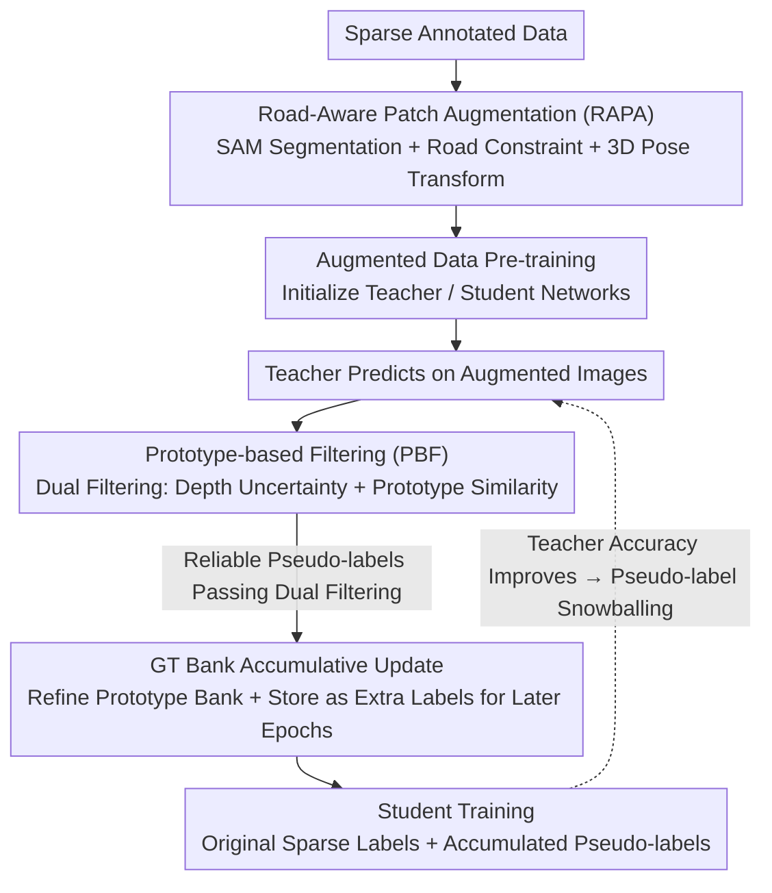

# MonoSAOD: Monocular 3D Object Detection with Sparsely Annotated Label

**Conference**: CVPR 2026  
**arXiv**: [2604.01646](https://arxiv.org/abs/2604.01646)  
**Code**: [https://github.com/VisualAIKHU/MonoSAOD](https://github.com/VisualAIKHU/MonoSAOD)  
**Area**: 3D Vision / Object Detection  
**Keywords**: Monocular 3D Detection, Sparse Annotation, Data Augmentation, Pseudo-labeling, Prototype Filtering

## TL;DR

Ours first defines and addresses the problem of monocular 3D object detection with sparsely annotated labels, proposing Road-Aware Patch Augmentation (RAPA) and Prototype-based Filtering (PBF) modules. It significantly outperforms existing 2D SAOD methods under the KITTI 30% annotation setting (AP3D Easy: 21.28 vs 17.14).

## Background & Motivation

**Background**: Monocular 3D object detection infers 3D object information (depth, dimensions, orientation) from a single image, serving as a key technology for autonomous driving. Recent methods like MonoDETR and MonoDGP have made significant progress on fully annotated datasets, but they assume all objects have complete 3D labels.

**Limitations of Prior Work**: 3D annotation costs are extremely high—requiring precise depth, size, and orientation labels, taking 3-16 times longer than 2D annotation. Consequently, labels in real-world datasets are often incomplete: visible objects might be labeled in some scenes but missed in others, resulting in sparse and inconsistent annotations. This inconsistency severely interferes with the model's ability to learn reliable depth and orientation cues.

**Key Challenge**: Existing 2D Sparse Annotated Object Detection (SAOD) methods select pseudo-labels based on classification confidence scores. However, confidence reflects the certainty of 2D localization rather than the accuracy of 3D attributes (depth, orientation). Consequently, high-confidence predictions can contain massive 3D errors. Meanwhile, point-cloud-based 3D SAOD methods rely on LiDAR depth, which is unavailable in monocular settings.

**Goal**: (1) How to enhance the model's understanding of road-object relationships and scene diversity under limited annotation? (2) How to generate reliable pseudo-labels that verify both 2D appearance consistency and 3D geometric accuracy?

**Key Insight**: The problem is decomposed into two paths: "making good use of sparse labels" (data augmentation) and "mining unlabeled objects" (pseudo-labels), with modules designed for the specific needs of monocular 3D detection.

**Core Idea**: Use SAM segmentation + road constraints + 3D geometric transformations for augmentation, and dual filtering via prototype similarity + depth uncertainty for pseudo-labels to solve sparse annotated monocular 3D detection.

## Method

### Overall Architecture

This paper addresses an overlooked practical issue in monocular 3D detection: the same class of visible objects may be labeled in some images but missed in others within the training set. These sparse and inconsistent annotations prevent the model from learning stable depth/orientation cues and cause missed objects to be misidentified as negative samples. MonoSAOD uses a teacher-student pipeline to remedy this from both ends. First, RAPA "moves" existing sparse annotations to more reasonable positions to generate geometrically consistent augmented samples. The model is pre-trained on this augmented data to initialize the teacher and student networks. During training, the teacher generates predictions on augmented images, and PBF selects truly reliable ones as pseudo-labels using depth uncertainty and prototype similarity. Selected pseudo-labels are used to refine the prototype bank and stored in the GT Bank as additional annotations for subsequent epochs. The student is trained on "original sparse labels + accumulated pseudo-labels," with the supervision signal growing throughout training.

### Key Designs

**1. Road-Aware Patch Augmentation (RAPA): Ensuring copy-pasted objects are neither floating nor geometrically inconsistent**

Traditional copy-paste methods have three flaws in monocular 3D: rectangular patches bring background noise, ignoring road constraints leads to floating objects or placement on walls, and failing to adjust 3D poses causes orientation and depth to mismatch geometry. RAPA addresses these. It selects high-quality, non-truncated, non-occluded annotated objects and uses SAM for precise segmentation. For the target image, SAM generates a road mask $M_\text{road}$. Object patches are then moved from the source to target coordinate system using camera extrinsics:

$$[x_t, y_t, z_t]^T = [R_t \mid T_t][R_s \mid T_s]^{-1}[x_s, y_s, z_s]^T$$

Offsets are uniformly sampled horizontally to find candidate locations. For each position, the orientation $r_y' = \alpha + \text{arctan2}(x_t', z_t')$ is recalculated to maintain the observation angle. Two constraints are checked after projecting back to 2D: the overlap between the object's bottom and the road mask must be $\ge \tau_\text{road}$ (ensuring placement on the road), and the IoU with existing labels must be $< \tau_\text{overlap}$ (avoiding unrealistic occlusion). Objects are placed only if both conditions are met. This produces visually clean and geometrically consistent new scenes.

**2. Prototype-based Filtering (PBF): Replacing unreliable classification confidence with depth uncertainty + prototype similarity**

Classification confidence in 2D SAOD only ensures "whether the box is accurate" and does not guarantee 3D attributes; high-score predictions can have significant depth errors. PBF uses two more relevant metrics. First, a prototype bank is built: RoI features of the teacher are extracted using sparse labels and accumulated into class prototypes $\mathcal{P} = \{p_k\}_{k=1}^K$ ($K=256$). Features with cosine similarity $> 0.8$ are merged, while distinct ones start new prototypes. Second, geometric reliability is checked using depth uncertainty $\sigma$ from a Laplacian loss, calculating $S_\text{depth} = \exp(-\sigma)$. Only those with $S_\text{depth} > \tau_\text{depth}$ pass, filtering out unstable depth estimates. Third, semantic consistency is checked by calculating the maximum cosine similarity $S_\text{proto}^{(i)} = \max_{p_k} \cos(f_\text{roi}^{(i)}, p_k)$. Only $S_\text{proto} > \tau_\text{proto}=0.85$ passes, filtering out appearance anomalies.

**3. GT Bank Accumulative Update: Snowballing reliable pseudo-labels**

Pseudo-labels selected by PBF are stored in the GT Bank to serve as additional supervision for the student in subsequent epochs. Simultaneously, their RoI features update the prototype bank with a small momentum: $p_k' = (1-\beta)p_k + \beta f_\text{roi}$ ($\beta=0.005$), allowing prototypes to follow the evolving feature distribution. As the teacher improves, the GT Bank collects more reliable pseudo-labels, creating a positive feedback loop: "better predictions → more stable pseudo-labels → stronger supervision → even better predictions."

### Loss & Training

Based on the MonoDETR architecture (ResNet-50 backbone), depth uncertainty uses the Laplacian aleatoric uncertainty loss: $\mathcal{L}_\text{depth} = \frac{\sqrt{2}}{\sigma}\|d_\text{gt} - d_\text{pred}\|_1 + \log(\sigma)$. The model is first pre-trained on sparse labels augmented by RAPA, then teacher-student training is performed. Training uses a single RTX 3090, batch size 16, AdamW optimizer, for 100 epochs.

## Key Experimental Results

### Main Results

| Method | 30% Easy | 30% Mod. | 30% Hard | 50% Mod. | 70% Mod. |
|------|----------|----------|----------|----------|----------|
| Baseline (MonoDETR) | 11.17 | 8.73 | 7.56 | 15.25 | 17.83 |
| Co-mining | 16.01 | 12.62 | 10.38 | 16.22 | 18.21 |
| Calibrated Teacher | 17.14 | 12.96 | 10.58 | 16.03 | 18.94 |
| **MonoSAOD (Ours)** | **21.28** | **15.60** | **12.79** | **18.84** | **19.37** |

The improvements are most significant in the most difficult 30% annotation setting (Easy: +4.14, Mod.: +2.64, Hard: +2.21 vs. the strongest baseline). On the KITTI test set with 30% labels, Easy AP3D reaches 17.47 (vs. 10.76 for the baseline), a 62% improvement.

### Ablation Study

| Configuration | Easy | Mod. | Hard |
|------|------|------|------|
| Baseline (No Aug, No PL) | 11.17 | 8.73 | 7.56 |
| + Confidence PL | 12.39 | 9.68 | 8.18 |
| + Conf. + PBF | 16.49 | 12.65 | 10.32 |
| + Conf. + RAPA | 20.31 | 14.51 | 11.72 |
| + Conf. + RAPA + PBF (Full) | **21.28** | **15.60** | **12.79** |

### Key Findings

- **RAPA contributes the most**: Adding RAPA alone improves Easy AP3D from 12.39 to 20.31 (+7.92), demonstrating that geometrically consistent data augmentation is critical for sparse labels.
- **PBF provides complementary gains**: Adding PBF on top of RAPA adds ~1 point (20.31→21.28); used alone, PBF improves performance from 12.39 to 16.49 (+4.10).
- **Filtering by confidence alone is weak**: Confidence-based pseudo-labels only yield about a 1-point gain, verifying that classification confidence cannot reflect 3D accuracy.
- **Generalization**: RAPA+PBF significantly improves MonoDGP (Mod. AP3D: 11.70→16.79 at 30% labels), proving the method's versatility.
- **Fog robustness**: Under foggy KITTI with 30% labels, MonoSAOD achieves 13.72 Mod. AP3D (vs. 8.65 baseline), showing increased advantage in adverse conditions.

## Highlights & Insights

- **First definition of sparse annotated monocular 3D detection**: Identifies the fundamental inadequacy of existing 2D SAOD methods for 3D tasks—confidence does not reflect 3D geometric accuracy. 
- **Combination of SAM + Road Constraints + 3D Transforms**: RAPA effectively combines SAM's segmentation, road semantic constraints, and 3D geometry. This geometrically aware copy-paste approach can be transferred to other tasks requiring 3D consistency.
- **Dual filtering via uncertainty and prototypes**: Leverages existing Laplacian uncertainty signals as a proxy for 3D reliability, which is cost-effective yet efficient.

## Limitations & Future Work

- Validated only on the KITTI dataset; results on larger datasets like nuScenes or Waymo are missing.
- RAPA relies on SAM segmentation and manual point prompts for road areas; automation could be improved.
- Prototype bank capacity ($K=256$) is fixed, which might be insufficient for more complex scenes with many classes.
- A significant gap remains compared to full annotation under the 30% setting.
- PBF thresholds ($\tau_\text{depth}$, $\tau_\text{proto}$) are manually set; adaptive thresholds might be better.

## Related Work & Insights

- **vs Calibrated Teacher**: Calibrated Teacher selects pseudo-labels by calibrating teacher confidence but remains focused on 2D information. MonoSAOD's PBF provides a clear advantage by verifying 3D depth reliability.
- **vs Co-mining / SparseDet**: These use self-consistency losses or gradient reweighting but are less direct. MonoSAOD's augmentation + pseudo-labeling is simpler and more effective.
- **vs Semi-supervised M3OD**: Semi-supervised methods assume some images are fully labeled and others are not, whereas SAOD involves partial label omission in every image.

## Rating

- Novelty: ⭐⭐⭐⭐ First to define and solve sparse annotated monocular 3D detection.
- Experimental Thoroughness: ⭐⭐⭐⭐ Multiple annotation ratios, test set evaluations, and ablation studies.
- Writing Quality: ⭐⭐⭐⭐ Clear motivation and methodology.
- Value: ⭐⭐⭐⭐ Addresses real-world labeling sparsity with a generalized, open-source approach.

<!-- RELATED:START -->

## Related Papers

- [\[CVPR 2026\] H²A²: Homogeneity-Aware and Heterogeneity-Aware Feature Perception for Unified Indoor 3D Object Detection](h2a2_homogeneity-aware_and_heterogeneity-aware_feature_perception_for_unified_in.md)
- [\[CVPR 2026\] Clay-to-Stone: Phase-wise 3D Gaussian Splatting for Monocular Articulated Hand-Object Manipulation Modeling](clay-to-stone_phase-wise_3d_gaussian_splatting_for_monocular_articulated_hand-ob.md)
- [\[CVPR 2026\] EV-CGNet: Co-visible Focused 3D-guided 2D Event Keypoint Detection Network](ev-cgnet_co-visible_focused_3d-guided_2d_event_keypoint_detection_network.md)
- [\[CVPR 2026\] 240FPS Stereo Vision from Monocular Mixed Spikes](240fps_stereo_vision_from_monocular_mixed_spikes.md)
- [\[CVPR 2026\] Changes in Real Time: Online Scene Change Detection with Multi-View Fusion](changes_in_real_time_online_scene_change_detection_with_multi-view_fusion.md)

<!-- RELATED:END -->
