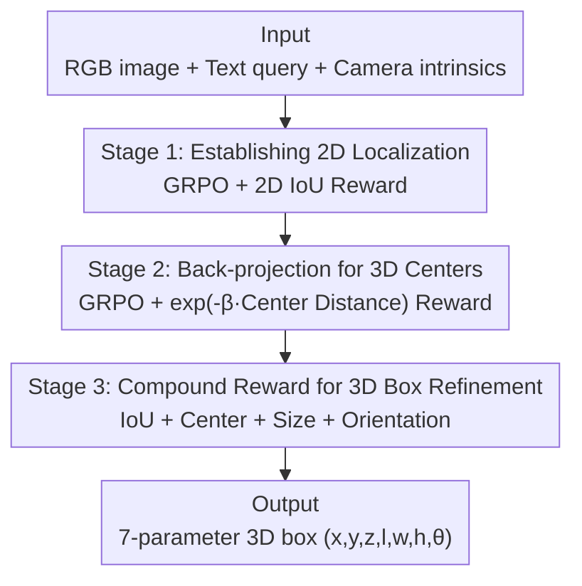

# MonoVLM: Monocular 3D Visual Grounding with Vision Language Models

**Conference**: CVPR 2026  
**Paper**: [CVF Open Access](https://openaccess.thecvf.com/content/CVPR2026/html/Qu_MonoVLM_Monocular_3D_Visual_Grounding_with_Vision_Language_Models_CVPR_2026_paper.html)  
**Code**: To be confirmed  
**Area**: 3D Vision  
**Keywords**: Monocular 3D grounding, Vision-Language Models, GRPO, Curriculum Reinforcement Learning, 3D Bounding Box Prediction

## TL;DR
MonoVLM utilizes a **three-stage curriculum GRPO training** framework to elevate monocular 3D visual grounding (predicting a 3D bounding box from an RGB image and a text description)—a task that even GPT-5 fails significantly—from nearly zero to SOTA. The model is first taught accurate 2D localization, then learns 3D centers through camera projection/back-projection, and finally refines complete 3D boxes using compound rewards. The 7B model outperforms specialized pure vision methods on Mono3DRefer.

## Background & Motivation
**Background**: Monocular 3D visual grounding requires "locating an object and predicting its 3D bounding box given an image and a natural language description." Traditionally, this task is addressed by specialized pure vision models (e.g., Mono3DVG, Mono3DVG-TGE), which achieve strong results by fusing visual features with depth cues. Conversely, VLMs have demonstrated exceptional performance in 2D visual understanding and instruction following.

**Limitations of Prior Work**: Both paths face critical issues. Specialized models **lack semantic understanding**, relying on pre-defined visual features and struggling to interpret complex or subtle language descriptions outside the training domain. Meanwhile, VLMs (even GPT-5) exhibit **extremely poor performance** in 3D perception, often achieving Acc@0.25 below 2% and single-digit mIoU, rendering the task nearly impossible for them.

**Key Challenge**: The authors decompose the failure of VLMs into three specific root causes: ① **Inaccurate 2D localization**, failing to even bound the object correctly on the image plane; ② **Lack of 3D geometric understanding**, with no concept of depth, relative size, or spatial relationships; ③ **Inability to utilize the geometric duality** of camera projection/back-projection matrices, even when intrinsic parameters are provided. An intuitive empirical study (Table 1) highlights this: after naive training, the model is surprisingly accurate on the **depth (z) axis** but shows massive errors in **horizontal (x)/vertical (y) axes**—because $x$ and $y$ are back-projected from the 2D image center $(u, v)$, meaning inaccurate 2D boxes directly contaminate 3D coordinates.

**Goal**: To transform an off-the-shelf VLM into a precise monocular 3D grounding model solely through training strategies, **without altering the architecture or adding task-specific modules**.

**Key Insight**: Since the failure can be decomposed into 2D localization, 3D centers, and full 3D boxes, these can be tackled layer-by-layer using a **curriculum-based** approach rather than forcing the model to learn 3D IoU from scratch. A pilot study showed that using 3D IoU directly as a GRPO reward resulted in signals that were **too sparse** to guide the model towards 3D understanding, leaving behind flaws in 2D localization and 3D centers.

**Core Idea**: Construct a **coarse-to-fine three-stage curriculum** using GRPO. Stage 1 solidifies 2D localization (the prerequisite for 3D), Stage 2 learns 3D centers via back-projection formulas, and Stage 3 refines the full 3D box using a compound reward comprising "IoU + Center + Size + Orientation."

## Method

### Overall Architecture
The input to MonoVLM consists of an RGB image $I$, a text query $T$, and camera intrinsics (assumed available at both training and inference). The output is a compact 7-parameter 3D box $y_o=(x,y,z,l,w,h,\theta)$, including center coordinates, dimensions, and yaw angle $\theta$ around the vertical axis. The model architecture remains unchanged; the task is decomposed from easy to difficult via a three-stage GRPO curriculum. Each stage is driven by a **verifiable geometric reward** to ensure the capability learned in the previous stage serves as a foundation for the next.

### Key Designs

**1. Curriculum GRPO + Compact 7-Parameter Representation: Progressive Learning via Verifiable Rewards**

The foundation of the method rests on two choices. First, **GRPO** is used instead of SFT or PPO. GRPO samples $G$ candidates $\{o_1, \dots, o_G\}$ for each prompt, normalizes their rewards $r_i$ to get advantages $A_i = \frac{r_i - \text{mean}\{r\}}{\text{std}\{r\}}$, and updates the strategy using a clipped objective + KL regularization. This requires **no additional critic** and naturally fits verifiable rewards like IoU. Second, a **compact 7-parameter representation** (center + size + orientation) is used instead of explicit 8-vertex coordinates. Ablation studies prove the 8-vertex representation is detrimental due to higher prediction space dimensions and ambiguous 3D semantics of raw coordinates. These choices, combined with the 2D → 3D center → full box curriculum, enable the three stages to succeed progressively.

**2. Stage 1: Establishing 2D Localization—The True Source of 3D Error is in 2D**

The pilot study revealed that after monocular 3D IoU training, depth $z$ was relatively accurate while $x, y$ errors were high. The reason lies in the back-projection formula:

$$x = \frac{(u-c_x)\cdot z}{f_x}, \quad y = \frac{(v-c_y)\cdot z}{f_y}$$

where $(f_x, f_y)$ are focal lengths and $(c_x, c_y)$ is the principal point. Even with accurate depth $z$, any error in the 2D center $(u, v)$ **propagates directly** to $x$ and $y$. Thus, Stage 1 focuses solely on solidifying 2D localization using a **2D IoU reward** $R_{\text{stage-1}} = \text{2DIoU}(\hat b_i, b_i)$. Remarkably, this 2D-only training significantly reduces 3D center errors (Table 1: MiMo's x-axis error 2.86 → 0.60), confirming that accurate 2D localization is a necessary prerequisite for 3D.

**3. Stage 2: Back-projection Supervision for 3D Centers—Discovering 2D-3D Duality**

After Stage 1, 3D center errors (especially in the y-axis) remain significant. Stage 2 directly optimizes 3D center positions with a reward based on the exponential Euclidean distance between the predicted center $\hat c_i$ and GT center $c_i$:

$$R_{\text{stage-2}} = \exp(-\beta\lVert\hat c_i - c_i\rVert_2)$$

$\beta$ controls reward sensitivity to distance, requiring no additional depth supervision. A key observation is the synergistic effect: while only 3D centers are optimized, the 2D grounding IoU **continues to rise simultaneously** (Figure 3). Due to geometric back-projection constraints, the model must implicitly refine 2D localization to accurately predict 3D centers. This suggests the model "discovers" the duality between 2D and 3D during this stage.

**4. Stage 3: Compound Reward for 3D Box Refinement—Supplementing Sparse 3D IoU with Dense Signals**

The final stage optimizes complete 3D grounding. Since 3D IoU rewards alone face a sparse, difficult landscape (only 21.31 mIoU in ablation), the authors introduce fine-grained rewards for three 3D box components alongside the main IoU reward: center location via $R_{\text{loc}} = \exp(-\beta_{\text{loc}}\lVert\hat c-c\rVert_2)$, dimensions via normalized L1 distance $R_{\text{size}} = \exp(-\beta_{\text{size}}\frac{\lVert\hat d-d\rVert_1}{\lVert d\rVert_1+\epsilon})$ (to encourage scale-invariant learning), and orientation via cosine similarity $R_{\text{rot}} = \frac{1}{2}(\cos(\hat\theta-\theta)+1)$ (to handle angular periodicity). Equal weighting is used by default, and performance remains stable under moderate re-weighting. The compound reward breaks the complex task of "full 3D box prediction" into dense, complementary supervisions, pushing mIoU from 21.31 to 29.13.

### Loss & Training
The entire process uses GRPO (including clipped objective + KL regularization back to a fixed reference policy $\pi_{\text{ref}}$), with a different geometric reward swapped in for each stage. Qwen2.5-VL-7B and MiMo-VL-7B are used as base VLMs, resulting in MonoVLM-Qwen and MonoVLM-MiMo, respectively. Implementation is based on EasyR1, using 4× H100 GPUs with default hyperparameters.

## Key Experimental Results

**Dataset**: Mono3DRefer (standard monocular 3D grounding benchmark), with official splits of 29,990 training / 5,735 validation / 5,415 test samples. Metrics include Acc@0.25 / Acc@0.5 (percentage of predictions with mIoU $> 0.25 / 0.5$) and mIoU. Evaluation is categorized by Object Uniqueness (Unique/Multiple), Object Depth (Near/Medium/Far), and Occlusion (Easy/Moderate/Hard).

### Main Results (Overall, Mono3DRefer)

| Method | Type | Acc@0.25 | Acc@0.5 | mIoU(Overall) |
|------|------|----------|---------|---------------|
| GPT-5 | Closed-source VLM | 5.98 | 0.23 | 7.53 |
| Qwen2.5-VL-72B | Open-source VLM | 0.20 | 0.00 | 0.89 |
| Cube R-CNN + Best | Pure Vision 2-stage | 55.77 | 29.92 | — |
| Mono3DVG | Pure Vision Trans. | 64.36 | 44.25 | — |
| Mono3DVG-TGE | Pure Vision Trans. | 68.44 | 51.21 | — |
| **MonoVLM-Qwen (Ours)** | Open-source VLM | 61.89 | 38.13 | 29.13 |
| **MonoVLM-MiMo (Ours)** | Open-source VLM | **69.41** | 42.96 | **38.11** |

Key Takeaways: General VLMs (including GPT-5) largely fail (Acc@0.25 typically $< 2\%$). MonoVLM elevates them to SOTA levels, where **MonoVLM-MiMo's Acc@0.25 of 69.41 exceeds the specialized SOTA Mono3DVG-TGE (68.44)**. Its mIoU of 38.11 is **over 5x** that of GPT-5 (7.53). In the challenging "Multiple" scenario requiring linguistic disambiguation, it also outperforms Mono3DVG-TGE (71.23 vs 69.83), demonstrating the advantage of VLM linguistic capabilities.

### Ablation Study

| Configuration | mIoU | Description |
|------|------|------|
| Stage-1 only | 19.81 | 2D localization foundation only |
| Stage-1+2 | 20.89 | Adding 3D center |
| **Three-stage (Ours)** | **29.13** | Full curriculum (MonoVLM-Qwen) |
| Stage 3 IoU reward only | 21.31 | Starting point for compound reward |
| + Location | 25.92 | Adding center reward |
| + Size | 28.73 | Adding dimension reward |
| + Rotation (Ours) | 29.13 | Full compound reward |

| Variant Comparison | mIoU | Acc@0.25 | Acc@0.5 |
|-------------|------|----------|---------|
| Direct SFT | 33.07 | 60.74 | 35.79 |
| Stage-3 reward only | 32.59 | 62.33 | 33.01 |
| **Full three-stage (Ours)** | **38.11** | **69.41** | **42.96** |

### Key Findings
- **Every stage contributes positively**: mIoU increases monotonically (19.81 → 20.89 → 29.13). The compound reward in Stage 3 provides the largest jump, confirming that decomposing the 3D box into dense component rewards is critical.
- **2D localization is the true bottleneck for 3D error**: The pilot study found depth $z$ to be surprisingly accurate while $x/y$ were poor, caused by 2D center inaccuracies amplified via back-projection. This insight drives the entire method design.
- **Spontaneous utilization of 2D-3D duality**: Stage 2 optimization of 3D centers incidentally improves 2D IoU, validating the geometric synergy where "fixing 3D necessitates fixing 2D."
- **Simplicity outperforms complexity**: The three-stage curriculum, while intuitive, outperforms more complex alternatives (direct SFT or Stage-3 reward only), proving that a "streamlined approach is maximally effective."
- **8-vertex representation is detrimental**: The 7-parameter compact representation is superior to explicit 8-vertex coordinates due to smaller prediction space and clearer 3D semantics.

## Highlights & Insights
- **Diagnosis before Prescription**: By using a pilot study to identify the "2D localization error → back-projection contamination" issue, the authors designed a targeted curriculum, a "textbook" approach to problem-solving.
- **Geometric Duality as Free Supervision**: Using camera geometry to couple gradients between 2D and 3D tasks is clever, providing "incidental gains" that can translate to other tasks requiring 2D-3D consistency.
- **Compound Rewards Solve Sparsity**: Decomposing a single sparse 3D IoU into center/size/orientation creates a practical paradigm for using RL in geometric regression tasks.
- **Arch-Free, Training-Only**: The work proves that standard VLMs can match or exceed specialized 3D models without task-specific modules, providing strong evidence for using VLMs as unified visual backbones.

## Limitations & Future Work
- **Dependency on Camera Intrinsics**: Assumes intrinsics are available during both training and inference; robustness to unknown or inaccurate intrinsics is not discussed.
- **Single Dataset Validation**: Experiments are confined to Mono3DRefer; generalization across datasets or domains (e.g., real-world autonomous driving distribution shifts) is not fully tested.
- **Manually Designed Curriculum Order**: The three-stage split and sequence are heuristic. Whether this is optimal for all 3D tasks or can be automated remains an open question.
- **Limited Hyperparameter Sensitivity Disclosure**: While compound reward weights are claimed to be stable, a systematic sensitivity analysis for various $\beta$ values is missing.
- **Future Directions**: Extending curriculum GRPO to broader 3D tasks (detection, layout reasoning), exploring intrinsic self-estimation, and researching automated curriculum and reward weight learning.

## Related Work & Insights
- **vs Mono3DVG / Mono3DVG-TGE (Specialized Vision)**: These models use fused vision+depth for language-guided 3D localization but lack deep semantics. MonoVLM uses a VLM as the predictor, offering stronger linguistic reasoning and superior performance in "Multiple" disambiguation scenarios (Acc@0.25 71.23 vs 69.83).
- **vs General VLMs (GPT-5 / Qwen2.5-VL-72B)**: These have strong 2D skills but nearly zero 3D geometry capabilities (single-digit mIoU). MonoVLM improves mIoU by an order of magnitude using equivalent or smaller 7B models (38.11 vs GPT-5 7.53).
- **vs Standard GRPO / RL-for-VLM**: Existing works use GRPO for 2D grounding. This paper extends reward-driven reinforcement to the more complex 3D domain, successfully decomposing sparse 3D signals into learnable dense sub-targets.

## Rating
- Novelty: ⭐⭐⭐⭐ Reaching SOTA in 3D grounding via training strategy alone without architectural changes is impressive.
- Experimental Thoroughness: ⭐⭐⭐⭐ Strong main results and ablations, though limited to the Mono3DRefer dataset.
- Writing Quality: ⭐⭐⭐⭐⭐ Extremely clear logical chain from diagnosis to methodology; geometric synergies are well-explained.
- Value: ⭐⭐⭐⭐ Provides a simple, feasible path for using off-the-shelf VLMs in unified 3D-aware visual systems.

<!-- RELATED:START -->

## Related Papers

- [\[CVPR 2026\] 240FPS Stereo Vision from Monocular Mixed Spikes](240fps_stereo_vision_from_monocular_mixed_spikes.md)
- [\[CVPR 2026\] Iris: Integrating Language into Diffusion-based Monocular Depth Estimation](iris_integrating_language_into_diffusion-based_monocular_depth_estimation.md)
- [\[CVPR 2026\] Affostruction: 3D Affordance Grounding with Generative Reconstruction](affostruction_3d_affordance_grounding_with_generative_reconstruction.md)
- [\[CVPR 2026\] A Cookbook of 3D Vision: Data, Learning Paradigms, and Application](a_cookbook_of_3d_vision_data_learning_paradigms_and_application.md)
- [\[CVPR 2026\] Dynamic Visual SLAM using a General 3D Prior](dynamic_visual_slam_using_a_general_3d_prior.md)

<!-- RELATED:END -->
