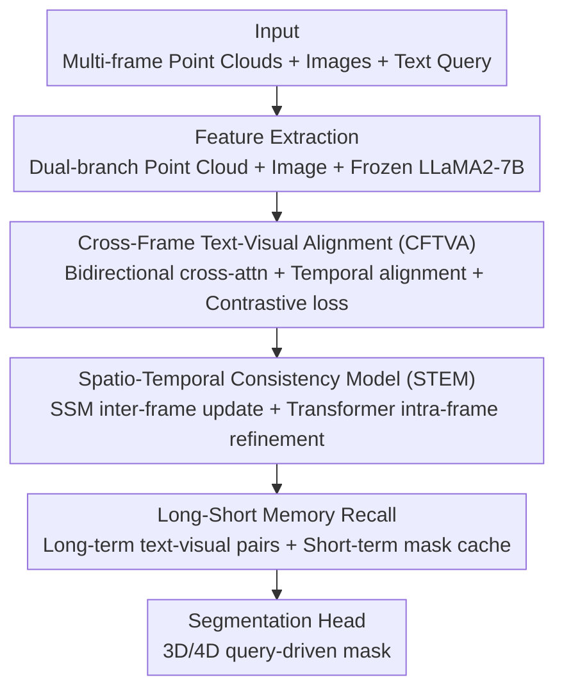

# MORE-STEM: Long-Short MemOry REcall and Spatio-TEmporal Consistency Model for Query-Driven 3D/4D Point Cloud Segmentation

**Conference**: CVPR 2026  
**Paper**: [CVF Open Access](https://openaccess.thecvf.com/content/CVPR2026/html/Li_MORE-STEM_Long-Short_MemOry_REcall_and_Spatio-TEmporal_Consistency_Model_for_Query-Driven_CVPR_2026_paper.html)  
**Code**: None (Not released)  
**Area**: 3D Vision / Point Cloud Segmentation / Vision-Language  
**Keywords**: 4D Point Cloud Segmentation, Instruction Segmentation, Spatio-Temporal Consistency, Memory Mechanism, Cross-Modal Alignment

## TL;DR
Addressing the limitation that language-driven 3D segmentation only handles static single frames and fails to understand dynamic scenes, MORE-STEM extends query-driven segmentation from 3D to 4D point cloud sequences. It integrates cross-frame text-visual alignment, spatio-temporal consistency modeling (State Space Model + Sparse Transformer), and long-short term memory recall. Additionally, it introduces InstructKITTI, the first outdoor 3D/4D instruction segmentation benchmark, achieving new SOTA performance across instruction, referring, and semantic segmentation tasks.

## Background & Motivation

**Background**: Localizing and segmenting targets in 3D point clouds using natural language queries (query-driven / instruction / referring segmentation) is a prominent topic in vision-language research. Benchmarks like ScanRefer, GRES, 3D-GRES, and SegPoint have established the effectiveness of vision-language alignment in static single-frame RGB-D/point clouds.

**Limitations of Prior Work**: Existing methods are largely constrained to **static 3D single frames** and lack temporal evolution modeling. This leads to inconsistent results when objects move or when context from prior frames is required. In real-world scenarios such as autonomous driving and robotics, temporal context and object motion are indispensable. As shown in Figure 1, queries with temporal/motion descriptions ("the silver car **moving in the opposite direction and closer to me**") can resolve ambiguous references into a single clear target, yet static methods cannot utilize these temporal cues.

**Key Challenge**: The few attempts at temporal modeling rely either on simple frame aggregation or recurrent fusion. Such **frame-level/global feature fusion** struggles to maintain **voxel-level** spatio-temporal consistency under occlusion or large displacements and fails to capture long-range dependencies or cross-scene recall. Furthermore, existing memory mechanisms (e.g., MemorySeg, DDSemi, MAD) either lack semantic/modal guidance, or are used only as training regularizers rather than for real-time inference, lacking principled coordination between long and short-term memory.

**Goal**: To build a unified framework that simultaneously addresses 3D semantic segmentation, 3D referring segmentation, and 3D/4D instruction segmentation, while maintaining spatio-temporal consistency and cross-scene memory recall in dynamic environments.

**Key Insight**: Rather than focusing solely on single frames, the model performs fine-grained temporal alignment between language queries and **cross-frame** evolving 3D features, propagates temporal features at the **voxel level** using State Space Models (SSM), and employs hierarchical memory to balance long-term semantics with short-term adaptation.

**Core Idea**: Three modules serve distinct functions: Cross-Frame Text-Visual Alignment (CFTVA) ensures language matches evolving vision; the Spatio-Temporal Consistency Model (STEM) stabilizes inter-frame voxel features; and Long-Short Memory Recall enables "remembering distant scenes and continuing recent frames," all connected via a new benchmark.

## Method

### Overall Architecture
The input consists of multi-frame point clouds, RGB images, and a text query. First, a dual-branch point cloud encoder extracts features: a lightweight Point Transformer produces point-wise embeddings $F_{\text{point}}$, and a sparse 3D Transformer (with shifted window attention) produces voxel features $F_{\text{voxel}}$. Images are processed by an image encoder to extract $F_{\text{img}}$, while text is encoded via a frozen LLaMA2-7B into $F_{\text{txt}}$. These features enter **CFTVA** for cross-modal and cross-frame alignment, grounding linguistic semantics spatially and temporally to evolving 3D features. The aligned visual representations enter **STEM**, which uses an SSM for inter-frame voxel propagation and a controllable 3D Transformer for intra-frame spatial refinement. Finally, the **Long-Short Memory Recall** module retrieves text-visual pairs from long-term memory for semantic continuity and utilizes short-term mask feature caches for real-time adaptation. The segmentation head then outputs spatio-temporal consistent 3D/4D masks.

### Key Designs

**1. Cross-Frame Text-Visual Alignment (CFTVA): Matching Language to Evolving 3D Features**

Static alignment fails in dynamic scenes where temporal words like "opposite direction" or "closer" require cross-frame visual evidence. CFTVA involves three steps. First, **bidirectional cross-modal attention** is applied within each frame to inject image cues: $F_t^{\text{point}'} = \mathrm{CrossAttn}(F_t^{\text{point}}, F_t^{\text{img}})$ and $F_t^{\text{voxel}'} = \mathrm{CrossAttn}(F_t^{\text{voxel}}, F_t^{\text{img}})$, forming the visual representation $F_t^{\text{vis}} = [F_t^{\text{point}'}, F_t^{\text{voxel}'}]$. Second, text embeddings from LLaMA2-7B and visual representations are projected into the same space ($F^{\text{txt}'}=W_{\text{txt}}F^{\text{txt}}$, $F_t^{\text{vis}'}=W_{\text{vis}}F_t^{\text{vis}}$). **Temporal cross-modal attention** then aligns the text with visual tokens from the current and previous two frames: $F_t^{\text{vis}^{\text{align}}} = \mathrm{Attn}(F^{\text{txt}'}, [F_t^{\text{vis}'}, F_{t-1}^{\text{vis}'}, F_{t-2}^{\text{vis}'}])$. This allows the text to "see" the multi-frame context. Finally, a temporal contrastive loss reinforces discriminative correspondence:

$$\mathcal{L}_{\text{align}} = -\log\frac{\exp\big(\mathrm{sim}(F_t^{\text{vis}^{\text{align}}}, F^{\text{txt}'})/\tau\big)}{\sum_{t'}\exp\big(\mathrm{sim}(F_{t'}^{\text{vis}^{\text{align}}}, F^{\text{txt}'})/\tau\big)},$$

where $\mathrm{sim}(\cdot)$ is cosine similarity and $\tau$ is the temperature.

**2. Spatio-Temporal Consistency Model (STEM): Stabilizing Voxel Features via State Space Models**

STEM decouples "inter-frame propagation" and "intra-frame refinement" to prevent temporal drift. For inter-frame propagation, **SSM-based recursion** maintains a temporal hidden state for each voxel $v$: $h_t(v) = A\,h_{t-1}(v) + B\,[F_t^{\text{point}^{\text{align}}}(v)\,\|\,F_t^{\text{voxel}^{\text{align}}}(v)]$, where $(A,B)$ are learnable parameters. For intra-frame refinement, a **controllable voxel-level Transformer** enhances spatial coherence: $z_t(v) = \mathrm{Transformer}(Q_t, K_t, V_t)$. The final spatio-temporal feature is combined: $\tilde{f}_t(v) = \mathrm{Norm}\big(h_t(v) + z_t(v)\big)$.

**3. Long-Short Memory Recall (LTM + STM): Balancing Global Knowledge and Local Continuity**

**Long-Term Memory (LTM)** maintains three associated banks: text $\{F_i^{\text{txt}}\}$, feature pairs $\{f_{\text{pair}}^i\}$, and visual $\{\tilde{f}_i\}$, with pairs weighted by confidence $w_i^{\text{init}} = \frac{1}{\mathcal{L}_i + \epsilon}$. To avoid bias from high-frequency categories, it updates weights as $w_i^{\text{bias}} = \frac{w_i^{\text{init}}}{\sum_{j\in c} w_j^{\text{init}}}$, ensuring balanced semantic recall. **Short-Term Memory (STM)** maintains a Mask memory bank $\{\tilde{f}_{\text{mask}}^{i-k}\}_{k=1}^{K}$ from adjacent frames. The current frame uses the LTM output as a Query to retrieve temporal info from the STM via cross-attention to predict the current mask.

### Loss & Training
The model is trained using AdamW with a cosine learning rate scheduler and a 1% warm-up. For indoor scenes, the initial LR is 0.005 with a weight decay of 0.05; for outdoor, it is 0.002 and 0.005. Training is conducted on 4×NVIDIA V100 (32 GB) GPUs. LLaMA2-7B remains frozen throughout.

## Key Experimental Results

### Main Results
Evaluation spans four sub-tasks: 4D instruction segmentation, 3D instruction segmentation, 3D referring segmentation, and 3D semantic segmentation, using InstructKITTI (Ours), Instruct3D (based on ScanNet++), ScanRefer, and SemanticKITTI.

| Benchmark/Task | Metric | Ours | Runner-up | Gain |
|------|------|------|------|------|
| Instruct3D (3D Instr.) | Acc | 31.4 | 27.5 (SegPoint) | +3.9 |
| Instruct3D (3D Instr.) | mIoU | 35.9 | 31.6 (SegPoint) | +4.3 |
| InstructKITTI (3D Instr.) | Acc | 38.62 | 21.60 (Chat-Scene) | +17.0 |
| InstructKITTI (3D Instr.) | mIoU | 37.95 | 21.50 (Chat-Scene) | +16.5 |
| ScanRefer (3D Ref.) | mIoU | 52.7 | 44.8 (RefMask3D) | +7.9 |
| SemanticKITTI (3D Sem. val) | mIoU | 74.6 | 73.4 (MR-COSMO) | +1.2 |

On the InstructKITTI 4D benchmark, the model achieves 42.19 Acc@50 and 40.67 mIoU. Efficiency on InstructKITTI: 0.19s latency/query and 28.9 GB GPU memory (higher latency than 3D-STMN but vastly higher accuracy).

### Key Findings
- **CFTVA is the largest contributor**: Removing it drops mIoU from 31.4 to 29.7 (−1.7), confirming that cross-modal grounding to 3D space is the most critical factor.
- **Synergistic Roles**: STEM ensures sequence stability, LTM strengthens cross-scene history, and STM reduces local inconsistencies.
- **Significant Outdoor Dynamic Gains**: The +17 Acc improvement on InstructKITTI (outdoor) is much larger than on Instruct3D (indoor), highlighting the value of temporal modeling in dynamic environments.

## Highlights & Insights
- **Upgrading 3D Instruction Segmentation to 4D**: The motivation that time/motion resolves ambiguity is powerful. The new InstructKITTI benchmark fills a gap in outdoor dynamic instruction segmentation.
- **Pragmatic STEM Design**: Using SSM for temporal propagation avoids the overhead of explicit frame stacking, while the sparse Transformer handles spatial granularity. This "time via recursiveness, space via attention" approach is highly transferable.
- **Balanced Memory Weighting**: The confidence-based weighting $w^{\text{init}}$ and bias-correction for category balance is a robust strategy for any memory bank system suffering from long-tail distribution issues.

## Limitations & Future Work
- **Code/Benchmark Availability**: Code links are not explicitly provided, and the benchmark construction depends on specific pipeline details.
- **Heavy LLM Dependency**: Relies on LLaMA2-7B and Qwen3VL-7B, leading to high deployment costs.
- **Latency**: 0.19s/query is significantly slower than more optimized models like 3D-STMN (0.05s).
- **Scalability of Memory Banks**: The storage/retrieval cost of LTM and STM for extremely long sequences is not fully explored.

## Related Work & Insights
- **Vs. Static Segmentation**: Unlike ScanRefer or SegPoint, this method handles motion and prior context, improving mIoU from 31.6 to 35.9 on Instruct3D.
- **Vs. Spatio-Temporal Modeling (Mamba4D/HiLoTs)**: These often focus on frame-level fusion. STEM operates at the voxel level to maintain finer consistency.
- **Vs. Memory Enhancement**: Unlike MemorySeg (spatial only) or DDSemi (training only), this work utilizes a principled dual-memory structure for real-time inference.

## Rating
- Novelty: ⭐⭐⭐⭐ (4D extension + Synergy + Benchmark).
- Experimental Thoroughness: ⭐⭐⭐⭐ (Wide range of tasks; though 4D comparisons are limited).
- Writing Quality: ⭐⭐⭐⭐.
- Value: ⭐⭐⭐⭐ (Practical for robotics and autonomous driving).

<!-- RELATED:START -->

## Related Papers

- [\[AAAI 2026\] MR-CoSMo: Visual-Text Memory Recall and Direct Cross-Modal Alignment Method for Query-Driven 3D Segmentation](../../AAAI2026/3d_vision/mr-cosmo_visual-text_memory_recall_and_direct_cross-modal_alignment_method_for_q.md)
- [\[CVPR 2026\] STS-Mixer: Spatio-Temporal-Spectral Mixer for 4D Point Cloud Video Understanding](sts_mixer_4d_point_cloud.md)
- [\[CVPR 2026\] ST4R-Splat: Spatio-Temporal Referring Segmentation in 4D Gaussian Splatting](st4r-splat_spatio-temporal_referring_segmentation_in_4d_gaussian_splatting.md)
- [\[CVPR 2026\] SuP: Sub-cloud Driven Point Cloud Registration](sup_sub-cloud_driven_point_cloud_registration.md)
- [\[CVPR 2026\] ConsisVLA-4D: Advancing Spatiotemporal Consistency in Efficient 3D-Perception and 4D-Reasoning for Robotic Manipulation](consisvla-4d_advancing_spatiotemporal_consistency_in_efficient_3d-perception_and.md)

<!-- RELATED:END -->
