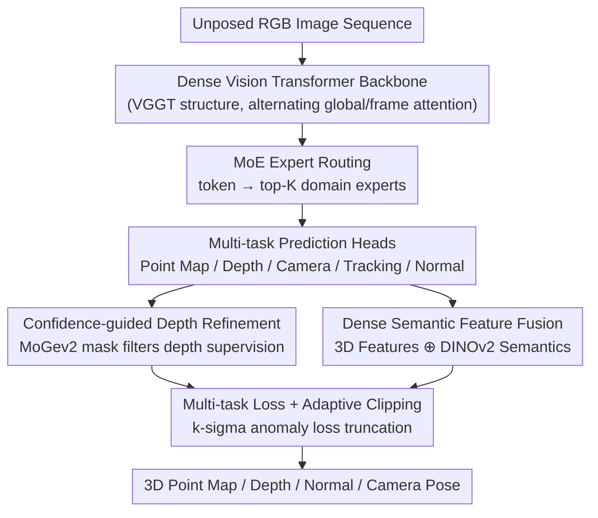

# MoRE: 3D Visual Geometry Reconstruction Meets Mixture-of-Experts

**Conference**: CVPR 2026  
**Paper**: [CVF Open Access](https://openaccess.thecvf.com/content/CVPR2026/html/Gao_MoRE_3D_Visual_Geometry_Reconstruction_Meets_Mixture-of-Experts_CVPR_2026_paper.html)  
**Code**: Project Page https://g-1nonly.github.io/MoRE_Website/ (Code TBD)  
**Area**: 3D Vision  
**Keywords**: Feed-forward 3D Reconstruction, Mixture-of-Experts (MoE), Visual Geometry Foundation Models, Depth Refinement, Multi-task Learning

## TL;DR
MoRE introduces Mixture-of-Experts (MoE) routing into feed-forward dense 3D geometry foundation models represented by VGGT. This allows different experts to specialize in heterogeneous scenes such as indoor/outdoor, objects, humans, or dynamic environments. Combined with confidence-guided depth refinement and dense semantic feature fusion, it achieves SOTA performance across four tasks: point maps, depth, camera poses, and surface normals.

## Background & Motivation

**Background**: 3D visual geometry reconstruction is shifting from "per-scene optimization" toward "feed-forward foundation models." Methods like DUSt3R, MASt3R, Fast3R, VGGT, and Pi3 directly regress geometric quantities—point maps, depth, camera parameters, and tracking features—from unposed images. This collapses the traditional calibration and global alignment pipeline into a single forward pass and demonstrates strong cross-dataset generalization.

**Limitations of Prior Work**: The success of these models largely depends on "large models + large data" scaling. However, the authors argue that scaling 3D models is more difficult than LLMs or 2D vision. Geometric supervision is inherently complex (noisy depth ground truth, inconsistent loss scales across tasks), and 3D data is highly heterogeneous, with vast distribution differences between indoor, outdoor, object-centric, human-centric, and dynamic scenes. A single dense feature decoder struggles to master all these disparate domains simultaneously.

**Key Challenge**: Increasing capacity to improve accuracy across domains requires more parameters and compute. However, once dense Transformer models are scaled up, computational costs grow linearly or even super-linearly with parameter count. Furthermore, a "one-size-fits-all" set of weights can lead to mutual interference across heterogeneous 3D distributions.

**Goal**: To expand model capacity and enable adaptive allocation of that capacity without proportional increases in computational cost, while simultaneously addressing noisy depth supervision and over-smoothing in multi-view predictions.

**Key Insight**: Borrowing the MoE architecture from LLMs—where each token activates only a small subset of experts—allows capacity expansion without a computational explosion. Additionally, experts naturally differentiate to specialize in various aspects of the data, which aligns perfectly with the diversity of 3D scenes.

**Core Idea**: Integrate MoE into the prediction pipeline of feed-forward 3D geometry reconstruction, using a router to dynamically distribute features to domain-specialized experts. Complement this with confidence masks to filter unreliable depth supervision, DINOv2 semantic features to recover local details lost in multi-view fusion, and a suite of customized losses with adaptive clipping to stabilize large-scale training.

## Method

### Overall Architecture
MoRE is an end-to-end feed-forward model. Given an unposed RGB image sequence $(I_i)_{i=1}^N$, it uses a dense vision Transformer backbone (following the VGGT architecture) to output camera parameters $C_i \in \mathbb{R}^9$, point maps $P_i$, depth $D_i$, tracking features $T_i$, and normal maps $N_i$. Beyond the four heads used in VGGT, MoRE adds a normal prediction head. Training follows two stages: **Stage 1** supervises the backbone and heads using multi-task objectives; **Stage 2** replaces FFNs in the alternating global/frame attention blocks with expert sets, inserting MoE layers to allow the model to route specialized representations based on the scene. Depth is refined via confidence masks, and normals are enhanced through dense semantic fusion. The system is optimized via customized losses and adaptive clipping.

### Key Designs

**1. MoE Expert Routing: Adaptive Handling of Heterogeneous 3D Scenes**

This is the primary innovation addressing the limitation of single-decoder features in diverse 3D domains. MoRE implements MoE layers as modular components within the backbone. During initialization, FFNs in the alternating attention structure (global and frame-level) are replicated into a set of experts $\varepsilon_i$. A linear layer functions as a router to predict the probability of each token being assigned to each expert: $P(x)_i = e^{f(x)_i}/\sum_j e^{f(x)_j}$, where $f(x)=W\cdot x$ represents the routing logits. Each token is processed by the top-K experts with the highest probabilities, and the output is a weighted sum: $\text{MoE}(x)=\sum_{i=1}^{K} P(x)_i\cdot \varepsilon(x)_i$. This expands capacity as the number of experts increases while keeping the active compute per token constant. Experts naturally specialize in indoor, outdoor, object, or dynamic distributions. To prevent load imbalance, a differentiable loss $L_{moe}=E\cdot\sum_{i=1}^{E} F_i\cdot G_i$ is added, where $F_i$ is the fraction of tokens assigned to expert $i$ and $G_i$ is the average routing probability.

**2. Confidence-guided Depth Refinement: Avoiding Noisy Ground Truth Fitting**

Real-world depth data often contains noise and missing values. Hard-fitting these unreliable ground truths degrades accuracy. The authors observe that monocular models (e.g., MoGev2) calibrated on clean data provide highly accurate relative depth. They use this to "filter supervision": for each sample, a confidence mask $M_{conf}=\big[\,|D_{moge}-D_{gt}|/\max(D_{gt},\alpha) < \tau\,\big]$ is computed (with $\alpha=0.5$ for stability and $\tau=0.1$ as the threshold) to discard low-confidence or missing GT regions. A prior-guided depth term $L^{p}_{depth}=L_{grad}(\hat D_{M_{conf}}, D^{M_{conf}}_{moge})$ is added to the original VGGT depth loss: $L_{depth}=L^{vggt}_{depth}+L^{p}_{depth}$, applied only to high-confidence regions. This prevents overfitting to corrupted data, yielding more stable depth estimates.

**3. Dense Semantic Feature Fusion: Recovering Geometric Details via Semantic Cues**

While single-view models yield sharp geometry, multi-view models often "smooth" predictions to maintain 3D consistency, losing fine-grained details. The authors concatenate the backbone's globally aligned 3D features $f_{3d}$ with dense semantic features $f_s$ extracted from DINOv2: $f_n=f_{3d}\oplus f_s$. This fused representation is fed into a DPT head to regress the final depth and normals. Semantic features provide local geometric cues that sharpen predictions and better fit fine structures, which is shown to significantly improve normal quality.

**4. Customized Losses and Adaptive Clipping: Stabilizing Large-scale Heterogeneous Training**

To learn point maps, cameras, depth, tracking, and normals simultaneously, the authors extend the VGGT loss suite with three targeted terms: **Local Point Loss** $L_{pts\_local}$ (resolves monocular scale ambiguity by calculating an optimal scale $\hat s$ to align predicted point clouds with GT before computing depth-weighted L1 distance); **Point Normal Loss** $L_{pts\_n}$ (computes normals via cross-products of adjacent points and supervises them by angular difference to encourage local surface smoothness); and **Predicted Normal Loss** $L_n=L1(N,\bar N)$ (direct supervision of the normal head in view space). Due to varying data quality, outlier labels can cause loss spikes. The authors use adaptive clipping to stabilize training: a sliding window maintains the mean $\mu_L$ and standard deviation $\sigma_L$ of recent losses, setting a threshold $T_L=\mu_L+k\sigma_L$ (default $k=3$). Losses exceeding this threshold are clipped, ensuring training is driven by the typical distribution rather than extreme outliers.

### Loss & Training
The total objective is $L = L_{pts} + L_{cam} + L_{depth} + \lambda_{track}L_{track} + \lambda_{moe}L_{moe} + \lambda_{pts\_local}L_{pts\_local} + \lambda_{pts\_n}L_{pts\_n} + \lambda_{n}L_{n}$, with weights $\lambda_{moe}=0.01$, $\lambda_{pts\_local}=0.5$, $\lambda_{pts\_n}=1.0$, and $\lambda_{n}=1.0$. The model is initialized with a pre-trained VGGT checkpoint. Training data includes the VGGT set augmented by an internal dataset covering diverse scenes. Training involves two stages: multi-task supervision followed by MoE fine-tuning.

## Key Experimental Results

### Main Results
In point map reconstruction (Mean of Acc./Comp.), MoRE leads on most datasets. Selected results for DTU and ETH3D:

| Dataset | Metric | MoRE (Ours) | Pi3 | VGGT |
|---------|--------|-------------|-----|------|
| DTU | Acc.↓ | **1.011** | 1.198 | 1.338 |
| DTU | Comp.↓ | **1.482** | 1.849 | 1.896 |
| DTU | N.C.↑ | **0.695** | 0.678 | 0.676 |
| ETH3D | N.C.↑ | **0.782** | 0.768 | 0.766 |
| NRGBD | N.C.↑ | **0.992** | 0.987 | — |

The improvement in normal estimation is most significant (Mean/Med angular error ↓, δ11.25° ↑):

| Dataset | Metric | MoRE | StableNormal | Lotus |
|---------|--------|------|--------------|-------|
| NYUv2 | Mean↓ | **15.1** | 19.7 | 17.5 |
| NYUv2 | δ11.25°↑ | **63.5** | 53.0 | 58.7 |
| ScanNet | Mean↓ | **16.1** | 18.1 | 18.1 |
| IBims-1 | δ11.25°↑ | **72.6** | 66.7 | 66.2 |

For camera poses under a zero-shot setting on RealEstate10K, AUC@30 reaches **86.28** (compared to Pi3 85.90, VGGT 77.62). ATE on TUM-dynamics drops to **0.010** (VGGT 0.012, Pi3 0.014), setting or matching SOTA across multiple datasets. Monocular depth performance is comparable to specialized models like MoGe.

### Ablation Study
Components added incrementally on DTU (Point Map), NYUv2 (Depth), and RealEstate10K (Pose):

| Configuration | DTU Acc.↓ | DTU Comp.↓ | NYUv2 δ<1.25↑ | RE10K AUC@30↑ | Description |
|---------------|-----------|------------|---------------|---------------|-------------|
| w/o L, w/o MoE | 1.338 | 1.896 | 0.951 | 77.62 | VGGT Baseline |
| w/o MoE | 1.297 | 1.625 | 0.953 | 85.14 | + Customized Losses |
| **Ours (Full)** | **1.011** | **1.482** | **0.957** | **86.28** | + MoE |

All variants were trained for the same number of steps to ensure a fair comparison of compute.

### Key Findings
- **MoE and Customized Losses are Complementary**: Adding customized losses (including confidence depth refinement) improves pose AUC significantly; adding MoE further compresses DTU Acc. from 1.297 to 1.011. This proves that "capacity adaptation" and "supervision quality" provide distinct gains.
- **Value of "Less is More" in Depth**: Supervising only high-confidence regions is more accurate than fitting all noisy ground truth data—a counter-intuitive result for depth training.
- **Over-smoothing Recovered by Semantics**: DINOv2 dense fusion significantly sharpens normals and depth. The improvement in normals is the most substantial gain across all tasks.
- **Consistency and Artifacts**: Unlike Pi3, which often produces checkerboard artifacts due to insufficient Transformer learning, MoRE remains consistent across sparse and dense views.

## Highlights & Insights
- **Seamless Transfer of MoE to 3D Geometry**: Replicating alternating attention FFNs as experts with top-K routing and load balancing effectively scales capacity without increasing inference compute. This is a successful empirical validation of MoE for 3D foundation models.
- **Filtering Over Augmenting**: Using an off-the-shelf monocular model (MoGev2) as a "judge" to generate confidence masks and discard "dirty" ground truth is a simple yet powerful strategy applicable to any dense prediction task plagued by noisy labels.
- **Reconciling Consistency and Detail**: The inherent tension between 3D consistency (which causes smoothing) and local sharpness is resolved using lightweight 2D self-supervised semantic features.
- **Engineering Robustness**: The adaptive k-sigma loss clipping is a practical, reusable trick for stabilizing training on heterogeneous, large-scale datasets with varying quality.

## Limitations & Future Work
- **Dependency on External Models**: Refinement relies on MoGev2 and DINOv2. Any biases or blind spots in these external models may be inherited by MoRE.
- **Interpretability of Experts**: While the paper claims experts specialize in domains (indoor/outdoor, etc.), quantitative evidence of specific expert specialization is limited.
- **Training and Memory Overhead**: Although inference compute is constant, replicating FFNs increases total parameters and memory requirements during training.
- **Future Directions**: Exploring alignment between experts and scene categories, extending confidence masking to normals and point maps, and developing dedicated experts for temporal consistency in dynamic scenes.

## Related Work & Insights
- **vs VGGT**: MoRE uses VGGT as its backbone but adds a normal head, MoE layers, and refinement modules. It outperforms VGGT (e.g., DTU Acc. 1.338 → 1.011) through expert division rather than simple parameter scaling.
- **vs Pi3 / Fast3R**: These models show weaker cross-scene generalization or artifacts. MoRE's advantage stems from adaptive capacity allocation.
- **vs DUSt3R / MASt3R**: Early methods required global alignment or decoupled poses. MoRE handles everything in a unified feed-forward framework with higher accuracy.
- **vs Specialized Monocular Models**: MoRE integrates monocular cues as supervision guides and semantic features, eventually surpassing specialized models like StableNormal in multi-view contexts.

## Rating
- Novelty: ⭐⭐⭐⭐ Successful migration of MoE to 3D foundation models; clean but relies on established paradigms.
- Experimental Thoroughness: ⭐⭐⭐⭐⭐ Extensive benchmarks across four tasks with clear ablation of components.
- Writing Quality: ⭐⭐⭐⭐ Clear structure and complete formulations; could provide more evidence for expert specialization.
- Value: ⭐⭐⭐⭐ Provides a practical, reproducible path for scaling 3D foundation models via capacity expansion.

<!-- RELATED:START -->

## Related Papers

- [\[CVPR 2026\] More Natural, More Real: Object-aware Gaussian Splatting for 3D Visual Decoding from Human Brain](more_natural_more_real_object-aware_gaussian_splatting_for_3d_visual_decoding_fr.md)
- [\[ICLR 2026\] MoE-GS: Mixture of Experts for Dynamic Gaussian Splatting](../../ICLR2026/3d_vision/moe-gs_mixture_of_experts_for_dynamic_gaussian_splatting.md)
- [\[CVPR 2026\] Emergent Outlier View Rejection in Visual Geometry Grounded Transformers](emergent_outlier_view_rejection_in_visual_geometry_grounded_transformers.md)
- [\[CVPR 2026\] Gen3R: 3D Scene Generation Meets Feed-Forward Reconstruction](gen3r_3d_scene_generation_meets_feed-forward_reconstruction.md)
- [\[CVPR 2026\] DVGT: Driving Visual Geometry Transformer](dvgt_driving_visual_geometry_transformer.md)

<!-- RELATED:END -->
