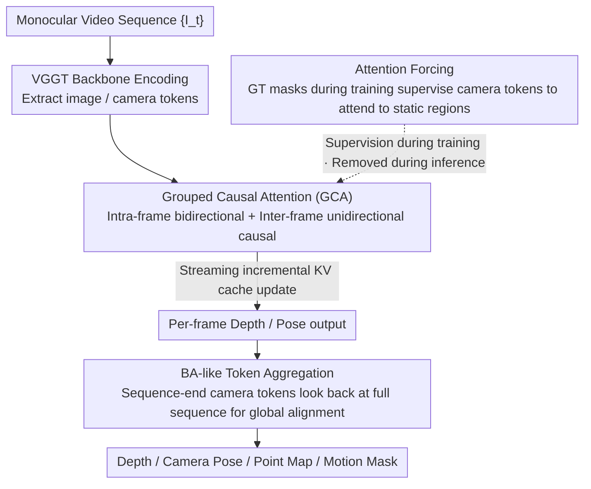

# MoRe: Motion-aware Feed-forward 4D Reconstruction Transformer

**Conference**: CVPR 2026  
**arXiv**: [2603.05078](https://arxiv.org/abs/2603.05078)  
**Code**: [Project Page](https://hellexf.github.io/MoRe/)  
**Area**: 3D Vision  
**Keywords**: 4D Reconstruction, Dynamic Scenes, Attention Forcing, Streaming Inference, Motion Decoupling

## TL;DR

This paper proposes MoRe, a motion-aware feed-forward 4D reconstruction Transformer. It decouples dynamic motion from static structures during training via an attention forcing strategy and combines it with grouped causal attention to achieve efficient streaming inference. MoRe achieves SOTA performance in camera pose estimation and depth prediction for dynamic scenes.

## Background & Motivation

Reconstructing temporally evolving 3D structures from monocular video (4D reconstruction) is a core requirement for applications like AR, robotics, and digital twins. Current methods face several dilemmas:

- **Feed-forward models with static assumptions** (DUSt3R, VGGT, Fast3R): These models directly regress point maps and poses. While fast, their features for camera estimation are heavily contaminated by dynamic objects (attention shifts to moving objects), leading to significant degradation in pose accuracy.
- **Optimization-based pipelines** (MonST3R, CasualSAM): These integrate modules like optical flow, segmentation, and depth estimation. While robust in dynamic scenes, their multi-stage architectures involve high computational overhead, making them unsuitable for real-time or long-sequence processing.
- **Streaming reconstruction methods** (CUT3R, StreamVGGT): These utilize LLM-style causal attention for online processing. However, standard causal attention disrupts the spatial consistency between intra-frame tokens and allows error accumulation over time.

Key Challenge: How to design a fast, generalizable framework that ensures accuracy for both pose and depth under dynamic scenes and streaming inputs?

## Method

### Overall Architecture

MoRe is built upon a strong static reconstruction backbone (VGGT architecture). It jointly estimates depth $\{D_t\}$, camera parameters $\{g_t\}$, point maps $\{P_t\}$, and motion masks $\{M_t\}$ from a monocular video sequence $\{I_t\}_{t=1}^T$. During the training phase, motion-aware capabilities are injected via an attention forcing strategy. During inference, the model does not rely on additional motion priors or segmentation inputs. It supports both Full Attention mode (for optimal quality) and Streaming Causal Attention mode (for online processing).

### Key Designs

**1. Attention Forcing: Teaching camera tokens "where to look" during training to gain motion decoupling for free**

This design directly addresses the most difficult pain point—visualizing the attention maps of VGGT reveals that in dynamic scenes, the camera token's attention is spread uniformly across both moving objects and the static background. The stable features required for camera estimation are contaminated by moving objects, causing pose instability. MoRe's approach is to partition the GT motion mask into patches of size $s \times s$ during training and calculate a static score for each image token:

$$a_i = 1 - \frac{1}{s^2} \sum_{(u,v) \in m_i} m_i(u,v)$$

Where $a_i \in [0,1]$, with values closer to 1 indicating more static regions. This $a_i$ is then used to supervise the attention weights $\alpha_i$ of the camera token towards that specific image token, forcing the model to concentrate attention on static regions and avoid moving objects. Crucially, this supervision is entirely removed during inference—GT masks are only used for training, and the model internalizes the preference for static regions into its weights, resulting in zero additional overhead and no segmentation input requirements at test time.

**2. Grouped Causal Attention: Enabling streaming inference without losing intra-frame spatial consistency**

Naively applying LLM-style causal attention is problematic: it flattens all image tokens in a frame into a sequence where tokens can only look in one direction, disrupting intra-frame spatial correspondences and undermining geometric reasoning. MoRe modifies this into a frame-aware causal mask—image tokens within the same frame are bidirectionally visible (restoring spatial consistency), while inter-frame visibility is restricted to past-looking causal attention. For streaming processing, the first frame initializes the KV cache, and subsequent frames perform incremental computation:

$$F_t = \text{Attn}(\mathbf{Q}_t, [\mathbf{K}_{1:t-1}, \mathbf{K}_t], [\mathbf{V}_{1:t-1}, \mathbf{V}_t])$$

This represents a minimal-modification compromise between "online incremental execution" and "preserving intra-frame structure."

**3. BA-like Token Aggregation: Recovering global consistency lost in streaming inference via a single attention pass**

Causal constraints prevent later frames from seeing future information, leading to error accumulation over time—a common issue in all streaming methods. MoRe adds a lightweight global optimization step after the sequence is processed: the camera queries $\mathbf{Q}_t^{\text{cam}}$ and KV features from all frames are cached, allowing each camera token to re-attend to the entire sequence:

$$\mathbf{C}_t^{\text{opt}} = \text{Attn}(\mathbf{Q}_t^{\text{cam}}, [\mathbf{K}_{1:T}], [\mathbf{V}_{1:T}])$$

This effect is analogous to traditional Bundle Adjustment (BA) for global alignment, but the cost is only a single additional attention pass, which is far cheaper than iterative BA. A training trick involves replicating camera tokens at the end of the sequence and supervising both the "streaming" and "global" paths to ensure consistency between incremental and globally optimized results.

### A Complete Example

Consider a streaming inference on a monocular video of $T=8$ frames with a walking pedestrian: When the 1st frame arrives, the model encodes its image/camera tokens into the KV cache and produces depth and pose. When the 2nd frame arrives, its image tokens interact bidirectionally within the frame, while the camera token attends to both the 1st frame's KV and its own (step $F_2$ in the formula). Because motion-aligned attention is internalized, the camera token automatically ignores the walking pedestrian and anchors to the static streetscape, preventing pose drift. This continues incrementally until the 8th frame, with the KV cache accumulating. Once all 8 frames are processed, BA-like aggregation is triggered—each of the 8 camera tokens re-examines the full 1–8 frame features for global alignment, correcting the drift accumulated during the streaming process and outputting a globally consistent camera trajectory, depth, point maps, and motion masks. No external optical flow or segmentation modules are required.

### Loss & Training

- **Depth/Point Map**: Confidence-weighted regression loss $\mathcal{L}_{\text{conf}} = \sum_i (\hat{c}_i \|\hat{y}_i - y_i\|_2^2 - \lambda \log(\hat{c}_i))$
- **Motion Mask**: Standard BCE loss $\mathcal{L}_{\text{motion}}$
- **Attention Alignment**: $\mathcal{L}_{\text{attn}} = \frac{1}{M} \sum_i \max(0, a_i - C) \cdot \alpha_i$, penalizing attention weights in dynamic regions only.
- **Camera Pose**: Relative transform supervision $\mathcal{L}_{\text{cam}}$; gradients are truncated for early streaming tokens and preserved for replicated global tokens.
- **Training Strategy**: A mixture of 12 datasets (Dynamic Replica, PointOdyssey, Spring, KITTI, ScanNet, Co3Dv2, etc.), covering diverse indoor/outdoor and dynamic/static environments.

## Key Experimental Results

### Main Results

**Camera Pose Estimation (Dynamic Scenes)**:

| Method | Type | Sintel ATE↓ | Bonn ATE↓ | TUM-dyn ATE↓ | ScanNet ATE↓ |
|------|------|-------------|-----------|--------------|--------------|
| VGGT | Full Attention | 0.1715 | 0.0141 | 0.0109 | 0.0347 |
| MoRe (FA) | Full Attention | **0.0877** | **0.0138** | 0.0115 | 0.0375 |
| CUT3R | Streaming | 0.2163 | 0.0420 | 0.0438 | 0.0929 |
| Stream3R | Streaming | 0.2144 | 0.0235 | 0.0240 | 0.0521 |
| MoRe | Streaming | **0.1474** | **0.0211** | **0.0260** | **0.0605** |

**Video Depth Estimation**:

| Method | Type | Sintel AbsRel↓ | Bonn AbsRel↓ | KITTI AbsRel↓ |
|------|------|----------------|--------------|---------------|
| VGGT | Full Attention | 0.387 | 0.055 | 0.073 |
| MoRe (FA) | Full Attention | **0.335** | **0.055** | **0.066** |
| Stream3R | Streaming | 0.397 | 0.070 | 0.079 |
| MoRe | Streaming | **0.254** | **0.068** | **0.072** |

### Ablation Study

| Configuration | Sintel ATE↓ | Sintel RPE_trans↓ | TUM ATE↓ | Description |
|------|-------------|-------------------|----------|------|
| w/o Attention Forcing | 0.163 | 0.092 | 0.028 | Remove motion decoupling supervision |
| w/o BA-like Opt | 0.155 | 0.085 | 0.027 | Remove global token aggregation |
| Full MoRe | **0.147** | **0.082** | **0.026** | Complete proposed method |

| Configuration | Sintel AbsRel↓ | Bonn AbsRel↓ | KITTI AbsRel↓ | Description |
|------|----------------|--------------|---------------|------|
| w/o GCA | 0.277 | 0.070 | 0.079 | Standard causal attention |
| w/ GCA | **0.254** | **0.068** | **0.072** | Grouped causal attention |

### Key Findings

- The Attention Forcing strategy is most effective on Sintel (highly dynamic): ATE improves from 0.163 to 0.147, validating the efficacy of motion decoupling.
- Grouped Causal Attention (GCA) consistently improves depth estimation across all benchmarks, proving that intra-frame spatial consistency is vital for geometric reasoning.
- In Full Attention mode, MoRe drastically reduces Sintel ATE from VGGT's 0.1715 to 0.0877 (-49%), a breakthrough improvement.
- In streaming mode, MoRe outperforms all counterparts (CUT3R, StreamVGGT, Wint3R, Stream3R) and supports incremental processing.
- Zero-shot Generalization: Performance is maintained across dynamic evaluation datasets that were not seen during training.

## Highlights & Insights

1. The **Attention Forcing** concept is elegant: it requires no changes to the inference architecture and merely teaches the model "where to look" via supervision during training to achieve zero-cost motion decoupling.
2. Starting from the direct observation of VGGT attention maps (Fig. 3) makes the motivation clear and the problem definition precise.
3. The design of **Grouped Causal Attention** is simple and effective, preserving causality while restoring intra-frame spatial consistency—a minimal modification of LLM causal attention for image tokens.
4. **BA-like token aggregation** achieves global consistency with only one additional attention calculation, making it significantly more efficient than traditional BA.

## Limitations & Future Work

1. Training depends on GT motion masks, which limits the scale and diversity of available training data (requires dynamic datasets with segmentation labels).
2. In streaming mode on ScanNet (static), the ATE of 0.0605 is higher than the 0.0375 of full attention, suggesting that causal constraints still incur losses in long static sequences.
3. BA-like optimization requires waiting for the entire sequence to finish, which is not strictly real-time streaming in its final stage.
4. The accuracy of the motion mask prediction itself was not reported, nor were downstream tasks (e.g., dynamic object removal) evaluated.
5. Self-supervised motion mask generation could be explored to eliminate reliance on GT annotations.

## Related Work & Insights

- **VGGT**: The direct baseline for MoRe; MoRe fixes its attention confusion issues in dynamic scenes via attention forcing.
- **CUT3R**: Introduces a persistent Transformer latent state for online reconstruction, but its attention design does not distinguish between intra-frame and inter-frame tokens.
- **MonST3R/CasualSAM**: Optimization-based pipelines are more robust for dynamic scenes but slower; MoRe provides a feed-forward alternative that is both fast and robust.
- Insights: Attention forcing, as a general strategy for "teaching the model what to attend to during training," could be transferred to other vision tasks requiring motion/static decoupling.

## Rating

- Novelty: ⭐⭐⭐⭐ Attention forcing is novel and effective; GCA design is clever.
- Experimental Thoroughness: ⭐⭐⭐⭐⭐ 4 benchmarks, 10+ baselines, support for both Full Attention and Streaming modes, comprehensive ablation.
- Writing Quality: ⭐⭐⭐⭐ Motivation via attention map visualization is clear; formulas and logic are rigorous.
- Value: ⭐⭐⭐⭐ Provides a practical feed-forward solution for 4D reconstruction; the attention forcing strategy has high potential for broader adoption.

<!-- RELATED:START -->

## Related Papers

- [\[CVPR 2026\] Z-Order Transformer for Feed-Forward Gaussian Splatting](z-order_transformer_for_feed-forward_gaussian_splatting.md)
- [\[CVPR 2026\] MoVieS: Motion-Aware 4D Dynamic View Synthesis in One Second](movies_motion-aware_4d_dynamic_view_synthesis_in_one_second.md)
- [\[CVPR 2026\] 4D Primitive-Mâché: Glueing Primitives for Persistent 4D Scene Reconstruction](4d_primitive-mache_glueing_primitives_for_persistent_4d_scene_reconstruction.md)
- [\[CVPR 2026\] Complet4R: Geometric Complete 4D Reconstruction](complet4r_geometric_complete_4d_reconstruction.md)
- [\[CVPR 2026\] Motion 3-to-4: 3D Motion Reconstruction for 4D Synthesis](motion_3-to-4_3d_motion_reconstruction_for_4d_synthesis.md)

<!-- RELATED:END -->
