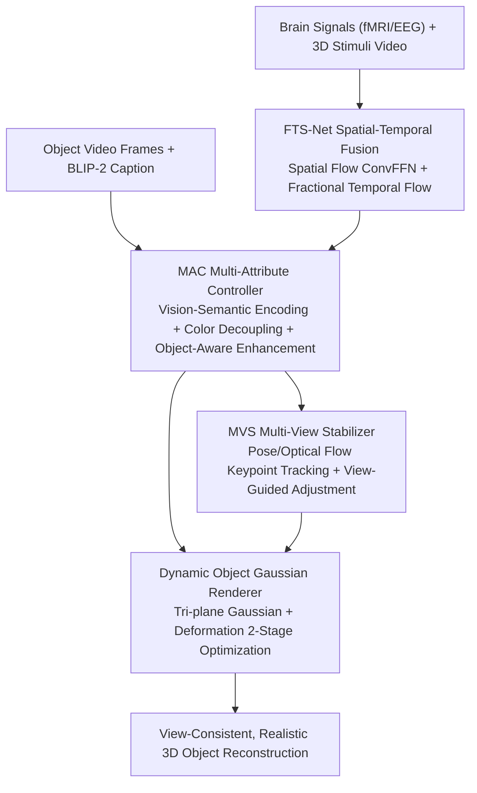

# More Natural, More Real: Object-aware Gaussian Splatting for 3D Visual Decoding from Human Brain

**Conference**: CVPR 2026  
**Paper**: [CVF Open Access](https://openaccess.thecvf.com/content/CVPR2026/html/Jing_More_Natural_More_Real_Object-aware_Gaussian_Splatting_for_3D_Visual_CVPR_2026_paper.html)  
**Code**: To be confirmed  
**Area**: 3D Vision  
**Keywords**: Brain signal decoding, 3D Gaussian Splatting (3DGS), fMRI/EEG, Multi-view consistency, Neural decoding

## TL;DR
BrainGS is the first brain signal-to-3D object reconstruction framework based on 3D Gaussian Splatting (3DGS). It encodes fMRI/EEG signals using a spatial-temporal fusion network, decouples and aligns brain signals with vision-semantic-color anchor points via a multi-attribute controller, and tracks/corrects object viewpoint changes through a multi-view stabilizer. It achieves SOTA reconstruction fidelity on fMRI/EEG-3D datasets (fMRI 2.936 FPD / 0.202 LPIPS).

## Background & Motivation

**Background**: Brain signal decoding (extracting mental representations from fMRI/EEG) has achieved high-fidelity results in 2D image and video reconstruction (e.g., MinD-Vis, MindEye, Mind-Video). Recently, driven by the concept of "world models," decoding has advanced to 3D spatial dimensions. Projects like the Mind-3D series established fMRI-3D paired datasets, and Neuro-3D provided EEG-3D data, initiating attempts to reconstruct 3D objects from the brain.

**Limitations of Prior Work**: Existing Brain-3D methods suffer from two specific drawbacks. First, **Brain-3D alignment lacks multi-dimensional synchronization**: prevailing methods utilize simple self-attention embeddings for brain signals and align them with basic CLIP features, failing to extract cross-modal spatial-temporal representations (addressing low fMRI temporal resolution and low EEG SNR) or account for feature differences across scales, leading to a lack of multi-granular neuro-visual information. Second, **multi-view inconsistency**: human perception of stereoscopic depth derives from binocular and motion parallax, whereas current methods use simple spatial embeddings for view changes. These sparse and inaccurate representations cause inconsistent poses and artifacts in reconstructions.

**Key Challenge**: While 3DGS is efficient for view synthesis, it fails when directly processing "noisy and sparse" brain signals. The inherent ambiguity in mapping brain signals to objects makes it difficult to achieve reconstructions that are both accurate and consistent.

**Goal**: To develop a 3DGS framework capable of extracting multi-scale spatial-temporal features across fMRI/EEG, aligning brain signals with vision/semantics/color at a fine-grained level, and stably modeling multi-view changes to reconstruct "more natural and real" 3D objects.

**Key Insight**: Explicitly model brain signals by mapping them to 3D Gaussian primitives, rather than following ambiguous indirect routes like "2D to 3D" or pre-trained 3D decoders. Bind brain signals and object attributes at the feature level using contrastive learning.

**Core Idea**: Utilize a suite of four components—Fusion Time-Spatial Network (FTS-Net), Multi-Attribute Controller (MAC), Multi-View Stabilizer (MVS), and Dynamic Gaussian Rendering—to transform brain activity into a controllable, view-consistent Gaussian field.

## Method

### Overall Architecture
Given brain signals $(X_i)$ and 3D visual stimuli (objects $V_{o,q}$ presented as videos), BrainGS first employs **FTS-Net** to encode heterogeneous brain signals into unified multi-scale spatial-temporal features $F_b$. Then, **MAC** decomposes object features into vision-semantic and color anchors to align with brain features via contrastive learning, utilizing object-aware enhancement to focus on relevant features for Gaussian field initialization. Subsequently, **MVS** tracks object pose and keypoint changes using a dual-path 3D model/optical flow approach and applies view-guided adjustments to obtain stable view features $Z_{view}$. Finally, the **Dynamic Object Gaussian Renderer** utilizes a tri-plane representation and a deformation module to render view-consistent 3D objects through two-stage optimization.

### Key Designs

**1. FTS-Net Spatial-Temporal Fusion: A unified network for heterogeneous fMRI/EEG structures**

To address the lack of cross-modal spatial-temporal representations, FTS-Net models both the spatial topological distribution and temporal evolution of brain signals. It uses patch embedding ($P$ size, $S$ stride) to preserve inter-variable correlations, yielding $E\in\mathbb{R}^{N\times N_P\times D}$ via 1D convolution, followed by depthwise separable convolutions for multi-scale dependencies. The **Spatial Flow** uses a grouped Convolutional Feed-Forward Network (ConvFFN) for spatial features. The **Temporal Flow** uses a generalized Riemann-Liouville fractional transform to capture dynamic responses at time $t$: $\mathcal{R}^{\alpha}(X)_t=\frac{1}{\Gamma(\alpha)}\int_0^t \frac{X(i)}{(t-i)^{1-\alpha}}\,di$, where $\alpha\in\{0.4,0.6,0.8\}$, capturing both rapid neural responses and slow contextual dynamics. The flows are merged via cross-attention into $F_b$.

**2. MAC Multi-Attribute Controller: Decoupling and aligning brain signals via three anchors**

This provides "controllable initialization" for 3DGS through three sub-modules: (a) **Vision-Semantic Encoder**: Extracts BLIP-2 captions and CLIP-ViT features $F_{vs}$, using a synchro-discriminator and binary cross-entropy loss $L_{VS}=-(y\log \text{sim}(F_{vs},F_b)+(1-y)\log(1-\text{sim}(F_{vs},F_b)))$ to train synchronized encoding. (b) **Color Primitive Decoupler**: Maps Gaussian centers $\mu_j$ and spherical harmonics $SH_j$ to color $F_c$ via Color MLP and affine transforms $\eta, \delta$, using $L_C=\text{InfoNCE}(F_c,F_b)$. (c) **Object-Aware Enhancement**: Uses cross-channel contrastive learning $L_{CL}=-\log\frac{\exp(\text{sim}(F_{vs},F_{c})/\tau)}{\sum_o \exp(\text{sim}(F_{vs},F_{c})/\tau)}$ and self-attention to focus on specific object parts, yielding enhanced features $Z_{vs}=\text{MLP}_{vs}(F_b')\odot\text{SelfAtt}(F_{vs}')$.

**3. MVS Multi-View Stabilizer: Dual-path tracking and view-guided adjustment**

To fix artifacts from sparse view modeling: (a) **View Motion Tracker**: Uses the Trellis 3D base model to extract 2D landmarks and 3D keypoints, optimizing focal length $f_{opt}$ and pose $(R_{opt},T_{opt})$ frame-by-frame. (b) **Viewpoint Tracker**: Employs an optical flow model $F_{flow}=(u,v)$ and Laplacian filtering to select significant keypoints $K'$ for supervision. (c) **View-Guided Adjustment**: Uses alignment loss $L_{align}=\sum_j\|\mathcal{P}_j(F_{view})-K_j'\|_2$ and a view-guided encoder with cosine similarity loss $L_{view}$ to ensure smooth pose transitions in $Z_{view}$.

**4. Dynamic Object Gaussian Renderer: Tri-plane Canonical Gaussian + View Deformation**

Maps MAC/MVS features to explicit Gaussians. A multi-resolution tri-plane representation $Z_{can}=\{Z_{xy},Z_{yz},Z_{zx}\}$ is used to generate canonical Gaussians $\mathcal{G}_{can}=\{\mu_c,r_c,s_c,\alpha_c,SH_c\}$. A deformation module $\mathcal{F}_{deform}$ then predicts offsets based on $Z_{view}$ to generate deformable Gaussians $\mathcal{G}_{deform}$. **Two-stage optimization**: The canonical stage establishes basic structure using L1 + D-SSIM + LPIPS; the deformation stage optimizes the entire network with added cross-modal contrastive loss $L_{CL}$ for texture refinement. Total loss: $L_{render}=L_1+\lambda_1 L_{D\text{-}SSIM}+\lambda_2 L_{LPIPS}+\lambda_3 L_{CL}$.

### Loss & Training
Three-stage training: 1) Pre-train FTS-Net for stable subject representations; 2) Train MAC and MVS on fMRI/EEG data; 3) Fine-tune 3DGS. Optimizer: AdamW (lr 1e-4→2e-5, weight decay 0.01), global batch 256, 300 epochs. Inference reaches ~155 FPS on A800.

## Key Experimental Results

> Metrics: **2-way/10-way↑** (semantic classification); **FPD↓** (Fréchet Point Cloud Distance), **CD↓** (Chamfer Distance), **EMD↓** (Earth Mover's Distance) for structure; **LPIPS↓**, **PSNR↑/SSIM↑** for texture.

### Main Results
Averaged across subjects on fMRI-Shape and EEG-3D (relative gains in parentheses):

| Dataset | Method | 2-way↑ | FPD↓ | CD↓ | LPIPS↓ | SSIM↑ |
|--------|------|--------|------|-----|--------|-------|
| fMRI-Shape | MinD-3D++ | 0.887 | 3.025 | 1.635 | 0.234 | 0.763 |
| fMRI-Shape | **Ours** | **0.908** (+2.4%) | **2.936** (-2.9%) | **1.517** (-7.2%) | **0.202** (-13.7%) | **0.815** (+6.8%) |
| EEG-3D | Neuro-3D | 0.558 | 4.215 | 2.956 | 0.607 | 0.681 |
| EEG-3D | **Ours** | **0.795** (+42.4%) | **3.774** (-10.5%) | **2.318** (-21.6%) | **0.455** (-25.0%) | **0.769** (+12.9%) |

EEG-3D Classification (72 object classes / 6 colors):

| Method | Obj top-1 | Obj top-5 | Color top-1 | Color top-2 |
|------|-----------|-----------|-----------|-----------|
| Neuro-3D | 5.91 | 16.30 | 39.93 | 61.40 |
| **Ours** | **6.48** (+9.6%) | **18.75** (+15.0%) | **42.20** (+5.6%) | **64.92** (+5.7%) |

Under OOD settings (AP / APAC Set), BrainGS maintains performance near in-domain levels (AP 3.115 FPD), demonstrating generalizable neural representations.

### Ablation Study
On fMRI-Shape:

| Configuration | 2-way↑ | FPD↓ | CD↓ | SSIM↑ | Note |
|------|--------|------|-----|-------|------|
| w/o MAC | 0.621 | 4.775 | 2.780 | 0.633 | Decoupling is insufficient |
| w/o MVS | 0.774 | 3.795 | 2.156 | 0.648 | Structure/consistency worsens |
| w/o Enhancement | 0.868 | 3.015 | 1.669 | 0.774 | Feature mismatch |
| w/o Adjustment | 0.892 | 3.171 | 1.712 | 0.675 | Lacks view supervision |
| **Ours (Full)** | **0.908** | **2.936** | **1.517** | **0.815** | Complete model |

### Key Findings
- **MAC has the highest impact**: Without MAC, CD increases from 1.517 to 2.780, indicating multi-attribute alignment is crucial for "pinning" brain signals to Gaussian attributes.
- **MVS handles structural consistency**: Significant degradation in FPD/CD/EMD without MVS validates its role in artifact removal.
- **Brain regions align with neuroscientific priors**: Temporal lobe for classification, parietal lobe for structure, and occipital lobe (V1) for texture. ROI importance maps show visual-semantic contributions from V1/V4/IT/MT and motion from MST/TPOJ, providing biological interpretability.

## Highlights & Insights
- **First 3DGS framework for 3D brain decoding**: Directly modeling with explicit primitives avoids ambiguities of 2D-to-3D routes and achieves 155 FPS inference.
- **Unified fMRI and EEG encoding**: The dual-stream spatial-temporal design of FTS-Net handles disparate SNR and resolutions, yielding a ~42% Gain in 2-way accuracy for EEG.
- **Three-anchor decoupling (Vision-Semantic/Color/View)**: Provides a clever bridge from high-dimensional brain signals to controllable Gaussian attributes.
- **Biological interpretability**: Mapping features back to the cortex aligns reconstruction quality with neural functional partitions.

## Limitations & Future Work
- **OOD performance drop**: Significant performance gaps persist in cross-subject settings, hindering "calibration-free" application.
- **Heavy reliance on external models**: Dependency on BLIP-2, CLIP, Trellis, and optical flow models introduces a long pipeline where errors can propagate.
- **Restricted data scale**: Evaluation is limited to synthetic/rendered stimuli (ShapeNet/Objaverse); performance on natural complex objects is unverified.
- **Viewpoint dependency**: MVS relies on multi-view stimulus videos, which are difficult to collect in realistic neuroscience settings.

## Related Work & Insights
- **vs MinD-3D++**: Both use fMRI-Shape, but BrainGS outperforms MinD-3D++'s diffusion-based approach in FPD (2.936 vs 3.025) and SSIM (0.815 vs 0.763) via explicit modeling.
- **vs Neuro-3D**: Prev. SOTA on EEG-3D; BrainGS shows massive gains (2-way ↑42.4%) thanks to FTS-Net's spatial-temporal modeling of low-SNR EEG.
- **vs 2D→3D (Mind2Matter)**: BrainGS avoids the "lifting" ambiguity by directly mapping brain signals to Gaussian fields, yielding better view consistency.

## Rating
- Novelty: ⭐⭐⭐⭐⭐ First 3DGS-based brain-3D framework with unified FTS-Net and anchor decoupling.
- Experimental Thoroughness: ⭐⭐⭐⭐⭐ Covers fMRI/EEG, reconstruction/classification, OOD, and ROI analysis.
- Writing Quality: ⭐⭐⭐⭐ Clear framework and strong interpretability; some minor LaTeX residue in sub-module descriptions.
- Value: ⭐⭐⭐⭐ Sets new SOTA and interpretable paradigm for Brain-3D tasks.

<!-- RELATED:START -->

## Related Papers

- [\[CVPR 2026\] MoRE: 3D Visual Geometry Reconstruction Meets Mixture-of-Experts](more_3d_visual_geometry_reconstruction_meets_mixture-of-experts.md)
- [\[CVPR 2026\] MoRe: Motion-aware Feed-forward 4D Reconstruction Transformer](more_motion-aware_feed-forward_4d_reconstruction_transformer.md)
- [\[CVPR 2026\] Meta-learning In-Context Enables Training-Free Cross Subject Brain Decoding](meta-learning_in-context_enables_training-free_cross_subject_brain_decoding.md)
- [\[CVPR 2026\] 3D-VCD: Hallucination Mitigation in 3D-LLM Embodied Agents through Visual Contrastive Decoding](3d-vcd_hallucination_mitigation_in_3d-llm_embodied_agents_through_visual_contras.md)
- [\[CVPR 2026\] LangRef3DGS: Natural Language-Guided 3D Referential Segmentation from Partial Observations via 3D Gaussian Splatting](langref3dgs_natural_language-guided_3d_referential_segmentation_from_partial_obs.md)

<!-- RELATED:END -->
