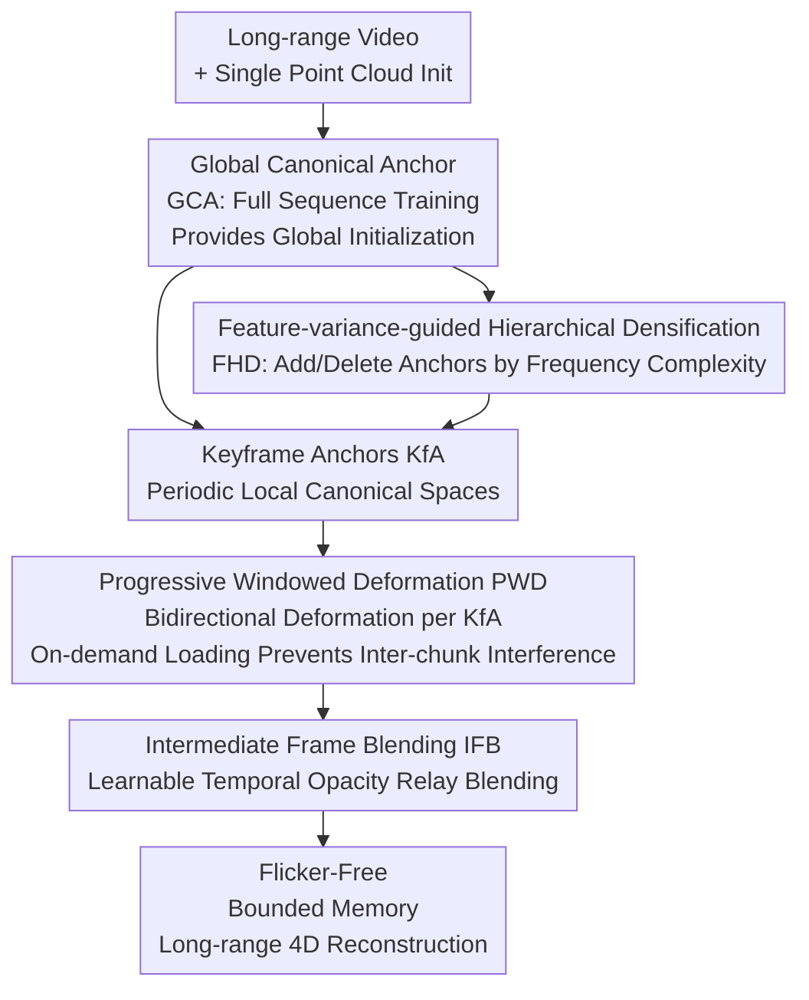

# MoRel: Long-Range Flicker-Free 4D Motion Modeling via Anchor Relay-based Bidirectional Blending with Hierarchical Densification

**Conference**: CVPR 2026  
**Paper**: [CVF Open Access](https://openaccess.thecvf.com/content/CVPR2026/html/Kwak_MoRel_Long-Range_Flicker-Free_4D_Motion_Modeling_via_Anchor_Relay-based_Bidirectioanl_CVPR_2026_paper.html)  
**Code**: https://cmlab-korea.github.io/MoRel/ (Project Page)  
**Area**: 3D Vision  
**Keywords**: 4D Gaussian Splatting, Dynamic Scene Reconstruction, Long-Range Modeling, Temporal Consistency, Anchor Representation

## TL;DR
MoRel utilizes "Keyframe Anchors + Bidirectional Deformation + Learnable Temporal Opacity Blending" to decompose long-sequence dynamic scenes of thousands of frames into segments of anchor relays. Under bounded memory constraints, it eliminates flickering at segment boundaries caused by chunk-based training, achieving the best temporal consistency among all comparison methods with a tOF reduction to 0.203.

## Background & Motivation
**Background**: 3D Gaussian Splatting (3DGS), with its explicit Gaussian primitives and GPU-parallel splatting, achieves real-time high-fidelity novel view synthesis. It has naturally been extended to the temporal dimension as 4D Gaussian Splatting (4DGS) for reconstructing dynamic video scenes.

**Limitations of Prior Work**: When videos extend to "long-sequence 4D motion" spanning several minutes or thousands of frames, existing 4DGS methods fail. The paper categorizes existing approaches: (i) **All-at-once training**—optimizes all frames jointly in a canonical representation; while globally consistent, modeling long sequences requires high-dimensional Gaussians that grow continuously, leading to memory explosion and limited representation for disoccluded regions, plus it lacks support for streaming random access; (ii) **Chunk-based training**—divides long videos into short segments and trains models independently; this saves memory and supports random access, but independent optimization causes temporal discontinuities at junctions, leading to boundary artifacts and sudden appearance changes (flickering), and subsequent disoccluded areas cannot be recovered as segments only see local windows; (iii) Sliding windows and (iv) Temporal Gaussian hierarchies—either rely on external optical flow increasing system complexity and only providing local fixes, or require continuous Gaussian reallocation and CPU-GPU streaming, making the system extremely bloated.

**Key Challenge**: Long-sequence 4D modeling inherently faces a trilemma between "Bounded Memory ↔ Temporal Consistency ↔ Representation Fidelity." All-at-once training sacrifices memory for consistency, while chunk-based training sacrifices consistency for memory; no existing method achieves all three.

**Goal**: To achieve temporally coherent, flicker-free long-sequence dynamic scene reconstruction with high-frequency details under bounded memory conditions, while supporting random temporal access required for practical systems.

**Key Insight**: The authors observe that the root cause of flickering in chunk-based methods is the lack of explicit cross-chunk consistency modeling—boundary frames are predicted independently by adjacent segments with no smooth transition. Therefore, can adjacent keyframe anchors be made to **deform towards each other**, with their influence being smoothly relayed in the intermediate frames?

**Core Idea**: Periodic **Keyframe Anchors (KfA)** are employed as "local canonical spaces." Each anchor learns **bidirectional deformations** to cover its preceding and succeeding time windows. Adjacent anchors are adaptively mixed in intermediate frames via a **learnable temporal opacity**, smoothly handing over representation authority from one anchor to the next, like a relay baton, ensuring both bounded memory and temporal continuity.

## Method

### Overall Architecture
MoRel is built upon the anchor-point representation (Scaffold-GS), where anchors on a sparse voxel grid define the canonical space, and each anchor derives several neural Gaussians. The framework, termed **Anchor Relay-based Bidirectional Blending (ARBB)**, consists of two phases and four sequential training stages. The core idea is to establish the spatial representation first, then learn temporal deformation and relay blending.

The first phase is **Anchor Relay**: A **Global Canonical Anchor (GCA)** is trained using the entire video to provide globally consistent initialization and assign hierarchical labels to each anchor based on feature variance. Then, a series of **Keyframe Anchors (KfA)** are placed at periodic keyframe intervals. Each KfA is initialized from the leveled GCA and refined only within its local time window, becoming the local canonical space for that segment, with details supplemented via FHD densification. The second phase is **Bidirectional Blending**: Each KfA independently learns forward and backward deformations (PWD stage) within its Bidirectional Deformation Window (BDW). Adjacent KfAs are then fused in intermediate frames via learnable temporal opacity (IFB stage). Both training and rendering utilize "on-demand loading/unloading of KfAs," ensuring that only one or two anchors and their deformation fields reside in memory at any time.

### Key Designs

**1. Anchor Relay-based Bidirectional Blending (ARBB): Eliminating Chunk-based Flickering via Anchor Relays and Bidirectional Deformation**

This is the primary backbone of the paper, directly addressing boundary flickering. MoRel places a keyframe anchor $A^{Key}_n$ at every GOP (Group-of-Pictures) interval. Instead of managing only its own frame, each anchor is responsible for a time window $[\max(0, t_n-\text{GOP}),\ \min(t_n+\text{GOP}, T-1)]$, with a temporal tolerance $\epsilon$ allowing it to learn changes in the local neighborhood $[t_n-\epsilon, t_n+\epsilon]$. Crucially, each KfA learns **bidirectional deformations**: the deformation field $D_n(\cdot, \tau_n)$ uses normalized relative time $\tau_n \in [-1, 1]$ (corresponding to $t \in [t_n-\text{GOP}, t_n+\text{GOP}]$) to perform both forward ($+$) and backward ($-$) deformations.

Why is bidirectionality key? In chunk-based methods, boundary frames are only handled by one side, causing discontinuities. MoRel allows adjacent KfAs to deform into the intermediate region—the previous anchor reaches forward, and the subsequent anchor reaches backward. The intermediate frame is covered by both and then blended, creating a "bidirectional bridge" that transforms hard junctions into soft transitions. This is the root of achieving the lowest tOF (0.203).

**2. Progressive Windowed Deformation (PWD): Eliminating Inter-chunk Contamination and Locking Memory via On-demand Loading**

Training bidirectional deformations directly on long sequences faces two issues: all-at-once training causes memory explosion, while naive chunk-based training leads to **backward contamination**. When $A^{Key}_n$ is refined for $\text{chunk}_n$ after being trained for $\text{chunk}_{n-1}$, its previously optimized properties are destroyed (e.g., new anchors might grow that weren't trained for backward deformation).

PWD solves this by defining a **Bidirectional Deformation Window (BDW)** for each KfA. During training, the KfA is optimized independently within its BDW. $A^{Key}_n$ is dynamically loaded only when $\text{BDW}_n$ is being optimized and unloaded otherwise (on-demand loading). After $J^{PWD}_n$ iterations, the window **progressively slides** to the next BDW with one chunk of overlap. This ensures each anchor's bidirectional deformation is learned in isolation without being corrupted by subsequent blocks, locking training memory at 4.5–6.5 GB (compared to ~12–18 GB for all-at-once).

**3. Intermediate Frame Blending (IFB): Smooth Relay via Learnable Temporal Opacity**

Even with deformation fields established by PWD, adjacent KfAs might yield inconsistent results in intermediate frames. Prior works used fixed opacity decay, but in dynamic scenes with occlusions, the influence of a KfA changes non-uniformly.

IFB introduces **learnable temporal opacity control**: each anchor $a^n_k$ is assigned its own temporal offset $o^{dir}_{n,k}$ and temporal decay rate $d^{dir}_{n,k}$ ($dir \in \{Fw, Bw\}$). The temporal opacity for the $n$-th KfA is:

$$w^{dir}_{n,k} = \exp\left[-\lambda_{decay}\cdot d^{dir}_{n,k}\cdot |\tau_n - o^{dir}_{n,k}|\right]$$

where $\lambda_{decay}$ is a global base coefficient. The IFB stage loads adjacent $A^{Key}_n$ and $A^{Key}_{n+1}$ simultaneously and **only trains the blending weights**, freezing anchor attributes and deformation fields. Learnable offsets and decay rates allow the hand-over of "representation authority" to adapt to irregular motions.

**4. Feature-variance-guided Hierarchical Densification (FHD): Controlling Anchor Growth via Variance as a Frequency Proxy**

Indiscriminate densification in long sequences leads to uncontrolled anchor counts and memory pressure. FHD recognizes that the variance of anchor features $\hat{f}_k$ serves as a proxy for **local frequency complexity**. High-frequency regions are sensitive to features early in training, causing large gradient fluctuations that increase $\text{Var}(\hat{f}_k)$.

FHD consists of two steps. **Variance-based Leveling (VL)**: After GCA training, anchors are categorized into levels based on variance thresholds $\{\tau_1, \tau_2\}$:

$$L_{a^{Global}_k} = \begin{cases} 0, & \sigma^2_k < \tau_1 \quad (\text{Low Freq})\\ 1, & \tau_1 \le \sigma^2_k < \tau_2\\ 2, & \sigma^2_k \ge \tau_2 \quad (\text{High Freq}) \end{cases}$$

**Level-wise Densification (LD)**: During KfA and PWD densification, a level weight $w^{j}_L$ is applied to the accumulated gradient $g^{j}_n$, where the weight is linearly interpolated with training progress $\eta_t$:

$$w^{j}_L = \begin{cases} 1, & L = 0\\ \lambda_L + (1-\lambda_L)\eta_t, & L \ge 1 \end{cases}$$

This prioritizes low-frequency structures early on to stabilize the foundation, avoiding redundant anchors in unstable high-frequency areas, and refines high-frequency details later. This reduces rendering memory from ~144 MB to 126 MB without significant quality loss.

### Loss & Training
Four stages are executed sequentially: GCA → KfA → PWD → IFB (with iterations $J^{GCA}, J^{KfA}, J^{PWD}, J^{IFB}$). GCA is initialized from a **single point cloud** (significantly lower overhead than per-frame point clouds) and trained on all frames. KfA initializes from the leveled GCA and trains on views within its temporal window with FHD densification. PWD learns bidirectional deformations. IFB freezes all but the blending weights.

## Key Experimental Results

### Main Results
The dataset used is **SelfCapLR**, newly constructed by the authors, featuring 5 challenging sequences (Bike1, Bike2, Corgi, Yoga, Dance) exceeding 3500 frames with large motions.

Average Quality Metrics (PSNR↑ / SSIM↑ / LPIPS↓):

| Group | Method | PSNR | SSIM | LPIPS |
|-------|--------|------|------|-------|
| All-at-once | 4DGS [CVPR'24] | 18.95 | 0.648 | 0.402 |
| All-at-once | MoDec-GS [CVPR'25] | 19.61 | 0.643 | 0.391 |
| All-at-once | LocalDyGS [ICCV'25] | 20.64 | 0.652 | 0.371 |
| Chunk-based | GIFStream [CVPR'25] | 19.02 | 0.653 | 0.405 |
| Chunk-based | 4DGS_chunk | 19.31 | 0.656 | 0.389 |
| Ours | **MoRel (Ours)** | **21.00** | **0.664** | **0.355** |

Temporal Consistency and Memory:

| Group | Method | tOF↓ | Train Mem (MB)↓ | Render Mem (MB)↓ |
|-------|--------|------|-----------------|------------------|
| All-at-once | 4DGS | 0.222 | ~18,000 | 143 |
| All-at-once | MoDec-GS | 0.249 | ~22,000 | 154 |
| All-at-once | LocalDyGS | 0.215 | ~12,000 | 122 |
| Chunk-based | GIFStream | 0.539 | ~9,000 | 93 |
| Chunk-based | 4DGS_chunk | 0.680 | ~4,500 | 65 |
| Ours | **MoRel** | **0.203** | ~6,000 | 126 |

MoRel ranks first in all quality metrics and achieves the lowest tOF (0.203). While chunk-based methods (4DGS_chunk) have a high tOF of 0.680 indicating severe flickering, MoRel maintains bounded training memory (~6 GB).

### Ablation Study
Evaluated on a 300-frame subset of SelfCapLR:

| Variant | Configuration | PSNR↑ | SSIM↑ | LPIPS↓ | Train Mem↓ | Render Mem↓ |
|---------|---------------|-------|-------|--------|------------|-------------|
| (a) | 2-stage, GCA only + Unidirectional | 19.71 | 0.654 | 0.386 | ~12,000 | 156 |
| (b) | 3-stage, (a) + KfA | 19.90 | 0.647 | 0.364 | ~4,500 | 94 |
| (c) | 3-stage, (b) + PWD + Linear Blending | 20.66 | 0.656 | 0.358 | ~6,500 | 138 |
| (d) | 4-stage, (b) + PWD + IFB | 21.07 | 0.672 | 0.342 | ~6,500 | 144 |
| (e) | 4-stage, (d) + FHD (Full Model) | 21.20 | 0.672 | 0.348 | ~6,000 | 126 |

### Key Findings
- **KfA is critical for memory**: Introducing KfA and on-demand loading ((a) to (b)) slashes training memory from 12k MB to 4.5k MB.
- **Bidirectional + Blending provides the main quality boost**: Upgrading from (b) to (d) with PWD and IFB improves PSNR significantly, proving that learnable opacity is superior to linear blending for irregular motions.
- **FHD balances quality and memory**: Adding FHD ((d) to (e)) preserves quality (PSNR 21.07→21.20) while reducing rendering memory from 144 MB to 126 MB by avoiding redundant anchor expansion.

## Highlights & Insights
- **"Anchor Relay" is a powerful metaphor**: Replacing hard "chunk stitches" with soft "bidirectional bridges" allows the method to inherit the benefits of chunking while restoring global consistency.
- **Feature variance as a frequency proxy** is clever: It detects high-frequency regions without explicit spectral analysis, allowing a controlled densification schedule that stabilizes low-frequency structures before refining details.
- **On-demand loading throughout**: Memory efficiency isn't achieved through compression but through system design (only loading 1-2 KfAs), naturally supporting streaming and random access.

## Limitations & Future Work
- **GOP is a critical hyperparameter**: The interval between KfAs determines the balance between memory, quality, and flicker, yet the paper lacks a detailed sensitivity analysis of GOP in the main text.
- **Limited Dataset Scale**: SelfCapLR contains only 5 sequences. While they focus on long-range motion, broader scene diversity is not fully explored in the main paper.
- **Modest PSNR gains**: While tOF improvement is significant, the PSNR gain over LocalDyGS is relatively small, suggesting the primary value lies in consistency rather than raw static image quality.

## Related Work & Insights
- **vs. All-at-once Training**: These methods guarantee global consistency but suffer from memory explosion in long sequences. MoRel achieves higher quality and 0.203 tOF with only ~6 GB memory.
- **vs. Chunk-based Training**: These suffer from boundary flickering. MoRel explicitly models cross-chunk consistency to solve this.
- **Built on Scaffold-GS**: It leverages the anchor-based architecture and extends its densification logic into a temporal hierarchical strategy (FHD).

## Rating
- Novelty: ⭐⭐⭐⭐ The combination of anchor relays, bidirectional blending, and learnable temporal opacity is a cohesive solution to long-range flickering.
- Experimental Thoroughness: ⭐⭐⭐⭐ Component analysis is clear; however, dataset size and GOP analysis could be more comprehensive.
- Writing Quality: ⭐⭐⭐⭐ Logic flow from motivation to method is clear, and figures effectively illustrate the trade-offs.
- Value: ⭐⭐⭐⭐ Provides a practical, scalable solution for long-range 4DGS with bounded memory and high temporal consistency.

<!-- RELATED:START -->

## Related Papers

- [\[CVPR 2026\] Can Natural Image Autoencoders Compactly Tokenize fMRI Volumes for Long-Range Dynamics Modeling?](can_natural_image_autoencoders_compactly_tokenize_fmri_volumes_for_long-range_dy.md)
- [\[CVPR 2026\] Tracking-Guided 4D Generation: Foundation-Tracker Motion Priors for 3D Model Animation](tracking-guided_4d_generation_foundation-tracker_motion_priors_for_3d_model_anim.md)
- [\[CVPR 2026\] 4C4D: 4 Camera 4D Gaussian Splatting](4c4d_4_camera_4d_gaussian_splatting.md)
- [\[CVPR 2026\] Mark4D: Temporally-Consistent Watermarking for 4D Gaussian Splatting](mark4d_temporally-consistent_watermarking_for_4d_gaussian_splatting.md)
- [\[CVPR 2026\] PackUV: Packed Gaussian UV Maps for 4D Volumetric Video](packuv_packed_gaussian_uv_maps_for_4d_volumetric_video.md)

<!-- RELATED:END -->
