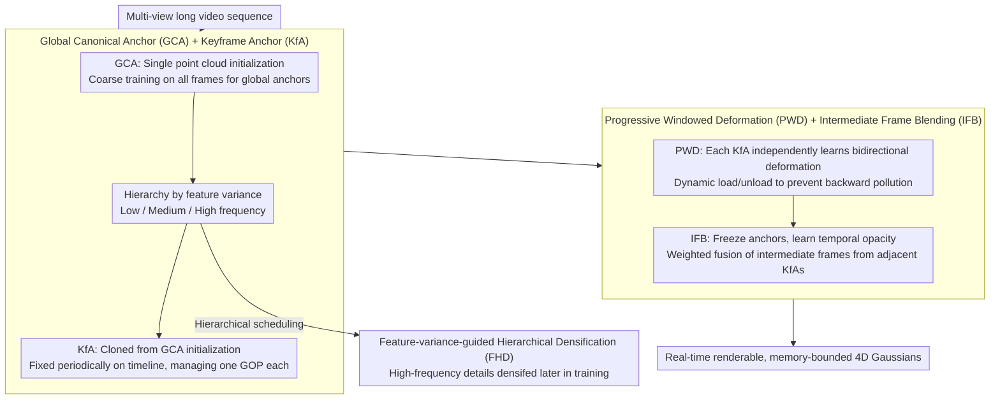

# MoRel: Long-Range Flicker-Free 4D Motion Modeling via Anchor Relay-based Bidirectional Blending with Hierarchical Densification

**Conference**: CVPR 2026  
**arXiv**: [2512.09270](https://arxiv.org/abs/2512.09270)  
**Code**: [https://cmlab-korea.github.io/MoRel/](https://cmlab-korea.github.io/MoRel/)  
**Area**: 3D Vision  
**Keywords**: 4D Gaussian Splatting, Dynamic Scene Reconstruction, Long Video Modeling, Temporal Consistency, Memory Efficient

## TL;DR
To address the challenges of memory explosion, temporal flickering, and occlusion handling in 4D Gaussian Splatting for long-video dynamic scene modeling, the MoRel framework is proposed. Based on Anchor Relay-based Bidirectional Blending (ARBB), it achieves flicker-free, memory-bounded long-range 4D motion reconstruction through the progressive construction of keyframe anchors and learnable temporal opacity control.

## Background & Motivation

1. **Background**: 3D Gaussian Splatting (3DGS) has become the mainstream paradigm for novel view synthesis and has been naturally extended to 4D dynamic scenes. Existing 4DGS methods are mainly categorized into "global one-time training" and "chunk-based training."

2. **Limitations of Prior Work**:
    - **Global one-time training** (e.g., 4DGS, MoDec-GS): Optimizing all frames together ensures global temporal consistency but leads to GPU memory explosion for long videos, as the number of high-dimensional Gaussians grows continuously over time.
    - **Chunk-based training** (e.g., GIFStream): Dividing long videos into short segments for independent training reduces memory overhead but produces temporal discontinuities and sudden appearance changes at segment boundaries—known as "flickering" artifacts.
    - Sliding window strategies provide local fixes but fail to guarantee global consistency; temporal Gaussian hierarchical structures maintain near-constant memory but involve high system complexity.

3. **Key Challenge**: The fundamental contradiction between "global temporal consistency" and "bounded memory usage" in long-video modeling—requiring smooth transitions across thousands of frames without linear memory growth.

4. **Goal**: (a) Bounded-memory long-range 4D modeling; (b) Flicker-free temporal consistency; (c) Efficient random temporal access; (d) No reliance on external cues like optical flow.

5. **Key Insight**: Drawing inspiration from the "Keyframe + GOP" concept in video coding, keyframe anchors (KfA) are periodically placed along the timeline. Smooth transitions are achieved through bidirectional deformation and adaptive blending.

6. **Core Idea**: Replacing global or chunk-based strategies with an anchor relay mechanism. Bidirectional deformation is learned between anchors with smooth blending via learnable opacity control, achieving memory-bounded and flicker-free long-range 4D reconstruction.

## Method

### Overall Architecture
MoRel addresses the "global consistency vs. bounded memory" dilemma in long-video 4D reconstruction: global training ensures no flickering but memory explodes with frame count, while chunk-based training saves memory but causes jumps at boundaries. The solution is inspired by video coding—segmenting the timeline into Groups of Pictures (GOPs) and placing a **Keyframe Anchor (KfA)** at the center of each GOP, allowing adjacent anchors to cover the entire video like a relay. The pipeline is an anchor-based 3DGS representation (anchors on sparse voxel grids define the canonical space). Training proceeds in two phases and four steps: first is the **Anchor Relay Phase**, where Global Canonical Anchors (GCA) browse the entire video for initialization, followed by cloning several KfAs to manage specific periods. Second is the **Bidirectional Blending Phase**, where Progressive Windowed Deformation (PWD) learns bidirectional deformation fields for each KfA, and Intermediate Frame Blending (IFB) learns smooth transitions between adjacent anchors. Throughout training, Feature-variance-guided Hierarchical Densification (FHD) categorizes anchors into low/medium/high frequencies based on feature variance to control the densification rhythm—delaying high-frequency detail growth—to further suppress peak memory. The input is a multi-view long video sequence; the output is real-time renderable, memory-bounded 4D Gaussians.

### Key Designs

**1. GCA + KfA: Replacing "Global Mixing" or "Independent Chunking" with "Base + Relay"**

Directly stacking anchors for every frame causes memory explosion, while starting chunk training from scratch leads to boundary jumps. MoRel first initializes GCA with a **single** point cloud (rather than time-dense points) and performs a coarse training pass over all frames to obtain global anchors $\mathbf{A}^{\text{Global}}$ with consistent appearance. After training, each anchor is assigned a hierarchical level based on feature variance. Subsequently, all KfAs are cloned from GCA (rather than starting from zero) and periodically fixed on the timeline. Each KfA is only responsible for the duration $[t_n - \text{GOP}, t_n + \text{GOP}]$, with a time tolerance $\epsilon$ for window robustness. Thus, GCA locks global appearance consistency, while KfAs capture detailed motion in their local canonical spaces; since KfAs correspond to keyframes in video coding, they provide random temporal access while ensuring only a few anchors are loaded/unloaded as needed, keeping memory bounded.

**2. PWD + IFB: Training Separately and Learning to Smooth Seams**

The root cause of flicker in chunk-based training is "backward pollution"—later chunks modify anchors that previous chunks still depend on. PWD ensures each KfA independently trains forward and backward deformation fields within its own window. By dynamic loading/unloading, anchors from other chunks are untouched during training, blocking pollution at the source; the deformation fields take normalized relative time $\tau_n \in [-1, 1]$ as input. After KfAs are trained, IFB handles intermediate frames: all anchor attributes and deformation fields are frozen, and two temporal parameters—offset $o_{n,k}^{\text{dir}}$ and decay speed $d_{n,k}^{\text{dir}}$—are learned to calculate the temporal opacity for each direction:

$$w_{n,k}^{\text{dir}} = \exp\!\big[-\lambda_{\text{decay}} \cdot d_{n,k}^{\text{dir}} \cdot |\tau_n - o_{n,k}^{\text{dir}}|\big]$$

to weightedly fuse renderings from adjacent KfAs. Compared to linear interpolation, this learnable opacity adapts to irregular motions (e.g., rapidly decaying weights when occlusions occur), effectively suppressing boundary flickering.

**3. FHD: Delaying High-Frequency Details to Save Memory**

Equally densifying all regions from the start causes high-frequency areas—which are unstable early in training—to generate redundant anchors, wasting memory. FHD uses feature variance $\sigma_k^2 = \text{Var}(\hat{f}_k)$ as a proxy for "frequency complexity." After GCA training, anchors are divided into low/medium/high frequency layers. Early in training, low-frequency weight is set to 1, while high-frequency weight is given a lower $\lambda_L$; as training progresses, high-frequency weights are raised via an interpolation factor $\eta_t$. The densification criterion follows hierarchical weighted gradient statistics $g_L^{j_n^S} = g^{j_n^S} \cdot w_L^{j_n^S}$. High-frequency details are thus deferred until the representation is stable, suppressing peak memory while preserving final quality.

### Key Experimental Results

#### Main Results
The SelfCap_LR dataset was constructed (5 scenes, >3500 frames) with larger average motion magnitudes and wider spatial ranges.

| Method | Type | Avg PSNR↑ | Avg SSIM↑ | Avg LPIPS↓ | tOF↓ | Training Memory↓ |
|------|------|-----------|-----------|------------|------|----------|
| 4DGS | Global | 18.95 | 0.648 | 0.402 | 0.222 | ~18,000MB |
| MoDec-GS | Global | 19.61 | 0.643 | 0.391 | 0.249 | ~22,000MB |
| LocalDyGS | Global | 20.64 | 0.652 | 0.371 | 0.215 | ~12,000MB |
| GIFStream | Chunk | 19.02 | 0.653 | 0.405 | 0.539 | ~9,000MB |
| 4DGS_chunk | Chunk | 19.31 | 0.656 | 0.389 | 0.680 | ~4,500MB |
| **MoRel** | **Ours** | **21.00** | **0.664** | **0.355** | **0.203** | **~6,000MB** |

#### Ablation Study

| Configuration | PSNR↑ | SSIM↑ | LPIPS↓ | Training Memory | Rendering Memory |
|------|-------|-------|--------|---------|---------|
| (a) GCA + Unidir. Def. | 19.71 | 0.654 | 0.386 | ~12,000 | 156 |
| (b) + KfA | 19.90 | 0.647 | 0.364 | ~4,500 | 94 |
| (c) + PWD + Linear Blend | 20.66 | 0.656 | 0.358 | ~6,500 | 138 |
| (d) + PWD + IFB | 21.07 | 0.672 | 0.342 | ~6,500 | 144 |
| (e) + FHD (Full MoRel) | 21.20 | 0.672 | 0.348 | ~6,000 | 126 |

#### Key Findings
- Introducing KfA reduced training memory from ~12,000MB to ~4,500MB (62.5%↓) while improving LPIPS.
- IFB improved PSNR by 0.41dB compared to linear blending; learnable opacity is critical for irregular motion.
- FHD reduced rendering memory from 144MB to 126MB while maintaining quality.
- MoRel achieved a state-of-the-art tOF of 0.203, significantly better than chunk-based methods (0.539/0.680).

## Highlights & Insights
- **Elegant Anchor Relay**: Borrowing keyframe concepts from video coding solves memory issues while providing random temporal access, making it practical for streaming systems.
- **PWD Solves "Backward Pollution"**: Addresses the fundamental flaw of chunk-based training where subsequent training destroys previous representations.
- **Transferable FHD Philosophy**: Using feature variance as a proxy for frequency complexity to control densification rhythm is transferable to static 3DGS scene reconstruction.

## Limitations & Future Work
- The 4-stage sequential training process is time-consuming; parallelizing certain stages is worth exploring.
- GOP selection is fixed; adaptive adjustment based on motion complexity could be investigated.
- Evaluation is primarily on self-collected datasets; generalization remains to be verified.
- Handling of extreme motions, such as objects appearing or disappearing instantaneously, is not discussed.

## Related Work & Insights
- **vs 4DGS (Global)**: PSNR is 2.05dB higher and tOF is 8.6% lower without memory explosion.
- **vs GIFStream (Chunk)**: IFB completely resolves boundary flickering, reducing tOF from 0.539 to 0.203.
- **vs TGH (Hierarchical)**: Lower system complexity without requiring CPU-GPU streaming.

## Rating
- Novelty: ⭐⭐⭐⭐ The anchor relay and PWD strategies are novel, though the fundamental concept is inspired by video coding.
- Experimental Thoroughness: ⭐⭐⭐⭐ Thorough ablation studies, though the main dataset is self-collected.
- Writing Quality: ⭐⭐⭐⭐⭐ Clear diagrams and logical flow.
- Value: ⭐⭐⭐⭐ High practical value for long-video 4D reconstruction.

<!-- RELATED:START -->

## Related Papers

- [\[CVPR 2026\] 4D Local Modeling Toward Dynamic Global Perception for Ambiguity-free Rotation-Invariant Point Cloud Analysis](4d_local_modeling_toward_dynamic_global_perception_for_ambiguity-free_rotation-i.md)
- [\[CVPR 2026\] MoVieS: Motion-Aware 4D Dynamic View Synthesis in One Second](movies_motion-aware_4d_dynamic_view_synthesis_in_one_second.md)
- [\[CVPR 2026\] Bidirectional Cross-Modal Prompting for Event-Frame Asymmetric Stereo](bidirectional_cross-modal_prompting_for_event-frame_asymmetric_stereo.md)
- [\[CVPR 2026\] LASER: Layer-wise Scale Alignment for Training-Free Streaming 4D Reconstruction](laser_layer-wise_scale_alignment_for_training-free_streaming_4d_reconstruction.md)
- [\[CVPR 2026\] Long-SCOPE: Fully Sparse Long-Range Cooperative 3D Perception](long_scope_fully_sparse_long_range_cooperative_3d_perception.md)

<!-- RELATED:END -->
