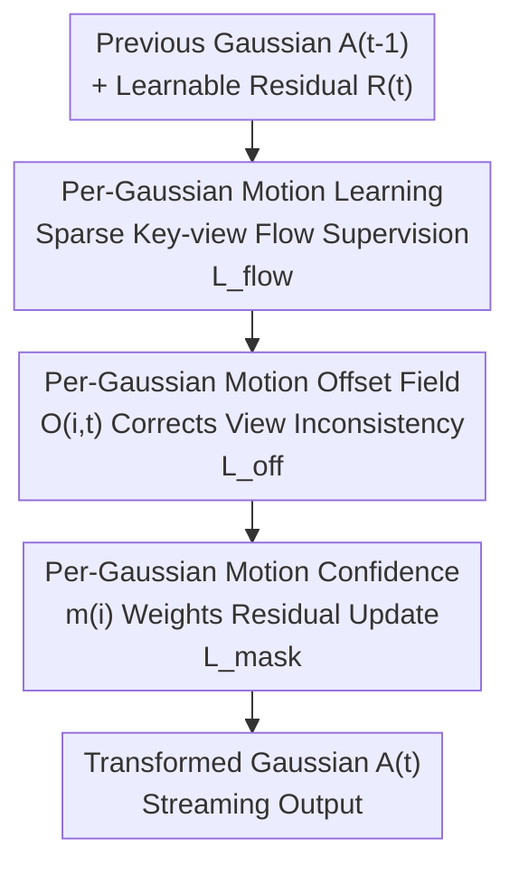

# MoRGS: Efficient Per-Gaussian Motion Reasoning for Streamable Dynamic 3D Scenes

**Conference**: CVPR 2026  
**Paper**: [CVF Open Access](https://openaccess.thecvf.com/content/CVPR2026/html/Lee_MoRGS_Efficient_Per-Gaussian_Motion_Reasoning_for_Streamable_Dynamic_3D_Scenes_CVPR_2026_paper.html)  
**Code**: To be confirmed  
**Area**: 3D Vision / Dynamic Gaussian Splatting  
**Keywords**: Online 4D Reconstruction, Gaussian Splatting, Per-Gaussian Motion, Optical Flow Supervision, Streaming Reconstruction

## TL;DR
In the context of online 3DGS reconstruction for streaming dynamic scenes, MoRGS explicitly supervises "per-Gaussian motion" using sparse key-view optical flow. It overlays a learnable per-Gaussian motion offset field to correct view inconsistencies in sparse flow and utilizes per-Gaussian motion confidence to apply residual updates only to truly moving Gaussians. This approach achieves state-of-the-art (SOTA) rendering quality and motion fidelity for online methods while maintaining low streaming latency.

## Background & Motivation

**Background**: Reconstructing dynamic scenes from multi-view video is central to applications like AR/VR and telepresence. 3DGS has replaced NeRF as the mainstream backbone due to its fast training and real-time rendering. However, most dynamic reconstruction methods are **offline**, requiring full sequences for non-causal optimization, making them unsuitable for live streaming scenarios where frames arrive sequentially without foresight.

**Limitations of Prior Work**: To meet strict latency and computational constraints, online methods (e.g., 3DGStream, QUEEN, HiCoM, 4DGC) generally **avoid explicit motion cues** (such as optical flow) and rely solely on photometric loss to optimize both appearance and motion. This leads to a "mismatch between supervision signals and optimization targets": per-Gaussian motion is optimized to reduce pixel residuals rather than to recover true 3D motion.

**Key Challenge**: Under purely pixel-driven objectives, models tend to explain local appearance changes by "slightly shifting adjacent Gaussians that should remain static" instead of correctly moving those that are truly dynamic. Consequently, the motion of Gaussians with large inter-frame displacements is underestimated, while static Gaussians acquire redundant motion, degrading temporal consistency.

**Goal**: To enable per-Gaussian motion to truly follow the 3D dynamics of the scene—by concentrating updates on genuinely dynamic Gaussians—without compromising streaming efficiency.

**Key Insight**: Optical flow is a cost-effective and powerful 2D motion prior. The key is "how to make it affordable"—calculating dense optical flow for all views is computationally prohibitive for online efficiency. The authors only compute optical flow on **sparse key views** as lightweight motion cues.

**Core Idea**: MoRGS proposes a unified, motion-aware online reconstruction framework that uses sparse key-view optical flow for explicit supervision (supervise), a learnable offset field to refine view inconsistencies (refine), and motion confidence to weight residual updates (weight).

## Method

### Overall Architecture
MoRGS is built upon online Gaussian attribute modeling, where the attributes at time $t$ are derived from the previous frame plus a learnable residual: $\mathcal{A}_t = \mathcal{A}_{t-1} + \mathcal{R}_t$. Within this causal recursive framework, MoRGS maintains the "frame-by-frame residual addition" structure but injects three motion reasoning components: supervising per-Gaussian motion with sparse key-view flow, correcting geometric inconsistencies with a per-Gaussian **motion offset field**, and weighting residual updates with per-Gaussian **motion confidence** to focus updates on truly dynamic regions.

### Key Designs

**1. Per-Gaussian Motion Learning: Anchoring Gaussian Motion to Real 2D Dynamics via Sparse Key-View Flow**

To address the issue where photometric loss forces motion to track pixel residuals rather than real movement, the authors introduce optical flow as explicit supervision. To maintain online efficiency, optical flow is not calculated for all views but only for a small subset of **key views** $\hat{v}$ using a pre-trained network (SEA-RAFT) on adjacent frames: $F^{\text{flow}}_{\hat{v}}(x) = F^{\text{flow}}(I_{\hat{v},t}, I_{\hat{v},t-1})$.

Matching image-space flow with Gaussian motion requires a "pixel ↔ Gaussian" correspondence. The 3D displacement of each Gaussian is defined as $\Delta\mu_{i,t} = \mu_{i,t} - \mu_{i,t-1}$. This is projected onto the image plane using camera projection linearization $\pi_{\hat{v}}$ and rendered via transmittance-normalized $\alpha$-blending to create a per-pixel Gaussian motion map: $F^{G}_{\hat{v}}(x) = \sum_i w_i(x)\,\pi_{\hat{v}}(\Delta\mu_{i,t})$, where $w_i(x)$ is the normalized weight. An End-Point Error (EPE) loss aligns the rendered motion map with the observed flow: $L_{\text{flow}} = \sum_{\hat{v}}\lVert F^{\text{flow}}_{\hat{v}}(x) - F^{G}_{\hat{v}}(x)\rVert_2$. This differentiable process ensures Gaussian displacement follows 2D observations rather than just minimizing photometric error.

**2. Per-Gaussian Motion Offset Field: Compensating for Geometric Inconsistency in Sparse Supervision**

While sparse key-view flow provides strong directionality, it is **view-constrained**: optical flow in a 3D region may conflict across different views, and rendered motion maps blur attribution by blending multiple Gaussians. To mitigate this, the authors attach a learnable motion offset $O_{i,t}\in\mathbb{R}^3$ to each Gaussian, rewriting the motion as $\Delta\hat{\mu}_{i,t} = \underbrace{\Delta\mu_{i,t}}_{\text{Flow-guided}} + \underbrace{O_{i,t}}_{\text{Learnable Offset}}$.

This division of labor is strategic: the flow-guided base motion $\Delta\mu_{i,t}$ encodes displacements from sparse key views, while the offset $O_{i,t}$ is optimized by aggregating gradients from **all views that observe the Gaussian**, thereby fusing multi-view evidence. When cues are consistent across views, the offset remains small; when they conflict with underlying 3D geometry, the offset compensates, ensuring displacement follows true motion without overfitting to sparse flow. To prevent offsets from dominating, an $L_{\text{off}} = \lVert O_{i,t}\rVert_1$ constraint is applied. Ablation shows that using offsets with only 4 supervision views **outperforms** 8 supervision views without offsets.

**3. Per-Gaussian Motion Confidence: Concentrating Residual Updates on Dynamic Regions**

The key to online reconstruction is ensuring that "what should move moves, and what should stay stays." The authors introduce a per-Gaussian motion confidence $m_i\in[0,1]$ as a motion likelihood to weight Gaussian attribute residuals. The update formula is modified from $\mathcal{A}_{i,t}=\mathcal{A}_{i,t-1}+\mathcal{R}_{i,t}$ to $\mathcal{A}_{i,t}=\mathcal{A}_{i,t-1}+m_i\odot\mathcal{R}_{i,t}$. This dampens updates for near-static Gaussians and amplifies them for dynamic ones.

Supervision for confidence comes from 2D motion segmentation masks. For periodically sampled keyframes, a motion mask $M^{\text{flow}}_{\hat{v},k} = \lVert F^{\text{flow}}(I_{\hat{v},k}, I_{\hat{v},k-1})\rVert > \lambda_{\text{flow}}$ is generated (assuming static cameras). Since flow masks are view-dependent, the authors refine them using SAM2 to create object-level, view-consistent masks: $M_{\hat{v},k} = M^{\text{flow}}_{\hat{v},k}\cup M^{\text{sam}}_{\hat{v},k}$. This maintains object boundaries while keeping computational overhead low by only running SAM2 on keyframes. The confidence map is rendered via $\alpha$-blending $\tilde{M}_{\hat{v},k}(x)=\sum_i T_i m_i \alpha_i$ and supervised by $L_{\text{mask}} = \sum_{\hat{v}}\lVert\tilde{M}_{\hat{v},k} - M_{\hat{v},k}\rVert_1$. This also **accelerates the modeling of large motions** by prioritizing updates on high-confidence Gaussians.

### Loss & Training
**Initial Frame Reconstruction**: Gaussians are initialized from SfM points with motion confidence $m_i$ set to zero. Following 3DGS, static attributes are optimized first; motion confidence is frozen until after densification to prevent motion gradients from interfering with initial quality (e.g., 10k iterations for N3DV).

**Sequential Frame Reconstruction**: Subsequent frames update residuals causally. The total loss is:

$$L_{\text{total}} = L_{\text{recon}} + \lambda_{\text{mask}}L_{\text{mask}} + \lambda_{\text{flow}}L_{\text{flow}} + \lambda_{\text{off}}L_{\text{off}}$$

Where $L_{\text{recon}}$ is the L1+D-SSIM loss. $L_{\text{mask}}$ and $L_{\text{flow}}$ are computed only for key views, and $L_{\text{mask}}$ is restricted to keyframes. Optical flow uses SEA-RAFT on 4 views per scene. Each frame is optimized for 8 epochs (5 for the lightweight MoRGS-s version).

## Key Experimental Results

### Main Results
Evaluated on N3DV (6 scenes, 20 views) and Meet Room (3 scenes, 13 views) with 300 frames per scene using an RTX A5000.

| Dataset | Method | PSNR(dB)↑ | LPIPS↓ | Training(s)↓ | Rendering(FPS)↑ |
|--------|------|-----------|--------|----------|------------|
| N3DV | 3DGStream (CVPR'24) | 31.67 | — | 13 | 215 |
| N3DV | QUEEN-l (NeurIPS'24) | 32.19 | 0.136 | 2.9 | 186 |
| N3DV | 4DGC (CVPR'25) | 31.58 | — | 50 | 168 |
| N3DV | **MoRGS-l (Ours)** | **32.53** | **0.118** | 4.0 | 200 |
| N3DV | MoRGS-s (Ours-light) | 32.42 | 0.119 | 3.4 | 215 |
| Meet Room | 3DGStream | 30.79 | — | 7.2 | 288 |
| Meet Room | QUEEN-l† | 29.47 | 0.185 | 1.5 | 317 |
| Meet Room | **MoRGS (Ours)** | **31.79** | **0.152** | 2.3 | 308 |

MoRGS achieves the highest rendering quality among online methods with latency comparable to baselines. MoRGS-s saves an additional 0.6s per frame while maintaining higher PSNR than Prev. SOTA.

### Ablation Study
ML = Per-Gaussian Motion Learning, MO = Motion Offset, MC = Motion Confidence.

| Configuration | N3DV PSNR↑ | Meet Room PSNR↑ | N3DV Training(s) |
|------|-----------|-----------------|--------------|
| Baseline (None) | 31.33 | 29.40 | 3.3 |
| + ML | 31.85 (+0.52) | 30.55 (+1.15) | 3.7 |
| + ML + MO | 32.21 (+0.36) | 31.21 | 3.8 |
| + ML + MO + MC (Full) | 32.53 (+0.32) | 31.79 (+0.58) | 4.0 |

### Key Findings
- **Monotonic gains from the three modules**: ML makes the largest contribution (+0.52 to +1.15 dB), adding only ~0.4s per frame. MO adds +0.36/+0.66 dB. MC adds +0.32/+0.58 dB.
- **Offsets increase the value of sparse supervision**: Offsets show greater gains as supervision views become sparser. 4 views with offsets (32.21) outperforms 8 views without (32.07), demonstrating a clear accuracy-efficiency trade-off.
- **Higher stability in static regions**: Using masked Total Variation (mTV) in static zones, MoRGS shows significantly lower values than QUEEN-l (e.g., 0.671 vs 1.51 on COFFEE MARTINI), confirming that explicit motion modeling restricts updates to truly dynamic regions.

## Highlights & Insights
- **Three-stage "Supervise-Refine-Weight" Motion Reasoning**: Decomposing the challenge into sparse flow supervision, 3D offset refinement, and confidence weighting achieves SOTA motion fidelity with minimal overhead. This paradigm is highly transferable.
- **Effective Attribution Decoupling via Offset Fields**: While rendered motion maps suffer from attribution blurring, offsets are attached to individual Gaussians and aggregate gradients from all viewing angles. This compensates for the blind spots of sparse flow.
- **Versatile Confidence Metric**: A single scalar $m_i$ handles three tasks: suppressing redundant updates (consistency), focusing on dynamic Gaussians (quality), and accelerating early training for large motions.

## Limitations & Future Work
- The method relies heavily on the quality of pre-trained optical flow (SEA-RAFT) and segmentation (SAM2); errors in these cues can propagate to motion supervision.
- Motion confidence assumes a **static camera setup** (judging motion by flow magnitude). This assumption may fail in scenarios with significant camera ego-motion or monocular settings ⚠️.
- Evaluation is limited to indoor, forward-facing, static-camera datasets; robustness to large camera movements or outdoor scenes remains unverified.

## Related Work & Insights
- **vs. Online Methods (3DGStream, QUEEN, etc.)**: These treat motion as a proxy for appearance matching via photometric loss. MoRGS explicitly supervises motion, resulting in better quality and temporal consistency at the cost of ~0.4–1s per frame for flow/mask processing.
- **vs. Offline 4D Gaussians**: Offline methods use full-sequence constraints for high quality but are non-causal. MoRGS achieves comparable or better PSNR (32.53 dB) while remaining strictly online.
- **vs. Dense Flow Methods**: Dense flow for all views breaks online efficiency. MoRGS's "sparse cues + learnable refinement" provides a more efficient middle ground.

## Rating
- Novelty: ⭐⭐⭐⭐ First systematic explicit per-Gaussian motion modeling in online 3DGS; targeted three-stage design.
- Experimental Thoroughness: ⭐⭐⭐⭐ Strong results on two datasets with comprehensive ablations and mTV validation, though lacks monocular/outdoor testing.
- Writing Quality: ⭐⭐⭐⭐ Clear logic; per-Gaussian motion visualizations are highly convincing.
- Value: ⭐⭐⭐⭐ Practical quality improvement for streaming 4D reconstruction; the "sparse cues + refinement" paradigm is valuable for the field.

<!-- RELATED:START -->

## Related Papers

- [\[CVPR 2026\] MotionScale: Reconstructing Appearance, Geometry, and Motion of Dynamic Scenes with Scalable 4D Gaussian Splatting](motionscale_reconstructing_appearance_geometry_and_motion_of_dynamic_scenes_with.md)
- [\[CVPR 2026\] Space-Time Forecasting of Dynamic Scenes with Motion-aware Gaussian Grouping](space-time_forecasting_of_dynamic_scenes_with_motion-aware_gaussian_grouping.md)
- [\[CVPR 2026\] GaussianFluent: Gaussian Simulation for Dynamic Scenes with Mixed Materials](gaussianfluent_gaussian_simulation_for_dynamic_scenes_with_mixed_materials.md)
- [\[CVPR 2026\] VAD-GS: Visibility-Aware Densification for 3D Gaussian Splatting in Dynamic Urban Scenes](vad-gs_visibility-aware_densification_for_3d_gaussian_splatting_in_dynamic_urban.md)
- [\[CVPR 2026\] Featurising Pixels from Dynamic 3D Scenes with Linear In-Context Learners](featurising_pixels_from_dynamic_3d_scenes_with_linear_in-context_learners.md)

<!-- RELATED:END -->
