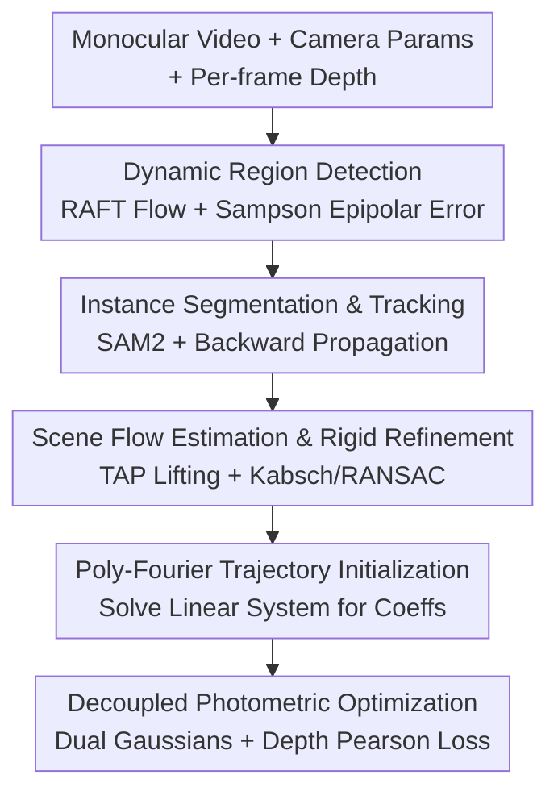

# MOSAIC-GS: Monocular Scene Reconstruction via Advanced Initialization for Complex Dynamic Environments

**Conference**: CVPR 2026  
**Paper**: [CVF Open Access](https://openaccess.thecvf.com/content/CVPR2026/html/Morkva_MOSAIC-GS_Monocular_Scene_Reconstruction_via_Advanced_Initialization_for_Complex_Dynamic_CVPR_2026_paper.html)  
**Code**: To be confirmed  
**Area**: 3D Vision / Monocular Dynamic Gaussian Splatting  
**Keywords**: Monocular dynamic reconstruction, Gaussian Splatting, scene flow initialization, rigidity constraints, Poly-Fourier trajectory

## TL;DR
MOSAIC-GS shifts "motion estimation" in monocular dynamic scene reconstruction from the photometric optimization stage to a four-step preprocessing pipeline. It first detects, segments, and tracks dynamic objects, refines scene flow using rigidity constraints, and **directly initializes** trajectories for dynamic Gaussians using Poly-Fourier curves. Combined with static/dynamic Gaussian decoupling, it achieves quality comparable to SOTA (surpassing in LPIPS) while accelerating training and rendering speeds by several times.

## Background & Motivation

**Background**: NeRF and 3DGS are mature for static scene reconstruction. Extensions to dynamic scenes generally follow two paths: per-frame deformation (storing Gaussian transforms for each frame, which has a large memory footprint and is non-scalable for long sequences) or continuous motion modeling (representing Gaussian trajectories with learnable functions, which is more compact but struggles with complex/fast motions, especially when relying solely on photometric cues).

**Limitations of Prior Work**: Monocular dynamic reconstruction is inherently **under-constrained**—lacking multi-view constraints makes it difficult to recover geometry and temporal consistency. Existing methods suffer from slow training, high memory/storage overhead, slow rendering, and significant artifacts in complex motion regions. Many prioritize visual realism over physical consistency, leading to distortions when viewed from novel perspectives. This is particularly problematic for platforms with restricted views and limited compute, such as robotics or embedded systems.

**Key Challenge**: The authors' key insight is that **inferring scene dynamics from pure visual data during the photometric optimization stage is inefficient and unreliable**. Preliminary experiments show that photometric optimization is extremely sensitive to initialization: without accurate motion estimation, most points in dynamic regions are pruned early on, forcing the model to spend many iterations trying to recover lost data, resulting in both slowness and poor quality.

**Goal**: Rather than struggling to infer motion during optimization, the goal is to "feed" high-quality motion priors into the initialization—ensuring that initialization carries not just Gaussian positions and colors, but also reliable motion trajectories.

**Key Insight**: Fully utilize **existing geometric/physical cues** in the video—depth, optical flow, dynamic object segmentation, and point-wise tracking—augmented by rigidity constraints to estimate preliminary 3D scene dynamics during the initialization phase.

**Core Idea**: Use a preprocessing pipeline consisting of "detection → segmentation/tracking → rigid refinement of scene flow → Poly-Fourier initialization" to shift dynamic recovery before photometric optimization, and decouple the scene into static and dynamic Gaussian sets to improve parameter efficiency.

## Method

### Overall Architecture
The input consists of monocular video, camera intrinsic/extrinsic parameters, and per-frame depth (provided by sensors or monocular depth models). The core of MOSAIC-GS is a four-step **preprocessing pipeline** that shifts motion recovery before photometric optimization: (1) Detect dynamic regions using optical flow and epipolar geometry; (2) Segment and track dynamic instances using SAM2; (3) Refine scene flow using TAP point tracking and rigid transformations; (4) Encode refined scene flow into Poly-Fourier curves and adaptively sample points to initialize static/dynamic Gaussians. These parameters serve as initial values for the final photometric optimization stage, where static and dynamic components use independent Gaussian sets (for higher parameter efficiency) but are rendered via joint rasterization, with geometric consistency reinforced by a Pearson correlation depth loss.

### Key Designs

**1. Dynamic Region Detection: Extracting True Scene Motion via Sampson Epipolar Error**

To address the lack of multi-view constraints in monocular setups, the authors do not rely on full 3D reconstruction errors, which are prone to noisy depth. Instead, they use **epipolar geometry**. Given adjacent frames $I_t, I_{t+1}$, dense optical flow $u_t$ is computed using RAFT. For each pixel correspondence $x$, the Sampson epipolar error is calculated as $e_{\text{epi}}(x) = \frac{(x'^\top F x)^2}{(Fx)_1^2 + (Fx)_2^2 + (F^\top x')_1^2 + (F^\top x')_2^2}$, where $F$ is the fundamental matrix derived from camera parameters. Pixels with high epipolar error cannot be explained by camera motion alone—likely stemming from true motion, flow errors, or camera parameter noise. Authors use a threshold $e_{\text{epi}}(x) > \tau_{\text{epi}}$ to filter dynamic candidates. This anchors motion detection in geometric constraints, making it more stable than direct 3D error metrics.

**2. Instance Segmentation and Tracking: Consistent Object Masks via SAM2 and Backward Propagation**

Since epipolar thresholds alone are insufficient, the authors introduce the promptable segmentation model SAM2. Per-frame bounding boxes for dynamic regions are extracted: if no dynamic object was previously detected, the box is used as a prompt; otherwise, the **mask of already tracked instances is subtracted** to avoid redundant tracking. Remaining boxes generate new instance masks $M^j_t$, and unreliable detections are filtered via a confidence threshold $p_{\text{conf}}(M^j_t) < \tau_{\text{mask}}$. High-confidence masks are added to the tracker and propagated forward. After processing all frames, **backward propagation** is performed to extend masks to earlier frames for objects that were initially static and moved later. Combining segmentation with tracking resolves ambiguities from occlusions and imperfect masks.

**3. Scene Flow Estimation and Rigid Refinement: Lifting Point Tracking to 3D with Rigidity Constraints**

The authors sample $N_p = 10,000$ query points in dynamic regions and track them into 2D trajectories using point tracking (BootsTAPIR). Each trajectory is assigned to a dynamic object $j$ based on majority overlap with segmentation masks. These 2D trajectories are **lifted to 3D** using depth maps and camera parameters to obtain scene flow. Crucial refinement follows: for each object $j$, the **Kabsch algorithm with RANSAC** is used on visible point pairs to estimate the best-aligned rigid transformation $(R^j_t, t^j_t)$. Positions are updated as $P^i_{t+1} := R^j_t P^i_t + t^j_t$. After forward processing, a backward pass fills in frames where objects are visible but points were unobserved. Remaining unobserved points are interpolated. Rigidity constraints reduce tracking noise and allow efficient motion inference in unobserved areas—a critical need for monocular scenes.

**4. Poly-Fourier Trajectory Initialization & Static/Dynamic Decoupling: Direct Motion Initialization**

This is the core differentiator. While most prior works learn trajectory coefficients during photometric optimization, the authors **initialize Poly-Fourier curve coefficients directly from the refined scene flow**. For each trajectory $\{P^i_t\}$, a linear system $Ax = y$ is solved. The basis functions $\phi(t) = [1, t, t^2, \sin(\omega t), \cos(\omega t)]^\top$ allow the coefficients $x = [a_0, a_1, a_2, \ldots, b_1, c_1, \ldots]$ to compactly encode the temporal trajectory, initializing deformation parameters for dynamic Gaussians. Gaussian colors are sampled from RGB pixels, and scales are initialized using the Laplacian of Gaussian (LoG) norm combined with depth to adaptively match local detail density.

The scene is decoupled into a static set $G_s$ and a dynamic set $G_d$ ($G = G_s \cup G_d$), each with independent initialization and densification strategies. Dynamic Gaussians store Poly-Fourier coefficients representing time-varying offsets for mean and rotation. The position offset is $\Delta\mu(t) = \sum_k a_k t^k + \sum_k (b_k\cos(k\omega t) + c_k\sin(k\omega t))$, with the mean $\mu(t) = \mu_0 + \Delta\mu(t)$. For rotation, instead of adding offsets to basis quaternions, the Poly-Fourier output is added to an identity quaternion and normalized to a valid unit quaternion $\Delta q(t)$, followed by quaternion multiplication $q(t) = \Delta q(t)\otimes q_0$. Notably, the authors **do not model time-varying color**, preventing the model from using artificial color changes to compensate for inaccurate motion—improving compactness and enforcing physical motion.

### Loss & Training
The total loss during photometric optimization is $\mathcal{L} = (1-\lambda_{\text{ssim}})\mathcal{L}_{\text{L1}} + \lambda_{\text{ssim}}\mathcal{L}_{\text{SSIM}} + \lambda_{\text{depth}}\mathcal{L}_{\text{depth}}$. To handle temporal depth scale inconsistencies, $\mathcal{L}_{\text{depth}}$ is implemented as a **Pearson correlation loss**, which preserves relative geometry and is invariant to absolute scale changes, preventing noisy absolute depth values from polluting the optimization. The default Poly-Fourier order is 32.

## Key Experimental Results

### Main Results
Evaluated on iPhone DyCheck and NVIDIA Dynamic Scene (original + Gaussian Marbles modification) using a single RTX 4090.

| Dataset | Method | PSNR↑ | LPIPS↓ |
|--------|------|-------|--------|
| DyCheck | Gaussian Flow | 16.22 | 0.311 |
| DyCheck | Shape of Motion | 17.32 | 0.295 |
| DyCheck | MoSca | **19.32** | 0.264 |
| DyCheck | **Ours** | 18.40 | **0.255** |
| NVIDIA (Orig) | MoSca | **26.72** | 0.070 |
| NVIDIA (Orig) | **Ours** | 26.26 | **0.060** |
| NVIDIA (Marbles) | Gaussian Marbles | 23.68 | 0.069 |
| NVIDIA (Marbles) | **Ours** | **23.79** | **0.069** |

MOSAIC-GS is generally second-best in PSNR (after MoSca) but **achieves the best or tied-best LPIPS across all three datasets**. The authors argue LPIPS better reflects human perception; the method reconstructs sharper details in dynamic regions, which can slightly lower PSNR. On the Marbles version, MOSAIC-GS reaches SOTA in both PSNR and LPIPS under the protocol of evaluating only visible regions.

### Efficiency

| Method | Training Time↓ | Rendering Speed↑ |
|------|-----------|-----------|
| Gaussian Marbles | 5–9 h | 200 FPS |
| Gaussian Flow | 23 min | 52 FPS |
| MoSca | 50 min | 38 FPS |
| **Ours** | **10.5 min** | **180 FPS** |

Training time includes preprocessing; pure photometric optimization takes only ~5 minutes. Compared to MoSca, it is ~5× faster to train and ~4.7× faster to render.

### Ablation Study (DyCheck)

| Configuration | mPSNR↑ | mLPIPS↓ | Training Time (min)↓ |
|------|--------|---------|----------------|
| Full model | 18.40 | 0.255 | 5.06 |
| w/o Deformation Init | 16.99 | 0.298 | 5.41 |
| w/o Rigid Refinement | 18.11 | 0.265 | 4.83 |
| w/o Decoupling | 14.65 | 0.456 | 8.26 |
| w/o Depth Supervision | 18.13 | 0.264 | 4.87 |
| Fourier Order 24 | 18.37 | 0.261 | 4.91 |
| Fourier Order 16 | 18.29 | 0.265 | 4.68 |

> mPSNR / mSSIM / mLPIPS are "masked" metrics calculated within the ground-truth covisibility mask to avoid penalizing unobserved regions.

### Key Findings
- **Static/Dynamic Decoupling is critical**: Without it, mPSNR drops to 14.65 and training time increases, as static initialization suffers and every Gaussian must carry deformation parameters.
- **Motion Initialization is the second most important factor**: Removing the deformation coefficient initialization causes mPSNR to drop from 18.40 to 16.99, confirming the value of accurate motion priors in monocular reconstruction.
- **Rigid refinement and depth supervision** each provide ~0.3 dB gain.
- **Fourier order** has a relatively small impact: Higher orders (32) capture complex motions in high-detail scenes like "Wheel," while lower orders are more compact for resource-constrained scenarios.
- **Zero-cost applications**: Because dynamic Gaussians are assigned instance IDs during preprocessing, the reconstruction naturally yields temporally consistent segmentation for object removal, isolation, or recoloring with zero extra overhead.

## Highlights & Insights
- **Paradigm shift to "Pre-initialization Motion"**: Instead of fighting under-constrained monocular motion during optimization, the method uses existing flow/segmentation/tracking/rigidity to estimate scene flow and directly initialize trajectories.
- **Direct initialization via Linear Systems**: Solving for Poly-Fourier coefficients directly from scene flow is a clean engineering insight that bypasses many optimization iterations.
- **Decoupled Gaussian sets**: Only dynamic Gaussians carry deformation parameters, keeping static Gaussians lightweight and improving both parameter efficiency and speed.
- **Omission of time-varying color**: Removing color deformation forces the model to explain appearance changes through real motion rather than "artificial color shifts," an unconventional but effective design for compactness.

## Limitations & Future Work
- Heavily dependent on the quality of initial segmentation masks and scene flow, inheriting errors from external models (RAFT/SAM2/BootsTAPIR/Depth estimation).
- Scene flow refinement may be insufficient when entire dynamic objects are never visible in the training views; rigidity constraints cannot recover completely unobserved objects.
- PSNR is consistently lower than MoSca; while the "sharpness vs. PSNR" trade-off is common, this remains a consideration for certain evaluation protocols.

## Related Work & Insights
- **vs MoSca (Current SOTA)**: MoSca uses a Motion Scaffold Graph and per-frame deformation. It has the highest PSNR but takes 50 min to train and renders at 38 FPS. MOSAIC-GS has slightly lower PSNR but better LPIPS and is ~5× faster.
- **vs Gaussian Flow**: Both use Poly-Fourier/continuous representation, but Gaussian Flow learns coefficients during optimization and models color shifts. MOSAIC-GS uses direct initialization, skips color shifts, and improves rotation stability.
- **vs Gaussian Marbles / Shape of Motion**: These use per-frame deformation/trajectory blending with large memory footprints and hours of training. MOSAIC-GS compresses training to ~10 min via decoupled compact encoding.

## Rating
- Novelty: ⭐⭐⭐⭐ Shifting motion recovery to initialization and solving for coefficients directly is a valuable paradigm shift.
- Experimental Thoroughness: ⭐⭐⭐⭐ Three datasets and detailed ablations, though quantitative analysis for completely unobserved objects is missing.
- Writing Quality: ⭐⭐⭐⭐ Clear step-by-step pipeline explanation and motivated by pre-experiments.
- Value: ⭐⭐⭐⭐ High practical utility for robotics due to speed and built-in support for instance-level editing.

<!-- RELATED:START -->

## Related Papers

- [\[CVPR 2026\] ReFlow: Self-correction Motion Learning for Dynamic Scene Reconstruction](reflow_self-correction_motion_learning_for_dynamic_scene_reconstruction.md)
- [\[CVPR 2026\] Disco-GS: Gaussian Splatting in Dynamic Color Lighting](disco-gs_gaussian_splatting_in_dynamic_color_lighting.md)
- [\[CVPR 2026\] WildRayZer: Self-supervised Large View Synthesis in Dynamic Environments](wildrayzer_self-supervised_large_view_synthesis_in_dynamic_environments.md)
- [\[CVPR 2026\] Neural Dynamic GI: Random-Access Neural Compression for Temporal Lightmaps in Dynamic Lighting Environments](neural_dynamic_gi_random-access_neural_compression_for_temporal_lightmaps_in_dyn.md)
- [\[CVPR 2026\] AeroGS: Scale-Aware Gaussian Splatting for Pose-Free Dynamic UAV Scene Reconstruction](aerogs_scale-aware_gaussian_splatting_for_pose-free_dynamic_uav_scene_reconstruc.md)

<!-- RELATED:END -->
