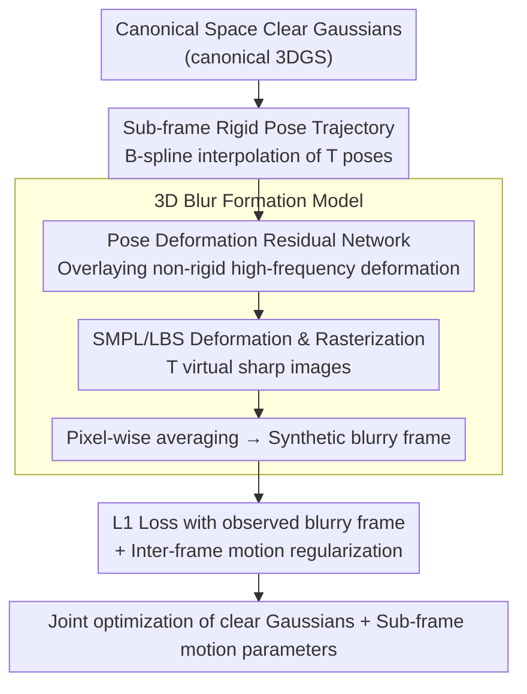

# Motion-Aware Animatable Gaussian Avatars Deblurring

**Conference**: CVPR 2026  
**arXiv**: [2411.16758](https://arxiv.org/abs/2411.16758)  
**Code**: [GitHub](https://github.com/MyNiuuu/MAD-Avatar)  
**Area**: 3D Vision  
**Keywords**: 3D Human Reconstruction, Motion Blur, 3D Gaussian Splatting, SMPL, Deblurring

## TL;DR

The authors propose the first method to reconstruct clear, animatable 3D human Gaussian Avatars directly from blurry videos. This is achieved through a 3D-aware physical blur formation model and an SMPL-based human motion model, which jointly optimize the Avatar representation and motion parameters.

## Background & Motivation

Creating 3D human Avatars from multi-view videos is a crucial task in computer vision. Existing methods (e.g., GauHuman) rely on high-quality sharp image inputs; however, in real-world scenarios, motion blur is inevitable due to variations in the speed and intensity of human movement. Blur introduces two primary issues: (1) 3DGS models learn distorted 3D representations because of the inherent ambiguity introduced by motion blur; (2) even with calibrated cameras, blurry frames lead to inaccurate SMPL parameter estimations. Simple two-stage solutions (2D deblurring followed by modeling) ignore 3D scene information, resulting in multi-view inconsistencies.

## Method

### Overall Architecture

This paper addresses the problem of reconstructing clear, drivable 3D Gaussian human Avatars directly from blurry multi-view videos, rather than performing 2D deblurring as a pre-processing step (which loses 3D information and causes multi-view inconsistency). The core idea is to decompose the reconstruction into two tasks: optimizing sub-frame motion during exposure and constructing a clear 3DGS Avatar in canonical space—binding them via a physical blur formation model.

Specifically, clear Gaussians in the canonical space are deformed to several timesteps within the exposure period according to SMPL parameters. At each timestep, a "virtual" sharp image is rasterized, and these are then averaged to synthesize a blurry frame. Loss is computed against the observed blurry frame for backpropagation. Thus, deblurring is naturally integrated into the forward process of 3D reconstruction.

### Key Designs

**1. 3D Blur Formation Model: Integrating 2D physical blur into the 3D Avatar rendering pipeline**

The limitation of two-stage schemes (2D deblurring before modeling) is that 2D deblurring lacks 3D geometric awareness, making multi-view results independent and inconsistent. This paper directly incorporates the physical fact that "blur is the accumulation of multiple instantaneous images during exposure" into the rendering process: a blurry image is the average of $T$ timesteps of rendering results during exposure:

$$\mathbf{I}^B = \frac{1}{T}\sum_{t=0}^{T-1}\mathcal{R}(\mathcal{W}(\{G_k(\mathbf{x})\}_{k=0}^{K-1}, \mathcal{S}_t), \mathbf{R}, \mathbf{K})$$

Where $\mathcal{W}$ deforms the canonical 3D Gaussians to the observation space based on SMPL parameters $\mathcal{S}_t$, and $\mathcal{R}$ represents rasterization. Since each timestep shares the same canonical Gaussian set, multi-view consistency is naturally maintained, and deblurring is transformed into a joint optimization of the "clear Gaussian + sub-frame motion."

**2. Sub-frame Rigid Pose Trajectory (B-spline Interpolation): Recovering continuous motion within exposure from a single blurry frame**

To average multiple timesteps, the pose at each moment during exposure must be known, yet only discrete blurry frames are observed. This method utilizes the 24 joints of SMPL and stores $P$ control parameters $\tilde{\Theta}^j \in \mathbb{R}^{P \times 3}$ for each joint. De Boor-Cox B-splines are used to interpolate intermediate poses at any time $t$ within the exposure:

$$\hat{\Theta}_t^j = \mathbf{B}(t) \cdot \mathcal{M}^P \cdot \tilde{\Theta}^j$$

Here $\mathbf{B}(t)$ is the time basis and $\mathcal{M}^P$ is the interpolation matrix. B-splines ensure smoothness of the interpolated joint motion; control parameters are initialized from coarse estimates and optimized during training.

**3. Pose Deformation Residual Network: Recovering high-frequency non-rigid deformations unreachable by B-splines**

B-splines can only describe basic pose trajectories and cannot handle non-rigid high-frequency changes like clothing folds or muscle jitter. This paper adds a CNN $G_{disp}$ to predict a displacement residual for each joint at each timestep, which is overlaid on the B-spline result:

$$\Theta_t^j = \hat{\Theta}_t^j + G_{disp}(\hat{\Theta}_t^j; \theta_{disp})$$

This allows the model to capture complex pose dynamics on top of smooth trajectories.

**4. Inter-frame Motion Regularization: Eliminating inherent motion direction ambiguity**

Motion blur has a fundamental ambiguity—forward and backward motion can produce nearly identical blurry images, making direction indistinguishable from a single frame. This paper uses the constraint that the "end pose of the previous frame" and the "start pose of the next frame" should be continuous across adjacent exposure periods. Geodesic distance regularization is applied:

$$\mathcal{L}_{reg} = \frac{1}{24 \cdot (N_e - 1)}\sum_{n=0}^{N_e-2}\sum_{j=0}^{23}|\hat{\Theta}_{n,T-1}^j - \hat{\Theta}_{n+1,0}^j|_G$$

This forces adjacent exposures to connect temporally, thereby locking a unique motion direction and enhancing inter-frame consistency.

### Loss & Training

The total loss is the L1 loss between synthesized blurry frames and observed blurry frames plus inter-frame regularization:

$$\mathcal{L} = \|\hat{\mathbf{I}}^B - \mathbf{I}^B\|_1 + \mathcal{L}_{reg}$$

The Adam optimizer is used ($\beta_1=0.9, \beta_2=0.999$), with learning rates and decay following the original 3DGS. Input resolution is $512 \times 512$ for synthetic datasets and $612 \times 512$ for real datasets, trained on a single RTX 4090.

## Key Experimental Results

### Main Results

| Method | Syn. PSNR↑ | Syn. SSIM↑ | Syn. LPIPS↓ | Real PSNR↑ | Real SSIM↑ | Real LPIPS↓ |
|------|----------|---------|----------|----------|---------|----------|
| GauHuman | 23.080 | 0.7660 | 0.2277 | 25.602 | 0.8044 | 0.2380 |
| BSST+GauHuman | 23.081 | 0.7698 | 0.2212 | 25.568 | 0.8068 | 0.2342 |
| **Ours** | **25.546** | **0.8290** | **0.1476** | **27.010** | **0.8271** | **0.1668** |

### Ablation Study

| Setup | Syn. PSNR↑ | Syn. LPIPS↓ | Real PSNR↑ | Description |
|------|----------|-----------|----------|------|
| w/o interp. | 24.009 | 0.1620 | 25.825 | No motion interpolation; largest performance drop |
| w/o pose deform | 25.301 | 0.1545 | 26.426 | Lacks high-frequency pose details |
| w/o LBS opt. | 25.394 | 0.1486 | 26.821 | Fixed skinning weights |
| Full model | 25.546 | 0.1476 | 27.010 | All components included |

### Key Findings

- Two-stage baselines (2D deblurring then reconstruction) show limited effectiveness because 2D deblurring cannot guarantee multi-view consistency.
- Inter-frame regularization $\mathcal{L}_{reg}$ is crucial for rendering quality at non-middle timesteps (PSNR increased from 24.421 to 25.417).
- Among B-spline, Slerp, and Linear trajectory representations, B-spline performs best, though the margins are relatively small.

## Highlights & Insights

- First work to solve the problem of reconstructing clear, animatable 3D human Avatars from blurry videos, filling a gap in the field.
- The approach of seamlessly integrating deblurring into 3D reconstruction is elegant: rather than performing deblurring first, the blur formation process is modeled within the 3D space.
- Construction of two benchmark datasets: a synthetic dataset based on ZJU-MoCap and a real-world dataset collected using a 360-degree hybrid exposure camera system.

## Limitations & Future Work

- Relies on coarse SMPL parameter initialization; extremely poor initialization may hinder convergence.
- Focuses only on human motion blur without considering the joint processing of camera motion blur.
- Potential scalability to multi-person scenes and more complex occlusions.
- Current support is limited to single-person Avatar reconstruction; handling mutual occlusions and contact areas in multi-person interaction scenes remains to be explored.

## Related Work & Insights

- **vs NeRF/3DGS Deblurring Methods** (e.g., DeblurNeRF, BAD-NeRF): While these primarily handle camera motion blur or defocus blur in static scenes, this work focuses on motion blur of animatable humans, requiring additional modeling of joint dynamics and SMPL priors to constrain the motion space.
- **vs GauHuman and clear-input methods**: GauHuman assumes sharp inputs; the proposed method can serve as a blur-aware front-end to improve the robustness of such methods under low-quality inputs.
- The B-spline motion modeling concept can be extended to other dynamic objects (e.g., animals, hands, soft objects).
- The physics-driven 3D blur formation model serves as a key bridge—integrating blur as a supervisory signal directly into 3D optimization.
- The 360-degree hybrid exposure camera system (4 blurry + 8 sharp synchronized cameras) provides a valuable real-world benchmark for blur-aware 3D reconstruction.
- The DIY demo using an iPhone 16 Pro demonstrates the practical potential of the method on consumer-grade devices.

## Rating

- Novelty: ★★★★☆ First to address blur-aware avatar reconstruction with a clear and valuable problem definition.
- Technical Depth: ★★★★☆ Sophisticated combination of physical blur modeling, B-spline, pose deformation CNN, and inter-frame regularization.
- Experimental Thoroughness: ★★★★★ Synthetic and real datasets, extensive ablation studies, and a DIY iPhone 16 Pro demonstration.
- Value: ★★★★☆ Fills a critical gap, as motion blur is highly prevalent in real-world scenarios.

<!-- RELATED:START -->

## Related Papers

- [\[CVPR 2026\] ProgressiveAvatars: Progressive Animatable 3D Gaussian Avatars](progressiveavatars_progressive_animatable_3d_gaussian_avatars.md)
- [\[CVPR 2026\] Tavatar: Topology-Aware Gaussian Attribute Derivation for Animatable Human Avatars](tavatar_topology-aware_gaussian_attribute_derivation_for_animatable_human_avatar.md)
- [\[CVPR 2026\] Zero-Shot Reconstruction of Animatable 3D Avatars with Cloth Dynamics from a Single Image](zero-shot_reconstruction_of_animatable_3d_avatars_with_cloth_dynamics_from_a_sin.md)
- [\[CVPR 2026\] HyperGaussians: High-Dimensional Gaussian Splatting for High-Fidelity Animatable Face Avatars](hypergaussians_high-dimensional_gaussian_splatting_for_high-fidelity_animatable_.md)
- [\[CVPR 2026\] FlexAvatar: Flexible Large Reconstruction Model for Animatable Gaussian Head Avatars with Detailed Deformation](flexavatar_flexible_large_reconstruction_model_for_animatable_gaussian_head_avat.md)

<!-- RELATED:END -->
