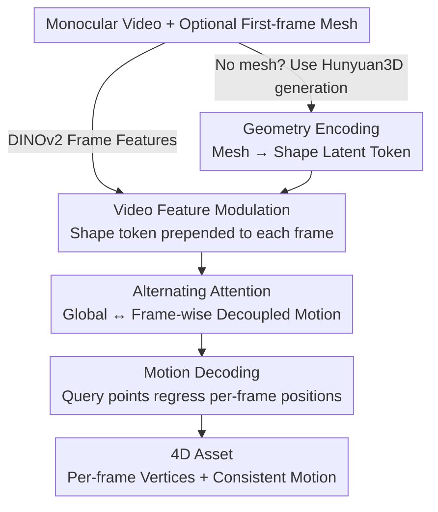

# Motion 3-to-4: 3D Motion Reconstruction for 4D Synthesis

**Conference**: CVPR 2026  
**Paper**: [CVF Open Access](https://openaccess.thecvf.com/content/CVPR2026/html/Chen_Motion_3-to-4_3D_Motion_Reconstruction_for_4D_Synthesis_CVPR_2026_paper.html)  
**Area**: 3D Vision / 4D Generation  
**Keywords**: 4D Synthesis, Motion Reconstruction, Feed-forward Framework, Scene Flow, Transformer

## TL;DR
Motion 3-to-4 decomposes the ill-posed problem of "generating 4D dynamic objects from monocular video" into two steps: **static 3D shape generation + dynamic motion reconstruction**. By using a (generatable) static reference mesh as an anchor, it performs feed-forward prediction of per-frame vertex motion flow relative to the reference frame. Leveraging DINOv2 video features for "surface point-to-pixel" alignment, it ensures geometric completeness and temporal consistency while compressing inference to seconds, significantly outperforming L4GM / GVFD / V2M4 on the self-built Motion-80 benchmark with ground-truth geometry.

## Background & Motivation

**Background**: 4D assets (capturing both static shape and motion over time) are in high demand for VR, film, robotics, and simulation. Current monocular video-to-4D approaches primarily follow three paths: ① generating multi-view videos from text/image followed by dynamic NeRF or 3D Gaussian Splatting reconstruction (e.g., Consistent4D, SV4D, L4GM); ② generating meshes per frame using pre-trained 3D generators followed by 4D alignment (e.g., V2M4, ShapeGen4D); ③ constructing motion latent spaces via VAE and applying predicted motion to an initial geometry for feed-forward inference (e.g., GVFD, AnimateAnyMesh).

**Limitations of Prior Work**: Category ① relies on long per-instance optimization and inherits multi-view inconsistencies from 2D generation models, leading to geometric drift. Category ② is slow due to the "per-frame generation → post-hoc alignment" pipeline, where independent per-frame generation introduces topology drift, causing flickering and physically implausible motion. Category ③, while supporting second-level inference, requires massive diverse data for VAEs to learn well-structured latent distributions; the extreme scarcity of high-quality 4D data results in failure to learn complex motions, poor generalization, and weak geometry.

**Key Challenge**: The 4D solution space is vast, yet 4D training data is extremely limited. Direct end-to-end "video-to-4D" learning is constrained by data volume, whereas pure reconstruction routes are non-generative, failing to "hallucinate" geometry for occluded or unseen regions, often leaving incomplete surfaces.

**Goal**: Given data scarcity, obtain complete geometry (including unseen backs), temporally consistent motion, feed-forward capability, generalization, and the ability to process sequences of arbitrary length.

**Key Insight**: The authors observe that 3D shape generation has been well-addressed by strong priors like Hunyuan3D 2.0, making it unnecessary to re-learn shapes in a 4D context. Thus, "shape" and "motion" are decoupled—leaving shape to existing 3D generators and reducing the 4D problem to a **motion reconstruction** problem. Motion reconstruction is essentially the alignment between "reference shape surface points ↔ video pixels," a local correspondence reasoning task that depends far less on data volume than learning full 4D distributions.

**Core Idea**: Use a static reference mesh as a canonical anchor to predict per-frame vertex **3D motion flow (scene flow) relative to the reference frame**, reframing 4D generation as a combination of "static 3D generation + motion reconstruction" to bypass the bottleneck of scarce 4D data.

## Method

### Overall Architecture
The input is a monocular video plus an optional first-frame mesh asset (if unavailable, one is generated from the first-frame image using Hunyuan3D 2.0). The output is a 4D asset for the entire sequence: full vertex positions per frame based on the reference mesh. The entire pipeline consists of two major components—**Motion Latent Learning** (encoding the static mesh and video frames into compact per-frame motion representations) and **Motion Decoding** (regressing per-frame 3D positions from query points sampled on the reference mesh). The process is entirely feed-forward, eliminating the need for post-hoc per-frame alignment as in V2M4.

### Key Designs

**1. Shape-Motion Decoupling: Reframing 4D Generation as Static Generation + Motion Reconstruction**

This is the foundation of the work, directly addressing the Core Problem of "4D data scarcity and excessive solution space." Instead of learning the entire 4D distribution, the task is split into two solvable sub-problems: static shape is handled by a ready-made 3D generator (Hunyuan3D 2.0), while motion is modeled as the **displacement flow of per-frame vertices relative to the first-frame reference shape**. Formally, $N$ surface points $X_0=(x_i, n_i, c_i)_{i=1}^N$ (coordinates, normals, RGB) uniformly sampled from the reference mesh $M=\{V, F, T\}$ are compressed into a shape latent $Z_{X_0}$. The motion branch then purely "pushes" these points to their positions in each frame. The benefit is that high-quality shape is guaranteed by strong priors, allowing the motion branch to be lightweight and significantly reducing the demand for 4D training data. Furthermore, since motion is a "relative-to-reference" flow rather than independently generated per-frame meshes, surface correspondences are naturally preserved, avoiding the per-frame topology drift seen in V2M4.

**2. Shape Latent Encoding + Video Modulation: Fusing Geometry with Video Context via DINOv2**

Static shape alone does not inform motion; video motion cues must be injected. On the shape side, inspired by 3DShape2VecSet, a set of learnable queries $A \in \mathbb{R}^{K \times C}$ of fixed length $K$ is used to aggregate sampled points via cross-attention, resulting in a compact 1D shape latent:

$$Z_{X_0} = \texttt{CrossSelfAttn}(A, \texttt{PointEmb}(X_0))$$

Here, $\texttt{PointEmb}: \mathbb{R}^9 \to \mathbb{R}^C$ uses an MLP to map 9D point labels (coordinates + normals + color) to positional embeddings. On the video side, pre-trained DINOv2 extracts patch features (semantic features facilitate robust cross-frame correspondence and strong generalization), with temporal embeddings injected to inform the model of frame order. The **Design Motivation** is to prepend the global shape token $Z_{X_0}$ to each frame's tokens as a per-frame motion representation, enabling the model to handle videos of arbitrary length (rather than compressing the entire motion into a fixed-length 1D sequence). An additional reference position token explicitly distinguishes the reference frame from others, ensuring attention correctly utilizes reference information for propagation.

**3. Alternating-Attention: Decoupling Motion across Arbitrary Lengths**

After prepending shape tokens to each frame, the model must share geometric structure across frames while distinguishing individual motions. Borrowing from VGGT, the authors use alternating attention: given initial aggregated latents $Z_t^{(0)} \in \mathbb{R}^{(K+P) \times C}$ for frame $t$, each block performs global attention across all frames followed by intra-frame attention:

$$[Z_0^{(\ell-\frac{1}{2})}, \dots] = \texttt{GlobalAttn}(Z_0^{(\ell-1)}, \dots), \quad Z_t^{(\ell)} = \texttt{FrameAttn}(Z_t^{(\ell-\frac{1}{2})})$$

After $L$ blocks, the first $K$ tokens of each frame are taken as the motion representation for that frame. The global step aligns all frames to the same geometry/context, while the per-frame step preserves frame-specific motion variances. This **Mechanism** of alternating global and per-frame steps is key to supporting "arbitrary frame count input" while maintaining temporal consistency.

**4. Relative-to-Reference Motion Flow Decoding: Regressing Per-frame Positions via Surface Queries**

The decoding stage does not independently predict full shapes per frame (like ShapeGen4D) or predict per-frame attribute offsets (like GVFD). Instead, it predicts the **per-frame motion flow relative to the reference shape**. Specifically, $M$ points $\hat{P}_0 = \{(x_i, n_i, c_i)\}_{i=1}^M$ are re-sampled from the reference mesh as queries (using the same PointEmb). A cross-attention decoder combines these with the frame's motion latent $Z_t$ to independently predict positions for each frame:

$$\hat{X}_t = \texttt{MotionDecoder}(\hat{X}_0, Z_t)$$

The decoded point features pass through a shared FC layer to yield final 3D coordinates. The advantage of a "relative reference flow" is that surface correspondences are explicitly preserved, preventing accumulated drift over long sequences. Query points can be sampled at any spatial position and any time, making the framework fully feed-forward and queryable in both space and time.

### Loss & Training
Training uses straightforward supervision—the MSE between predicted and ground-truth point positions:

$$\mathcal{L} = \frac{1}{M \times T} \sum_{i=1}^{M} \sum_{t=1}^{T} \|\hat{X}_t^i - X_t^i\|_2^2$$

During training, dense sampling (dense supervision) is performed to encourage the model to learn fine-grained surface correspondences and ensure coherent motion across the mesh. Implementation: each mesh samples $N=4096$ points to encode into $K=64$ shape latents, passing through $L=16$ transformer blocks with $M=4096$ densely sampled GT points. Training involves 12-frame sequences, batch size 256, learning rate $4 \times 10^{-4}$, and takes approximately 1.5 days on 8 H100 GPUs for 60k steps. Data is curated from ~50k models in Objaverse / Objaverse-XL, filtered down to 16k (excluding simple geometries like cubes/spheres and using ICP to remove trivial motion sequences), normalized to a $[-0.5, 0.5]$ bounding box, and rendered from a fixed viewpoint at 256x256.

## Key Experimental Results

### Main Results
On the self-built Motion-80, both geometry (CD↓, F-Score↑) and appearance (LPIPS↓, CLIP↑, FVD↓, DreamSim↓) are evaluated for short and long (>128 frames) sequences. "Ours w/m" denotes initialization with the ground-truth static mesh of the first frame.

| Dataset/Setting | Metric | L4GM | GVFD | V2M4 | Ours | Ours w/m |
|------|------|------|------|------|------|------|
| Motion-80 Short | CD ↓ | 0.3561 | 0.1970 | 0.3437 | **0.1113** | 0.0437 |
| Motion-80 Short | F-Score ↑ | 0.1269 | 0.2608 | 0.2318 | **0.3171** | 0.6774 |
| Motion-80 Short | DreamSim ↓ | 0.1941 | 0.2147 | 0.1974 | **0.1682** | 0.0614 |
| Motion-80 Long | CD ↓ | 0.3648 | OOM | 0.3719 | **0.1495** | 0.0929 |
| Motion-80 Long | F-Score ↑ | 0.0997 | OOM | 0.1652 | **0.2347** | 0.4322 |

Geometrically, Ours leads significantly in CD/F-Score. L4GM's 3DGS representation lacks surface constraints, causing floating artifacts. GVFD produces reasonable point clouds but inaccurate motion. V2M4's per-frame mesh stitching suffers from temporal inconsistency and flickering. In long sequences, GVFD encounters OOM while Ours remains stable via "relative reference flow."

On the Consistent4D benchmark (no GT mesh, rendering metrics only):

| Method | LPIPS ↓ | CLIP ↑ | FVD ↓ | DreamSim ↓ |
|------|---------|--------|-------|------------|
| L4GM | 0.1468 | 0.8457 | 1207.79 | 0.1830 |
| GVFD | 0.1789 | 0.8278 | 1340.78 | 0.2009 |
| V2M4 | 0.1611 | 0.8482 | 1471.58 | 0.1832 |
| **Ours** | **0.1455** | **0.8609** | 1260.06 | **0.1691** |

### Ablation Study
The main table compares "Ours" vs. "Ours w/m"—the difference being whether the motion branch consumes a generated mesh or the GT first-frame mesh:

| Configuration | CD ↓ (Short) | F-Score ↑ (Short) | Description |
|------|---------|--------------|------|
| Ours | 0.1113 | 0.3171 | Shape generated by Hunyuan3D |
| Ours w/m | 0.0437 | 0.6774 | Using GT static reference mesh |

Replacing the generated mesh with the GT mesh drops the CD from 0.1113 to 0.0437 and increases F-Score from 0.3171 to 0.6774. This indicates the motion reconstruction branch itself is extremely accurate; the bottleneck is primarily the static generation quality. This validates the "shape-motion decoupling"—provided a good shape, the motion branch can drive it effectively (why Motion Transfer works).

### Key Findings
- The decoupling design provides significant **Gain** in geometric accuracy and long-sequence robustness: CD is nearly halved compared to the next best method (GVFD 0.1970) to 0.1113, without OOM or drift in long sequences.
- Inference speed is 6.5 FPS (averaged over 512 frames), much faster than optimization methods like V2M4 (0.1), and nearly as fast as L4GM (7.8) but with far higher geometric accuracy. It is the only method in Table 1 supporting feed-forward inference, full mesh output, and mesh retargeting.
- Emergent **Motion Transfer** capability: despite being trained only on paired video-3D data, the model can transfer motion from a dragon video to diverse meshes like a chicken or a mechanical dragon, as motion is modeled as "surface point-to-pixel alignment" rather than being tied to a specific shape.
- Strong generalization to in-the-wild: combining BiRefNet for background removal + Hunyuan2.0 for initial shape + DINO's robust visual features allows the model to handle real-world videos and generated animations.

## Highlights & Insights
- **Reformulating the problem is smarter than brute-force learning**: Instead of learning a scarce 4D distribution end-to-end, decomposing 4D into strong 3D priors (existing) + lightweight motion reconstruction offloads the data demand. This is an elegant way to handle data scarcity.
- **"Relative-to-reference scene flow" is the key to temporal consistency**: Per-frame independent mesh generation inevitably drifts. Predicting vertex flow relative to the first frame naturally preserves surface correspondences—a representation choice that is more fundamental than simply adding losses.
- **Global ↔ Frame-wise Alternating Attention unlocks arbitrary lengths**: Prepending the shape token to each frame and using alternating attention allows the same model to avoid fixed sequence lengths, making it the only one that doesn't collapse on long sequences.
- **Valuable byproduct**: By decoupling motion from shape, the ability to animate artist-created static meshes and perform cross-object motion transfer is gained for free—a high-value feature for industrial pipelines (rigging/animation).

## Limitations & Future Work
- The authors acknowledge two failure modes: ① the geometry encoder operates on dense point clouds without explicit mesh topology modeling; when different parts of an object are not clearly separated in the reference mesh, **vertex sticking** occurs. ② Constant reliance on the first-frame mesh makes it difficult to adapt to **topological changes** (e.g., splitting or new structures) in subsequent frames.
- Static generation quality is the upper bound: the gap between "Ours" and "Ours w/m" suggests that end-to-end performance is bottlenecked by the 3D generator. Better generators will improve results, but generator biases will also propagate into the 4D output.
- Data is still synthetic-heavy: training is mostly on Objaverse renderings. In-the-wild performance relies on background removal and generated meshes. Robustness to complex real scenes (multiple objects, heavy occlusion, non-rigid details) remains to be tested.
- Future directions: introducing explicit topology/mesh connectivity to mitigate sticking; allowing reference geometry to be updated over time to handle topological changes; extending the branch to multi-object or articulated scenes.

## Related Work & Insights
- **vs. V2M4 (3D Gen + 4D Align)**: V2M4 generates meshes independently per frame and aligns them post-hoc, which is slow and prone to topology drift and flickering. Ours uses relative motion flow without per-frame generation, ensuring feed-forward correspondence and reducing CD from 0.34 to 0.11.
- **vs. GVFD (3D Gen + Motion Gen)**: GVFD learns a global motion latent via VAE with rendering supervision, restricted by 4D data scarcity and suffering from weak geometry and long-sequence OOM. Ours treats motion as a reconstruction problem (alignment), making it data-efficient and stable for long sequences.
- **vs. L4GM (Multi-view Gen + 3D Recon)**: L4GM regresses 3DGS, but points are not constrained to the surface, leading to floaters and ghosting from non-orthogonal views. Ours uses explicit mesh + scene flow for better geometry and consistency.
- **Insight**: When target data is scarce, "outsource" sub-problems that have been solved by others with massive data (e.g., 3D shape generation) and compress the remaining task into a lower-demand alignment/reconstruction problem. This "decoupling + reusing strong priors" paradigm is transferable to many X-to-4D or cross-modal generation tasks.

## Rating
- Novelty: ⭐⭐⭐⭐ The reformulation via decoupling and relative scene flow is clever, with motion transfer as a beautiful emergent byproduct; components themselves are largely existing modules.
- Experimental Thoroughness: ⭐⭐⭐⭐ Dual benchmarks (Motion-80 with GT + Consistent4D), dual dimensions (geometry + appearance), separate long/short sequence evaluations. Explicit ablations are somewhat limited (mostly Ours vs. w/m).
- Writing Quality: ⭐⭐⭐⭐ Clear motivation, well-explained method, and the methodology taxonomy in Table 1 is insightful.
- Value: ⭐⭐⭐⭐ Second-level feed-forward inference + complete geometry + mesh retargeting provides high utility for VR/film/simulation asset production pipelines.

<!-- RELATED:START -->

## Related Papers

- [\[CVPR 2026\] MotionCrafter: Dense Geometry and Motion Reconstruction with a 4D VAE](motioncrafter_dense_geometry_and_motion_reconstruction_with_a_4d_vae.md)
- [\[CVPR 2026\] MoVieS: Motion-Aware 4D Dynamic View Synthesis in One Second](movies_motion-aware_4d_dynamic_view_synthesis_in_one_second.md)
- [\[CVPR 2026\] MoRe: Motion-aware Feed-forward 4D Reconstruction Transformer](more_motion-aware_feed-forward_4d_reconstruction_transformer.md)
- [\[CVPR 2026\] 4DEquine: Disentangling Motion and Appearance for 4D Equine Reconstruction from Monocular Video](4dequine_disentangling_motion_and_appearance_for_4d_equine_reconstruction_from_m.md)
- [\[CVPR 2026\] AnyLift: Scaling Motion Reconstruction from Internet Videos via 2D Diffusion](anylift_scaling_motion_reconstruction_from_internet_videos_via_2d_diffusion.md)

<!-- RELATED:END -->
