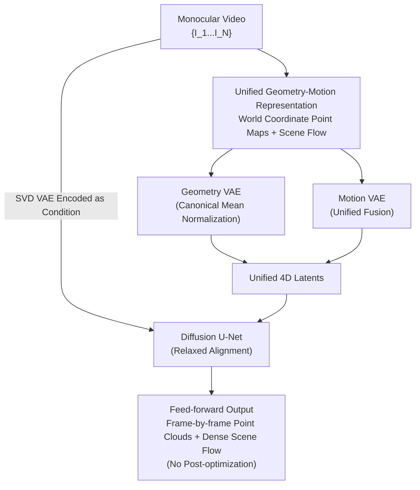

# MotionCrafter: Dense Geometry and Motion Reconstruction with a 4D VAE

**Conference**: CVPR 2026  
**Paper**: [CVF Open Access](https://openaccess.thecvf.com/content/CVPR2026/html/Zhu_MotionCrafter_Dense_Geometry_and_Motion_Reconstruction_with_a_4D_VAE_CVPR_2026_paper.html)  
**Code**: [Project Page](https://ruijiezhu94.github.io/MotionCrafter_Page/)  
**Area**: 3D Vision  
**Keywords**: 4D Reconstruction, Scene Flow, Video Diffusion Prior, Point Cloud, VAE Normalization

## TL;DR
MotionCrafter places the dense geometry (point clouds) and dense motion (3D scene flow) of a monocular video into the same world coordinate system. It uses a specially designed 4D VAE to encode both into a unified latent variable, and then leverages the spatiotemporal prior of a pretrained video diffusion model for feed-forward reconstruction. It also counter-intuitively demonstrates that "4D data does not need to be forced to align with the distribution of the RGB VAE," ultimately improving geometry and motion reconstruction by 38.64% and 25.0% respectively over SOTA, all without requiring any post-optimization.

## Background & Motivation

**Background**: Simultaneously recovering both the 4D geometry of dynamic scenes and dense point motion from monocular video serves as a foundational component for video understanding, robotics, and world models. Traditional methods rely on pixel correspondences combined with per-scene iterative mesh optimization to fit RGB(D) observations. In the deep learning era, this task has been divided into two separate lines of work: "dynamic geometry reconstruction" and "correspondence estimation." Recently, feed-forward methods like St4RTrack, Dynamic Point Maps, and Stereo4D have extended static reconstruction networks (e.g., DUSt3R/MASt3R) to dynamic scenes, emerging as promising alternatives.

**Limitations of Prior Work**: Most of these feed-forward methods adopt a DUSt3R-style "pairwise frames" design—processing only two frames at a time, predicting the point map of the target frame relative to the reference frame, and then using post-optimization to align and stitch pairwise results into a sequence. This approach has two fundamental flaws: first, it can only capture short-range correspondences, losing long-range temporal consistency in extended videos; second, motion is only modeled between the "first frame $\leftrightarrow$ other frames," making it highly non-robust to occlusions caused by viewpoint changes or newly appearing dynamic objects in subsequent frames. Furthermore, geometry reconstruction and motion estimation are inherently homologous (both relying on pixel correspondences in multi-view geometry), yet they are split into two independent sub-tasks, wasting their correlation.

**Key Challenge**: On one hand, the task itself is severely ill-posed and lacks large-scale in-the-wild datasets with dense geometry and motion annotations. On the other hand, to alleviate data scarcity by leveraging the strong priors of pretrained diffusion models, the research community generally believes that "3D attributes must be strictly normalized to $[-1,1]$ to align with the distribution of the original RGB VAE" to inherit the prior. However, 3D coordinates in the world coordinate system are unbounded $(-\infty,+\infty)$, and their distribution is inherently different from that of $[0,255]$ natural images; forcing alignment actually degrades reconstruction performance.

**Goal**: (1) Unify dense geometry and dense motion under a single representation for joint modeling; (2) Design a VAE capable of efficiently encoding this 4D representation to transfer video diffusion priors; (3) Clarify whether it is indeed necessary to strictly align the data/latent space when fine-tuning diffusion models.

**Key Insight**: The authors advocate that to truly understand dynamic 3D scenes, one must jointly model dense geometry and motion over the **entire video** within a **single shared world coordinate system**. Defining scene flow in the world coordinate system naturally eliminates the camera self-motion component—ideally, the scene flow of static background points is zero, making the motion patterns of dynamic objects much easier to learn.

**Core Idea**: Use a unified 4D representation combining "world-coordinate point maps + scene flow" to replace "pairwise point maps + post-optimization." A dedicated 4D VAE compresses this representation into a compact latent space, which is then fed forward to a pretrained video diffusion model. At the same time, the constraint that "data/latent spaces must align with the RGB VAE" is relaxed, replaced by a normalization strategy tailored to 3D distributions.

## Method

### Overall Architecture
MotionCrafter addresses the following problem: given an input monocular video $\{I_i\}_{i=1}^N$ (with each frame $I_i\in\mathbb{R}^{H\times W\times 3}$), it feed-forwards and reconstructs viewpoint-invariant point maps in the world coordinate system $X_i\in\mathbb{R}^{H\times W\times 3}$ for each frame and 3D scene flow $V_{i\to i+1}\in\mathbb{R}^{H\times W\times 3}$ between adjacent frames. That is, it learns a network $f_\theta:\{I_i\}_{i=1}^N\to\{X_i,V_{i\to i+1}\}_{i=1}^N$ (predicting only forward flow, with the last frame $N$ having no flow supervision).

The overall structure has three layers: (1) **Unified 4D Representation**—placing geometry (point maps) and motion (scene flow) in the world coordinate system with the first frame as the origin; (2) **4D VAE**—composed of a Geometry VAE and a Motion VAE, which jointly encodes point maps and scene flow into a unified 4D latent variable, representing the core innovation of this paper; (3) **Diffusion U-Net**—reusing the pretrained VAE of Stable Video Diffusion (SVD) to encode the input video into conditional latents, which are concatenated along the channel dimension with the 4D latents to guide the denoising process, where only the 4D latents are denoised during training. The entire VAE is trained in two stages and then frozen, followed by training the Diffusion U-Net. A crucial, counter-intuitive insight runs throughout: **they do not force the distribution of the 4D latent variables to align with the original distribution of the SVD VAE**. This "relaxed alignment" actually improves the generalization of both the VAE and the U-Net.

### Key Designs

**1. Unified Geometry-Motion Representation: Pinning Point Maps and Scene Flow into the Same World Coordinate System**

To address the limitation where the "pairwise frames + post-optimization" paradigm cannot model long-range motion and is sensitive to occlusion, the authors designate the coordinate system of the first frame as the world coordinate system, similar to DUSt3R. The point map $X_i$ stores the 3D coordinates $(x,y,z)$ of each pixel, while the scene flow $V_i$ represents the 3D displacement $(\Delta x,\Delta y,\Delta z)$ of pixels from frame $i$ to $i+1$, both within the world coordinate system. Ideally, the warped point map $X_i^d = X_i + V_i$ should align spatially with the next frame's point map $X_{i+1}$. However, due to viewpoint changes, $X_i^d$ and $X_{i+1}$ do not have a one-to-one pixel-space correspondence (the pixel indices $p_i$ vs $p_{i+1}$ for the same physical point differ across frames, or might even move out of view). Therefore, hard pixel-space correspondences cannot be directly established—which is precisely why the authors encode them into a latent space using a VAE, bypassing explicit pixel correspondences. The benefits of this representation are: **camera-free** (geometry and motion are defined in the world coordinate system, eliminating extra camera pose estimation), **temporal consistency** (geometry and motion are inherently continuous in video sequences, and sharing the same coordinate system makes them easier to learn jointly), and **richer motion modeling** (scene flow is defined between every pair of adjacent frames rather than just relative to the first frame, providing robustness against viewpoint occlusions and capturing motion of newly appearing objects). Since motion is modeled directly in the world coordinate system, camera ego-motion is naturally disentangled, and the scene flow of static background points is ideally zero.

**2. Geometry VAE with Modified Normalization: Replacing Max Normalization with Mean Normalization, Abandoning RGB Distribution Alignment**

To address the issue where 3D coordinates are unbounded and distribute differently from natural images, such that forcing max-normalization to $[-1,1]$ damages reconstruction, the authors adopt canonical (mean-scale) normalization for each sequence of world-coordinate point maps:

$$\hat{X}_i = \frac{X_i - \mu}{S},\quad \mu = \frac{1}{|D|}\sum_{d\in D} X_d,\quad S = \frac{1}{|D|}\sum_{d\in D}\lVert X_d - \mu\rVert_2 + \varepsilon$$

where $D$ denotes all valid points in the point map sequence, $\mu$ represents the mean (centering the coordinates), $S$ is the average distance to the center (scaling by scene scale), and $\varepsilon$ ensures numerical stability. This preserves the scale invariance of the point maps while better retaining fine structures for large-scale outdoor scenes. Contrary to existing practices (freezing the VAE and fine-tuning only the decoder, e.g., Geo4D), the authors **fine-tune the entire encoder-decoder**, allowing greater flexibility for the input distribution. The training objective is:

$$L_G = L_{point} + \lambda_d L_{depth} + \lambda_n L_{normal}$$

where $L_{point}$ is the point map reconstruction MSE, $L_{depth}$ is the multi-scale loss on the projected depth map, and $L_{normal}$ enforces surface normal consistency. Since these are world-coordinate point clouds, the authors normalize the GT camera poses along with the point clouds and project the point cloud into depth maps using scale-aligned camera parameters. The authors also experimented with adding a KL divergence term to constrain the latents to a standard Gaussian, which significantly degraded VAE performance and was subsequently discarded. This design directly answers the core question: strictly aligning the input/latent space of diffusion models is not necessary for 3D attributes; relaxing this constraint yields better generalization.

**3. Motion VAE and Unified Fusion: Concatenating Geometry and Motion Latents into a Unified 4D Latent to Decouple Motion**

Motion and geometry are inherently related; learning motion in isolation is suboptimal. The authors compared three fusion strategies: **no fusion** (encoding geometry and motion independently with no interaction), **offset fusion** (similar to LayerDiffuse, adding motion latents as offsets to geometry latents), and **unified fusion** (concatenating geometry and motion latents into a unified 4D latent vector, which is fed into the Motion VAE decoder to reconstruct scene flow). Although unification is not the optimal strategy for VAE reconstruction (separate is better), it becomes the best-performing approach when applied to the downstream diffusion U-Net, indicating that tightly coupled geometry-motion representations are critical for coherent 4D modeling. When training the Motion VAE, the Geometry VAE is frozen to preserve its geometry prior. The objective is:

$$L_M = \underbrace{\frac{1}{|D|}\sum_{d\in D}\lVert \hat{V}_d - V_d\rVert_2^2}_{\text{scene flow reconstruction}} + \lambda_{reg}\underbrace{\frac{1}{|N|}\sum_{n\in N}\lVert \hat{V}_n\rVert_2^2}_{\text{zero-flow regularization}}$$

The first term is the scene flow MSE on valid pixels $D$, and the second term follows the as-static-as-possible assumption, pulling the flow of all pixels $N$ toward zero (as the background should remain stationary). Combining the two VAEs into a unified 4D VAE integrates geometry and motion into a single latent space, achieving compact and efficient 4D scene encoding and decoding.

**4. Progressive Two-Stage Training + EDM Dual Paradigm: Learning Geometry/Motion Priors Individually, Then Freezing to Connect with the Diffusion U-Net**

To inherit the prior of the video generator while maintaining stable training, the authors utilize a modular two-stage pipeline: first, they train the Geometry VAE independently (40k steps) to capture geometry; then, they freeze it to train the Motion VAE (20k steps) to preserve the learned geometry prior. Once converged, the unified 4D VAE is frozen, and the Diffusion U-Net is trained (40k steps). During U-Net training, geometry supervision utilizes datasets (1)+(2), while motion supervision only uses dataset (2) which contains dense flow annotations. The framework is based on EDM preconditioning, supporting both deterministic and denoising paradigms. The target for the deterministic paradigm is:

$$L_{deterministic} = L_{latent} + \lambda_G L_G + \lambda_M L_M$$

where $L_{latent}$ is the latent space diffusion loss, which includes geometry latent supervision $\frac{1}{N}\sum_N\lVert\hat{z}^G_i - z^G_i\rVert_2^2$ and motion latent supervision $\frac{1}{N-1}\sum_{N-1}\lVert\hat{z}^M_i - z^M_i\rVert_2^2$ (the motion latent of the last frame is discarded since it only predicts forward flow); the denoising paradigm is simplified to $L_{denoise}=L_{latent}$. Experiments show that the deterministic paradigm generally performs better and is thus used as the default. Both the VAE and U-Net are initialized with pretrained SVD weights, using AdamW with a learning rate of 1e-4, taking about 3 days on 8×40GB GPUs.

> Correspondence between Framework $\leftrightarrow$ Diagram $\leftrightarrow$ Key Designs: The four contribution nodes in the diagram, namely "Unified Geometry-Motion Representation", "Geometry VAE", "Motion VAE", and "Diffusion U-Net", correspond to Designs 1, 2, 3, and 4 respectively (with the training paradigm classified under Design 4). The SVD VAE condition encoding, input video, and output are scaffolding nodes and are not listed as separate designs.

## Key Experimental Results

### Main Results

**Joint Geometry & Motion Reconstruction (World Coordinate System, Tab. 1)**: On five datasets (Kubric, Spring, VKITTI2, Dynamic Replica, and Point Odyssey), geometry is evaluated using Relative Point Error Relp$\downarrow$ and Inlier Ratio $\delta_p\uparrow$ (threshold 0.25), while motion is evaluated via EPE$\downarrow$ and APD$\uparrow$. Most baseline methods are DUSt3R-style pairwise designs, requiring camera poses predicted by VGGT to transform predictions to the world coordinate system. MotionCrafter improves average geometry by 38.64% and average motion by 25.0%, with an average rank of 1.0 for both.

| Dataset / Metric | Ours | ST4RTrack-P+VGGT | Zero-MSF+VGGT |
|--------|------|------|------|
| Kubric Geometry Relp$\downarrow$ | **3.40** | 17.81 | 8.79 |
| Kubric Geometry $\delta_p\uparrow$ | **98.73** | 80.76 | 94.73 |
| Spring Geometry Relp$\downarrow$ | **29.20** | 157.05 | 142.44 |
| Point Odyssey Geometry $\delta_p\uparrow$ | **94.90** | 71.66 | 78.27 |
| Spring Motion EPE$\downarrow$ | **5.61** | 441.84 | 7.78* |
| VKITTI2 Motion APD0.3$\uparrow$ | **25.90** | 13.16 | 21.69* |
| Geometry / Motion Average Rank$\downarrow$ | **1.0 / 1.0** | 3.4 / 4.8 | 4.6 / 2.4 |

Notably, the authors did not train on the motion annotations of Dynamic Replica and Point Odyssey (unlike the non-zero-shot Zero-MSF, which did), yet outperformed them across almost all metrics except for one comparable indicator.

**Pure Geometry Reconstruction (Tab. 2)**: Evaluated zero-shot on Monkaa, Sintel, and DDAD, compared against camera-centric methods (DepthPro, MoGe, GeoCrafter) and world-centric methods (MonST3R†, VGGT, Geo4D†, St4RTrack), where † denotes the use of post-optimization.

| Dataset / Metric | Ours (w/o post-optimization) | VGGT | Geo4D† |
|--------|------|------|------|
| Monkaa Relp$\downarrow$ | **25.88** | 34.54 | 28.04 |
| Monkaa $\delta_p\uparrow$ | **74.01** | 56.65 | 69.52 |
| Sintel Relp$\downarrow$ | 32.46 | **26.83** | 34.61 |
| DDAD Relp$\downarrow$ | 21.27 | **15.98** | 14.58 |
| Average Rank$\downarrow$ | 2.67 | **2.33** | 2.33 |

Ours achieves SOTA on Monkaa. Although slightly lagging behind VGGT on Sintel/DDAD, which the authors attribute to their unimodal design (without camera rays or depth maps) and the limited scale of outdoor training data, it requires absolutely no post-optimization (unlike Geo4D†).

### Ablation Study

**Geometry VAE Normalization and Training Strategy (Tab. 3)**: Reports geometry results at both the VAE and U-Net stages on Sintel and Monkaa.

| Configuration | Training Strategy / Normalization | Monkaa Relp$\downarrow$ | Monkaa $\delta_p\uparrow$ |
|------|---------|------|------|
| VAE-1 | Original / Max | 23.78 | 67.33 |
| VAE-2 | From scratch / Max | 11.48 | 90.55 |
| VAE-3 | Fine-tune decoder / Max | 14.44 | 85.91 |
| VAE-4 | Fine-tune all / **Mean (Ours)** | **5.03** | **99.13** |
| U-Net-I | VAE-3 + U-Net / Max | 33.66 | 56.42 |
| U-Net-II | VAE-4 + U-Net / Mean | **27.36** | **66.21** |

VAE-4 (mean normalization + full fine-tuning) significantly outperforms all max-normalization variants. When applied to the U-Net stage (U-Net-I vs U-Net-II), it yields an average 16.6% gain in geometry, verifying that relaxing alignment benefits generalization.

**Motion VAE Fusion Strategy (Tab. 4)**: Comparisons among Original, Offset, Separate, and Unify on Spring and Point Odyssey.

| Configuration | Fusion Strategy | Spring EPE$\downarrow$ | Spring APD0.03$\uparrow$ |
|------|---------|------|------|
| VAE-7 | Separate | **0.66** | **96.75** |
| VAE-8 | Unify | 0.88 | 94.78 |
| U-Net-III | Separate | 6.37 | 65.94 |
| U-Net-IV | Unify | **5.16** | **72.81** |

While the "Separate" strategy performs better in VAE reconstruction, the "Unify" strategy yields the best results once integrated into the U-Net, confirming that tightly coupled geometry-motion representations are critical for coherent 4D modeling.

### Key Findings
- **Relaxed alignment is a key counter-intuitive finding**: 3D attributes do not require forced normalization to $[-1,1]$ to match the RGB VAE distribution. Mean normalization coupled with full fine-tuning both preserves and enhances the generalization of the diffusion model, yielding an average +16.6% improvement in U-Net geometry.
- **Optimal VAE reconstruction $\neq$ Optimal downstream performance**: For both geometry normalization and motion fusion, the optimal configuration during the VAE stage (e.g., Separate) is outperformed by another configuration (e.g., Unify) at the U-Net stage. This highlights that model evaluation must focus on downstream tasks rather than intermediate VAE reconstruction metrics alone.
- **Video generators indeed possess valuable priors**: Using the original pretrained VAE yields reasonable reconstruction capabilities in indoor scenes, though it fails under large-scale outdoor variations. The suboptimal performance of VAE-2 (trained from scratch) conversely proves that SVD pretraining priors are highly beneficial for dense 4D reconstruction.

## Highlights & Insights
- **Defining scene flow in the world coordinate system** is a masterstroke: camera ego-motion is naturally disentangled, and the scene flow of the static background is ideally zero (enforced by zero-flow regularization). Consequently, the motion patterns of dynamic objects are highlighted and easier to learn, bypassing explicit camera pose estimation.
- **The insight that "Optimal VAE reconstruction $\neq$ Optimal downstream performance" has high transfer value**: Any two-stage system combining a "pretrained encoder + downstream generation/prediction" should select configurations based on end-to-end downstream metrics rather than focusing strictly on intermediate reconstruction quality.
- **Challenging the assumption of "mandatory alignment with the RGB VAE distribution"**: This conclusion is highly instructive for any line of work attempting to transfer diffusion priors to non-RGB modalities (depth, normals, flow, 3D attributes). Instead of trying to force diverse modalities into $[-1, 1]$, a normalization strategy tailored to the specific modality combined with full fine-tuning is far more effective.

## Limitations & Future Work
- The authors acknowledge that the current framework is limited to dense geometry and motion modalities. Given that prior works show incorporating multimodal inputs—such as camera parameters, depth maps, point trajectories, and novel views—can significantly improve 3D attribute prediction, multimodal integration is a clear next step.
- Performance on large-scale outdoor scenes is slightly inferior to VGGT, which the authors attribute to their unimodal design (lacking camera rays/depth) and the limited scale of outdoor training data—indicating the method remains sensitive to the domain coverage of the training data.
- The model relies on synthetic data to train motion (due to the lack of dense scene flow annotations for in-the-wild datasets), and its generalization to real-world dynamic scenes still requires more systematic validation. Additionally, the method only predicts forward flow and leaves the final frame unsupervised; the robustness against accumulated drift in long videos warrants further investigation. *Note: The latter two points are inferred by the author of this note and should be cross-referenced with the original paper.*

## Related Work & Insights
- **vs Geo4D**: Geo4D also leverages a video generator for 4D point map reconstruction, but it only outputs independent point maps per frame without modeling dense inter-point motion. It also freezes the VAE to fine-tune only the decoder and strictly aligns the distribution. In contrast, this work jointly models geometry and motion within a single 4D VAE and demonstrates that aligning the data/latent space is unnecessary.
- **vs St4RTrack / Dynamic Point Maps / Stereo4D**: These are DUSt3R-style pairwise frame designs, processing two frames at a time and relying on post-optimization to stitch sequences, with motion modeled only relative to the first frame. This work processes the entire sequence in a feed-forward manner, builds dense flow between adjacent frames, requires no post-optimization, and offers superior long-range consistency and occlusion robustness.
- **vs VGGT**: VGGT is a powerful world-centric geometry reconstructor (also utilized in this paper to help transform baselines to the world coordinate system using its camera poses) and performs better on Sintel/DDAD outdoor geometry. However, VGGT does not explicitly model dense point motion; this work trade-offs strict unimodal geometric precision for the capability of joint geometry and motion reconstruction.

## Rating
- Novelty: ⭐⭐⭐⭐⭐ Unified 4D representation + 4D VAE + "relaxed alignment" counter-intuitive finding; all three are highly substantial.
- Experimental Thoroughness: ⭐⭐⭐⭐ Comprehensive main results across multiple datasets + two key ablation groups (normalization/fusion), though outdoor geometry is relatively weaker and motion learning relies on synthetic data.
- Writing Quality: ⭐⭐⭐⭐⭐ Clear derivation of motivation, thoroughly explains "why no alignment is needed," and self-contained figures and tables.
- Value: ⭐⭐⭐⭐⭐ Feed-forward without post-optimization, SOTA performance, and the insight of "transferring diffusion priors to non-RGB modalities" is highly reusable.

<!-- RELATED:START -->

## Related Papers

- [\[CVPR 2026\] Motion 3-to-4: 3D Motion Reconstruction for 4D Synthesis](motion_3-to-4_3d_motion_reconstruction_for_4d_synthesis.md)
- [\[CVPR 2026\] MoRe: Motion-aware Feed-forward 4D Reconstruction Transformer](more_motion-aware_feed-forward_4d_reconstruction_transformer.md)
- [\[CVPR 2026\] MotionScale: Reconstructing Appearance, Geometry, and Motion of Dynamic Scenes with Scalable 4D Gaussian Splatting](motionscale_reconstructing_appearance_geometry_and_motion_of_dynamic_scenes_with.md)
- [\[CVPR 2026\] 4DEquine: Disentangling Motion and Appearance for 4D Equine Reconstruction from Monocular Video](4dequine_disentangling_motion_and_appearance_for_4d_equine_reconstruction_from_m.md)
- [\[CVPR 2026\] Any4D: Unified Feed-Forward Metric 4D Reconstruction](any4d_unified_feed-forward_metric_4d_reconstruction.md)

<!-- RELATED:END -->
