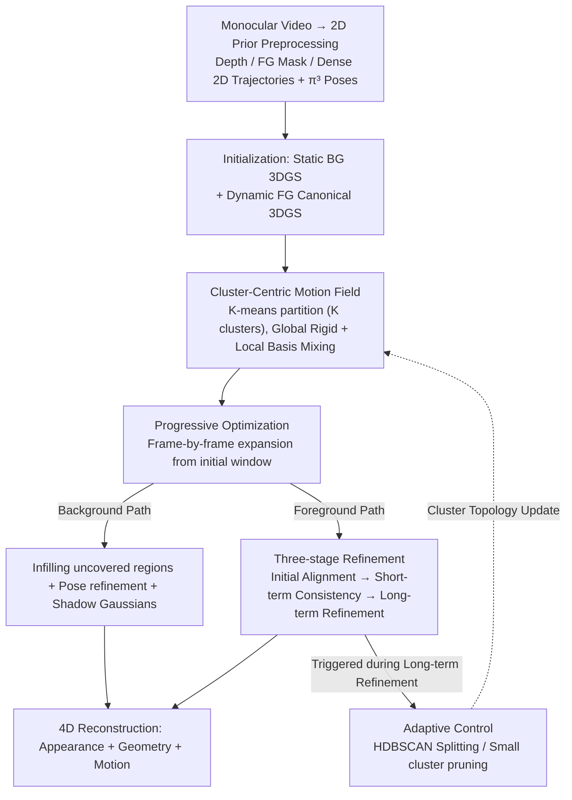

# MotionScale: Reconstructing Appearance, Geometry, and Motion of Dynamic Scenes with Scalable 4D Gaussian Splatting

**Conference**: CVPR 2026  
**arXiv**: [2603.29296](https://arxiv.org/abs/2603.29296)  
**Code**: [Project Page](https://hrzhou2.github.io/motion-scale-web/)  
**Area**: 3D Vision  
**Keywords**: 4D Reconstruction, Gaussian Splatting, Dynamic Scenes, Motion Field, Monocular Video

## TL;DR

The authors propose MotionScale, a scalable 4D Gaussian Splatting framework. By leveraging cluster-based adaptive motion fields and progressive optimization strategies, it achieves high-fidelity reconstruction of appearance, geometry, and motion for large-scale dynamic scenes from monocular videos. It achieves a PSNR of 17.98 on DyCheck and reduces the 3D tracking EPE to 0.070, significantly outperforming existing methods.

## Background & Motivation

1. **Background**: Dynamic 4D scene reconstruction is a core challenge in computer vision. Recently, NeRF and 3DGS have demonstrated impressive results in static or slightly dynamic scenes, particularly in multi-view settings. Recent works have begun combining 2D geometric/motion priors (e.g., depth estimation, point tracking) with 4DGS for reconstruction from monocular videos.

2. **Limitations of Prior Work**: While existing methods produce reasonable view synthesis from observed viewpoints, they exhibit significant deficiencies in geometric accuracy and long-term temporal consistency. These manifest as geometric distortions, incoherent motion trajectories, and difficulties in scaling to large-scale scenes or long videos.

3. **Key Challenge**: Two critical bottlenecks are identified: (1) **Under-constrained geometry**: Supervision primarily relies on view-dependent appearance signals, lacking the ability to enforce 3D structural consistency. (2) **Accumulated temporal drift**: Motion models depend on 2D tracking priors that lack 3D awareness, leading to unavoidable error accumulation in long sequences, which results in geometric collapse and inconsistent motion.

4. **Goal**: To design a motion representation that is both expressive and scalable, coupled with a stable optimization strategy, to achieve high-fidelity 4D reconstruction of large-scale dynamic scenes from monocular video.

5. **Key Insight**: Observing that global deformation fields or fixed-capacity architectures struggle with diverse local motions, the authors propose an adaptive expansion of model capacity driven by cluster-centric motion fields.

6. **Core Idea**: Parameterize the motion field via basis transformations of cluster centers, complemented by adaptive splitting/pruning mechanisms and a progressive optimization strategy that decouples foreground and background.

## Method

### Overall Architecture

MotionScale aims to simultaneously reconstruct the appearance, geometry, and motion of large-scale dynamic scenes from uncalibrated monocular videos. The pipeline begins by using off-the-shelf 2D models to decompose the video into monocular depth, foreground masks, and dense 2D point trajectories, with $\pi^3$ estimating initial camera poses as a geometric skeleton. The scene is partitioned into static background and dynamic foreground. The background is represented by standard 3D Gaussians, while the dynamic foreground consists of 3D Gaussians in a canonical space, mapped to each frame via a scalable "cluster-centric motion field." Optimization is performed progressively: starting from an initial temporal window, the model capacity is adapted by splitting or pruning clusters as the video length and motion complexity increase.

### Key Designs

**1. Cluster-Centric Motion Field: Trading "Cluster Granularity" for Scalable Non-rigid Expressivity**

Dynamic scenes involve varying motions across regions. Global MLPs or fixed temporal bases often lack expressivity or scale poorly. MotionScale partitions dynamic Gaussians into $K$ disjoint clusters $\{\mathcal{C}_k\}$, each possessing a global rigid transformation $\mathbf{G}_k^t \in SE(3)$ and $B$ fine-grained basis transformations $\mathcal{B}_k^t$. The position of a Gaussian $i$ at time $t$ is determined by mixing the basis transformations of its cluster using learnable coefficients $\mathbf{w}_i$ to form a local transformation, which is then composed with the global cluster transformation:

$$\boldsymbol{\mu}_i^t = \mathbf{R}_{k,g}^t(\mathbf{R}_{i,\ell}^t \boldsymbol{\mu}_i^0 + \mathbf{t}_{i,\ell}^t) + \mathbf{t}_{k,g}^t$$

Crucially, each Gaussian is assigned to only one cluster, keeping per-point computation constant. The mixing of local bases allows for non-rigid deformation, decoupling expressivity from computational cost—complex motions are handled by increasing the number of clusters rather than the per-Gaussian model size.

**2. Adaptive Control: Splitting Clusters when Internal Motion Diverges**

Initial cluster assignments are coarse. Over long sequences, non-rigid differences within a cluster may emerge, indicating insufficient granularity. Borrowing from 3DGS densification, the authors perform a "diagnostic" during the long-term optimization stage. 3D trajectories of Gaussians within a cluster are used as descriptors; HDBSCAN identifies density sub-clusters, and agglomerative clustering splits them into two candidates. If the distance between centroids exceeds a threshold, a split occurs. Parameters are inherited to maintain stability, while redundant small clusters are pruned to keep the representation compact.

**3. Progressive Optimization: Mitigating Drift through Decoupled FG/BG Propagation**

Joint optimization on long sequences suffers from foreground-background interference and accumulated drift. MotionScale employs two decoupled propagation paths. The background path focuses on "map completion," sampling new Gaussians for uncovered regions and performing sub-pixel camera pose refinement, alongside specific "Shadow Gaussians" to model transient shadows cast by moving objects. The foreground path uses a three-stage progression: **Initial Alignment** using unidirectional tracking loss (to prevent new frame noise from corrupting optimized frames), **Short-term Consistency** using bidirectional tracking, and **Long-term Refinement** using cross-sequence frame-pair sampling to counteract drift.

### Loss & Training

- **Tracking Loss** $L_{\text{track}}$: Minimizes the difference between rendered 2D trajectories and CoTracker3 priors.
- **Depth Consistency Loss** $L_{\text{depth}}$: Ensures rendered depth matches monocular depth priors at tracked locations.
- **Photometric Loss (RGB)**: Standard image reconstruction loss.
- **ARAP Regularization**: As-rigid-as-possible constraint to maintain local motion rigidity.
- **Shadow Gaussians**: Dedicated Gaussians modeling transient shadows, optimized only via photometric and segmentation constraints without geometric or motion supervision.

## Key Experimental Results

### Main Results

| Dataset | Metric | MotionScale | Shape of Motion | GFlow | 4D-Fly |
|--------|------|-------------|-----------------|-------|--------|
| DyCheck | PSNR↑ | **17.98** | 16.72 | - | 17.03 |
| DyCheck | SSIM↑ | **0.70** | 0.63 | - | 0.60 |
| DyCheck | LPIPS↓ | **0.40** | 0.45 | - | 0.37 |
| NVIDIA | PSNR↑ | **26.75** | 23.37 | - | 22.52 |
| NVIDIA | SSIM↑ | **0.78** | 0.75 | - | 0.69 |

| Method | EPE↓ | δ³ᴅ.05↑ | δ³ᴅ.10↑ | AJ↑ | δ_avg↑ | OA↑ |
|------|------|---------|---------|-----|--------|-----|
| MotionScale | **0.070** | **47.0** | **76.4** | **37.7** | **50.6** | **87.4** |
| Shape of Motion | 0.082 | 43.0 | 73.3 | 34.4 | 47.0 | 86.6 |
| SpatialTracker | 0.125 | 37.7 | 63.9 | 24.9 | 36.9 | 73.5 |

### Ablation Study

| Configuration | PSNR↑ | SSIM↑ | LPIPS↓ | AJ↑ | δ_avg↑ | OA↑ |
|------|-------|-------|--------|-----|--------|-----|
| Full Model | 17.98 | 0.70 | 0.40 | 37.7 | 50.6 | 87.4 |
| Global Bases | 16.70 | 0.63 | 0.45 | 34.2 | 46.6 | 86.1 |
| w/o Adaptive Control | 17.21 | 0.67 | 0.42 | 34.9 | 47.0 | 86.6 |
| w/o Pose Ref. | 17.45 | 0.67 | 0.41 | - | - | - |
| w/o Shadow | 16.26 | 0.60 | 0.50 | - | - | - |
| w/o FG Propagation | 16.97 | 0.64 | 0.42 | 34.4 | 46.9 | 86.4 |

### Key Findings

- **Cluster Motion Field vs. Global Bases**: The localized design improves PSNR by 1.28 and AJ by 3.5 compared to a global basis baseline (similar to Shape of Motion), proving localized motion bases are vital for fine-grained non-rigidity.
- **Adaptive Control**: Removing this mechanism leads to a drop of 0.77 in PSNR and 2.8 in AJ, highlighting the importance of dynamic topological adjustments.
- **Shadow Gaussians**: This has the largest impact (PSNR drops from 17.98 to 16.26). Lacking shadow representation forces foreground Gaussians to expand into shadow regions, creating geometric bloating and ghosting artifacts.
- **Pose Refinement**: While the quantitative gain is modest, qualitative results show it is essential for maintaining sharp textures.

## Highlights & Insights

- **Scalability by Design**: The cluster-centric motion field is clever—computation is local and constant per Gaussian, but capacity can expand infinitely via splitting. This "fixed computation + dynamic capacity" paradigm is applicable beyond 4DGS.
- **Three-stage Refinement**: The transition from conservative (unidirectional) to aggressive (global) optimization is a critical engineering strategy for preventing divergence in progressive systems.
- **Shadow Modeling**: Addressing transient shadows independently prevents them from corrupting the foreground geometry, solving a common but often neglected artifact in dynamic reconstruction.

## Limitations & Future Work

- **Prior Dependence**: Relies heavily on pre-trained 2D models (depth, segmentation, tracking); errors in these priors propagate to the final output.
- **Heuristic Splitting**: Adaptive control depends on HDBSCAN and distance thresholds, which might require tuning for extreme motion patterns.
- **Evaluation Scale**: Validated on DAVIS, DyCheck, and NVIDIA; testing on larger outdoor environments remains future work.

## Related Work & Insights

- **vs. Shape of Motion**: SoM uses global shared bases; MotionScale uses localized, adaptive bases and outperforms SoM significantly in long sequences and large-motion scenarios.
- **vs. GFlow**: GFlow often produces "cloudy" artifacts under large displacements. MotionScale maintains geometric clarity through progressive optimization and cluster constraints.
- **vs. 4D-Fly**: While PSNR is comparable, MotionScale shows clear advantages in SSIM and 3D tracking, demonstrating superior geometric consistency.

## Rating

- **Novelty**: ⭐⭐⭐⭐ The combination of cluster-centric motion and adaptive splitting is a distinct innovation within the 4DGS evolution.
- **Experimental Thoroughness**: ⭐⭐⭐⭐⭐ Comprehensive evaluation across three datasets with diverse NVS and tracking metrics.
- **Writing Quality**: ⭐⭐⭐⭐ Clear methodology and intuitive diagrams, though formula density is high.
- **Value**: ⭐⭐⭐⭐ Advances the SOTA in monocular 4D reconstruction with a scalable motion design.

<!-- RELATED:START -->

## Related Papers

- [\[CVPR 2026\] MoRGS: Efficient Per-Gaussian Motion Reasoning for Streamable Dynamic 3D Scenes](morgs_efficient_per-gaussian_motion_reasoning_for_streamable_dynamic_3d_scenes.md)
- [\[CVPR 2026\] Velox: Learning Representations of 4D Geometry and Appearance](velox_learning_representations_of_4d_geometry_and_appearance.md)
- [\[CVPR 2026\] 4D Primitive-Mâché: Glueing Primitives for Persistent 4D Scene Reconstruction](4d_primitive-mache_glueing_primitives_for_persistent_4d_scene_reconstruction.md)
- [\[CVPR 2026\] Efficiently Reconstructing Dynamic Scenes One D4RT at a Time](efficiently_reconstructing_dynamic_scenes_one_d4rt_at_a_time.md)
- [\[CVPR 2026\] MoRe: Motion-aware Feed-forward 4D Reconstruction Transformer](more_motion-aware_feed-forward_4d_reconstruction_transformer.md)

<!-- RELATED:END -->
