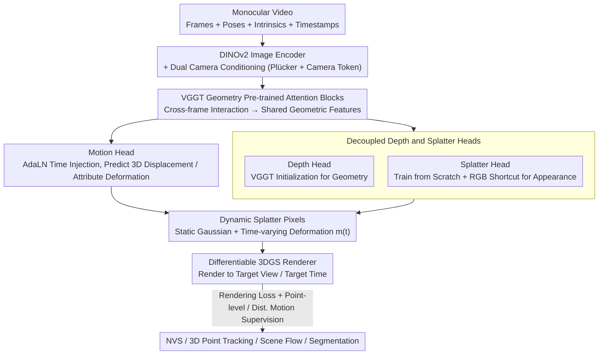

# MoVieS: Motion-Aware 4D Dynamic View Synthesis in One Second

**Conference**: CVPR 2026  
**arXiv**: [2507.10065](https://arxiv.org/abs/2507.10065)  
**Code**: [Available](https://chenguolin.github.io/projects/MoVieS)  
**Area**: 3D Vision  
**Keywords**: Dynamic View Synthesis, 4D Reconstruction, 3D Gaussian Splatting, Point Tracking, Feed-forward Reconstruction  

## TL;DR

The authors propose MoVieS, a feed-forward 4D dynamic scene reconstruction framework. By utilizing a **Dynamic Splatter Pixel** representation to unify appearance, geometry, and motion modeling, it achieves 4D reconstruction from monocular video in approximately 1 second. It supports multiple tasks including novel view synthesis, 3D point tracking, scene flow estimation, and moving object segmentation.

## Background & Motivation

Current 3D vision methods face three core limitations:

**Task Fragmentation**: Tasks such as depth estimation, 3D reconstruction, novel view synthesis, and point tracking are often handled independently, lacking unified modeling. Since these tasks share underlying 3D priors, separate processing wastes complementary information.

**Static Scene Limitations**: Most feed-forward reconstruction methods (e.g., pixelSplat, GS-LRM, VGGT) only handle static scenes and cannot model moving objects.

**Inefficiency of Optimization-based Dynamic Reconstruction**: Methods like Shape-of-Motion and MoSca require 10-45 minutes of per-scene optimization and rely on external optical flow or point tracking models for motion supervision, making the pipeline complex and difficult to generalize.

Existing feed-forward dynamic methods also have flaws: BTimer's independent per-frame prediction lacks temporal consistency and requires an additional enhancer module; NutWorld lacks explicit motion supervision and suffers from projection distortion due to its orthogonal camera. The core motivation for MoVieS is: **Can a unified feed-forward model simultaneously output appearance, geometry, and motion to complete 4D reconstruction within 1 second?** The key insight is that novel view synthesis and motion estimation can mutually reinforce each other—rendering loss provides dense spatial constraints for motion, while explicit motion supervision helps the model learn temporally consistent geometry.

## Method

### Overall Architecture

MoVieS aims to use a single feed-forward network to simultaneously output the appearance, geometry, and motion of a dynamic scene in 1 second, moving away from multi-model pipelines. Given an input monocular video $\mathcal{V} = \{\mathbf{I}_i, \mathbf{P}_i, \mathbf{K}_i, t_i\}_{i=1}^{N}$ with camera poses and timestamps, the framework first encodes all frames into shared geometric features, then uses three parallel heads to translate these features into a set of dynamic Gaussians, and finally performs differentiable rendering to any viewpoint and timestamp.

Specifically, each frame is first processed by a pre-trained image encoder (DINOv2) to extract features, incorporating camera embeddings and timestamp tokens. These per-frame features are passed to the geometry-pretrained attention blocks of VGGT for cross-frame interaction, allowing each pixel to "see" the context of other frames. These shared features are fed into the depth, splatter, and motion heads to determine all attributes of the dynamic splatter pixels. Finally, a differentiable 3DGS renderer renders the target images, with the rendering loss serving as the supervision signal for the entire pipeline.

### Key Designs

**1. Dynamic Splatter Pixels: Decomposing Scenes into "Static Gaussian + Time-varying Deformation"**

Previous feed-forward dynamic methods either embedded motion into implicit fields (hard to supervise/visualize) or used heavy 4D primitives. MoVieS represents each pixel as a splatter pixel $\mathbf{g} = \{\mathbf{x}, \mathbf{a}\}$, where $\mathbf{x} \in \mathbb{R}^3$ is the static position in canonical space and $\mathbf{a} \in \mathbb{R}^{11}$ contains rotation, scale, opacity, and color. Dynamic content is modeled as an additive time-varying deformation $\mathbf{m}(t) = \{\Delta\mathbf{x}(t), \Delta\mathbf{a}(t)\}$:

$$\mathbf{x} \leftarrow \mathbf{x} + \Delta\mathbf{x}(t), \quad \mathbf{a} \leftarrow \mathbf{a} + \Delta\mathbf{a}(t)$$

Separating static geometry from dynamic deformation allows $\Delta\mathbf{x}(t)$ to act as a readable 3D displacement field that can be directly supervised by point tracking labels or visualized as motion maps. For static scenes, the model naturally learns $\Delta\mathbf{x}$ as 0.

**2. Dual Camera Condition Injection: Plücker Embeddings for Local and Camera Tokens for Global Constraints**

Providing camera parameters only as a global vector makes it difficult for the network to associate pixels with rays. MoVieS encodes $\mathbf{P}_i$ and $\mathbf{K}_i$ in two ways: **Plücker embeddings**, which represent the camera ray for each pixel as pixel-aligned coordinates added to image features for local geometric constraints; and **Camera Tokens**, which compress parameters into a global token for the attention sequence to provide per-frame viewpoint information. Ablations confirm both are necessary—using only Plücker yields 25.81 PSNR, only Camera Token yields 26.81, while combined they achieve 27.60.

**3. Motion Head: Continuous Time 4D Reconstruction via AdaLN**

The motion head predicts displacements for any query time $t_q$. It uses sinusoidal encoding for $t_q$ and Adaptive Layer Normalization (AdaLN) to modulate feature tokens with the temporal signal. DPT convolutions then predict $\Delta\mathbf{x}$ and $\Delta\mathbf{a}$ per pixel. This allow for the reconstruction of continuous-time 4D scenes by querying arbitrary $t_q$ during inference.

**4. Decoupled Depth and Splatter Heads: Leveraging VGGT Priors vs. Learning from Scratch**

Many feed-forward methods use a single head for all Gaussian attributes, causing interference between geometry and appearance. MoVieS decouples them: the depth head is initialized from VGGT to inherit large-scale geometric priors, while the splatter head is trained from scratch with an RGB shortcut to preserve high-frequency texture and color fidelity from the input image.

**5. Motion Supervision design: Point-level and Distribution-level Losses**

Rendering loss alone is insufficient for accurate motion (EPE3D is 0.79 without motion loss). MoVieS employs a composite motion loss on pixels $\Omega$ with tracking labels:

$$\mathcal{L}_{\text{motion}} = \frac{\lambda_{\text{pt}}}{P}\sum_{i \in \Omega}\|\Delta\hat{\mathbf{x}}_i - \Delta\mathbf{x}_i\|_1 + \frac{\lambda_{\text{dist}}}{P^2}\sum_{(i,j) \in \Omega \times \Omega}\|\Delta\hat{\mathbf{x}}_i \cdot \Delta\hat{\mathbf{x}}_j^\top - \Delta\mathbf{x}_i \cdot \Delta\mathbf{x}_j^\top\|_1$$

The point-level L1 loss constrains absolute displacement, while the distribution-level loss aligns the inner product matrix of displacements between pixels to preserve relative motion structure. This results in much sharper motion boundaries.

### Loss & Training

The total loss is a weighted combination: $\mathcal{L} = \lambda_d \mathcal{L}_{\text{depth}} + \lambda_r \mathcal{L}_{\text{rendering}} + \lambda_m \mathcal{L}_{\text{motion}}$

- **Depth Loss**: MSE between predicted depth and GT + spatial gradient L1 loss.
- **Rendering Loss**: Pixel MSE + LPIPS perceptual loss ($\lambda_{\text{LPIPS}} = 0.5$) calculated on $M$ randomly sampled target timestamps.
- **Weights**: $\lambda_d = 1, \lambda_r = 1, \lambda_m = 10, \lambda_{\text{pt}} = 1, \lambda_{\text{dist}} = 10$.
- **Curriculum Training**: (1) Static scene pre-training, (2) Dynamic scene + multi-view training, (3) High-resolution fine-tuning.
- **Datasets**: Hybrid training on 8 datasets (RealEstate10K, TartanAir, MatrixCity, PointOdyssey, DynamicReplica, Spring, VKITTI2, Stereo4D).
- **Engineering**: gsplat backend, DeepSpeed, gradient checkpointing, bf16 mixed precision on 32×H20 GPUs for ~5 days.

## Key Experimental Results

### Main Results: Novel View Synthesis

| Method | Type | Time per scene | RE10K PSNR↑ | DyCheck mPSNR↑ | DyCheck mSSIM↑ | NVIDIA PSNR↑ |
|------|------|-----------|-------------|-----------------|----------------|--------------|
| DepthSplat | FF (Static) | 0.60s | 26.57 | 13.83 | 43.64 | 17.16 |
| GS-LRM† | FF (Static) | 0.57s | 26.94 | 14.60 | 45.35 | 17.83 |
| Ours (static) | FF (Static) | 0.84s | **27.60** | 15.24 | 47.84 | 18.73 |
| Splatter-a-Video | Opt. | 37min | - | 13.61 | 31.31 | 14.39 |
| Shape-of-Motion | Opt. | 10min | - | 17.96 | 56.62 | 15.30 |
| MoSca | Opt. | 45min | - | 18.24 | 55.14 | 21.45 |
| **MoVieS** | **FF (Dynamic)** | **0.93s** | 26.98 | **18.46** | **58.87** | 19.16 |

### Main Results: 3D Point Tracking (TAPVid-3D)

| Method | ADT EPE3D↓ | ADT δ0.05↑ | ADT δ0.10↑ | DriveTrack EPE3D↓ | Panoptic δ0.05↑ |
|------|------------|------------|------------|-------------------|-----------------|
| BootsTAPIR† | 0.5539 | 17.73% | 32.97% | 0.0617 | 69.28% |
| CoTracker3† | 0.5614 | 19.88% | 35.82% | 0.0637 | 69.27% |
| SpatialTracker | 0.5413 | 18.08% | 38.23% | 0.0648 | 72.91% |
| **MoVieS** | **0.2153** | **52.05%** | **71.63%** | **0.0472** | **87.88%** |

### Ablation Study

| Motion Supervision Strategy | ADT EPE3D↓ | ADT δ0.05↑ | ADT δ0.10↑ |
|-------------|-----------|-----------|-----------|
| No Motion Superv. | 0.7938 | 19.58% | 32.86% |
| + Point-level L1 | 0.2262 | 48.74% | 69.93% |
| + Dist. Loss | 0.2496 | 45.98% | 66.87% |
| Combined (Ours) | **0.2153** | **52.05%** | **71.63%** |

| Synergy: NVS & Motion | DyCheck mPSNR↑ | NVIDIA PSNR↑ | ADT EPE3D↓ | ADT δ0.05↑ |
|---------------------|---------------|-------------|-----------|-----------|
| NVS w/o Motion | 15.82 | 18.38 | 0.7938 | 19.58% |
| Motion w/o NVS | 16.26 | 18.98 | 0.3801 | 24.72% |
| **Full Model** | **18.46** | **19.16** | **0.2153** | **52.05%** |

### Key Findings

1. **Incredible Speed Advantage**: MoVieS completes 4D reconstruction in 0.93s, 600-2900x faster than optimization-based methods while maintaining competitive performance.
2. **Coupling of Motion and View Synthesis**: Ablations show mutual promotion. NVS alone cannot learn meaningful motion (EPE3D 0.79 vs 0.22); motion prediction without NVS is blurry. Joint training improves both.
3. **Seamless Static-Dynamic Handling**: For static inputs, predicted motion naturally converges to zero (< 1e-3).
4. **Significant Lead in 3D Point Tracking**: EPE3D on ADT drops from 0.54 to 0.22 (60% improvement), as estimating displacement directly in 3D avoids error accumulation in 2D-to-3D back-projection.
5. **Zero-shot Generalization**: Motion maps can be directly applied to scene flow and object segmentation without task-specific fine-tuning.

## Highlights & Insights

- **Elegance of Unified Representation**: Dynamic Splatter Pixels extend 3DGS to 4D via additive deformation, maintaining differentiability while being more efficient than implicit fields or 4D primitives.
- **Proxy Task Strategy**: Novel View Synthesis provides dense spatial constraints that serve as a strong proxy for learning motion.
- **Large-scale Heterogeneous Training**: The flexible design allows for mixing datasets with different labels, while curriculum learning manages the resulting instability.
- **Success of Pre-training + Fine-tuning in 4D**: Using VGGT initialization shortens training time significantly (~3x).

## Limitations

1. **Dependency on Known Camera Parameters**: Assumes accurate poses and intrinsics; does not handle "in-the-wild" videos without poses.
2. **Gap on NVIDIA Dataset**: Optimization-based methods like MoSca still hold an advantage in detail fitting for multi-view dynamic scenes.
3. **Training Instability**: Curriculum training on 32 H20 GPUs presents a high bar for reproduction; loss oscillation and gradient issues were noted.
4. **Motion Head Temporal Complexity**: Inference for each query timestamp is independent, making dense temporal sampling computationally proportional to the number of frames.

## Rating

| Dimension | Rating | Reason |
|------|------|------|
| Novelty | ⭐⭐⭐⭐ | High novelty in unifying appearance, geometry, and motion via splatter pixels, though components like 3DGS and VGGT are existing. |
| Experiments | ⭐⭐⭐⭐⭐ | Comprehensive coverage of NVS, tracking, and zero-shot tasks with well-designed ablations. |
| Writing | ⭐⭐⭐⭐ | Clear structure, high-quality visualizations, and well-motivated design choices. |
| Value | ⭐⭐⭐⭐⭐ | Compresses 4D reconstruction from minutes to seconds; the unified framework sets a strong foundation for future work. |

<!-- RELATED:START -->

## Related Papers

- [\[CVPR 2026\] Dynamic-Static Decomposition for Novel View Synthesis of Dynamic Scenes with Spiking Neurons](dynamic-static_decomposition_for_novel_view_synthesis_of_dynamic_scenes_with_spi.md)
- [\[CVPR 2026\] Efficiently Reconstructing Dynamic Scenes One D4RT at a Time](efficiently_reconstructing_dynamic_scenes_one_d4rt_at_a_time.md)
- [\[CVPR 2026\] Inferring Compositional 4D Scenes without Ever Seeing One](inferring_compositional_4d_scenes_without_ever_seeing_one.md)
- [\[CVPR 2026\] ClipGStream: Clip-Stream Gaussian Splatting for Any Length and Any Motion Multi-View Dynamic Scene Reconstruction](clipgstream_clip-stream_gaussian_splatting_for_any_length_and_any_motion_multi-v.md)
- [\[CVPR 2026\] Cross-View Splatter: Feed-Forward View Synthesis with Georeferenced Images](cross-view_splatter_feed-forward_view_synthesis_with_georeferenced_images.md)

<!-- RELATED:END -->
