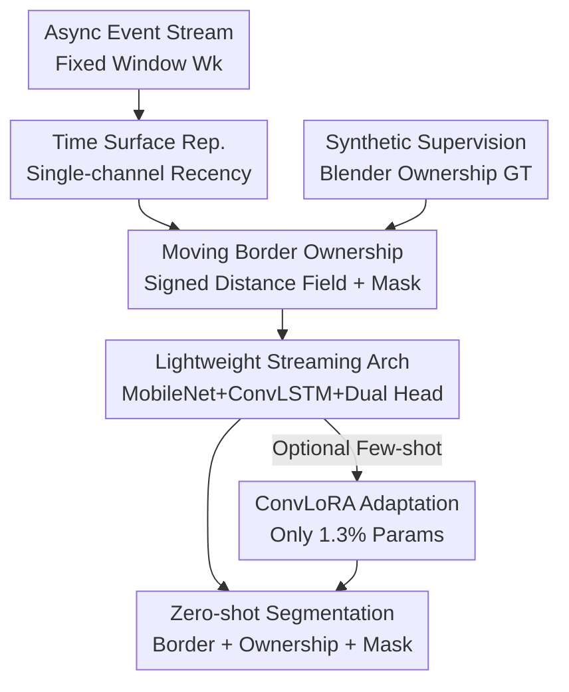

# Moving Border Ownership for Event-based Motion Segmentation

**Conference**: CVPR 2026  
**Paper**: [CVF Open Access](https://openaccess.thecvf.com/content/CVPR2026/html/Hua_Moving_Border_Ownership_for_Event-based_Motion_Segmentation_CVPR_2026_paper.html)  
**Area**: Event Cameras / Motion Segmentation  
**Keywords**: Event Camera, Motion Segmentation, Border Ownership, Synthetic Data, Zero-shot Generalization

## TL;DR
This paper reformulates event-based motion segmentation as "moving border ownership" prediction—detecting motion boundaries while simultaneously determining which side of the boundary belongs to the foreground moving object. By training a lightweight time-surface + MobileNet + ConvLSTM network with perfect supervision from Blender synthetic data, the model achieves zero-shot transfer to four real-world datasets (EED / EVIMO1 / EVIMO2 / EMSMC), reaching event-domain SOTA and running in real-time at 200 FPS.

## Background & Motivation

**Background**: Neuromorphic event sensors provide precise information at motion boundaries, making them naturally suited for independent motion segmentation. Existing methods fall into two categories: model-driven geometric methods (contrast maximization, motion clustering, optical flow clustering), which fit motion models to assign events to different motion layers; and learning-driven methods, which directly regress motion masks from event representations.

**Limitations of Prior Work**: When the camera itself is moving, the event stream contains a mixture of ego-motion and object motion, which must be decoupled for segmentation. Model-driven geometric methods rely on heavy assumptions (preset number of motion layers, temporal windows, various thresholds) and are computationally slow. Learning-based methods suffer from poor generalization—most are trained per-dataset, leading to performance drops when sensors or datasets change. Unsupervised Domain Adaptation (UDA) can transfer from RGB/Flow to events but still requires an adaptation phase.

**Key Challenge**: Current learning pipelines only produce "moving object masks," discarding a crucial clue for occlusion reasoning: border ownership. This refers to which side of a boundary is foreground versus background. Without ownership information, segmentation becomes blurred when objects occlude each other or pass through different depth layers.

**Goal**: To train a lightweight model capable of both locating moving objects and predicting their boundaries/border ownership, using **synthetic-only training and zero-shot transfer to real data** without per-dataset parameter tuning.

**Key Insight**: The authors draw inspiration from biological vision—neuroscience work by Meister et al. found that separation of object and background motion begins as early as the retinal ganglion cells, where some cells selectively respond to object motion. This suggests that moving object detection can be a simple, robust early mechanism. The authors argue that effective motion segmentation should learn boundaries and ownership rather than just object positions, echoing key computations in biological vision.

**Core Idea**: Transform motion segmentation into "ownership-aware boundary understanding." An **ownership-signed distance field** replaces simple binary masks, concentrating supervision on the motion boundaries where events actually occur, allowing occlusion reasoning to emerge naturally as a byproduct of segmentation.

## Method

### Overall Architecture

The system is a streaming pipeline consisting of "time-surface input → spatial encoding → temporal memory → dual-head decoding," with synthetic data generation and optional few-shot adaptation. The input is an asynchronous event stream within a fixed-duration window, compressed into a single-channel time surface. A MobileNetV3 encoder extracts spatial features, while a ConvLSTM maintains temporal memory across windows. A U-Net style decoder upsamples to the original resolution, splitting into two parallel prediction heads: one regressing a signed border ownership field $\hat{b}_k$, and one outputting a motion mask $\hat{m}_k$ via sigmoid. Supervision comes entirely from a Blender synthetic dataset, which provides perfect instance segmentation, depth, and motion masks to automatically construct ownership ground truth. During inference, the model runs zero-shot on real data; for difficult datasets, ConvLoRA is used for few-shot fine-tuning with minimal parameters.

### Key Designs

**1. Moving Border Ownership Formulation: Encoding "Which Side is Foreground" via Signed Distance Fields**

This is the conceptual core, addressing the loss of occlusion cues in standard masks. Instead of regressing binary masks, the network regresses a continuous, signed ownership field. Border pixels are defined as those at the junction of two or more instances in a 4-connected neighborhood. Each such pixel is **owned by the instance with the nearest depth** (closest to the camera); owned border pixels are set to $0$. For every pixel inside a foreground instance, the Euclidean distance to its nearest "owned border" is calculated, negated, and truncated to $[-10, 0]$. Thus, the ownership field transitions smoothly from $0$ at the boundary to $-10$ deep inside the object. Background and unlabeled regions are assigned a sentinel value and excluded from supervision.

This design offers two advantages: first, the sign itself encodes which side is foreground—one side is negative (foreground) and the other is the background sentinel; occlusion is defined by depth and expressed by the sign. Second, the distance field is continuously differentiable, providing more stable gradients than binary masks and focusing learning on the motion boundaries where events are dense. Ablations show that removing ownership supervision and using only binary masks causes EVIMO2 zero-shot performance to drop from 81.55 to 76.00 mIoU, resulting in blurrier boundaries and more false positives.

**2. Synthetic Supervision: Blender Pipeline for Perfect Ownership GT**

Border ownership ground truth is nearly impossible to obtain for real event data due to noise, limited temporal resolution, and calibration errors. The authors bypass this using a BlenderProc-driven pipeline: combining real indoor scenes from the Replica dataset (18 room types) with diverse dynamic objects from ShapeNet (sampled from 52,472 objects, with 3–8 per scene). Objects follow random 3D Lissajous trajectories, while the camera moves along jittery orbital paths, both using cubic splines to ensure physically plausible velocity curves. Sequences are rendered at 1200 FPS (real-world equivalent) at 640×480, simulating events using V2E's log-intensity threshold model (thresholds sampled between 0.1–0.3) with leak/shot noise added.

Crucially, every frame provides RGB, depth, instance segmentation, and binary motion masks. Instance segmentation gives precise boundaries, depth discontinuity encodes occlusion, and combining them **automatically constructs** the signed ownership field, placing supervision precisely where the event camera has measurements. The dataset contains 716 sequences, each with 360–500 frames, totaling 1.6TB. Ray-tracing ensures photorealism to narrow the sim-to-real gap. Ablations reveal that even when EVIMO2 GT is available, synthetic-only training (81.55) outperforms real-only training (74.52) due to cleaner supervision and larger coverage.

**3. Lightweight Streaming Architecture: Time-surface + MobileNet + ConvLSTM + Dual Head**

This design satisfies the need for real-time, lightweight processing while maintaining temporal context. The input representation is a single-channel time surface $T_k(u) = \frac{t_{\text{last}}(u) - \tau_k}{\Delta t}$, representing the normalized recency of the last event. Since temporal context is handled by recurrent hidden states, **multi-frame stacking is unnecessary**, keeping the input single-channel and preprocessing minimal.

The backbone is MobileNetV3-Large, with all BatchNorm layers replaced by GroupNorm to stabilize streaming inference with batch size 1. A ConvLSTM unit $h_k = \text{ConvLSTM}(\phi(T_k), h_{k-1})$ follows the encoder; its hidden state rolls forward within a scene and resets at boundaries, providing temporal memory. A U-Net style decoder with skip connections upsamples to original resolution, splitting into a boundary head $\hat{b}_k = g_b(h_k)$ and a motion head $\hat{m}_k = \sigma(g_m(h_k))$. Auxiliary prediction heads (deep supervision) are attached at intermediate scales to encourage sharp boundary structures early in the decoder. The model has 16.8M parameters and runs at 200 FPS on an RTX 2080Ti, roughly 2× real-time.

**4. ConvLoRA Few-shot Adaptation: Bridging Sim-to-Real with 1.3% Parameters**

For real-world datasets where zero-shot performance is insufficient, the authors use Convolutional Low-Rank Adaptation (ConvLoRA). After synthetic pre-training, the backbone is frozen, and only lightweight adapters are optimized. These are inserted only into the **decoder and prediction heads where domain shift is most severe**, while the general encoder remains unchanged. This adds only 1.3% trainable parameters but pushes EVIMO2 performance from a strong 81.55 zero-shot to 85.12 mIoU, surpassing the best model-driven method VCM (84). This decouples "general feature extraction" from "domain-specific output."

### Loss & Training

The total loss combines boundary ownership regression and motion mask segmentation across multiple scales. The boundary loss is a spatially-weighted MSE:

$$L_b = \frac{1}{|\Omega|}\sum_{u\in\Omega}\omega_k(u)\big(\hat{b}_k(u) - b_k(u)\big)^2,$$

where the weight $\omega_k(u)$ emphasizes the narrow band near boundaries—pixels within 10 pixels of a boundary have a weight of 10, otherwise 1. The motion mask uses standard pixel-wise binary cross-entropy $L_m$. Multi-scale aggregation upsamples auxiliary predictions and applies the same loss, with the total objective for a window being $L_k = L_b + L_m + \sum_{s\in S}\alpha_s(L_b^{(s)} + L_m^{(s)})$ and $\alpha_s = 0.5$.

## Key Experimental Results

### Main Results

Zero-shot comparison on five EVIMO1 scenes (mIoU, Ours not trained on EVIMO1):

| Method | Modality | Table | Box | Floor | Plain Wall | Fast Motion | Average ↑ |
|------|------|-------|-----|-------|------------|-------------|-------|
| EMSGC (Model-driven) | Event | 55 | 24 | 18 | 24 | 43 | 32.8 |
| SpikeMS | Event | 50 | 65 | 53 | 63 | 38 | 53.8 |
| GConv | Event | 51 | 60 | 55 | 80 | 39 | 57 |
| EVDodgeNet | Event+Flow | 70 | 67 | 61 | 72 | 60 | 66 |
| EVIMO | Event+Flow+Depth | 79 | 70 | 59 | 78 | 67 | 70.6 |
| **Ours (Zero-shot)** | **Event** | 74 | 77 | 69 | 65 | 63 | **69.6** |

Ours achieves 69.6 mIoU zero-shot using only events, matching the EVIMO pipeline (70.6) which uses events, flow, and depth, while significantly outperforming previous event-only learning methods. EVIMO2 main results and fine-tuning:

| Method | Modality | mIoU↑ |
|------|------|-------|
| EMSGC (Model-driven) | Event | 64.38 |
| MSEE | Event | 77.4 |
| VCM (Prev. SOTA Model-driven) | Event | 84 |
| UDA | RGB+Event | 63.4 |
| SemanticAided | Semantic+Depth | 79.82 |
| **Ours (Zero-shot)** | Event | 81.55 |
| **Ours (ConvLoRA Fine-tune)** | Event | **85.12** |

Zero-shot performance already exceeds learning methods relying on extra cues; fine-tuning surpasses the model-driven SOTA.

### Ablation Study

| Configuration | EVIMO2 mIoU | Description |
|------|-------------|------|
| Full (Ownership Supervision) | 81.55 | Signed distance ownership field |
| Binary Mask Only | 76.00 | Remove ownership, drop of 5.55; blurrier boundaries |
| Real-only Training | 74.52 | Trained only on EVIMO2 real data |
| Synthetic-only Training | 81.55 | Synthetic is cleaner/larger, outperforming real |
| Synthetic 1× (1200 FPS) | 80.02 | Frame rate / event density check |
| Synthetic 4× (4800 FPS) | 81.55 | Threshold for gains |
| Synthetic 8× (9600 FPS) | 81.39 | Diminishing returns |

### Key Findings
- **Ownership supervision is the primary driver of Gain**: Removing ownership and using only binary masks drops EVIMO2 zero-shot performance by 5.55 mIoU (81.55 → 76.00), with noticeably worse boundary quality.
- **Synthetic > Real**: Even with EVIMO2 GT available, synthetic-only training (81.55) is superior to real-only training (74.52) due to precise, noise-free supervision.
- **Diminishing returns on frame rate**: Increasing rendering from 1200 to 9600 FPS resulted in minimal mIoU changes; once pixel motion per frame is $\le 1$px, higher frame rates do not provide richer event information.
- **Failure Modes**: Performance degrades under lighting changes, slow motion, high sensor noise, and motion parallax where motion alone cannot disambiguate ownership.

## Highlights & Insights
- **Promoting "Border Ownership" to a First-class Representation**: Unlike prior work outputting only masks, this paper uses signed distance fields to encode "which side is foreground" directly, making occlusion reasoning a natural byproduct.
- **Synthetic Perfection Surpassing Real Data**: Since real data lacks reliable ownership GT, the authors use Blender to create perfect supervision, proving synthetic training can outperform real-world training for this task.
- **Practical Biological Motivation**: The design moves beyond high-level bio-inspiration, mapping specifically to retinal ganglion cell functions via "border + ownership" learning.
- **Transferable Trick**: The signed distance field + narrow-band weighted MSE supervision could be transferred to any dense prediction task requiring figure-ground or occlusion relationships.

## Limitations & Future Work
- **Dependency on Stable Boundary Events**: The method relies on moving object boundaries producing clear event structures; it degrades under slow motion or high noise.
- **Moving-object Specificity**: Current formulation targets moving objects; it does not handle general figure-ground boundaries for stationary scenes under pure ego-motion.
- **ConvLoRA Scope**: Adaptation was primarily validated on EVIMO2; verification across more sensors/environments is future work.
- **Sim-to-Real Gap**: While synthetic training is effective, shifts in event statistics (e.g., lighting) remain failure modes.

## Related Work & Insights
- **vs. Model-driven Geometric Methods (EMSGC / VCM)**: These fit motion models to cluster events, which is computationally heavy and requires preset parameters; Ours predicts ownership fields directly, reaching 81.55 zero-shot (near VCM's 84) and 85.12 after fine-tuning while maintaining real-time performance.
- **vs. Event Learning Methods (SpikeMS / GConv / EVIMO)**: These focus on masks and often require multi-modal data or per-dataset training; Ours achieves cross-dataset zero-shot transfer using only events by leveraging border ownership.
- **vs. Unsupervised Domain Adaptation (UDA)**: UDA helps bridge RGB to events but requires an adaptation phase; Ours focuses on zero-shot transfer without intermediate adaptation.

## Rating
- Novelty: ⭐⭐⭐⭐⭐ Reformulating motion segmentation as ownership prediction via signed distance fields is a clean and effective innovation.
- Experimental Thoroughness: ⭐⭐⭐⭐ Zero-shot across four datasets plus extensive ablations; ownership GT is missing on real data, so some comparisons are indirect.
- Writing Quality: ⭐⭐⭐⭐ Method and motivation are clearly linked; flows logically from data generation to architecture.
- Value: ⭐⭐⭐⭐⭐ SOTA zero-shot performance and 200 FPS real-time execution provide high practical value for robotics and autonomous driving.

<!-- RELATED:START -->

## Related Papers

- [\[CVPR 2026\] DIMOS: Disentangling Instance-level Moving Object Segmentation](dimos_disentangling_instance-level_moving_object_segmentation.md)
- [\[CVPR 2026\] GeoMotion: Rethinking Motion Segmentation via Latent 4D Geometry](geomotion_rethinking_motion_segmentation_via_latent_4d_geometry.md)
- [\[ECCV 2024\] Un-EVIMO: Unsupervised Event-based Independent Motion Segmentation](../../ECCV2024/segmentation/un-evimo_unsupervised_event-based_independent_motion_segmentation.md)
- [\[CVPR 2026\] SPOT: Spatiotemporal Prompt Optimization for Motion-Stabilized MLLM-Guided Video Segmentation](spot_spatiotemporal_prompt_optimization_for_motion-stabilized_mllm-guided_video_.md)
- [\[ECCV 2024\] Unsupervised Moving Object Segmentation with Atmospheric Turbulence](../../ECCV2024/segmentation/unsupervised_moving_object_segmentation_with_atmospheric_turbulence.md)

<!-- RELATED:END -->
