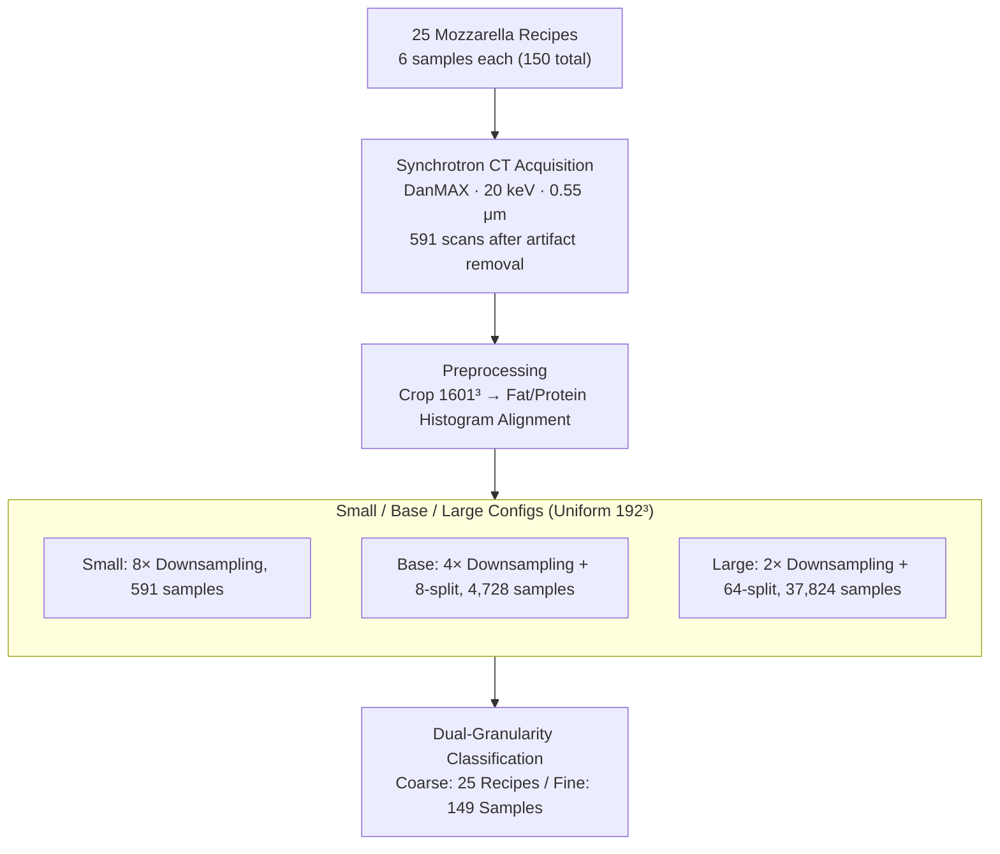

# MozzaVID: Mozzarella Volumetric Image Dataset

**Conference**: CVPR 2026  
**arXiv**: [2412.04880](https://arxiv.org/abs/2412.04880)  
**Code**: [https://papieta.github.io/MozzaVID/](https://papieta.github.io/MozzaVID/) (Available, open dataset)  
**Area**: 3D Vision  
**Keywords**: Volumetric Image Dataset, 3D Classification, X-ray CT, Food Microstructure, Deep Learning Benchmark  

## TL;DR

This paper introduces MozzaVID—a volumetric image classification dataset of mozzarella cheese microstructures based on synchrotron X-ray CT. It contains 591 to 37,824 volumetric samples of size $192^3$, with classification targets covering 25 cheese recipes and 149 samples. It bridges the massive gap in scale and task design between 3D volumetric datasets and 2D datasets. Experiments demonstrate that 3D models significantly outperform 2D models.

## Background & Motivation

1. **Background**: Volumetric images (3D CT, MRI, etc.) are widely applied in medicine, materials science, and food science. Deep learning development in these fields is increasingly active. In the 2D domain, standard benchmarks like MNIST (60,000) and ImageNet (14 million) have driven significant architectural innovation.

2. **Limitations of Prior Work**: Volumetric datasets face severe shortcomings: (a) **Small Scale**: The largest volumetric datasets (e.g., BugNIST with 9,154, PN9 with 8,798) are much smaller than 2D counterparts; (b) **Poor Accessibility**: Many medical datasets require registration, data agreements, or contacting authors; (c) **Specialized Tasks**: Most datasets focus on specific diagnostic problems, making them unsuitable as general benchmarks; (d) **Lack of Classification Benchmarks**: Most volumetric datasets focus on segmentation or detection, with fewer classification targets.

3. **Key Challenge**: Due to the lack of large-scale general volumetric benchmarks, 3D deep learning researchers cannot compare different architectures on a unified standard as in the 2D domain. Consequently, new models are often evaluated on single specialized datasets, limiting generalizability and comparability. Many 3D methods simply adapt 2D architectures to 3D, potentially missing opportunities for 3D-specific optimization.

4. **Goal**: To create a large-scale, clean, multi-purpose, and publicly available volumetric image classification benchmark to bridge the scale gap between 2D and 3D datasets.

5. **Key Insight**: The microstructure of mozzarella cheese is anisotropic and highly disordered—it can be partitioned into smaller volume blocks arbitrarily without introducing bias. This allows deriving up to 37,824 samples from 591 original scans, a unique advantage of food microstructures.

6. **Core Idea**: Leverage the disorder and separability of mozzarella microstructures to construct an unprecedentedly large 3D classification benchmark (37K+ volumes) while verifying the indispensability of 3D representations for volumetric tasks.

## Method

### Overall Architecture

The construction pipeline of MozzaVID consists of: (1) Cutting 6 samples from each of the 25 different mozzarella recipes (150 total), performing 4 local tomographic scans per sample (600 total, 591 after removing 9 artifacts); (2) High-resolution CT scanning at the MAX IV synchrotron (DanMAX beamline) using 20 keV energy and 0.55 $\mu$m pixel size; (3) Preprocessing (artifact removal, cropping, fat/protein phase histogram alignment) and deriving data into Small/Base/Large tiers with a uniform $192^3$ volume output; (4) Defining dual-granularity classification targets: Coarse (25 recipes) and Fine (149 samples).

### Key Designs

**1. Synchrotron CT Acquisition: High contrast for low-contrast protein vs. fat microstructures**

The X-ray attenuation coefficients of protein and fat in mozzarella are very close. Using standard laboratory micro-CT results in high noise and poor contrast. This work utilizes the MAX IV synchrotron (DanMAX beamline)—its high flux and coherence are superior to laboratory sources. Each scan collects 2,601 projections with 1.5 ms exposure at $2356 \times 2688$ resolution (0.55 $\mu$m pixel size). Rapid exposure also mitigates thermal instability issues during long scans. Raw volumes undergo three preprocessing steps: removing 9 artifact-heavy scans (600 → 591), cropping to $1601 \times 1601 \times 2156$, and histogram alignment (segmenting fat/protein phases first, then normalizing intensity) to ensure gray-level comparability across scans.

**2. Small/Base/Large Configurations: Covering the spectrum from "typical volumetric scenarios" to "approaching 2D scales"**

Volumetric datasets are generally small; benchmarks with tens of thousands to millions of samples like in 2D are nearly non-existent in 3D. Utilizing the "absence of fixed macro-shapes/boundaries" in mozzarella structures, this work derives three scales from the same scans. All start from a $1536^3$ center cube: Small (8X downsampling, 591 volumes); Base (4X downsampling + 8-split, 4,728 volumes); Large (2X downsampling + 64-split, 37,824 volumes). All output $192^3$ volumes, allowing researchers to establish stable baselines on "Large" while reproducing "data-constrained" real-world dilemmas on "Small/Base".

**3. Dual-Granularity Classification: Grading difficulty from "feasible" to "challenging"**

The dataset provides two layers of labels: Coarse (25 cheese recipes resulting from different cooking temperatures, screw speeds, and additives) and Fine (149 specific samples where 6 samples per recipe vary subtly due to spatial locations). There is a natural hierarchy: same-recipe cheeses are "shallowly similar," different samples of the same cheese are "moderately similar," and different scans of the same sample are "highly similar." Coarse classification on "Large" reaches 97.3% accuracy (feasible), while Fine classification on "Base" reaches only 73.3% (challenging), covering diverse volumetric task scenarios.

### Loss & Training

Cross-entropy loss is used, assessed by test set accuracy. AdamW optimizer, effective batch size 32, with tuned learning rates ($10^{-4}$ for large models). Data augmentation includes random XY-axis flips. Early stopping is applied at 30 epochs for CNNs and 50 epochs for Transformers. Models not converged within 5 days use the best performing checkpoint.

## Key Experimental Results

### Main Results

| Model | Coarse-3D-Large | Coarse-2D-Large | Fine-3D-Large | Fine-2D-Large |
|------|----------------|-----------------|---------------|---------------|
| ResNet50 | **0.973** | 0.777 | **0.935** | 0.770 |
| MobileNetV2 | 0.909 | 0.775 | 0.895 | 0.857 |
| ConvNeXt-S | 0.806 | 0.621 | 0.877 | 0.652 |
| ViT-B/16 | 0.731 | 0.474 | 0.855 | 0.442 |
| Swin-S | 0.896 | 0.620 | 0.922 | 0.686 |
| **Average** | **0.863** | **0.653** | **0.905** | **0.681** |

3D models are significantly superior to 2D models by 21-22 percentage points on average.

### Ablation Study (Dataset Scale)

| Configuration | Coarse-3D | Coarse-2D | 说明 |
|------|-----------|-----------|------|
| Small (591) | 0.614 (avg) | 0.367 (avg) | Severe overfitting due to limited data |
| Base (4,728) | 0.799 (avg) | 0.625 (avg) | Moderate scale, gap narrows |
| Large (37,824) | 0.863 (avg) | 0.653 (avg) | Largest scale, maximum 3D advantage |

### Key Findings

- **3D Representation is Irreplaceable**: Even 3D Coarse-Base (4,728 samples) outperforms most 2D Large models (37,824 samples), indicating that 3D spatial information is more critical than data volume for such tasks.
- **ResNet50 is the most robust** across all 3D configurations, outperforming modern ConvNeXt and ViT models. This suggests current state-of-the-art architectures might be over-optimized for 2D, leaving room for 3D-specific optimization.
- **Swin Transformer performs exceptionally well**, showing reasonable performance even on Small/Base configurations despite Transformers' typical data hunger.
- **UMAP embeddings show meaningful structural representations**: Cheeses with similar recipes cluster closer in embedding space, aligning well with the PCA space of chemical parameters.

## Highlights & Insights

- **Disorder as an Advantage**: Because mozzarella lacks regular repeating patterns, it can be split freely without losing information. This insight cleverly converts material properties into a design advantage for the dataset.
- **Three Configurations covering the full spectrum**: A single dataset satisfies multiple research needs from typical volumetric small-data scenarios to large benchmark scales.
- **Classification as a Structural Tool**: The classifier’s embedding space quantifies and visualizes microstructure variability, offering direct value to food science beyond being a method benchmark.
- **First 3D DL Dataset for Food Microstructure**: Fills a gap at the intersection of food science and computer vision.

## Limitations & Future Work

- **Classification Only**: Lack of segmentation or detection ground truth. While this was necessary for the splitting strategy, it limits task diversity.
- **High Accuracy on "Large" (97.3%)**: Leaves limited room for future improvement on the coarse task; the Small/Base configurations remain more challenging.
- **Single Source**: Limited to mozzarella. While the authors argue for visual similarity to other medical/organic volumetric data, its value as a general benchmark for other materials needs verification.
- **Scan Direction Bias**: Fiber direction in certain cheeses might be used by models as a shortcut, though ablations suggest the effect is minor.
- **Lack of Pre-training**: All models are trained from scratch, which might disadvantage data-hungry architectures like ViT. Future work could explore self-supervised pre-training on volumetric data.

## Related Work & Insights

- **vs. BugNIST**: Both are non-medical 3D classification datasets. BugNIST has 9,544 samples but simpler baseline classification. MozzaVID-Large has 4× the samples and more challenging targets.
- **vs. MedMNIST 3D**: MedMNIST 3D has 1,633-1,908 samples at low resolution ($64^3$). MozzaVID is better suited for benchmarking due to higher sample counts and category variety.
- **vs. 2D Food Datasets (FoodSeg103/Recipe1M+)**: These are 2D photo datasets for recognition, whereas MozzaVID focuses on 3D microstructure analysis.

## Rating

- Novelty: ⭐⭐⭐⭐ First large-scale 3D food microstructure dataset with creative material selection.
- Experimental Thoroughness: ⭐⭐⭐⭐ Comprehensive coverage across 5 architectures, 3 configurations, and 2D/3D paradigms.
- Writing Quality: ⭐⭐⭐⭐ Exemplary dataset paper with thorough related work research.
- Value: ⭐⭐⭐⭐ Fills a significant gap in 3D benchmarking; likely to become a standard test set for volumetric deep learning.

## Related Papers

- [\[CVPR 2026\] Volumetric Functional Maps](volumetric_functional_maps.md)
- [\[CVPR 2026\] Radiance Meshes for Volumetric Reconstruction](radiance_meshes_for_volumetric_reconstruction.md)
- [\[CVPR 2026\] OLATverse: A Large-scale Real-world Object Dataset with Precise Lighting Control](olatverse_a_large-scale_real-world_object_dataset_with_precise_lighting_control.md)
- [\[CVPR 2026\] PackUV: Packed Gaussian UV Maps for 4D Volumetric Video](packuv_packed_gaussian_uv_maps_for_4d_volumetric_video.md)
- [\[CVPR 2026\] Color-Encoded Illumination for High-Speed Volumetric Scene Reconstruction](color-encoded_illumination_for_high-speed_volumetric_scene_reconstruction.md)

<!-- RELATED:END -->

<!-- RELATED:START -->

## Related Papers

- [\[CVPR 2026\] Volumetric Functional Maps](volumetric_functional_maps.md)
- [\[CVPR 2026\] Radiance Meshes for Volumetric Reconstruction](radiance_meshes_for_volumetric_reconstruction.md)
- [\[CVPR 2026\] PackUV: Packed Gaussian UV Maps for 4D Volumetric Video](packuv_packed_gaussian_uv_maps_for_4d_volumetric_video.md)
- [\[CVPR 2026\] Color-Encoded Illumination for High-Speed Volumetric Scene Reconstruction](color-encoded_illumination_for_high-speed_volumetric_scene_reconstruction.md)
- [\[CVPR 2026\] Artiverse: A Diverse and Physically Grounded Dataset for Articulated Objects](artiverse_a_diverse_and_physically_grounded_dataset_for_articulated_objects.md)

<!-- RELATED:END -->
