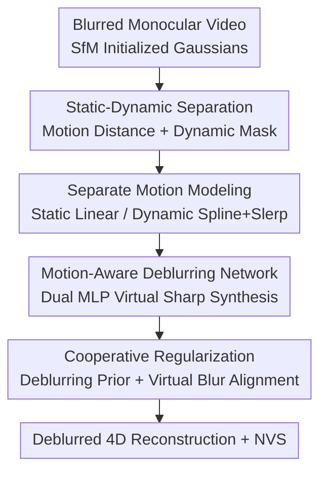

# MSCD-GS: Motion-Separated Cooperative Deblurring Dynamic Reconstruction via Gaussian Splatting

**Conference**: CVPR 2026  
**Paper**: [CVF Open Access](https://openaccess.thecvf.com/content/CVPR2026/html/Liao_MSCD-GS_Motion-Separated_Cooperative_Deblurring_Dynamic_Reconstruction_via_Gaussian_Splatting_CVPR_2026_paper.html)  
**Code**: https://liaoyongjian1.github.io/MSCD-GS/ (Project Page)  
**Area**: 3D Vision  
**Keywords**: 4D Gaussian Splatting, Motion Deblurring, Dynamic Reconstruction, Static-Dynamic Separation, Cooperative Supervision

## TL;DR
To address the pervasive motion blur in dynamic scenes captured by monocular cameras, MSCD-GS categorizes Gaussian points into static and dynamic types to separately model their motion during exposure. Two motion-aware MLPs are utilized to synthesize virtual sharp images, which are then combined with a deblurring network prior for cooperative regularization. This approach reconstructs high-quality 4D dynamic scenes from blurred inputs, outperforming existing methods in both deblurring and novel view synthesis on Stereo Blur and real-world datasets with faster training speeds.

## Background & Motivation
**Background**: 4D reconstruction based on 3D Gaussian Splatting (3DGS) treats time as the fourth dimension, enabling real-time rendering and explicit modeling of time-varying geometry and appearance. It has been widely applied in dynamic SLAM, autonomous driving, and robotic perception. However, the majority of these methods assume sharp images as input.

**Limitations of Prior Work**: Real-world monocular cameras integrate light over a finite exposure time. If the camera or objects move during this period, motion blur becomes inevitable. Blur is divided into camera motion blur (global offset of the background) and object motion blur (intertwined non-linear motion), the latter being significantly harder to handle. Direct supervision of 4DGS with blurred images severely degrades rendering quality.

**Key Challenge**: A naive approach is to use a deblurring network (e.g., NAFNet) as a pre-processor before feeding images to 4DGS. However, Table 1 suggests this approach is capped by the deblurring network's performance; reconstruction quality is limited by the single-frame network, which lacks 3D geometric awareness and temporal consistency. Other methods like BARD-GS and Deblur4DGS, while capable, rely heavily on extensive priors like depth maps, trajectories, or optical flow, limiting their utility.

**Goal**: To organically combine the "deblurring network" and "4DGS" without piling up priors, leveraging the quality of deblurring priors while correcting their instabilities through 4D geometric consistency.

**Key Insight**: The authors revisit the physical principle of motion blur—a blurred image is the integral average of multiple virtual sharp images during exposure. Since static backgrounds and dynamic objects exhibit distinct motion characteristics (rigid global linear motion vs. independent non-linear motion), they should be modeled separately rather than with a single rigid model.

**Core Idea**: Separate Gaussian points into static/dynamic categories and model their respective motions during exposure to synthesize virtual sharp images. Use a dual-path cooperative supervision strategy involving a "deblurring network prior" and "virtual blurred image synthesis" to avoid over-fitting to the deblurring network's output.

## Method

### Overall Architecture
The input consists of a monocular video with motion blur and corresponding camera parameters. The goal is to reconstruct a high-quality deblurred 4D scene. The workflow is: initialize Gaussian point clouds using SfM on blurred images; separate Gaussians into static and dynamic categories based on motion distance and dynamic masks; model separate motion trajectories for each category and use two motion-aware MLPs to predict deformations at multiple timestamps during exposure to render virtual sharp images; finally, apply cooperative regularization where one path uses pre-trained NAFNet results as a prior and the other aligns a synthesized virtual blurred image with the real input.

To enhance stability, blurred images are divided into $N$ subsets $\Phi=\{I_1\cdots I_N\}$, where motion is continuous and small, enabling progressive reconstruction of the full 4D scene.

### Key Designs

**1. Static-Dynamic Separation: Decoupling Background and Objects via Motion Distance and Masks**

Camera-induced and object-induced blur follow different laws. The authors use BootsTAPIR to track pixel motion and generate 2D dynamic masks $M_D$. Gaussians whose 2D projections fall within the mask and whose motion distance is in the top $1.5\%$ are labeled as dynamic Gaussians $G_D$, with the rest labeled as static $G_S$. This allows the background to be modeled with rigid global motion and foreground objects with independent non-linear models.

**2. Separate Motion Modeling: Linear for Static, Catmull-Rom Spline + Slerp for Dynamic**

Static Gaussians are assumed to follow linear motion within the short subset time $\tau_d$: $\mu_S(t_i)=\mu_S(t_s)+\frac{t_i}{\tau_d}d$, requiring only an estimated displacement $d$. Dynamic trajectories are non-linear, modeled via Catmull-Rom splines for position $\mu_D(t_i)=T(t_i)\cdot M_\mu\cdot\mu$ and Spherical Linear Interpolation (Slerp) for rotation $q_D(t_i)=\frac{\sin((1-t_i)\theta)q_{-1}+\sin(t_i\theta)q_{+1}}{\sin\theta}$ in quaternion space. A dual-Gaussian decay model is used for opacity $\sigma(t_i)$ to handle objects entering or leaving the view smoothly.

**3. Motion-Aware Deblurring Network: Dual MLPs for Deformations during Exposure**

Exposure time is discretized into $N$ sampling moments. The static branch uses an MLP $F_S$ to predict rigid rotation $\Delta R$ and translation $\Delta T$ for $N$ virtual images. The dynamic branch uses a lightweight MLP $F_D$ (with position encoding and residual fusion) to predict displacement $\Delta\mu_D$, anisotropic scale $\Delta S$, and rotation $\Delta R_D$ for each dynamic Gaussian. Merging these yields virtual sharp images $I(t_i)$, and their average synthesizes the virtual blurred image $\hat{B}(t)=\frac{1}{N}\sum_{i=1}^N I(t_i)$.

**4. Cooperative Regularization: Balancing Priors and Physical Alignment**

To prevent the reconstruction from being capped by NAFNet's quality, the authors first optimize the 4DGS to a high-quality state using deblurred images $B_d$. Subsequently, real blurred images $B$ are introduced for a second path of supervision. The total loss is $L_{render}(t)=\lambda L'_{render}(t)+(1-\lambda)\sum\|B(t)-\hat{B}(t)\|_1$. The hyperparameter $\lambda=0.4$ balances the deblurring prior and the physical blur synthesis, ensuring the model ignores erroneous details from the prior.

### Loss & Training
Optimization occurs in two stages: initialization with deblurred images $B_d$, followed by cooperative regularization with real blurred images $B$. The number of virtual views $N=3$. Subsets are reconstructed progressively. Training was conducted on an NVIDIA A100 40GB.

## Key Experimental Results

### Main Results
Evaluated on the Stereo Blur dataset (6 scenes, 48 images each), MSCD-GS leads across all metrics with significantly shorter training times.

| Method | Deblur PSNR↑ | Deblur LPIPS↓ | NVS PSNR↑ | FPS↑ | Training (h)↓ |
|------|------|------|------|------|------|
| SoM + NAFNet | 29.01 | 0.101 | 27.76 | - | - |
| DyBluRF (CVPR'24) | 28.67 | 0.101 | 25.90 | 0.2 | 51.1 |
| BARD-GS (CVPR'25) | 30.21 | 0.096 | 27.02 | 80 | 4.62 |
| Deblur4DGS (arXiv'25) | 30.32 | 0.085 | 27.84 | 96 | 6.10 |
| **Ours** | **33.21** | **0.043** | **29.49** | **121** | **0.72** |

On the GoPro real-world dataset, MSCD-GS achieved a 28.13 PSNR, approximately 3 dB higher than the runner-up BARD-GS. Training time is nearly an order of magnitude faster.

### Ablation Study
Ablations on the "Man" scene (DN: Deblur Net, SGD: Static GS Deblurring, DGD: Dynamic GS Deblurring):

| Configuration (DN/SGD/DGD) | Deblur PSNR↑ | NVS PSNR↑ | Note |
|------|------|------|------|
| DN only | 29.50 | 27.01 | Capped by net ability |
| SGD only | 28.23 | 26.29 | Only fixes background |
| DGD only | 27.41 | 25.62 | Only fixes objects |
| DN + DGD | 30.15 | 28.25 | Background remains blurry |
| SGD + DGD | 31.02 | 29.33 | Low detail limit without prior |
| **All (Full)** | **31.72** | **29.64** | Best performance |

$N=3$ sampling moments proved to be the "sweet spot," providing the best balance between quality and speed.

### Key Findings
- **Cooperative Regularization**: Using the deblurring network as a prior while constraining it with physical blur synthesis (DN+SGD+DGD) yields a $0.7$ dB gain over (SGD+DGD), proving that the cooperative approach surpasses pure deblurring.
- **Modeling Necessity**: Both static and dynamic branches are required to maintain clarity across the entire scene.
- **Physical Fidelity**: A small number of virtual views ($N=3$) is sufficient to approximate the integral; the accuracy of the physical modeling is more critical than the density of sampling.

## Highlights & Insights
- **Explicit Physical Process**: Instead of treating deblurring as a black box, the model incorporates the "integral of sharp images = blurred image" principle into a differentiable framework.
- **Differentiated Motion Models**: Modeling the background linearly and the foreground with splines/Slerp is a prime example of tailoring mathematical models to physical laws, saving parameters and improving accuracy.
- **Breakthrough in Performance Caps**: By using real blurred images to pull the model back to the physical constraint surface, it avoids the artifacts and "ceiling" effects of standard 2D deblurring networks.
- **Efficiency**: Achieving SOTA results with $0.72$ h training and $121$ FPS demonstrates that smart architectural choices can outperform prior-heavy, computationally expensive methods.

## Limitations & Future Work
- The reliance on BootsTAPIR for pixel tracking and the $1.5\%$ threshold for static-dynamic separation may be unstable in scenes with extremely fast motion or dense dynamic objects.
- The linear motion assumption for static Gaussians relies on short subset durations and may fail under extreme camera shake or long exposures.
- The upper bound of clarity is still partially influenced by the NAFNet prior; the impact of stronger deblurring networks or potential bias introduction is not fully explored.
- Validated only on two real blurred datasets; scalability to large-scale scenes with multiple dynamic objects remains to be tested.

## Related Work & Insights
- **vs. Deblur4DGS / BARD-GS**: These methods rely heavily on depth, trajectories, or flow. MSCD-GS reaches higher quality with almost no such priors and is nearly $10\times$ faster.
- **vs. Naive Serializing**: Simple concatenation of deblurring networks and 4DGS is limited by the network's quality. This work uses the real blurred image as a second source of truth to break that limit.
- **vs. 2D Deblurring Networks**: Those methods lack 3D geometric awareness and produce temporal inconsistencies. MSCD-GS enforces spatio-temporal consistency through explicit 4D geometry.

## Rating
- Novelty: ⭐⭐⭐⭐ Solid physical motivation with static-dynamic separation, though individual components are well-known techniques.
- Experimental Thoroughness: ⭐⭐⭐⭐ Strong baseline comparisons and ablations, though test scenarios are somewhat limited in scale.
- Writing Quality: ⭐⭐⭐⭐ Clear explanation of theory and pipeline, with complete formulations.
- Value: ⭐⭐⭐⭐ High practical value for monocular dynamic scene reconstruction due to its efficiency and limited requirements for priors.

<!-- RELATED:START -->

## Related Papers

- [\[CVPR 2026\] Motion-Aware Animatable Gaussian Avatars Deblurring](motion-aware_animatable_gaussian_avatars_deblurring.md)
- [\[AAAI 2026\] MoBGS: Motion Deblurring Dynamic 3D Gaussian Splatting for Blurry Monocular Video](../../AAAI2026/3d_vision/mobgs_motion_deblurring_dynamic_3d_gaussian_splatting_for_blurry_monocular_video.md)
- [\[CVPR 2026\] Disco-GS: Gaussian Splatting in Dynamic Color Lighting](disco-gs_gaussian_splatting_in_dynamic_color_lighting.md)
- [\[CVPR 2026\] Space-Time Forecasting of Dynamic Scenes with Motion-aware Gaussian Grouping](space-time_forecasting_of_dynamic_scenes_with_motion-aware_gaussian_grouping.md)
- [\[CVPR 2026\] $L^{2}DGS$: Low-Light Dynamic Gaussian Splatting](l2dgs_low-light_dynamic_gaussian_splatting.md)

<!-- RELATED:END -->
