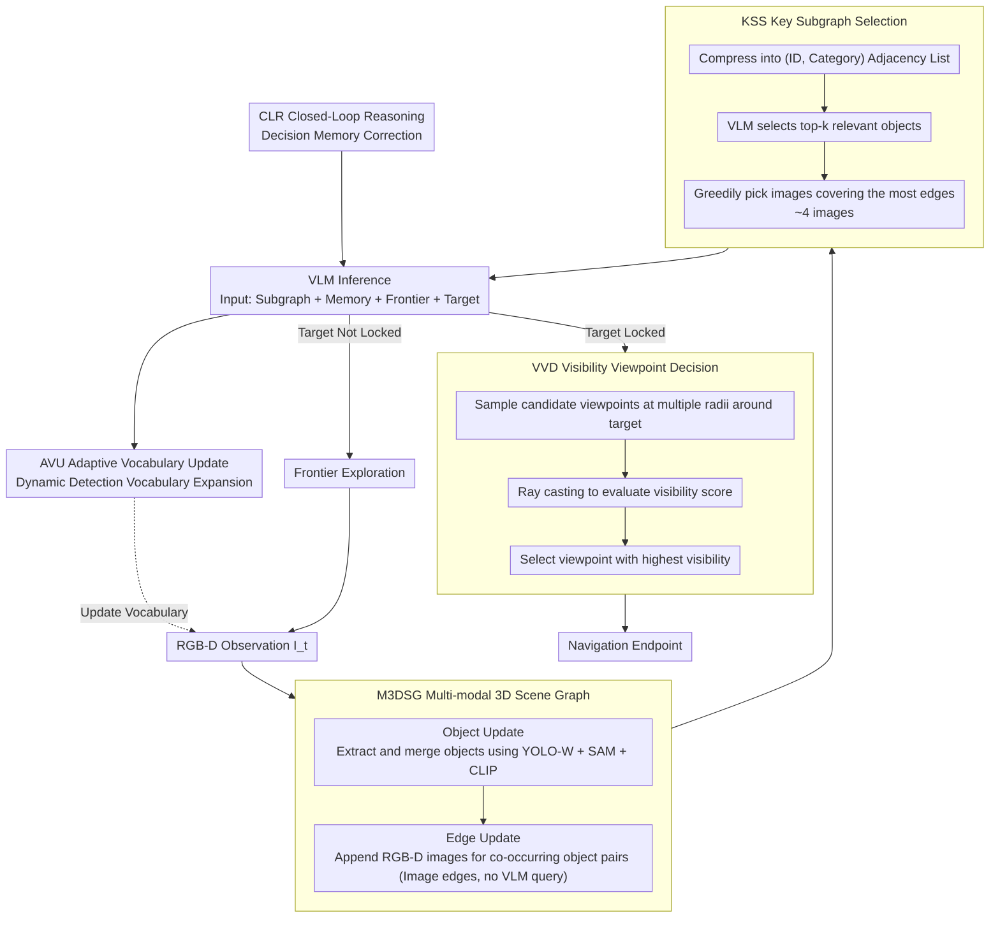

# MSGNav: Unleashing the Power of Multi-modal 3D Scene Graph for Zero-Shot Embodied Navigation

**Conference**: CVPR 2026  
**arXiv**: [2511.10376](https://arxiv.org/abs/2511.10376)  
**Code**: None  
**Area**: 3D Vision / Embodied Navigation  
**Keywords**: Embodied Navigation, 3D Scene Graph, Zero-Shot Navigation, Multi-modal Scene Graph, Viewpoint Decision, VLM

## TL;DR

A Multi-modal 3D Scene Graph (M3DSG) is proposed, utilizing dynamically allocated image edges instead of traditional text relation edges to preserve visual information. Based on this, a zero-shot navigation system, MSGNav, is constructed. A Visibility Viewpoint Decision (VVD) module is introduced to address the "last-mile" problem in navigation, achieving SOTA performance on GOAT-Bench and HM3D-ObjNav.

---

## Background & Motivation

Embodied Navigation requires agents to autonomously explore and navigate in unknown environments based on targets (category/language description/reference image). Traditional RL methods suffer from poor generalization and a significant sim-to-real gap, while zero-shot methods are more suitable for real-world deployment as they require no training or fine-tuning.

Recent zero-shot navigation methods based on explicit 3D scene graphs and LLM reasoning (e.g., SG-Nav) have shown promise. However, traditional 3D scene graphs overly abstract object relations into pure text labels ("top", "beside", etc.), leading to three serious issues:

**High Construction Cost**: Frequent MLLM calls are required to infer relations, incurring massive token and time overheads.

**Irreversible Loss of Visual Information**: Compressing rich visual observations into text labels increases ambiguity and sensitivity to perception errors.

**Limited Vocabulary**: New categories outside the preset vocabulary cannot be represented, limiting generalization capabilities.

Furthermore, the authors identify an overlooked "last-mile" problem: **knowing the target location does not equate to finding an appropriate navigation endpoint perspective**. Existing methods typically select the nearest traversable point as the target, but viewpoints that are too close or occluded lead to task failure—statistics show many 3D-Mem failure cases stop 0.25m to 1.0m from the target.

**Core Problem**: Visual information is indispensable for real-world navigation. The information bottleneck in traditional text scene graphs and the blind spots in viewpoint selection are two major obstacles to current performance improvement.

---

## Method

### Overall Architecture

This paper addresses two long-standing issues in zero-shot navigation: traditional 3D scene graphs compress object relations into text labels, which requires frequent VLM queries, loses visual information, and is limited by a fixed vocabulary; and the "last-mile" problem, where knowing the target location is insufficient without a viewpoint that provides visibility.

The overall workflow of MSGNav is "Incremental Scene Graph Construction → Efficient Inference → Optimal Viewpoint Decision." At each timestep $t$, the agent receives RGB-D observation $\mathcal{I}_t$ to incrementally update the scene graph $\mathbf{S}_t$. During inference, KSS first extracts a target-relevant subgraph from the expanded scene graph for the VLM, which then locates the target or decides on a frontier exploration direction. Once the target is locked, VVD selects a viewpoint with the highest visibility around the target as the navigation endpoint. The system consists of five modules: M3DSG, KSS, AVU, CLR, and VVD.

### Key Designs

**1. M3DSG Multi-modal 3D Scene Graph: Replacing text edges with image edges to save MLLM calls and retain visual data**

Traditional scene graphs abstract object relations into text labels, causing expensive construction, visual info loss, and limited vocabulary. M3DSG defines the scene graph as $\mathbf{S}=(\mathbf{O}, \mathbf{E})$. The key difference is that each edge stores a set of RGB-D images $\mathbf{I}_j$ recording the visual context of co-occurring object pairs instead of text. Construction involves two steps: Object Update uses YOLO-W (open-vocabulary detection) + SAM (instance mask) + CLIP (visual embedding) to extract objects from each frame, recording 8 attributes: ID, category, 3D coordinates, bounding box, mask, point cloud, visual features, and room location. New objects are merged with existing ones based on spatial and visual similarity. Edge Update appends the current image to the image set of co-occurring object pairs with distance less than threshold $\theta$, while maintaining a reverse mapping $\mathbf{H}$ from images to object pairs. Edge construction requires no VLM queries, making it efficient, preserving original visual evidence, and supporting infinite vocabulary expansion.

**2. KSS Key Subgraph Selection: Extracting only target-relevant images from the expanded scene graph**

As exploration proceeds, the scene graph expands rapidly. Feeding the entire graph to the VLM is slow and expensive. KSS shrinks it in three steps: Compress the scene graph into an adjacency list of (ID, Category); Focus by having the VLM select the top-$k$ object set $\mathbf{O}^{rel}$ most relevant to the target; Prune using a greedy dynamic allocation algorithm to select images covering the most edges, efficiently solving this set cover problem via the reverse mapping $\mathbf{H}$. The final key subgraph requires only about 4 images on average to represent the target context, reducing token overhead by over 95%.

**3. AVU Adaptive Vocabulary Update: Allowing the VLM to add new categories to the vocabulary during exploration**

Preset vocabularies (e.g., ScanNet-200) limit open-world generalization. During exploration, AVU has the VLM inspect edge images, compare them with existing objects, and dynamically propose a new vocabulary $\hat{V}_t$, which is merged into the total vocabulary $V_t = V_{t-1} \cup \hat{V}_t$, achieving incremental expansion.

**4. CLR Closed-Loop Reasoning: Using decision memory to avoid repetitive exploration errors**

Decision memory $\mathbf{M}$ is introduced to store each exploration decision $\mathcal{R}_t$ in a historical action library for future reference. Decisions and vocabulary updates are produced simultaneously:

$$\mathcal{R}_t, \hat{V}_t = \text{VLM}(\mathbf{S}^k, \mathbf{M}_t, \mathbf{F}, g, t)$$

By forming a closed loop through historical feedback, repeated erroneous decisions are avoided. AVU and CLR complement each other—AVU provides additional perceptual information to supplement CLR's strict decision-making, while CLR filters noise introduced by AVU's perception.

**5. VVD Visibility Viewpoint Decision: Addressing the last-mile problem of target occlusion**

Existing methods often use the nearest traversable point as the endpoint, but viewpoints that are too close or occluded cause task failure. VVD samples candidate viewpoints uniformly at multiple radii $\mathbf{R}$ around the target object $\bar{o}$. For each candidate $\mathbf{v}_i$, ray casting evaluates its visibility to the target point cloud $\mathcal{PC}_{\bar{o}}$. Points are sampled along the line of sight to check if they exceed an occlusion threshold $\tau$ from the nearest scene point cloud. The visibility score is the proportion of visible points in the target point cloud:

$$S_{\mathbf{v}_i} = \frac{1}{|\mathcal{PC}_{\bar{o}}|} \sum_{\mathbf{p} \in \mathcal{PC}_{\bar{o}}} \mathbb{1}_{\mathcal{E}(\mathbf{v}_i, \mathbf{p})}$$

The viewpoint with the highest score is selected as the navigation endpoint.

### Loss & Training

A zero-shot method requiring no training or fine-tuning. GPT-4o (2024-08-06) is used as the VLM backbone, YOLO-W for open-vocabulary detection, SAM for instance segmentation, and CLIP for visual embedding. The success distance threshold is 0.25m for GOAT-Bench and 1.0m for HM3D-ObjNav.

---

## Key Experimental Results

### Main Results: GOAT-Bench (Multi-modal Lifelong Open-Vocabulary Navigation)

| Method | Training-free | SR(%) ↑ | SPL(%) ↑ |
|---|:---:|:---:|:---:|
| SenseAct-NN Skill Chain | ✗ | 29.5 | 11.3 |
| VLMnav | ✓ | 20.1 | 9.6 |
| DyNaVLM | ✓ | 25.5 | 10.2 |
| 3D-Mem | ✓ | 28.8 | 15.8 |
| TANGO | ✓ | 32.1 | 16.5 |
| MTU3D (SOTA Training method) | ✗ | 47.2 | 27.7 |
| **MSGNav (Ours)** | **✓** | **52.0** | **29.6** |

MSGNav outperforms the training-based MTU3D by +4.8% SR and +1.9% SPL without any training.

### Main Results: HM3D-ObjNav

| Method | Training-free | SR(%) ↑ | SPL(%) ↑ |
|---|:---:|:---:|:---:|
| SG-Nav | ✓ | 49.6 | 25.5 |
| VLFM | ✗ | 62.6 | 31.0 |
| DORAEMON | ✓ | 66.5 | 20.6 |
| WMNav | ✓ | 72.2 | 33.3 |
| **MSGNav (Ours)** | **✓** | **74.1** | **33.4** |

### Ablation Study: Module Contributions (GOAT-Bench Val Unseen, 1st Episode)

| M3DSG | VVD | AVU | CLR | Overall SR(%) | Overall SPL(%) |
|:---:|:---:|:---:|:---:|:---:|:---:|
| | | | | 28.8 | 20.2 |
| ✓ | | | | 43.8 (+15.0) | 28.0 (+7.8) |
| ✓ | ✓ | | | 56.3 (+12.5) | 34.7 (+6.7) |
| ✓ | ✓ | ✓ | | 55.3 | 36.7 |
| ✓ | ✓ | | ✓ | 53.2 | 32.9 |
| ✓ | ✓ | ✓ | ✓ | **60.0** | **37.0** |

- M3DSG contributes the most (+15.0% SR), followed by VVD (+12.5% SR).
- AVU and CLR have limited effects or even degradation when used alone, but they are **complementary**: AVU provides extra perception to supplement CLR's strict decisions, while CLR filters AVU's noise.

### Ablation Study: Scene Graph Type Comparison

| Scene Graph Type | Overall SR(%) | Overall SPL(%) |
|---|:---:|:---:|
| Node-only (No edges) | 51.8 | 31.2 |
| Traditional graph (Text edges) | 56.2 | 32.7 |
| **M3DSG (Image edges)** | **60.0** | **37.0** |

Image edges improve performance by **+3.8% SR and +4.3% SPL** compared to text edges, with particularly significant gains on Language and Image targets.

### Key Findings

1. M3DSG is the most significant module, providing a +15.0% SR gain over the 3D-Mem baseline.
2. VVD recovers approximately 18% absolute SR at the standard 0.25m threshold, confirming that many failures occur during final viewpoint selection.
3. AVU and CLR are complementary—open-vocabulary expansion introduces noise, which closed-loop reasoning helps correct.
4. Image edges show a distinct advantage over text edges for Language and Image targets.
5. Viewpoints with VVD visibility scores > 0.6 consistently align with ground-truth viewpoints.

---

## Highlights & Insights

- **Replacing text edges with image edges** is a concise and efficient design: it avoids frequent MLLM inference calls while preserving rich visual context. "Less is more"—rather than laboriously abstracting relations into text, it is better to let the VLM understand relations from raw images.
- **Identification and formalization of the last-mile problem** is highly valuable. Navigation is not just about arriving; it is about arriving at a "good location," a factor often neglected in real robot deployment.
- The **Greedy Subgraph Selection algorithm** achieves a 95% token compression, requiring only 4 images on average, balancing efficiency with information density.
- Surpassing training-based methods in a zero-shot setting (52.0% vs 47.2%) demonstrates the significant potential of the scene representation + VLM reasoning paradigm.
- The system is highly modular, with each module independently validated through ablation, reflecting mature engineering design.

---

## Limitations & Future Work

1. **Inference Efficiency Bottleneck**: Reliance on online VFM and VLM inference (YOLO-W+SAM+CLIP+GPT-4o) makes real-time deployment difficult. Lightweight graph construction and inference schemes need exploration.
2. **Last-Mile Not Entirely Solved**: VVD mitigates but does not eliminate the problem. There is still room for improvement after relaxing success thresholds. RL-based active perception is a promising direction.
3. **VLM Dependency**: The system heavily relies on GPT-4o's reasoning and API, which is costly and network-dependent. Only Qwen-VL-Max was verified as an alternative in supplementary materials.
4. **Image Edge Storage Overhead**: The storage cost of retaining numerous RGB-D images is not discussed; long-term exploration might strain memory.
5. **Simulation-Only Validation**: Lacks experiments in real physical environments.

---

## Related Work & Insights

- **3D-Mem**: Emphasizes the value of raw images for navigation; M3DSG builds on this by introducing a scene graph structure to organize visual information.
- **ConceptGraphs** (ICRA 2024): A traditional open-vocabulary 3D scene graph using text relation edges; M3DSG's comparative experiments clearly highlight the advantages of image edges.
- **SG-Nav**: Also utilizes hierarchical scene graphs for navigation via text prompts for LLMs, but is limited by text relation representations.
- **GOAT-Bench** (CVPR 2024): A multi-modal lifelong navigation benchmark defining Category, Language, and Image target types.

**Insight**: Explicit 3D scene graphs combined with VLM reasoning have become the mainstream paradigm for zero-shot navigation. MSGNav suggests that the design of representation (Image vs. Text) may be more critical than the model selection itself—preserving original sensory data during construction and letting the VLM interpret it as needed during inference is a design principle worth promoting.

---

## Rating

| Dimension | Score (1-5) | Explanation |
|---|:---:|---|
| Novelty | 4 | Replacing text edges with image edges is simple and effective; formalizing the last-mile problem is novel. |
| Technical Quality | 4 | Sound module design, clear algorithms, and thorough ablation studies. |
| Experimental Thoroughness | 4.5 | Two benchmarks + comprehensive ablation + category analysis + VVD statistical validation. |
| Writing Quality | 4 | Clear problem definition, intuitive figures, and smooth logic. |
| Value | 3.5 | Inference efficiency remains limited by the online invocation of multiple large models. |
| **Overall** | **4.0** | A solid systematic work; M3DSG design is ingenious and significantly effective. |

<!-- RELATED:START -->

## Related Papers

- [\[CVPR 2026\] Multi-Scale Gaussian-Language Map for Zero-shot Embodied Navigation and Reasoning](multi-scale_gaussian-language_map_for_zero-shot_embodied_navigation_and_reasonin.md)
- [\[CVPR 2026\] GeoSAM2: Unleashing the Power of SAM2 for 3D Part Segmentation](geosam2_unleashing_the_power_of_sam2_for_3d_part_segmentation.md)
- [\[CVPR 2026\] Unleashing the Power of Chain-of-Prediction for Monocular 3D Object Detection](unleashing_the_power_of_chain-of-prediction_for_monocular_3d_object_detection.md)
- [\[CVPR 2026\] Zoo3D: Zero-Shot 3D Object Detection at Scene Level](zoo3d_zero-shot_3d_object_detection_at_scene_level.md)
- [\[CVPR 2026\] SAGE: Scalable Agentic 3D Scene Generation for Embodied AI](sage_scalable_agentic_3d_scene_generation_for_embodied_ai.md)

<!-- RELATED:END -->
