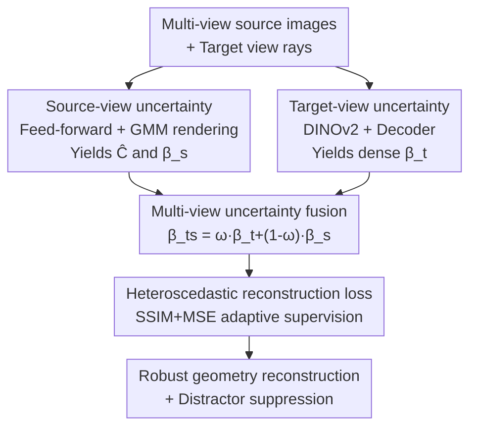

# MU-GeNeRF: Multi-view Uncertainty-guided Generalizable Neural Radiance Fields for Distractor-aware Scene

**Conference**: CVPR 2026  
**arXiv**: [2604.17965](https://arxiv.org/abs/2604.17965)  
**Code**: https://github.com/Yanyilucas/MU-GeNeRF (Available)  
**Area**: 3D Vision / Neural Radiance Fields  
**Keywords**: Generalizable NeRF, Distractor Suppression, Uncertainty Modeling, Heteroscedastic Loss, Novel View Synthesis  

## TL;DR
To address the issue where generalizable NeRF (GeNeRF) supervision signals are contaminated by transient distractors (pedestrians, shadows, dynamic objects) in dynamic real-world scenes, this paper decouples "distractor-awareness" into two complementary components: **source-view uncertainty** (structural inconsistency across source views) and **target-view uncertainty** (observation anomalies in the target image). These are fused via a heteroscedastic reconstruction loss. Within a feed-forward generalization framework, this approach locates distractors without damaging static structures, outperforming existing GeNeRFs and approaching the performance of per-scene optimized distractor-free NeRFs.

## Background & Motivation
**Background**: NeRF implicitly encodes scenes for novel view synthesis but requires per-scene optimization from scratch and assumes static geometry and lighting during capture. GeNeRF learns a "scene-agnostic multi-view aggregation prior," enabling feed-forward synthesis of target views from sparse source views, thus generalizing to unseen scenes without per-scene optimization.

**Limitations of Prior Work**: Real-world environments commonly contain transient distractors (moving people, cars, changing shadows), which break cross-view structural consistency and inject incorrect supervision during training, leading to blurred or distorted reconstructions. Existing distractor-free NeRFs (e.g., NeRF-W, NeRF on-the-go, UP-NeRF) are built on the per-scene optimization paradigm: they rely on "overfitting" consistency within a single scene and then estimating uncertainty from **per-view reconstruction errors** to identify distractors.

**Key Challenge**: This paradigm cannot be directly transferred to the generalization setting. GeNeRF is not optimized for each scene individually, so its reconstruction error sources are mixed—they may stem from **transient distractors in the target view** or from **structural inconsistencies between source views caused by occlusion or viewpoint changes**. If all reconstruction errors are indiscriminately treated as signals for distractors, as in per-scene methods, "inconsistent static structures" will be misidentified as distractors. This weakens the interpretability of uncertainty and severely damages geometric modeling accuracy.

**Goal**: Within a feed-forward generalization framework, decouple reconstruction errors by their source and process "source-view structural conflicts" and "target-view observation anomalies" separately to accurately locate distractors without harming static geometry.

**Key Insight**: The authors observe that these two types of errors are fundamentally different—source-view inconsistency is a **cross-view conflict at the geometric/appearance level**, while target-view distraction is a **semantic anomaly within a single image**. Therefore, they should be modeled by two separate mechanisms rather than a single uncertainty measure.

**Core Idea**: Decompose distractor-awareness into two complementary components: **source-view uncertainty $\beta^s$** and **target-view uncertainty $\beta^t$**, which implicitly collaborate through a heteroscedastic reconstruction loss to compensate for each other's failure modes.

## Method

### Overall Architecture
Given $N$ source images with camera parameters, the model first projects sampling points on the target view rays onto source images $\{I_n^s\}$ and feature maps $\{F_n^s\}$ to sample colors $\{c_n^s\}$ and features $\{f_n^s\}$. This information, along with spatial coordinates $x_k$ and directions $d_k$, is fed into a feed-forward network $\mathcal{G}_\theta$, which predicts the color $c_k$ and **source-view uncertainty** $\beta_k^s$ for each sampling point. All points along the ray are aggregated as components of a Gaussian Mixture Model (GMM) to render the pixel color $\hat{C}$ and ray-level source-view uncertainty $\beta^s$. Simultaneously, the target image $I^t$ passes through DINOv2 to extract semantic features $F^t$, which are then used by a decoder $\mathcal{F}_\theta$ to predict a dense **target-view uncertainty map** $\beta^t$. Finally, the two uncertainties are fused into a weighted $\beta_{ts}$ and incorporated into a heteroscedastic reconstruction loss to adaptively adjust the supervision intensity for each pixel, suppressing distractors and stabilizing geometric modeling.

### Key Designs

**1. Source-view uncertainty: Measuring "cross-view structural conflict" during feed-forward rendering**

Uncertainty in per-scene methods comes from single-view reconstruction errors, which is unreliable for GeNeRF because it cannot distinguish whether the error is a distractor or an inconsistency in the source views themselves. This paper allows the feed-forward network $\mathcal{G}_\theta$ (using the View-Transformer from VolRecon/ReTR for multi-view feature aggregation and the Render-Transformer for point-wise rendering weights) to output a scalar $\beta_k^s$ alongside the color $c_k$: $c_k, \beta_k^s = \mathcal{G}_\theta(f_n^s, c_n^s, x_k, d_k)$. The key is how to aggregate "point-level uncertainty" to the "pixel-level": each sampling point is modeled as a Gaussian $\mathcal{N}(\mu_k, \Sigma_k)$, where mean $\mu_k = c_k$ and variance $\sigma_k^2 = \beta_k^s$ (three-channel independent equal variance). Then, $K$ points on the ray are treated as components of a GMM, weighted by $\alpha_k$ (normalized weights from the Render-Transformer via Softmax):

$$\hat{C}(r)=\sum_{k=1}^{K}\alpha_k\mu_k,\qquad \beta^s(r)=\sum_{k=1}^{K}\alpha_k^2\sigma_k^2$$

Thus, color and uncertainty are inferred using the same set of weights. $\beta^s$ directly reflects "how credible each point is when aggregating multi-view information." Since it is calculated during the original resolution feed-forward process, it accurately characterizes geometric/appearance conflicts like occlusion boundaries, but it naturally misses transient distractors present only in the target view—this is where the second component complements.

**2. Target-view uncertainty: Generating a distractor distribution map using semantic features**

Source-view uncertainty cannot handle "sudden appearances of people/cars in the target image" because these distractors only appear in the target view observation. This paper uses a pre-trained DINOv2 to extract semantic features $F^t$ from the target image $I^t$, followed by a CNN+MLP decoder $\mathcal{F}_\theta$ to generate a dense target-view uncertainty map $\beta^t(u,v)=\mathcal{U}(\mathcal{F}_\theta(F^t))(u,v)$ ($\mathcal{U}$ denotes bilinear upsampling to the original image size). During training, a dilated patch strategy is used to sample rays, and the corresponding $\beta^t(r)$ is used as the loss weight. Compared to the ray-by-ray, decoupled training of NeRF on-the-go, this method predicts the dense map from the entire image at once, fully utilizing the spatial modeling capability of the CNN and naturally supporting end-to-end joint optimization with the GeNeRF backbone. Note that $\beta^t$ is predicted by an independent decoder and does not participate in feed-forward inference, so it is not needed during the inference stage. Used alone, it can locate distractors but fails to distinguish the source of reconstruction errors, easily misidentifying inconsistent static structures as distractors (and low-resolution upsampling amplifies misjudgments)—therefore, it must collaborate with $\beta^s$.

**3. Multi-view uncertainty fusion + patch-SSIM: Implicit complementarity under heteroscedastic loss**

$\beta^s$ and $\beta^t$ each have blind spots: the former cannot locate target-view distractors, and the latter can damage static structures. This paper fuses the two linearly $\beta_{ts}=\omega\cdot\beta^t+(1-\omega)\cdot\beta^s$ ($\omega=0.5$) and incorporates them into a heteroscedastic reconstruction loss:

$$\mathcal{L}_{\text{Multi-uncer}}=\frac{\mathcal{L}_{\text{SSIM}}(P(r),\hat{P}(r))+\mathcal{L}_{\text{MSE}}(P(r),\hat{P}(r))}{2\beta_{ts}^2(r)}+\lambda\log\beta_{ts}(r)$$

The numerator is the joint patch-level SSIM+MSE error, while the denominator uses fused uncertainty to adaptively reduce supervision weights in high-uncertainty areas, and $\lambda\log\beta_{ts}$ prevents uncertainty from diverging to infinity. Since the two uncertainties have different sources and complementary characteristics, they form an implicit collaboration within the heteroscedastic framework: the failure mode of one is compensated by the other. **Patch-SSIM is indispensable**—both $\beta^s$ (structural conflicts like occlusion boundaries) and $\beta^t$ (semantic anomalies like transient distractors) rely on capturing locally relevant structural/semantic changes, requiring spatially consistent supervision to be learned effectively. While pixel-wise MSE lacks spatial context and its gradient is easily dominated by isolated noise, patch-SSIM provides spatially smooth, context-aware gradients, encouraging the model to learn coherent uncertainty distributions and preventing overfitting to isolated noise.

### Loss & Training
The final loss is the multi-view heteroscedastic reconstruction loss mentioned above, with MSE and SSIM weights of 0.8 and 0.2 respectively, regularization coefficient $\lambda=0.1$, and fusion weight $\omega=0.5$. $N=4$ during training and $N=8$ during evaluation; images are uniformly scaled to $320\times640$; batch size is 1, with 1024 pixels randomly sampled per batch using a $3\times3$ patch and a dilation rate of 2 to enhance spatial coverage. Generalization training is done for 60 epochs (approx. 2.5 days), followed by per-scene fine-tuning for 60K iterations. All experiments were conducted on a single NVIDIA A6000.

## Key Experimental Results

### Main Results
Evaluation was conducted on two real-world datasets: On-the-go (handheld indoor/outdoor captures with various distractors) and RobustNeRF (indoor, non-continuous dynamic distractors across frames). ReTR / MuRF are GeNeRFs designed for static scenes (no distractor-awareness), while UP-NeRF / NeRF on-the-go are distractor-free NeRFs trained from scratch per scene.

PSNR↑ comparison on On-the-go (selected, ft denotes per-scene fine-tuning):

| Method | Type | Corner | Patio | Spot | Patio-High |
|------|------|--------|-------|------|-----------|
| ReTR | GeNeRF No Opt | 16.33 | 16.39 | 17.43 | 15.66 |
| MuRF | GeNeRF No Opt | 13.41 | 11.78 | 14.18 | 11.88 |
| **MU-GeNeRF (Ours)** | GeNeRF No Opt | **17.96** | **18.63** | **19.35** | **17.76** |
| ReTR ft | GeNeRF Fine-tuned | 19.76 | 17.97 | 18.52 | 16.88 |
| UP-NeRF | Per-scene | 19.34 | 15.78 | 16.71 | 14.52 |
| NeRF on-the-go | Per-scene | 23.15 | 21.35 | 23.03 | 20.99 |
| **MU-GeNeRF (Ours) ft** | GeNeRF Fine-tuned | 21.77 | 20.72 | 21.38 | 20.33 |

On RobustNeRF, the method also leads all GeNeRF baselines and approaches NeRF on-the-go (e.g., Statue PSNR 19.97 vs 21.25, Android 22.34 vs 23.17). Under equivalent settings (no optimization / fine-tuned), the proposed method consistently outperforms ReTR, MuRF, and UP-NeRF. Although slightly lower than the fully optimized per-scene NeRF on-the-go, the paradigms differ: ours is a feed-forward GeNeRF succeeding through transferable priors, with a **significant efficiency advantage**—on Patio/Patio-High, it only requires about 60K iterations (approx. 2 hours) of fine-tuning to achieve comparable results, whereas NeRF on-the-go requires 250K iterations (approx. 48 hours) of per-scene optimization.

### Ablation Study
Component-wise ablation on Corner / Patio-High from On-the-go (PSNR↑ / SSIM↑):

| Configuration | $\beta^s$ | $\beta^t$ | MSE | SSIM | Corner PSNR | Patio-High PSNR |
|------|:---:|:---:|:---:|:---:|------|------|
| #0 Remove all uncertainty | | | ✓ | ✓ | 20.20 | 14.92 |
| #1 Only $\beta^s$ | ✓ | | ✓ | ✓ | 19.85 | 15.33 |
| #2 Only $\beta^t$ | | ✓ | ✓ | ✓ | 20.73 | 19.55 |
| #3 Remove SSIM | ✓ | ✓ | ✓ | | 16.84 | 13.07 |
| #4 Remove MSE | ✓ | ✓ | | ✓ | 14.87 | 14.10 |
| **Full** | ✓ | ✓ | ✓ | ✓ | **21.77** | **20.33** |

### Key Findings
- **Both uncertainty streams are essential**: Using only $\beta^s$ (#1) results in a PSNR of only 15.33 on Patio-High as it fails to locate target-view distractors; using only $\beta^t$ (#2) enables localization but risks damaging static structures, with low-resolution upsampling amplifying misjudgments. The full model at 20.33 is significantly higher.
- **MSE and SSIM are complementary**: Removing SSIM (#3) causes Patio-High to drop to 13.07, and removing MSE (#4) drops it to 14.10. SSIM lacks pixel precision leading to blurred details, while MSE lacks structural/spatial context, limiting the uncertainty mechanism. Using either alone is suboptimal.
- **Robustness to distractor injection**: Even when different proportions of distractors are mixed into source views, the rendering structure remains consistent. The model focuses on geometric consistency via uncertainty weighting rather than memorizing specific semantic categories—$\beta^t$ is only triggered when an object violates geometric consistency.

## Highlights & Insights
- **"Error Decoupling" is the correct perspective**: Decoupling mixed reconstruction errors in GeNeRF into "source-view structural conflicts" vs. "target-view observation anomalies" addresses the root cause of per-scene methods failing in generalization settings. This is more fundamental than simply building a more complex single uncertainty model.
- **GMM unified inference of color and uncertainty**: Treating ray sampling points as components of a GMM and using the same Render-Transformer weights $\alpha_k$ to calculate both color and $\beta^s(r)=\sum\alpha_k^2\sigma_k^2$ is a clean and reusable feed-forward uncertainty aggregation paradigm.
- **Dense full-image prediction + End-to-end**: Predicting target-view uncertainty as a dense map via DINOv2 + decoder at once (without including it in inference) is simpler than the ray-by-ray decoupled training of NeRF on-the-go. It can be transferred to other feed-forward tasks requiring "semantic anomaly localization."
- **Patch-SSIM as "Spatial Regularization" for uncertainty learning**: Using structural similarity to provide spatially smooth gradients stabilizes the uncertainty distribution against isolated noise. This idea is a valuable reference for any pixel-wise weighting task relying on locally correlated signals.

## Limitations & Future Work
- The authors acknowledge: The method **cannot explicitly identify or remove distractors**; it relies solely on robust supervision to guide the model toward structurally stable regions, so its performance is limited in highly occluded scenes.
- Performance remains slightly lower than the fully per-scene optimized NeRF on-the-go. There is a natural trade-off between "generalization priors" and "per-scene refinement"; comparisons of PSNR should consider the differences in paradigms and optimization budgets.
- Low-resolution $\beta^t$ prediction followed by upsampling carries the risk of amplified misjudgments; the fusion weight $\omega$ is fixed at 0.5 without scene adaptation.
- Future work: The authors plan to explore explicit distractor modeling and integration with dynamic scene understanding to improve reliability and interpretability.

## Related Work & Insights
- **vs NeRF on-the-go**: It estimates uncertainty ray-by-ray for per-scene training using heteroscedastic loss to implicitly remove distractors, requiring dense views and per-scene training (250K iterations, ~48 hours). This paper is a feed-forward GeNeRF that splits uncertainty into source/target streams, achieving comparable results in ~60K iterations (~2 hours), leading significantly in efficiency though slightly trailing in absolute image quality.
- **vs UP-NeRF**: It estimates uncertainty for each sampling point and **explicitly** models/separates transient distractors, which can lead to inaccurate decoupling in complex scenes. This paper uses **implicit** heteroscedastic collaboration for suppression, proving more stable in generalization settings and outperforming UP-NeRF in main experiments.
- **vs ReTR / MuRF**: This paper reuses the View/Render-Transformer architecture of ReTR but adds distractor-aware designs, which ReTR lacks, preventing it from learning robust priors in transient scenes. MuRF uses Transformers to implicitly model view consistency but is easily misled by distractors, introducing inconsistent contexts during aggregation and causing a significant drop in image quality.

## Rating
- Novelty: ⭐⭐⭐⭐ Decoupling "distractor-awareness" into source/target uncertainty streams under the GeNeRF framework is clear and effective.
- Experimental Thoroughness: ⭐⭐⭐⭐ Two real-world datasets + component-wise ablation + distractor injection + uncertainty strategy visualization provide a comprehensive evaluation.
- Writing Quality: ⭐⭐⭐⭐ Motivation and the complementary relationship between the two uncertainty streams are well-explained with intuitive diagrams.
- Value: ⭐⭐⭐⭐ Successfully brings distractor-free capabilities to feed-forward generalizable NeRF with practical efficiency advantages.

<!-- RELATED:START -->

## Related Papers

- [\[CVPR 2026\] Evidential Neural Radiance Fields](evidential_neural_radiance_fields.md)
- [\[CVPR 2026\] Generalizable Radio-Frequency Radiance Fields for Spatial Spectrum Synthesis](generalizable_radio-frequency_radiance_fields_for_spatial_spectrum_synthesis.md)
- [\[CVPR 2025\] Depth-Guided Bundle Sampling for Efficient Generalizable Neural Radiance Field Reconstruction](../../CVPR2025/3d_vision/depth-guided_bundle_sampling_for_efficient_generalizable_neural_radiance_field_r.md)
- [\[CVPR 2026\] RF4D: Neural Radar Fields for Novel View Synthesis in Outdoor Dynamic Scenes](rf4dneural_radar_fields_for_novel_view_synthesis_in_outdoor_dynamic_scenes.md)
- [\[ICLR 2026\] Splat the Net: Radiance Fields with Splattable Neural Primitives](../../ICLR2026/3d_vision/splat_the_net_radiance_fields_with_splattable_neural_primitives.md)

<!-- RELATED:END -->
