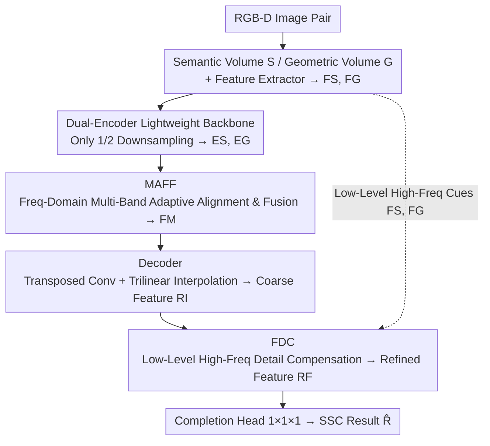

# Multi-modal Frequency Decomposition Network for Semantic Scene Completion

**Conference**: CVPR 2026  
**Paper**: [CVF Open Access](https://openaccess.thecvf.com/content/CVPR2026/html/Zuo_Multi-modal_Frequency_Decomposition_Network_for_Semantic_Scene_Completion_CVPR_2026_paper.html)  
**Code**: None  
**Area**: 3D Vision  
**Keywords**: Semantic Scene Completion, Frequency Domain Decomposition, RGB-D Multi-modal Fusion, Detail Compensation, Lightweight Network

## TL;DR
MFDNet shifts multi-modal fusion for RGB-D semantic scene completion (SSC) from the spatial domain to the frequency domain. It adaptively aligns and fuses semantic and geometric features across multiple frequency bands using MAFF, and compensates the coarse completion results with low-level high-frequency details using FDC. This balances "modal alignment" and "detail preservation," achieving state-of-the-art (SOTA) performance on NYUv2 and NYUCAD while reducing the parameter count by 54.4%.

## Background & Motivation

**Background**: Semantic Scene Completion (SSC) inputs a pair of RGB-D images and outputs a 3D voxelized semantic occupancy map (containing both geometric structure and semantic labels), playing a core role in 3D scene understanding, robot navigation, and VR. The mainstream approach processes RGB images with a 2D semantic segmentation network, projects pixel-level semantics into 3D to obtain a semantic volume $S$, encodes the depth map using TSDF to obtain a geometric volume $G$, and then extracts and fuses high-level features in the **spatial domain** using heavy convolutions and downsampling.

**Limitations of Prior Work**: This spatial-domain pipeline suffers from two layers of "misalignment." First, the **raw data itself is inaccurate**: the semantic volume projected from 2D segmentation maps is inconsistent with the real semantics, and the depth map cannot represent the true distance due to sensor limitations. The two modalities often contradict each other at the same voxel (e.g., one labeled as "free" and the other as "occupied"). Second, **feature learning amplifies misalignment**: context aggregation operations like convolutions and downsampling introduce feature smoothing and detail loss, further erasing the distinction between already misaligned multi-modal features.

**Key Challenge**: Aligning semantics and preserving geometric details is a trade-off in the spatial domain. Stacking more complex operations aligns semantics but smooths out geometric details, while reducing operations preserves geometry but fails to align semantics. Both cannot be satisfied simultaneously. Worse yet, the spatial domain encodes the scene as a holistic feature, lacking fine-grained information decoupling, which causes local detail alignment across modalities to be disrupted by irrelevant global information.

**Goal**: Perform multi-modal alignment and detail preservation simultaneously in a lightweight manner (with fewer convolutions and less downsampling).

**Key Insight**: Frequency decomposition decouples global information and local details into different frequency bands (low frequency $\leftrightarrow$ global, high frequency $\leftrightarrow$ local details). Fusing features in the frequency domain alleviates spatial-domain information entanglement, allowing cross-modal alignment to aggregate information only from relevant frequency bands.

**Core Idea**: Utilize multi-band decomposition and adaptive fusion (MAFF) in the frequency domain for "global alignment," followed by low-level high-frequency compensation (FDC) for "local detail completion," creating a global-to-local alignment and completion paradigm that replaces the traditional heavy spatial-domain alignment approaches.

## Method

### Overall Architecture
MFDNet is a dual-encoder completion network. Given a pair of RGB-D images, standard pre-processing is applied: the RGB image is projected into a semantic volume $S\in\mathbb{R}^{H\times W\times D}$ using a pretrained 2D segmentation network, and the depth map is encoded into a geometric volume $G$. After converting the semantic volume to one-hot encoding, two separate feature extractors produce semantic features $F_S$ and geometric features $F_G$. These then enter a dual-encoder (each consisting of 4 DDR blocks with different dilation rates), which **only downsamples to 1/2** (other methods typically downsample to 1/4 or more), striking a compromise between preserving details and capturing global context to yield encoded features $E_S$ and $E_G$. There are two core innovations: **MAFF** adaptively aligns and fuses $E_S$ and $E_G$ across multiple frequency bands in the frequency domain to obtain the fused feature $F_M$; a decoder (one transposed convolution + trilinear interpolation) upsamples $F_M$ back to full-resolution coarse features $R_I$; **FDC** then uses high-frequency cues from low-level features $F_S$ and $F_G$ to compensate for local details in $R_I$, yielding the refined feature $R_F$. Finally, a $1\times1\times1$ convolution completion head outputs the final SSC results $\hat R$. MAFF handles global alignment, and FDC compensates for local details, forming a sequential global-to-local alignment and completion pipeline.

### Key Designs

**1. Dual-Encoder Lightweight Backbone: Preserving Geometric Details via Conservative Downsampling**

This step directly addresses the challenge of "feature learning amplifying misalignment." Since downsampling smooths geometric details, MFDNet minimizes downsampling: each of the dual encoders contains 4 DDR blocks with different dilation rates, where the first block reduces the resolution to 1/2 and doubles the channels, while typical SSC methods downsample to 1/4 or lower. A 1/2 downsampling rate is a sweet spot that preserves voxel-level local details while expanding the receptive field to capture global context via dilated convolutions. Employing independent encoders (dual-encoder) for semantics and geometry ensures that single-modality features are cleanly learned before being precisely fused by MAFF, preventing the premature mixing of misaligned modalities. Because the heavy task of alignment is delegated to the frequency-domain module, the backbone can afford to use very few layers, maintaining an overall lightweight architecture.

**2. MAFF: Multi-band Adaptive Alignment and Fusion in the Frequency Domain**

The fundamental problem of spatial-domain fusion is the entanglement of global information and local details, which interfere with each other during alignment. MAFF moves fusion to the frequency domain to decouple them. First, FFT and FFTShift (shifting the low frequency to the spectrum center and high frequency to the boundary for ease of filtering) are applied to the encoded features: $\tilde E_S = S(T(E_S)),\ \tilde E_G = S(T(E_G))$. Then, $k$ bandpass filters are constructed using the differences of a set of Gaussian low-pass filters $\text{HLP}(\cdot)$: $T^0=\text{HLP}(\gamma_0)$, intermediate bands $T^j=\text{HLP}(\gamma_j)-\text{HLP}(\gamma_{j-1})$, and $T^{k-1}=1-\text{HLP}(\gamma_{k-2})$, slicing the features by frequency bands ($\tilde A^i = \tilde E\odot T^i$) to cover global-to-local levels from low to high frequencies.

The key lies in the weight learning strategy during fusion: **learning weights from holistic features and applying them to individual frequency bands** (overall-to-band). Specifically, $W_S^i = \alpha\cdot\sigma(\tilde E_S),\ W_G^i = \alpha\cdot\sigma(\tilde E_G)$ ($\sigma$ contains convolution + sigmoid, and $\alpha$ is a scaling factor). Then, a weighted sum is computed as $\tilde M_S=\sum_i W_S^i\odot \tilde A_S^i$, $\tilde M_G=\sum_i W_G^i\odot \tilde A_G^i$, and $\tilde A_M=\tilde M_S+\tilde M_G$. Finally, IFFT converts it back to the spatial domain to obtain the fused feature $F_M$. Learning weights from holistic features models **intra-modal multi-band dependencies** (bands are not isolated) while calibrating intra-modal inaccuracies. Meanwhile, sharing this frequency-domain representation and adding the two modalities models **inter-modal relations**, aligning high-level features. Ablation studies show that overall-to-band significantly outperforms band-to-band and overall-to-overall, verifying the necessity of "holistic guidance with band-specific weighting." This is also the fundamental difference from other frequency-domain methods like FFNet: FFNet independently fuses high and low frequencies, disrupting intra-modal multi-band dependencies, whereas MFDNet preserves them.

**3. FDC: Compensating for Missing Local Details in Coarse Features via Low-Level High-Frequency Cues**

MAFF performs global alignment, but the decoded coarse feature $R_I$ still lacks local details. FDC is based on the insight that "low-level features $F_S$ and $F_G$ before downsampling are less smoothed and retain more detailed cues." It first adjusts $F_S$ and $F_G$ to $\hat F_S$ and $\hat F_G$ using convolutions with BN and activation, then extracts high-frequency components $\tilde A_S$ and $\tilde A_G$ in the frequency domain using high-pass filters $T_S=1-\text{HLP}(\gamma_S)$ and $T_G=1-\text{HLP}(\gamma_G)$.

The weight design for compensation is highly deliberate—**learning weights from the coarse feature $R_I$ (rather than from the extracted low-level features)**: $\hat W_S=\beta\cdot\sigma(\tilde R_I),\ \hat W_G=\beta\cdot\sigma(\tilde R_I)$. Residual-style fusion is then performed: $R_F = R_I + T(S(\tilde A_S\odot\hat W_S + \tilde A_G\odot\hat W_G))$. This deliberately differs from the weight source of MAFF: MAFF learns weights from holistic encoded features to calibrate intra-modal inaccuracies, whereas FDC learns weights from $R_I$ to let the network adaptively identify missing details based on the current coarse results ("compensating where needed"). The residual form also establishes an extra gradient backpropagation path directly to the low-level layers, enhancing the network's ability to capture scene details. Ablations show that "weighted high-frequency" outperforms "weighted holistic low-level features" (as holistic low-level features contain too much redundant information, distracting the network), and learning weights from $R_I$ outperforms learning them from low-level high-frequency or holistic low-level features.

### Loss & Training
To improve alignment accuracy during the fusion stage, MAFF introduces **auxiliary semantic and geometric supervision**: the weighted frequency-domain features $\tilde M_S$ and $\tilde M_G$ are converted back to the spatial domain as $M_S$ and $M_G$, each passing through a prediction head to obtain a 3D semantic prediction $\hat P$ and an occupancy prediction $\hat Y$. The supervision is defined as $L_S=\text{CE}(\hat P,P)$ and $L_G=\text{BCE}(\hat Y,Y)$ (where $P$ is downsampled from the full-resolution GT, and $Y$ is obtained by binarizing $P$). The final completion result $\hat R$ is supervised via $L_{SSC}=\text{CE}(\hat R,R)$. The total objective is:

$$L_{total}=\lambda_S L_S + \lambda_G L_G + \lambda_{SSC} L_{SSC}.$$

This hierarchical supervision allows MAFF to perform both intra-modality calibration and cross-modality alignment, serving as an effective training-side guarantee.

## Key Experimental Results

Datasets: NYUv2, NYUCAD; Metrics: scene completion IoU (SC), semantic scene completion mIoU (SSC).

### Main Results
Comparison with various methods on the NYUv2 test set (selected):

| Domain | Method | IoU (%) | mIoU (%) |
|--------|--------|---------|----------|
| Spatial | SISNet | 78.2 | 52.4 |
| Spatial | CVSformer | 73.7 | 52.6 |
| Spatial | SG-SSC | 74.3 | 54.6 |
| Spatial | AMMNet | 76.3 | 56.1 |
| Frequency | FFNet | 71.8 | 44.4 |
| Frequency | **MFDNet (Ours)** | **77.1** | **57.0** |

Compared with the previous best model AMMNet, the mIoU increases by 0.9%, with significant improvements in classes such as window (42.8% $\rightarrow$ 46.2%) and tvs (52.4% $\rightarrow$ 54.8%). On NYUCAD, MFDNet achieves 87.6% IoU and 69.7% mIoU, with precision +1.2% and IoU +1.0%, bringing distinct improvements in classes like floor and window.

Parameter and fusion strategy comparison (removing the discriminator/FDC for a fair comparison):

| Method | IoU (%) | mIoU (%) | Params (M) |
|--------|---------|----------|------------|
| AMMNet† (w/o discriminator) | 75.0 | 55.2 | 20.85 |
| Ours† (w/o FDC) | 75.8 | 55.7 | 4.79 |
| AMMNet (Full) | 76.3 | 56.1 | 22.17 |
| **Ours (Full)** | **77.1** | **57.0** | **10.10** |

Looking only at the fusion module, Ours† improves by 0.8% IoU / 0.5% mIoU compared to AMMNet†, using 77.03% fewer parameters. The full model parameter count drops from 22.17M to 10.10M (approximately 54.4% reduction), demonstrating the efficiency of the frequency-domain fusion strategy.

### Ablation Study

Component Ablation (NYUv2):

| MAFF | FDC | IoU (%) | mIoU (%) | Description |
|------|-----|---------|----------|-------------|
| | | 75.2 | 54.5 | Addition fusion baseline |
| ✓ | | 75.8 | 55.7 | +MAFF, better cross-modal complementarity |
| | ✓ | 76.3 | 55.1 | +FDC, restores high-frequency details |
| ✓ | ✓ | **77.1** | **57.0** | Full model |

MAFF Inner Weight Strategy (Table 2 in paper):

| Domain | Weight Learning | IoU (%) | mIoU (%) |
|--------|-----------------|---------|----------|
| Spatial | No weights | 76.3 | 55.1 |
| Spatial | overall-to-overall | 76.0 | 55.5 |
| Frequency | overall-to-overall | 76.4 | 56.1 |
| Frequency | band-to-band | 76.7 | 56.5 |
| Frequency | **overall-to-band** | **77.1** | **57.0** |

FDC compensation components (Table 3 in paper): w/o compensation 55.7 $\rightarrow$ overall 56.1 $\rightarrow$ weighted overall 56.4 $\rightarrow$ high-freq 56.6 $\rightarrow$ **weighted high-freq 57.0**; FDC weight source (Table 4 in paper): learning from high-frequency itself 56.3, from holistic low-level features 56.1, and **from coarse feature $R_I$ 57.0** (optimal).

### Key Findings
- **MAFF contributes the most to mIoU**: Adding MAFF alone boosts mIoU from 54.5% to 55.7%. Adding FDC alone is more beneficial for IoU (geometry/completion completeness). The two are complementary, and only their combination pushes the mIoU past 57.0%.
- **Frequency Domain > Spatial Domain, and overall-to-band > other strategies**: Shifting weight learning from the spatial to the frequency domain increases mIoU by 0.6% (56.1% vs 55.5%), and overall-to-band is 0.5% higher than band-to-band. This indicates that "preserving multi-band dependency + holistic guidance" is indispensable.
- **FDC must learn weights from coarse features**: Learning weights from $R_I$ (57.0%) clearly outperforms learning from low-level features (56.1%–56.3%) because the network can only "compensate where needed" by inspecting the coarse results. Additionally, compensating only high-frequency components (rather than the holistic low-level features) avoids interference from redundant information. t-SNE analysis shows that the distance between semantic/geometric feature clusters gradually shrinks from $d_1$ (spatial domain) to $d_4$, and spectrum analysis reveals that $R_F$ is richer in high-frequency components than $R_I$, visually confirming the effectiveness of alignment and detail compensation.

## Highlights & Insights
- **Trading "Alignment vs. Detail" for Frequency Domain Decoupling**: Traditional approaches rely on stacking heavy operations in the spatial domain to force alignment. This paper observes that low and high frequencies naturally correspond to global structures and local details, respectively. By employing band decomposition, alignment and detail preservation are handled in their respective frequency bands. This perspective is highly transferable to any multi-modal task where global alignment sacrifices local details.
- **Opposing Weight Sources for the Two Frequency Modules**: MAFF learns weights from holistic features (to calibrate intra-modal and align inter-modal features), whereas FDC learns weights from coarse features (to identify missing details). Although both rely on "frequency domain + weight learning," differing objectives warrant different sources. This "purpose-driven weight sourcing" paradigm is highly reusable.
- **Lightweightness is a Byproduct of Design, Not a Compromise**: Because the heavy alignment task is shifted to the frequency domain, the backbone only needs 1/2 downsampling and fewer convolutional layers. Consequently, the parameter count is halved while performance improves—proving that "solving the problem in a different domain" is more fundamental than "refining in the original domain."
- **Residual Compensation Establishes a Gradient Shortcut**: The residual structure of FDC ($R_F=R_I+(\cdot)$) not only supplements details but also provides an extra backpropagation pathway directly to the low-level layers, killing two birds with one stone.

## Limitations & Future Work
- **Dependency on Pretrained 2D Segmentation Networks**: The semantic volume originates from off-the-shelf 2D segmentations. Thus, the quality of semantic segmentation directly propagates to the completion results. The paper does not thoroughly discuss the upper-bound performance limitations imposed by segmentation errors.
- **Validation Limited to Indoor Datasets**: SSC is also applied in outdoor/driving scenarios (such as SemanticKITTI). There is a lack of validation on whether frequency decomposition is equally effective on larger-scale, sparser outdoor voxels. ⚠️ The paper does not provide outdoor results; please refer to the original paper.
- **Sensitivity to Hyperparameters (e.g., number of bands $k$, filter radii $\gamma$)**: Although the paper outlines the filter construction, it does not systematically report the optimal choice for $k$ or how to select $\gamma$, which might require manual tuning during replication.
- **Future Directions**: It would be promising to explore learnable filter radii (rather than fixed $\gamma$) or make the number of bands adaptive. Additionally, the "compensate where needed" concept of FDC could be extended to multi-scale features instead of compensating only on a single coarse feature.

## Related Work & Insights
- **vs. FFNet (Frequency-Domain SSC)**: FFNet also uses learnable filters to divide RGB-D into different frequency bands, but it **fuses high and low frequencies independently**, which destroys intra-modal multi-band dependencies. Moreover, it simply concatenates the 2D segmentations projected in 3D, failing to address the misalignment caused by inaccurate depth. MFDNet utilizes the overall-to-band strategy to preserve multi-band dependencies and unifies the alignment of both modalities in the frequency domain, showing a significant margin on NYUv2 (mIoU 57.0% vs. FFNet's 44.4%).
- **vs. AMMNet (Spatial-Domain Calibration)**: AMMNet calibrates semantic features using TSDF and performs fusion via discriminator-guided modulation, but it ignores other modal inaccuracies and has a large parameter footprint (22.17M). MFDNet performs bi-directional alignment in the frequency domain, achieving better performance with only 10.10M parameters. Under a fair comparison, its fusion module uses 77% fewer parameters.
- **vs. CleanerS / SG-SSC**: CleanerS uses distillation to reduce TSDF noise, while SG-SSC uses semantic-guided fusion. However, SG-SSC's 2D $\to$ 3D projection introduces depth errors again. Instead of "patching inaccuracies" in the spatial domain, MFDNet decouples them in the frequency domain, inherently reducing cross-modal interference.

## Rating
- Novelty: ⭐⭐⭐⭐ Systematically shifts multi-modal alignment for SSC into the frequency domain, using two complementary and cohesive mechanisms: "holistic guidance for band-specific weighting" and "coarse feature-guided high-frequency compensation." This offers a fresh perspective with high self-consistency.
- Experimental Thoroughness: ⭐⭐⭐⭐ Includes main results, detailed ablation studies, and t-SNE/spectrum visualizations. However, evaluation is confined to two indoor datasets and lacks outdoor benchmarks.
- Writing Quality: ⭐⭐⭐⭐ Clear motivation (two types of misalignment + trade-off) with explicit correspondence between equations and modules.
- Value: ⭐⭐⭐⭐ Achieves SOTA while halving parameters. The frequency-domain decoupling scheme holds high transfer value for other multi-modal alignment tasks.

<!-- RELATED:START -->

## Related Papers

- [\[CVPR 2026\] Learning Spatial-Temporal Consistency for 3D Semantic Scene Completion](learning_spatial-temporal_consistency_for_3d_semantic_scene_completion.md)
- [\[CVPR 2026\] TGSFormer: Scalable Temporal Gaussian Splatting for Embodied Semantic Scene Completion](tgsformer_scalable_temporal_gaussian_splatting_for_embodied_semantic_scene_compl.md)
- [\[CVPR 2026\] Semantic Foam: Unifying Spatial and Semantic Scene Decomposition](semantic_foam_unifying_spatial_and_semantic_scene_decomposition.md)
- [\[CVPR 2026\] X-Part: High Fidelity And Structure Coherent Shape Decomposition And Completion](x-part_high_fidelity_and_structure_coherent_shape_decomposition_and_completion.md)
- [\[CVPR 2026\] SAQN: Semantic-based Adaptive Query Network for 3D Referring Expression Segmentation](saqn_semantic-based_adaptive_query_network_for_3d_referring_expression_segmentat.md)

<!-- RELATED:END -->
