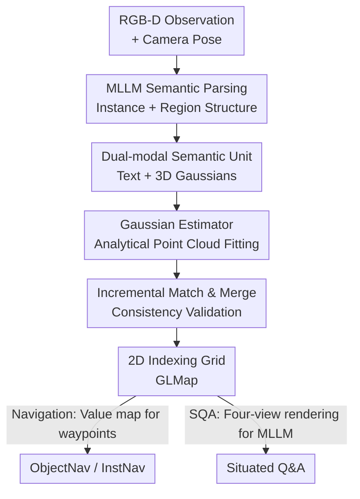

# Multi-Scale Gaussian-Language Map for Zero-shot Embodied Navigation and Reasoning

**Conference**: CVPR2026  
**arXiv**: [2605.01736](https://arxiv.org/abs/2605.01736)  
**Code**: https://github.com/sx-zhang/GLMap  
**Area**: 3D Vision / Embodied Navigation  
**Keywords**: Semantic Mapping, 3D Gaussian Splatting, Embodied Navigation, Zero-shot, Multi-scale Semantics

## TL;DR
This paper proposes the Multi-Scale Gaussian-Language Map (GLMap), which organizes environment representation via a "2D indexing grid + instance/region dual-layer semantic units." Each semantic unit simultaneously stores "natural language descriptions + 3D Gaussians," allowing direct reading by LLM/VLM/MLLM without additional projection training. An analytical Gaussian Estimator is used to fit Gaussian parameters directly from point clouds (avoiding gradient optimization). GLMap achieves consistent performance gains across ObjectNav, InstNav, and SQA tasks in a zero-shot manner.

## Background & Motivation
**Background**: Embodied agents (tasked with finding objects, specific instances, or answering situated questions) rely on maps that record environmental geometry and semantics. Existing semantic maps generally fall into three categories: topological maps (objects as nodes, adjacency as edges), grid maps (classes or visual features in world-coordinate grids), and dense geometric maps (classes or CLIP features stored in point clouds).

**Limitations of Prior Work**: These maps often sacrifice either "explicit geometry" or "multi-scale semantics." Topological edges cannot represent precise spatial relationships; category maps only store coarse labels without attributes or context; feature maps (e.g., storing CLIP embeddings) provide dense semantics but lack clear instance boundaries. Crucially, they store intermediate feature tensors, whereas modern LLM/VLM/MLLMs natively process **images and text**. Integrating them requires training extra projection/alignment layers, limiting scalability and modularity.

**Key Challenge**: An "LLM-friendly interface" requires semantics to be explicitly exposed as natural language and images, whereas "explicit geometry + multi-scale semantics" requires compact, incremental storage of spatial structures. Prior methods typically compress semantics into implicit features, losing the former benefit.

**Goal**: To build a map that satisfies three conditions: ① Explicit geometry (precise spatial localization); ② Multi-scale semantics (instance-level + region-level); ③ LLM-friendliness (semantics explicitly presented as language and images).

**Key Insight**: The authors observe that embodied tasks **provide depth maps and camera intrinsics**, allowing direct reconstruction of high-quality dense point clouds. This differs from the original 3DGS setting, which infers geometry from multi-view images via differentiable optimization. Since geometry is known, gradient optimization is unnecessary; 3D Gaussians can be **analytically** calculated from point clouds.

**Core Idea**: Each semantic unit is associated with both a text description and a set of 3D Gaussians. Text is read directly by LLMs, while Gaussians allow fast rendering of task-relevant images via splatting. An analytical estimator performs closed-form fitting from "point cloud to Gaussians," enabling real-time incremental mapping.

## Method

### Overall Architecture
GLMap represents the environment as $\mathcal{M}=\{m,\mathcal{S}_o,\mathcal{S}_r\}$: $m$ is a 2D indexing grid (cells store IDs of semantic units within their spatial range); $\mathcal{S}_o$ is a set of instance semantic units; $\mathcal{S}_r$ is a set of region semantic units. An instance unit $o=(\mathcal{G},T_o)$ stores 3D Gaussians $\mathcal{G}$ and an open-vocabulary text description $T_o$. A region unit $r=(\mathcal{I}_r,T_r)$ stores a set of IDs of contained instances and region text (regions do not store Gaussians separately; they are rendered by fusing member instance Gaussians to save storage).

The pipeline runs **incrementally** during an embodied episode: for each RGB-D frame, an MLLM parses the image into "instance + region" structured semantics. For each instance, GroundingDINO+MobileSAM extracts masks, which are back-projected into point clouds to analytically fit Gaussians via the Gaussian Estimator. New instances/regions are matched and merged based on text and Gaussian similarity. Finally, the 2D grid is updated. The map is queried by LLMs via "spatial/instance/region queries" for downstream tasks: navigation uses a similarity-based value map for waypoint selection, while SQA renders four-view images at estimated poses for MLLM input.

### Key Designs

**1. Dual-modal Semantic Unit: A Native Semantic Interface for LLMs**
This directly addresses the need for extra alignment training. Each unit in GLMap stores natural language (e.g., categories, attributes, region functions) for LLMs and 3D Gaussians for fast image rendering at arbitrary viewpoints via splatting for VLMs/MLLMs. 3D Gaussians are preferred over point clouds for their compact storage and efficient rendering. Semantics are split into instance units $\mathcal{S}_o$ (fine-grained) and region units $\mathcal{S}_r$ (contextual), enabling **zero-shot** compatibility with existing models without projection training.

**2. Gaussian Estimator: Analytical Fitting Instead of Gradient Optimization**
Traditional 3DGS requires iterative optimization to infer geometry. Leveraging available depth and intrinsics, the authors propose an **analytical** estimator $\mathcal{G}=f_{GE}(\mathcal{P})$. Point clouds are voxelized (1 cm). For each voxel $\mathbf{v}$, points $\tilde{\mathcal{P}}_\mathbf{v}$ are sampled from its Chebyshev neighborhood $\mathcal{N}(\mathbf{v})$ to ensure base primitive overlap. Parameters are fit using closed-form sample statistics: mean $\boldsymbol{\mu}_\mathbf{v}$ is the centroid, and covariance is $\Sigma_\mathbf{v}=\frac{1}{|\tilde{\mathcal{P}}_\mathbf{v}|}\sum(\mathbf{p}_i-\boldsymbol{\mu}_\mathbf{v})(\mathbf{p}_i-\boldsymbol{\mu}_\mathbf{v})^\top+\epsilon I$. Colors are averaged, and opacity is fixed (e.g., 0.8). This process requires no backpropagation and is fast enough for incremental updates.

**3. Curvature-aware Merging: Preserving Details while Saving Storage**
Voxel fitting produces redundant Gaussians on flat surfaces. A similarity metric is defined as $D(G_i,G_j)=\|\boldsymbol{\mu}_i-\boldsymbol{\mu}_j\|_2+\lambda_\Sigma\|\Sigma_i-\Sigma_j\|_F+\lambda_c\|\mathbf{c}_i-\mathbf{c}_j\|_2$. The merging threshold is **adaptive to curvature**: merging occurs if $D(G_i,G_j)<1+\tau(\kappa(\Sigma_i)+\kappa(\Sigma_j))$, where $\kappa(\Sigma)$ is the ratio of the minimum eigenvalue to the trace (a proxy for curvature). This keeps more Gaussians at boundaries/thin structures and merges more aggressively in flat areas.

**4. Incremental Matching and Merging: Global Map Consistency**
Two sets of IDs are maintained: local IDs $\tilde{n}$ and global IDs $n$. Instance matching uses a **two-level consistency** check: semantic consistency (text embedding cosine similarity $>\tau_s$) followed by geometric consistency (existence of mergeable Gaussians). If both are met, instances are merged (union of Gaussians, concatenated text summarized by a lightweight LLM if too long). Region matching uses "text similarity + instance set overlap." This ensures multi-view observations are fused consistently.

### Loss & Training
GLMap is **entirely training-free**. Mapping uses off-the-shelf models: Gemma3-27B (parsing), GroundingDINO+MobileSAM (segmentation), nomic-embed-text (embeddings), and Qwen3-8B (summarization). Downstream tasks reuse existing LLM/VLM/MLLM methods without additional alignment training.

## Key Experimental Results

### Main Results
Zero-shot ObjectNav (HM3D / MP3D, Habitat) benchmarking in a training-free, open-vocabulary setting:

| Dataset | Metric | GLMap | Prev. Best | Gain |
|--------|------|------|----------|------|
| HM3D | SR(%) | 62.7 | 61.4 (BeliefMapNav) | +1.3 |
| HM3D | SPL(%) | 33.7 | 33.0 (ApexNAV) | +0.7 |
| MP3D | SR(%) | 42.5 | 41.1 (FBN) | +1.4 |
| MP3D | SPL(%) | 18.3 | 17.8 (ApexNAV) | +0.5 |

Zero-shot InstNav (HM3D) and SQA (SQA3D) performance:

| Task | Metric | GLMap | Prev. Best |
|------|------|------|----------|
| InstNav | SR(%) | 22.5 | 20.2 (UniGoal) |
| InstNav | SPL(%) | 13.7 | 11.4 (UniGoal) |
| SQA | EM-1(%) | 58.5 | 57.2 (GPT4Scene) |
| SQA | EM-R1(%) | 61.3 | 60.4 (GPT4Scene) |

**Plug-and-play Gain**: GLMap improves various paradigms zero-shot—ESC(LLM) SR 39.2→48.8 (+9.6), VLFM(VLM) 52.5→59.1 (+6.6), ApexNAV 59.6→62.7 (+3.1).

### Ablation Study
Multi-scale semantics ablation on HM3D ObjectNav (Baseline: VLFM):

| Configuration | SR(%) | SPL(%) | Description |
|------|-------|--------|------|
| Indexing grid only (=VLFM) | 52.5 | 30.4 | Similarity via egocentric views |
| Grid + Instance units | 57.4 | 31.3 | +4.9 SR via instance semantics |
| Grid + Region units | 56.2 | 30.9 | +3.7 SR via region semantics |
| Grid + Instance + Region (Full) | 59.1 | 32.2 | Highest performance via complementarity |

Comparison of map structures (under zero-shot downstream tasks):

| Map Structure | Semantic Units | ObjectNav SR | InstNav SR | SQA EM-1 |
|----------|----------|------|------|------|
| Topological (UniGoal) | Instance+Region (Text) | 54.5 | 20.2 | 34.2 |
| Grid (GOAT) | Object (Label) | 50.6 | 17.0 | - |
| Grid (g3D-LF) | Region (Vision feature) | 55.6 | 11.5 | 47.7 |
| Dense Geom (Chat-Scene) | Region (Vision feature) | - | - | 54.6 |
| **GLMap** | Instance+Region (Text+Render) | **62.7** | **22.5** | **58.5** |

### Key Findings
- Instance and region units are complementary; combining them yields the best results (52.5→59.1).
- GLMap is the only structure to lead across all three tasks. Topological maps lack fine-grained visual details (e.g., color), hurting SQA. Category grid maps fail InstNav and lack MLLM compatibility. Feature maps (g3D-LF) suffer from 2D patch-based features lacking instance centers. 
- The analytical Gaussian Estimator maintains high color fidelity and semantic integrity despite avoiding gradient optimization.

## Highlights & Insights
- **Leveraging Geometry Fully**: Original 3DGS optimization compensates for missing depth/intrinsics. Since embodied agents have these, the authors simplify the process to a closed-form calculation, enabling real-time mapping.
- **Dual-modal Interface for the LLM Era**: Rather than compressing semantics into tensors and training alignments, storing "text + renderable images" provides a native interface for LLMs/VLMs.
- **Curvature-aware Merging**: A clean storage-precision trade-off using covariance proxies to preserve boundaries while compressing flat planes.
- **Task-oriented Multi-scale Semantics**: Instance semantics serve object inference, while regional semantics provide context for InstNav and SQA.

## Limitations & Future Work
- **Front-end Dependency**: Errors in MLLM parsing or GroundingDINO segmentation directly propagate to semantic units.
- **Geometry Assumptions**: Assumes precise depth and poses; robustness to noise or dynamic objects in the real world remains to be fully verified.
- **Viewpoint Selection**: Heuristic rendering viewpoints (e.g., four-views for SQA) may be insufficient under severe occlusion.
- **Text Summarization**: The drift or information loss in text summaries over long episodes has not been quantified.

## Related Work & Insights
- **vs. Topological Maps (UniGoal/SG-Nav)**: GLMap provides precise spatial relationships and fine-grained visual details, whereas topological maps often lack precise geometry for SQA tasks.
- **vs. Feature Maps (g3D-LF/Chat-Scene)**: Unlike feature-based methods that require feature-to-token alignment training, GLMap's text+image interface is natively readable by LLMs zero-shot.
- **vs. Standard 3DGS**: GLMap replaces differentiable optimization with analytical estimation to support incremental mapping.

## Rating
- Novelty: ⭐⭐⭐⭐ 
- Experimental Thoroughness: ⭐⭐⭐⭐ 
- Writing Quality: ⭐⭐⭐⭐ 
- Value: ⭐⭐⭐⭐ 

<!-- RELATED:START -->

- **ConceptGraphs**: Open-Vocabulary 3D Scene Graphs for Perception and Planning, ICRA 2024.
- **GS-SLAM**: Dense Visual SLAM with 3D Gaussian Splatting, CVPR 2024.
- **VLFM**: Visual Language Frequency Maps for Embodied AI, CVPR 2024.

<!-- RELATED:END -->

## Related Papers

- [\[CVPR 2026\] MSGNav: Unleashing the Power of Multi-modal 3D Scene Graph for Zero-Shot Embodied Navigation](msgnav_unleashing_the_power_of_multi-modal_3d_scene_graph_for_zero-shot_embodied.md)
- [\[CVPR 2026\] Zero-Shot Depth Completion with Vision-Language Model](zero-shot_depth_completion_with_vision-language_model.md)
- [\[ICLR 2026\] pySpatial: Generating 3D Visual Programs for Zero-Shot Spatial Reasoning](../../ICLR2026/3d_vision/pyspatial_generating_3d_visual_programs_for_zero-shot_spatial_reasoning.md)
- [\[CVPR 2026\] Context-Nav: Context-Driven Exploration and Viewpoint-Aware 3D Spatial Reasoning for Instance Navigation](context-nav_context-driven_exploration_and_viewpoint-aware_3d_spatial_reasoning_.md)
- [\[ICCV 2025\] 3D Gaussian Map with Open-Set Semantic Grouping for Vision-Language Navigation](../../ICCV2025/3d_vision/3d_gaussian_map_with_openset_semantic_grouping_for_visionlan.md)

<!-- RELATED:END -->
