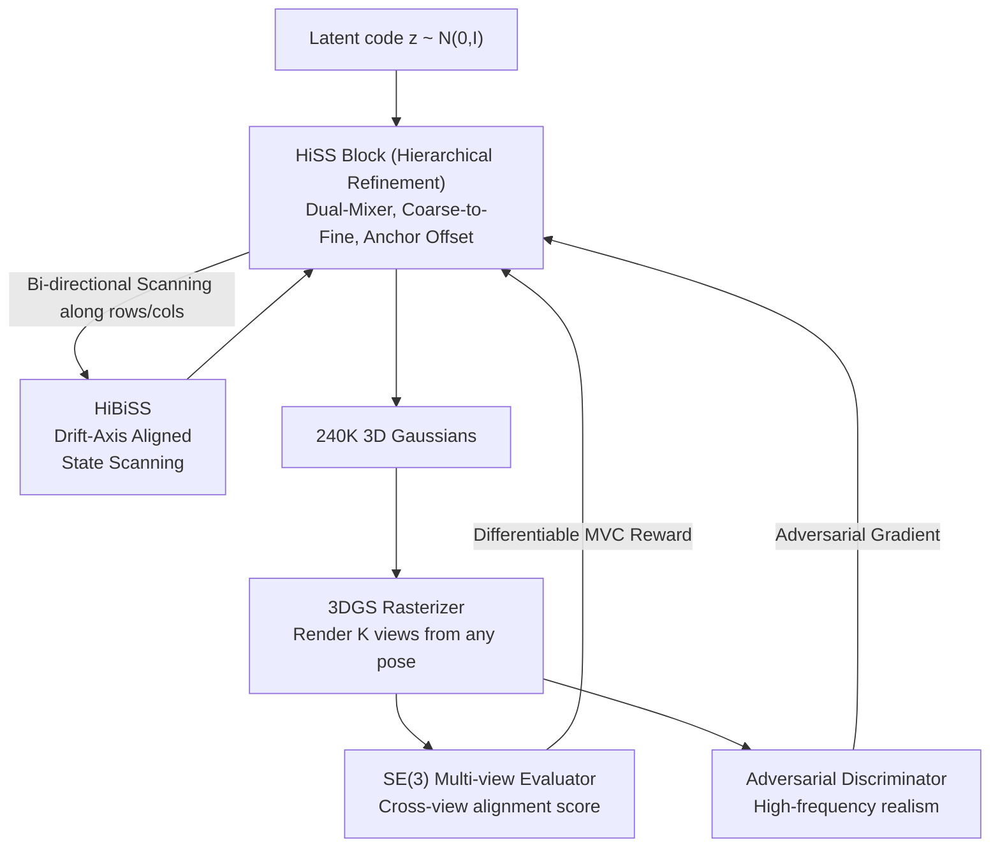

# Multi-view Consistent 3D Gaussian Head Avatars 'without' Multi-view Generation

**Conference**: CVPR 2026  
**arXiv**: [2605.25220](https://arxiv.org/abs/2605.25220)  
**Code**: https://humansensinglab.github.io/MVCHead/ (Project page + code available)  
**Area**: 3D Vision  
**Keywords**: 3D Gaussian head avatar, multi-view consistency, State Space Model, Mamba, zero multi-view supervision  

## TL;DR
MVCHead achieves SOTA perceptual quality and texture/geometry consistency by directly regressing 240,000 3D Gaussians from randomly sampled 2D face images (without multi-view data, 3D supervision, or intermediate view generation). It leverages a single-forward State Space Model (SSM) featuring "Hierarchical Bi-directional State Scanning" aligned with multi-view drift axes and an "SE(3) multi-view evaluator" to bake consistency directly into the architecture.

## Background & Motivation
**Background**: High-fidelity 3D Gaussian head avatar generation (for AR/VR, telepresence, and digital humans) follows three main paradigms: 1) Multi-view optimization (e.g., NeRSemble, RenderMe-360), which uses studio-grade dense captures ($\approx 10^4$ frames per person) for per-person optimization; 2) Multi-view diffusion, which generates side views from a single image using diffusion models and then lifts them to 3DGS; 3) Feed-forward generators (e.g., GGHead, GS-GAN, CGS-GAN), which differentiably output 3D Gaussians from latent codes.

**Limitations of Prior Work**: The first two paths are either unscalable or unreliable. Studio capture is expensive and requires per-person optimization. Multi-view diffusion ties Multi-view Consistency (MVC) entirely to the quality of intermediate view generation; since the reconstruction and diffusion stages are not end-to-end differentiable, pixel-level cross-view losses are not optimized, leading to identity drift (minor shifts in hair, ears, or jaw shadows that lack a self-consistent 3D explanation). Furthermore, generating dense intermediate views for every asset is computationally prohibitive at scale. While feed-forward generators are end-to-end differentiable, forcing MVC in a minimal resource setting (no real multi-view pairs) remains an open challenge.

**Key Challenge**: Traditional MVC relies on either multi-view ground truth (expensive) or intermediate views as proxies (unreliable and non-differentiable). This paper argues that intermediate view generation is counterproductive for scalability and that MVC should be "induced by design" rather than by additional data or generation steps.

**Goal**: Achieve large-scale, real-time, multi-view consistent 3D head generation using a single, end-to-end differentiable model in a minimal resource setting (2D images only), without intermediate views or 3D ground truth.

**Key Insight**: The authors make two key observations. First, multi-view inconsistency is not isotropic: yaw primarily causes horizontal displacement, while pitch causes vertical displacement. Since drift is strongest along image row/column axes, State Space Models (SSMs) can be used to "smooth" this drift via recursive propagation along these axes. Second, the self-rendering of a 3D configuration inherently carries a strong MVC prior: judging if a set of renders comes from the same 3D source does not require real multi-view pairs; a evaluator can be learned as a reward signal.

**Core Idea**: Integrate MVC into the network architecture using Hierarchical Bi-directional State Scanning (HiBiSS) aligned with drift axes, and use an SE(3) multi-view evaluator to score cross-view pixel alignment as a differentiable reward, learning consistent 3D heads from 2D images.

## Method

### Overall Architecture
MVCHead learns a mapping from a latent code $z\sim\mathcal{N}(0,I)$ to a set of anisotropic 3D Gaussians $\mathcal{S}_\theta(z)=\{g_i\}_{i=1}^N$ ($N=240\text{K}$). Each Gaussian $g_i=(\mu_i,s_i,q_i,\alpha_i,c_i)$ includes center, scale, quaternion rotation, opacity, and RGB. Building on the transformer-based GSGAN, it introduces three key modifications: a Dual-Mixer architecture composed of SSM blocks, HiBiSS scanning, and an SE(3) multi-view evaluator as an explicit MVC reward.

The pipeline operates in a single forward pass: the latent code is refined coarsely-to-finely through multiple **HiSS blocks (Hierarchical State Space blocks)**. Each layer uses HiBiSS to propagate geometric and appearance cues across the token grid to ensure local-global consistency, upsampling primitives by treating "parent Gaussians $S_0$ as anchors $A_0$ to derive child Gaussians $S_1$." The final aggregated Gaussians are processed by a 3DGS rasterizer to render images from arbitrary poses. During training, these renders are examined by two evaluators: an adversarial texture discriminator for realism and an SE(3) multi-view evaluator for cross-view alignment. Crucially, **no camera conditioning** is used inside HiSS blocks to prevent the model from learning "2D shortcuts."

### Key Designs

**1. HiSS Block: Coarse-to-Fine Gaussian Regression via Anchor Offsets + Dual-Mixer**

To address the challenge of generating detailed yet stable geometry without 3D supervision, MVCHead represents the head as a set of Gaussians refined through $L$ layers of HiSS blocks. Each Gaussian serves as both a coarse approximation and a regression anchor for the next level. **Anchor-based Refinement** explicitly parameterizes fine Gaussians as offsets from coarse anchors, forcing new primitives to remain near existing structures. The number of Gaussians grows by an upsampling ratio $r$ per block, eventually rendering $\sum_{l=0}^{L-1}Nr^l$ primitives. The **Dual-Mixer** within the block uses one self-attention branch for global semantics (identity) and one SSM branch for grid-aligned local coherence. Appearance is decoupled from geometry via AdaIN scale/bias injection predicted from the mapping code $w$.

**2. HiBiSS: Aligning State Recursion with Multi-view Drift Axes**

This design encodes the observation of "drift anisotropy" into the architecture. Standard Mamba's unidirectional scanning lacks vertical propagation and introduces causal bias. The authors derive that for a centered head under camera intrinsics $\mathbf{K}=\mathrm{diag}(f_x,f_y,1)$, small yaw/pitch changes result in displacements $\delta\mathbf{u}\approx J_x(X)\delta\theta_x+J_y(X)\delta\theta_y$, where $|\partial x/\partial\theta_y|\gg|\partial y/\partial\theta_y|$ and $|\partial y/\partial\theta_x|\gg|\partial x/\partial\theta_x|$. HiBiSS employs four complementary 2D scans (horizontal L-R, R-L; vertical U-D, D-U) to form bi-directional recursive paths. The horizontal forward recursion is:

$$h^{\rightarrow}_{i,j+1}=A_h h^{\rightarrow}_{i,j}+B_h F_{i,j},\quad \tilde{F}^{\text{hor}}_{i,j}=C_h h^{\rightarrow}_{i,j}+D_h F_{i,j}$$

This forces state propagation to align with the directions of maximum $\|\partial\mathbf{u}/\partial\theta\|$, acting as an anisotropic, pose-aware smoothing mechanism.

**3. SE(3) Multi-view Evaluator: Self-rendering as MVC Reward**

This component forces MVC without multi-view ground truth. The evaluator $E_\psi$ is a pose-aware encoder that outputs a consistency score $s=E_\psi(\{\hat I_k\},\{T_k\})$. During training, the model maximizes this score as a reward: $\mathscr{L}_{mvc}=-\mathbb{E}_{z,\{T_k\}}[E_\psi(\{\mathcal{R}(\mathcal{S}_\theta(z),T_k)\}_{k=1}^K,\{T_k\}_{k=1}^K)]$. The evaluator is trained as a **set-based binary classifier**: the positive set $\mathcal{S}^+$ contains $K$ renders of the same avatar at different poses; the negative set $\mathcal{S}^-$ contains views from different latent codes sharing the same poses. To ensure the score depends only on relative viewpoint arrangement, the evaluator uses **Geometric Transform Attention (GTA)**, where all poses are anchored to the first view ($\tilde T_k=T_k T_1^{-1}$) and attention is modified by relative extrinsic-derived linear mappings.

### Loss & Training
The total loss is a multi-task objective using only 2D images to jointly optimize the decoder, the SE(3) evaluator $E_\psi$, and the adversarial discriminator $D_\phi$:

$$\mathscr{L}_{\text{total}}=\lambda_{mvc}\mathscr{L}_{mvc}+\mathscr{L}_{adv}+\lambda_{knn}\mathscr{L}_{knn}+\lambda_{ctr}\mathscr{L}_{ctr}$$

$\mathscr{L}_{adv}$ is a camera-conditioned adversarial loss with R1 regularization. $\mathscr{L}_{knn}$ penalizes excessive spacing between neighboring Gaussians, while $\mathscr{L}_{ctr}$ encourages Gaussian centers to remain near their anchors. Training was conducted on 4 H100 GPUs for 10M steps using FFHQ and FFHQ-C.

## Key Experimental Results

### Main Results
Perceptual Realism (FID / FID3D at 512×512, 50K renders):

| Dataset | Metric | MVCHead | CGSGAN (Prev. SOTA) | GGHead | GSGAN |
|---------|--------|---------|---------|--------|-------|
| FFHQ | FID↓ | **4.39** | 4.94 | 5.15 | 5.60 |
| FFHQ-C | FID↓ | **3.94** | 4.53 | 5.37 | 5.17 |
| FFHQ | FID3D↓ | **4.39** | 4.94 | 7.90 | 10.50 |
| FFHQ-C | FID3D↓ | **3.94** | 4.53 | 7.78 | 7.68 |

Multi-view Consistency (Average of 100 avatars vs. CGSGAN):

| Dimension | Metric | MVCHead | CGSGAN |
|-----------|--------|---------|--------|
| Shape | CD↓ | **0.6654** | 0.6724 |
| Texture | cPSNR↑ | **22.082** | 21.852 |
| Texture | cLPIPS↓ | **0.0528** | 0.0622 |
| Geometry | MEt3R↓ | **0.2620** | 0.2814 |

MVCHead significantly outperforms the previous SOTA in perceptual quality and five out of six consistency metrics.

### Ablation Study
Ablation on FFHQ-C (512×512):

| Configuration | FID↓ | MEt3R↓ | Description |
|---------------|------|--------|-------------|
| Full Model | **3.94** | **0.2620** | - |
| w/o $\mathscr{L}_{adv}$ | collapse | — | Training collapses without adversarial loss |
| w/o $\mathscr{L}_{mvc}$ | 5.41 | 0.3144 | MVC reward is crucial for consistency |
| w/o HiSS block | 5.28 | 0.2948 | SSM components provide gains over Attention only |
| w/o HiBiSS | 4.78 | 0.2873 | Bidirectional axial scanning outperforms standard scanning |

### Key Findings
- Adversarial loss is essential for convergence, while the MVC reward is the primary driver for consistency.
- The use of SSMs (HiSS) and their specific directional alignment (HiBiSS) provide complementary gains.
- MVCHead achieves consistency through architectural design and self-rendering rewards without requiring intermediate views or 3D ground truth.

## Highlights & Insights
- **Encoding Drift Anisotropy into Architecture**: Aligning SSM scanning with the Jacobian-derived axes of multi-view displacement is a clever use of geometric inductive bias.
- **Differentiable Consistency Reward**: Treating self-consistency as an evaluative classification task bypasses the need for multi-view ground truth, a concept applicable to other 3D generation tasks.
- **GTA for Invariance**: The Geometric Transform Attention ensures the evaluator scores are invariant to global camera placement, focusing purely on 3D consistency.
- **SSM for 3DGS**: This is the first application of SSM/Mamba to 3D Gaussian head generation. The authors also contribute FaceGS-10K, a dataset of 10,000 ready-to-use 3D Gaussian head assets for downstream tasks.

## Limitations & Future Work
- **Field of View**: As training is limited to front and side views, the model cannot generate complete 360° avatars (e.g., the back of the head is missing).
- **Negative Samples**: The negative set in the evaluator currently relies on different identities; using "same identity but geometrically perturbed" samples could further refine consistency signals.
- **Metric Sensitivity**: Consistency metrics like MEt3R rely on external models (MASt3R/DINO), making evaluations dependent on the robustness of these tools.

## Related Work & Insights
- **vs. Optimization-based (GaussianAvatars)**: Optimization methods reach a higher consistency ceiling but are not scalable. MVCHead sacrifices some shape precision for massive scalability.
- **vs. Multi-view Diffusion (FaceLift)**: Diffusion-based lifting suffers from identity drift across synthesized views. MVCHead eliminates this by ensuring the entire generation process is 3D-intrinsic and end-to-end differentiable.
- **vs. Feed-forward (CGS-GAN)**: While both are efficient, MVCHead moves beyond basic adversarial training by introducing explicit multi-view rewards and axial-specific SSM scanning.

## Rating
- Novelty: ⭐⭐⭐⭐⭐ (First SSM for 3DGS heads; well-motivated axial scanning).
- Experimental Thoroughness: ⭐⭐⭐⭐ (Extensive consistency metrics, though primary comparison is focused on CGSGAN).
- Writing Quality: ⭐⭐⭐⭐⭐ (Clear derivations and explanations of the core logic).
- Value: ⭐⭐⭐⭐⭐ (Significant potential for real-time digital human applications; open-sourced dataset).

<!-- RELATED:START -->

## Related Papers

- [\[CVPR 2026\] Intrinsic Image Fusion for Multi-View 3D Material Reconstruction](intrinsic_image_fusion_for_multi-view_3d_material_reconstruction.md)
- [\[CVPR 2026\] Mamba Learns in Context: Structure-Aware Domain Generalization for Multi-Task Point Cloud Understanding](mamba_learns_in_context_structure-aware_domain_generalization_for_multi-task_poi.md)
- [\[CVPR 2026\] EcoSplat: Efficiency-controllable Feed-forward 3D Gaussian Splatting from Multi-view Images](ecosplat_efficiency-controllable_feed-forward_3d_gaussian_splatting_from_multi-v.md)
- [\[CVPR 2026\] Confidence-Guided Multi-Scale Aggregation for Sparse-View High-Resolution 3D Gaussian Splatting](confidence-guided_multi-scale_aggregation_for_sparse-view_high-resolution_3d_gau.md)
- [\[CVPR 2026\] Any Resolution Any Geometry: From Multi-View To Multi-Patch](any_resolution_any_geometry_from_multi-view_to_multi-patch.md)

<!-- RELATED:END -->
