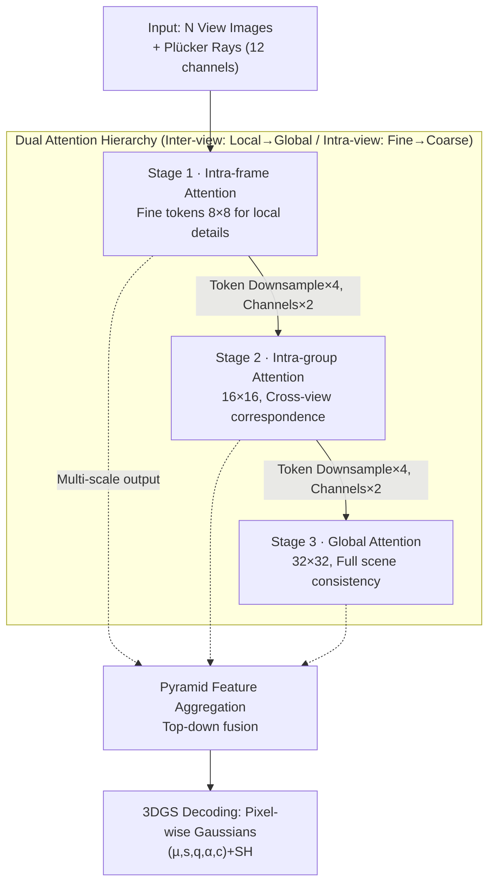

# Multi-view Pyramid Transformer: Look Coarser to See Broader

**Conference**: CVPR 2026  
**Paper**: [CVF Open Access](https://openaccess.thecvf.com/content/CVPR2026/html/Kang_Multi-view_Pyramid_Transformer_Look_Coarser_to_See_Broader_CVPR_2026_paper.html)  
**Code**: Project Page https://gynjn.github.io/MVP/  
**Area**: 3D Vision  
**Keywords**: Feed-forward 3D reconstruction, Multi-view Transformer, 3D Gaussian Splatting, Pyramid Attention, Scalability

## TL;DR
MVP utilizes a "dual attention hierarchy" (relaxing the view dimension from intra-frame → intra-group → global, while merging spatial tokens from fine → coarse) to enable feed-forward Transformers to process dozens to hundreds of images. It reconstructs large-scene 3D Gaussians within 0.1–2 seconds, achieving state-of-the-art quality and speed across the 16–256 view range.

## Background & Motivation

**Background**: Recent large-scale reconstruction models (LRM series, DUSt3R/VGGT lineage) reformulate 3D reconstruction as "multi-view 2D reasoning." By tokenizing input images and feeding them as a long sequence into a Transformer, these models establish cross-view geometric correspondences via self-attention to output point clouds, depth, or 3D Gaussians in a single forward pass. This paradigm is more robust and faster than traditional geometric pipelines like COLMAP.

**Limitations of Prior Work**: High-resolution images contribute a large number of tokens, and sequence length grows linearly with the number of input views. Since self-attention has quadratic complexity, increasing the view count leads to memory and computational explosions. Existing efficiency solutions have drawbacks: Long-LRM replaces some attention blocks with Mamba’s linear complexity blocks but lacks the expressiveness of self-attention; iLRM compresses inputs into compact scene representations, but global attention remains a bottleneck as views increase; LVT restricts attention to neighboring views, requiring multi-layer local interactions to achieve global consistency, which is difficult to define and relies on known camera poses.

**Key Challenge**: There is a trade-off between scalability (number of views) and expressiveness/global consistency. Crucially, the authors argue that **global attention is not truly effective in long contexts**: as the number of views increases, the attention distribution becomes diluted and unstable, leading to poor correspondence learning—mathematically observed as "diminishing returns with more views." Thus, stacking global attention is not only slow but also hits a quality ceiling.

**Key Insight**: The authors adopt the "fine-to-coarse" philosophy proven in CNNs and Swin Transformers. Shallow layers use fine-grained feature maps to capture local details, while deeper layers use coarse, highly semantic feature maps to capture global context while reducing computation. This pyramid philosophy is adapted into the multi-view setting.

**Core Idea**: To build a **Dual Attention Hierarchy** that converges along two complementary dimensions: the view dimension relaxes attention windows from "local → global," and the spatial dimension merges intra-frame tokens from "fine → coarse." This ensures the number of tokens participating in attention does not explode, preventing attention dilution while balancing computation and expressiveness.

## Method

### Overall Architecture
MVP is a feed-forward multi-view dense prediction Transformer. It takes $N$ images with known camera poses as input and outputs pixel-wise 3D Gaussians (position, scale, rotation, opacity, color), which are rendered into novel views using 3DGS. The core consists of a three-stage attention pyramid: Stage 1 performs intra-frame attention to capture details; Stage 2 performs intra-group attention to establish local cross-view correspondences; Stage 3 uses global attention to stitch the scene into a consistent 3D representation. Between stages, spatial resolution is reduced by $4 \times$ and channels are doubled. Multi-scale outputs are fused via a Pyramid Feature Aggregation (PFA) module and decoded by a linear head.

### Key Designs

**1. Inter-view Attention Hierarchy: Scaling via "Intra-frame → Intra-group → Global"**

This addresses the bottleneck where global attention is slow and diluted. The authors introduce grouped self-attention as an intermediate between "purely local" and "global." Views are partitioned into contiguous groups of size $M=4$. The three stages use 2 intra-frame blocks, 4 intra-group blocks, and 8 global blocks respectively. The attention window expands from a single frame to a group and finally to all views (where Stage 3 is a special case with $M=N$):

$$G \leftarrow \text{group}(T),\quad G_{i,j} \leftarrow \text{self-att}(G_{i,j})\ (\text{Intra-frame}),\quad T_i \leftarrow \text{self-att}(G_i)\ (\text{Intra-group})$$

where $T \in \mathbb{R}^{Nhw \times d}$ represents all tokens. This design is effective because: 1) Group size is fixed, and global attention occurs only in the final stage when tokens are significantly downsampled, preventing token count explosion; 2) Local correspondences are learned before global consistency, avoiding dilution over massive token sets.

**2. Intra-view Attention Hierarchy: Coarsening tokens for computation and receptive field**

Individual high-resolution images contribute too many tokens. This hierarchy performs "fine-to-coarse" spatial merging. Convolutional layers between stages perform spatial downsampling ($h \to h/2, w \to w/2$) and channel doubling. Patch sizes progress from $8 \times 8 \to 16 \times 16 \to 32 \times 32$, with embedding dimensions increasing from $256 \to 512 \to 1024$. Early stages capture local geometry, while later stages consolidate large-scale context. This complements the inter-view hierarchy to strictly bound the total token count.

**3. Pyramid Feature Aggregation (PFA): Top-down fusion for dense prediction**

Downsampling improves efficiency but loses detail if only the coarsest feature map is used for decoding. PFA reshapes tokens from each stage back to spatial maps, projects them, and merges them top-down via upsampling and residual fusion:

$$F = \text{fuse}\big(\text{up}(\text{fuse}(\text{up}(F^{(3)}) + F^{(2)})) + F^{(1)}\big)$$

This reconciles global context with fine-grained local details. Ablations show PFA is critical for LPIPS (perceptual detail), which degrades from 0.235 to 0.340 without it.

### Loss & Training
Each pixel parameters a 3D Gaussian $(\mu, s, q, \alpha, c)$ and spherical harmonics (SH) coefficients. Supervision uses MSE and Perceptual loss ($\lambda=0.2$) between rendered images and ground truth. A view-dependent opacity regularization term $R_\alpha = \frac{1}{N_\mathcal{G}}\sum_j|\sigma(\alpha_j \cdot \omega_j)|$ is added to suppress artifacts. Total loss: $L = L_\text{img} + \gamma R_\alpha$ with $\gamma=0.001$. Training follows a curriculum: 1) $480 \times 256$, 32 views; 2) $960 \times 540$, 32 views; 3) $960 \times 540$, variable views while **freezing the first two stages** and updating only global modules.

## Key Experimental Results

### Main Results
On the DL3DV dataset, MVP is compared against optimized 3D-GS (30K steps) and feed-forward baselines Long-LRM and iLRM:

| View Count | Method | PSNR↑ | SSIM↑ | LPIPS↓ | Time (s)↓ |
|------------|--------|-------|-------|--------|-----------|
| 16 | iLRM | 21.92 | 0.748 | 0.316 | 0.19 |
| 16 | **Ours** | **23.76** | **0.798** | **0.239** | **0.09** |
| 32 | iLRM | 24.30 | 0.803 | 0.256 | 0.53 |
| 32 | **Ours** | **25.96** | **0.847** | **0.187** | **0.17** |
| 128 | iLRM | 22.98 | 0.807 | 0.249 | 5.61 |
| 128 | 3D-GS (30k) | 29.43 | 0.914 | 0.123 | 8 min |
| 128 | **Ours** | 29.02 | 0.903 | 0.134 | **0.77** |
| 256 | iLRM | 20.63 | 0.767 | 0.281 | 20.92 |
| 256 | 3D-GS (30k) | 30.39 | 0.926 | 0.114 | 8 min |
| 256 | **Ours** | 29.67 | 0.915 | 0.125 | **1.84** |

At 256 views, MVP is within 0.7 dB PSNR of optimized 3D-GS while being over $250 \times$ faster. Long-LRM fails (OOM) at 256 views, and iLRM’s quality degrades as views increase. Zero-shot transfer to Mip-NeRF360 shows MVP leads significantly at 128 views (PSNR: Ours 25.12 vs iLRM 21.32). 

### Ablation Study
Variants trained on DL3DV at $256 \times 256$ for 100K steps:

| Configuration | PSNR↑ | SSIM↑ | LPIPS↓ | Note |
|---------------|-------|-------|--------|------|
| Baseline (Full) | 22.79 | 0.733 | 0.235 | Frame2/Group4/Global8 + PFA |
| w/o PFA | 21.58 | 0.646 | 0.340 | Loss of fine details |
| w/o Intra-group | 22.53 | 0.720 | 0.247 | Weak cross-view modeling |
| w/o Inter-view (Global only) | 22.94 | 0.739 | 0.236 | Slightly better, but computation scales poorly |
| w/o Intra-view (Fixed tokens) | 22.83 | 0.732 | 0.249 | OOM at 256 views |
| Reverse Hierarchy | 18.95 | 0.442 | 0.555 | Order of processing is essential |

### Key Findings
- **PFA is critical for perceptual quality**: Without it, LPIPS nearly doubles, proving multi-scale fusion is vital for detail recovery.
- **Inter-view hierarchy enables scalability**: Total global attention provides a slightly higher peak PSNR at low view counts but is $6 \times$ slower at 256 views.
- **Intra-view hierarchy prevents OOM**: Without spatial token merging, processing 256 views is computationally impossible.
- **Order matters**: Reversing the stages (Global-to-Local) leads to performance collapse, suggesting the "local-then-global" inductive bias is key.
- **Robustness to long context**: When trained on 32 views but tested on 48, MVP’s PSNR increases by +1.18, whereas other baselines saturate.

## Highlights & Insights
- **Dual Hierarchy Synergy**: MVP正交叠加 (orthogonally stacks) view grouping and spatial token merging. Neither alone is sufficient to handle token totals in long contexts.
- **Attention Dilution as a Quality Issue**: The authors frame hierarchy not just as a speed optimization, but as a quality necessity to prevent diluted attention scores in long sequences.
- **Unified Transformer Framework**: The framework elegantly unifies intra-frame, intra-group, and global attention, making it easily adaptable to dynamic scenes or geometric tasks.
- **Redundancy Pruning**: Pruning Gaussians with opacity $<0.01$ removes 89% of primitives at 256 views with minimal (0.15 dB) PSNR loss.

## Limitations & Future Work
- **Pose Dependence**: Relies on known camera poses (Plücker rays), limiting utility compared to pose-free models like DUSt3R.
- **Static Scene Focus**: While extensible, the current experiments are limited to static feed-forward reconstruction. 
- **High Training Cost**: Requires significant GPU resources (32 $\times$ H100 for 9 days) and a multi-stage curriculum.
- **Grouping Strategy**: The current simple sequential grouping does not account for actual geometric overlap or camera proximity.

## Related Work & Insights
- **vs Long-LRM**: Long-LRM uses Mamba blocks to improve efficiency but lacks self-attention expressiveness and hits OOM at 256 views. MVP retains self-attention while bounding token count.
- **vs iLRM**: iLRM crashes to 20.6 PSNR at 256 views due to global attention bottlenecks; MVP avoids this by delaying global attention to the coarsest token stage.
- **vs LVT**: LVT relies on indirect multi-layer propagation for global consistency; MVP achieves global consistency explicitly in its final stage.

## Rating
- Novelty: ⭐⭐⭐⭐
- Experimental Thoroughness: ⭐⭐⭐⭐⭐
- Writing Quality: ⭐⭐⭐⭐
- Value: ⭐⭐⭐⭐⭐

<!-- RELATED:START -->

## Related Papers

- [\[CVPR 2026\] SMVRT: Implicit Human 3D Modeling Using Sparse Multi-View Volumetric Reconstruction with Transformer Fusion](smvrt_implicit_human_3d_modeling.md)
- [\[CVPR 2026\] Any Resolution Any Geometry: From Multi-View To Multi-Patch](any_resolution_any_geometry_from_multi-view_to_multi-patch.md)
- [\[CVPR 2026\] DepthFocus: Controllable Depth Estimation for See-Through Scenes](depthfocus_controllable_depth_estimation_for_see-through_scenes.md)
- [\[CVPR 2026\] Multi-view Consistent 3D Gaussian Head Avatars 'without' Multi-view Generation](multi-view_consistent_3d_gaussian_head_avatars_without_multi-view_generation.md)
- [\[CVPR 2026\] ART: Articulated Reconstruction Transformer](art_articulated_reconstruction_transformer.md)

<!-- RELATED:END -->
