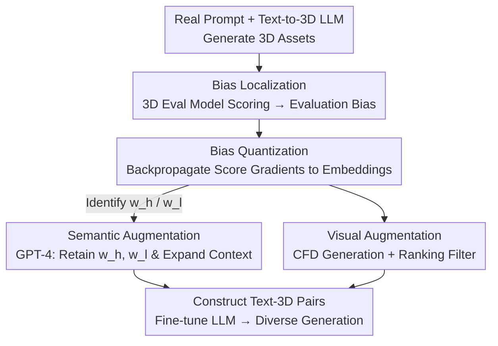

# Multimodal Semantic Bias Mitigation for Diverse Text-To-3D Generation

**Conference**: CVPR 2026  
**Paper**: [CVF Open Access](https://openaccess.thecvf.com/content/CVPR2026/html/Min_Multimodal_Semantic_Bias_Mitigation_for_Diverse_Text-To-3D_Generation_CVPR_2026_paper.html)  
**Code**: None  
**Area**: 3D Vision  
**Keywords**: Text-to-3D Generation, Bias Localization, Bias Mitigation, Word-level Gradients, Data Augmentation

## TL;DR
To address the "cross-modal bias" in large text-to-3D models (e.g., TRELLIS)—where models are overly sensitive to prompt formatting, focus only on a few keywords, and struggle with complex descriptions—this paper proposes a "localization-quantization-mitigation" framework. It utilizes gradients backpropagated from a 3D quality evaluation model to locate biases at the word level. Based on this, GPT-4 and external 3D generators are used to construct semantically rich and visually reliable text-3D pairs to fine-tune the large model. This approach generates higher-quality 3D content that is more diverse and better aligned with text, surpassing 8 SOTA methods on MATE-3D and T³Bench.

## Background & Motivation
**Background**: Early mainstream text-to-3D generation relied on Score Distillation Sampling (SDS) to distill 3D representations (NeRF/3DGS) from pre-trained 2D diffusion models. However, these are affected by the inherent biases of 2D diffusion priors, often leading to cross-view inconsistencies, blurry textures, and the Janus (multi-face) problem. Recently, large text-to-3D models like TRELLIS, trained directly on large-scale 3D asset datasets, can generate cross-view consistent 3D assets, representing a new paradigm.

**Limitations of Prior Work**: Due to the relative scarcity of "text-3D" paired data, while models like TRELLIS exhibit good geometric consistency, they struggle with "diverse" text-to-3D generation. Fig. 2 demonstrates significant performance variances across different prompt types; models often overfit to specific prompts or favor a single word. For example, given "A ceramic vase with a long, narrow neck," the model focuses almost entirely on "vase," yielding results that fail to match the full semantics. While understanding of "Basic" prompts is acceptable, comprehension of complex prompts like "Fantastical" or "Grouped" is poor.

**Key Challenge**: The root cause is **cross-modal semantic bias**—the influence of certain words on the generation result is severely amplified, causing the model to "over-attend" to a few words while "ignoring" the rest. This bias stems from uneven semantic coverage in the training data rather than simple model capacity issues.

**Goal**: The problem is decomposed into two sub-problems: (1) how to **locate and quantify** this cross-modal bias at the word level; and (2) how to **mitigate** the bias without damaging the model's existing general knowledge, enabling it to understand more diverse prompts.

**Key Insight**: The authors approach this from the "data layer" rather than modifying model architecture. Since bias arises from uneven semantic coverage, a pre-existing text-to-3D **evaluation model** is used as a probe. By backpropagating gradients from predicted quality scores, words with larger token embedding gradients are identified as more sensitive, indicating they are the sources of bias.

**Core Idea**: Use eval-model gradients to localize word-level bias and construct "semantically stable and rich" text-3D pairs to fine-tune the large model, redistributing concentrated attention across more words.

## Method

### Overall Architecture
The framework is a "localization → quantization → mitigation" data augmentation pipeline acting on a pre-trained large text-to-3D model (TRELLIS as backbone). First, **Bias Localization**: The model generates 3D assets from real prompts, and a multidimensional 3D quality evaluation model scores them to formalize "evaluation bias." Second, **Bias Quantization**: Gradients are backpropagated from predicted scores to text token embeddings. The absolute gradient value measures each word's contribution to the bias, identifying the "most significant word" $w_h$ and the "least significant word" $w_l$. Third, **Bias Mitigation**: Based on word-level bias, semantic augmentation (using GPT-4 to generate diverse context prompts while retaining $w_h, w_l$) and visual augmentation (using an external generator CFD to generate meshes and a ranking model to filter semantically faithful samples) are performed to construct new pairs for fine-tuning.

### Key Designs

**1. Bias Localization: Formalizing "Evaluation Bias" with a 3D Quality Probe**

To mitigate bias, a measurable definition is required. The authors treat model capability as an ideal constant $\phi$, and the evaluation model provides an estimate $\hat\phi=E(X)$ based on data $X$. Evaluation bias is defined as $\epsilon(\hat\phi)=\hat\phi-\phi$, where zero signifies an unbiased state. Specifically, for each prompt $t_n$, the large model generates a set of $D$ meshes $x_n^D=\{G(t_n)\}$, and a multidimensional evaluation model $\hat q_i=\psi(F(x,t)\mid\pi(f_c^i))$ with a shared feature extractor scores each mesh. Two types of bias are distinguished: **local bias** is statistical within the same prompt $t_n$ with local quality score $q_l=\frac{1}{|x_n^D|}\sum_{x_n^d}q$; **global bias** is averaged over the dataset $q_g=\frac{1}{|\mathcal X|}\sum_{(x,t)\in\mathcal X}q$. This step transforms the vague phenomenon of prompt sensitivity into computable score differences.

**2. Bias Quantization: Gradient Backpropagation for Word-level Attribution**

Once localized, the cause must be attributed to specific words. Since $\epsilon(\hat\phi)=\hat\phi-\phi\propto\hat\phi$, the authors use the predicted score $q$ (local or global) for attribution. Mapping the prompt token embedding sequence as $\{e_0,\dots,e_n\}$, the sum of absolute gradients of the score relative to each embedding is calculated: $e_i'=\sum\left|\frac{\partial q}{\partial e_i}\right|,\ q\in\{q_l,q_g\}$. $e_i'$ serves as an estimate of the token's contribution to bias. Token gradients are then aggregated to the word level. The intuition is that gradient magnitude reflects the sensitivity of output to that word; higher sensitivity indicates "over-reliance." To save computation, average gradients are calculated directly. This refines bias from a "sentence-level score" to a "per-word contribution."

**3. Bias Mitigation - Semantic Augmentation: Retaining Strong/Weak Words with GPT-4**

Knowing the dominant word $w_h$ and the weak word $w_l$, the mitigation strategy involves training a model with broader semantic information without losing general knowledge. Inspired by Invariant Risk Minimization (IRM), the authors construct multiple contexts $C=\{C_1,C_2,\dots\}$ using GPT-4 to generate diverse prompts that **simultaneously retain $w_h$ and $w_l$**. This preserves the base semantics $w_h$ while reinforcing the model's understanding of rare weak words $w_l$ through repeated exposure, diluting the attention monopoly of $w_h$. Generated prompts are manually filtered for consistency and diversity. This targets the "single-word focus" issue through data diversity.

**4. Bias Mitigation - Visual Augmentation: Filtering Faithful Pairs via External Generators**

Diverse prompts require visually reliable 3D counterparts. The authors use CFD (an open-source text-to-3D method) to generate 3D representations for augmented prompts, converted into textured meshes. A ranking model (HPSv2) identifies semantically faithful meshes. Specifically, for an original pair $\{x_n,t_n\}$ and generated prompt $t_{nC}$, the generated mesh $x_{nc}$ is compared with $x_n$ to determine a winner $x_{win}$ and loser $x_{lose}$. Only pairs belonging to $x_{win}$ are used to construct new pairs $\{x_{nc},t_n\}$. This "many-to-many" assignment enriches supervision signals from the text modality (Algorithm 1), ensuring fine-tuning uses high-quality, aligned pairs rather than noise.

### A Complete Example
For the prompt "A ceramic vase with a long, narrow neck": ① **Bias Localization**—TRELLIS generates multiple vase meshes; the eval model shows varying quality. ② **Bias Quantization**—Backpropagated gradients reveal "vase" has the largest gradient ($w_h$), while "long," "narrow," and "neck" have tiny gradients ($w_l$), showing the model ignores the specific description. ③ **Semantic Augmentation**—GPT-4 generates prompts with "vase" and "neck" in different contexts. ④ **Visual Augmentation**—CFD generates meshes and HPSv2 selects those actually showing a "long, narrow neck." ⑤ **Fine-tuning**—TRELLIS is updated with these pairs, resulting in outputs that correctly render the slender neck while maintaining the vase structure.

## Key Experimental Results

### Main Results
On the MATE-3D (160 prompts, 8 categories) and T³Bench (300 prompts) benchmarks, TRELLIS-text with our method (w/ ours) shows comprehensive improvements, surpassing 8 SOTA methods. Below is the total quality score on MATE-3D (selected):

| Method | Basic | Complex | Fantastic | Grouped | Imaginative |
|:---|:---:|:---:|:---:|:---:|:---:|
| One-2-3-45++ | 7.79 | 6.50 | 6.60 | 6.49 | 6.13 |
| TRELLIS-text | 7.39 | 6.50 | 6.24 | 5.73 | 5.57 |
| **TRELLIS-text w/ ours** | **8.19** | **6.72** | **6.95** | **6.64** | **6.25** |

On T³Bench (scores normalized to [0,100]), our method is optimal across single object, single object with environment, and multi-object settings. For multi-object, the score rose from 28.5 (TRELLIS-text) to 37.5:

| Method | Single Obj. Avg | w/ Env Avg | Multi-Obj. Avg |
|:---|:---:|:---:|:---:|
| ProlificDreamer | 49.4 | 44.8 | 35.8 |
| TRELLIS-text | 44.8 | 43.4 | 28.5 |
| **TRELLIS-text w/ ours** | **50.2** | **47.8** | **37.5** |

Compared to the previous best One-2-3-45++, the average gain is 0.19 (MATE-3D). Improvements are most significant in "Fantastical" and "Grouped," categories, addressing the primary weakness in complex prompt understanding.

### Ablation Study
Ablations on prompt generation strategies (MATE-3D) verify the necessity of "gradient guidance + $w_h/w_l$ synergy":

| Configuration | Basic | Fantastic | Grouped | Note |
|:---|:---:|:---:|:---:|:---|
| TRELLIS-text | 7.39 | 6.24 | 5.73 | Base model |
| w/o grad guide | 4.15 | 3.24 | 3.37 | Massive drop without gradient guidance |
| only $w_l$ | 4.39 | 5.23 | 3.11 | Weak words only |
| only $w_h$ | 7.68 | 6.43 | 5.81 | Strong words only |
| **Ours (Full)** | **8.19** | **6.95** | **6.64** | Both words + gradient guidance |

### Key Findings
- **Gradient guidance is vital**: Removing it causes a performance collapse (Basic drops from 8.19 to 4.15), proving that blind prompt augmentation is harmful; word-level localization is essential.
- **Both $w_h$ and $w_l$ are required**: Using only strong words yields limited gains, while using only weak words leads to degradation. Simultaneous preservation achieves the IRM-style goal of "maintaining base semantics while filling gaps."
- **Plug-and-play capability**: Applying the same prompt augmentation to One-2-3-45++ also yields gains (e.g., Basic 7.79 → 7.86), showing the framework is not limited to one backbone.
- **Interpretable localization**: Word-level gradients link specific linguistic concepts to geometric/appearance distortions in 3D meshes, providing a visualization tool for generation bias.

## Highlights & Insights
- **First work on bias detection/mitigation in text-to-3D LLMs**: Extends 2D "fairness/bias" research to the 3D domain, specifically targeting cross-modal bias.
- **Eval-model gradients as bias probes**: Localizes bias at the word level without changing architecture or requiring manual labels, providing an elegant and interpretable attribution method.
- **Data-centric mitigation**: Addresses the root cause in the training data via GPT-4 and external generators, avoiding the high cost of significant model weight updates.
- **Strong-weak word synergy (IRM perspective)**: Provides a clean paradigm for ensuring models do not fixate on single words.

## Limitations & Future Work
- **Dependency on external components**: The pipeline relies on 3D quality models, GPT-4, CFD, and HPSv2. Errors in any component can propagate.
- **Manual filtering**: Semantic augmentation involves a manual step to remove improper prompts, limiting full automation.
- **Gradient magnitude as a proxy**: Whether $| \text{grad} |$ perfectly captures cross-modal bias (rather than just sensitivity) requires further theoretical grounding.
- **Limited backbone testing**: Primarily validated on TRELLIS-text; more evidence is needed for generalizability across diverse architectures.

## Related Work & Insights
- **vs. SDS-based Text-to-3D**: Those methods suffer from 2D prior biases (Janus problem). Ours works on 3D LLMs to mitigate text-side biases at the data layer.
- **vs. TRELLIS**: While TRELLIS has consistent geometry, it lacks diversity. This work specifically bolsters TRELLIS's semantic diversity for complex prompts.
- **vs. 2D Diffusion Bias Mitigation**: Similar to FairDiffusion or ITI-GEN in 2D, this work extends these concepts to 3D via "eval-gradient attribution + data augmentation."

## Rating
- Novelty: ⭐⭐⭐⭐ First to address 3D LLM bias using word-level gradient attribution.
- Experimental Thoroughness: ⭐⭐⭐⭐ Solid results on two benchmarks, though sensitive to external model bias and lacking wider backbone evidence.
- Writing Quality: ⭐⭐⭐ Formalization is clear, though some notation is slightly dense.
- Value: ⭐⭐⭐⭐ Practical data-layer solution for complex prompt understanding in 3D.

<!-- RELATED:START -->

## Related Papers

- [\[CVPR 2026\] Are We Ready for RL in Text-to-3D Generation? A Progressive Investigation](are_we_ready_for_rl_in_text-to-3d_generation_a_progressive_investigation.md)
- [\[CVPR 2026\] Text–Image Conditioned 3D Generation](text-image_conditioned_3d_generation.md)
- [\[CVPR 2026\] Image-to-Point Cloud Feature Back-Projection for Multimodal Training of 3D Semantic Segmentation](image-to-point_cloud_feature_back-projection_for_multimodal_training_of_3d_seman.md)
- [\[CVPR 2026\] Text-Driven 3D Hand Motion Generation from Sign Language Data](text-driven_3d_hand_motion_generation_from_sign_language_data.md)
- [\[CVPR 2026\] 3D-VCD: Hallucination Mitigation in 3D-LLM Embodied Agents through Visual Contrastive Decoding](3d-vcd_hallucination_mitigation_in_3d-llm_embodied_agents_through_visual_contras.md)

<!-- RELATED:END -->
