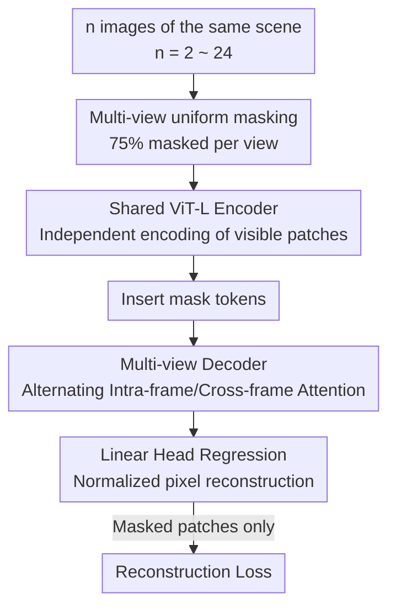

# MuM: Multi-View Masked Image Modeling for 3D Vision

**Conference**: CVPR 2026  
**Paper**: [CVF Open Access](https://openaccess.thecvf.com/content/CVPR2026/html/Nordstrom_MuM_Multi-View_Masked_Image_Modeling_for_3D_Vision_CVPR_2026_paper.html)  
**Code**: https://github.com/davnords/mum  
**Area**: 3D Vision / Self-Supervised Pre-training  
**Keywords**: Masked Image Modeling, Multi-view Self-supervision, 3D Feature Learning, MAE, CroCo

## TL;DR
MuM generalizes the "mask-and-reconstruct" objective of MAE from single images to arbitrary multi-view sequences (up to 24 views) of the same scene. By utilizing a lightweight multi-view decoder with alternating cross-frame attention, it pre-trains geometric-aware feature encoders. MuM outperforms DINOv3 and CroCo v2 on 3D tasks such as feed-forward reconstruction, dense matching, and relative pose estimation while using approximately 1/30 of the training compute.

## Background & Motivation

**Background**: Image Self-Supervised Learning (SSL) currently follows two main paradigms. One is the Masked Autoencoder (MAE) family, which randomly masks a large portion of an image and requires the network to reconstruct masked pixels. The other is the self-distillation/instance discrimination DINO family, where DINOv3 represents the state-of-the-art for semantic features. Current 3D vision pipelines (e.g., VGGT, MapAnything, RoMa) increasingly rely on strong pre-trained encoders as backbones followed by geometric heads.

**Limitations of Prior Work**: Features learned by the DINO series are generally considered "semantic" rather than "geometric" and are extremely expensive to train—DINOv3-7B required 161,440 H100 hours, sophisticated heuristics like Sinkhorn-Knopp centering to avoid collapse, and billions of images, making it inaccessible to typical academic labs. Within the MAE paradigm, CroCo is specifically designed for 3D by conditioning the reconstruction task on an "unmasked reference view" to force the network to learn geometric correspondences. However, this requires significant overlap between view pairs, making data sampling fragile. Subsequent improvements that changed the task to co-visibility segmentation rely on ground-truth geometry, weakening the purity of "self-supervision."

**Key Challenge**: To obtain geometric features, the dual-view conditional reconstruction in CroCo is stuck between "data sampling flexibility" and "geometric supervision intensity"—reference views must overlap and do not naturally scale beyond two frames. Furthermore, existing methods cannot achieve DINO-level performance for both semantics and geometry without massive compute.

**Goal**: Design a simple, scalable, and sampling-tolerant SSL objective specifically for the geometric features required by 3D tasks, while reducing training costs to an academically feasible level.

**Key Insight**: The "dual-view" constraint in CroCo is unnecessary. Since MAE already learns significant representations from single-image reconstruction, one can simply feed "multi-view sequences of the same scene + uniform masking" into the network. Forcing the network to reconstruct each image by leveraging visible information from other views causes geometric correspondences to emerge naturally through "cross-view completion." Additionally, the framework seamlessly degenerates to standard MAE when $n=1$, making sampling completely independent of co-visibility requirements.

**Core Idea**: Extend the MAE reconstruction objective from "one image" to "arbitrary multiple images of the same scene." All views use a uniform mask, and a lightweight decoder with alternating inter-frame attention is used for joint decoding, learning geometric features through a minimalist pixel reconstruction loss.

## Method

### Overall Architecture
MuM is a self-supervised pre-training framework based on a ViT encoder-decoder architecture. The input is a sequence of images $I=(I_1,\dots,I_n)$ from the same scene (where $n$ is randomly sampled between 2 and 24 during training). Each image is divided into non-overlapping patches, and a portion is masked according to a uniform masking rate of 75%. Visible patches independently pass through a **weight-sharing ViT-L encoder**. After encoding, learnable mask tokens are added back to each view, and all tokens are fed into a **lightweight ViT-B multi-view decoder**. The decoder uses alternating attention to enable communication within and across views. Finally, a linear head regresses each patch to normalized RGB pixel values, calculating the reconstruction error only at the masked positions. The objective is equivalent to the original MAE when $n=1$, naturally supporting mixed single/multi-view training.

### Key Designs

**1. Multi-View Masked Image Modeling: Extending MAE to Arbitrary Views**

The bottleneck of CroCo is its restriction to "dual views + one unmasked reference." MuM generalizes this: given a sequence $I=(I_1,\dots,I_n)$ from the same scene, each image is partially masked by a binary mask $M_i\in\{0,1\}^N$ (masking ratio $\omega_i$). The network $\varepsilon_\vartheta$ predicts the target representation from the visible parts. The loss (omitting normalization constants) is:

$$L(\vartheta)=\sum_{i=1}^{n}\big\|M_i\odot(\varepsilon_\vartheta(\tilde I_i)-f(I_i))\big\|^2$$

where $f$ defines the reconstruction target. MuM uses simple "per-patch pixel normalization." The critical difference is that MuM uses a uniform $\omega_i=0.75$ without any unmasked reference view, and $n$ is sampled uniformly from 2 to 24. This has two benefits: first, sampling is independent of co-visibility; second, extending to multiple views is natural, unlike CroCo where masking ratios for more than two views are ambiguous. Geometric correspondence emerges because the network is forced to find clues in other views to reconstruct masked patches.

**2. Symmetric Alternating Attention Decoder: Cross-view Communication without Reference Frames**

To enable multi-view collaboration, cross-view information flow is necessary. MuM places communication in the decoder. During the encoding stage, visible patches are processed **independently** by the shared ViT-L encoder (enabling parallelization). In the ViT-B decoder, $L=6$ **alternating attention blocks** are used. Each block performs (i) intra-frame attention (restricted to a single view) followed by (ii) global attention (tokens attend across all views). This mechanism, adapted from VGGT, is used here in an SSL context and is intentionally **symmetric**—unlike CroCo or DUSt3R, no specific reference frame is designated. Ablations show that placing communication in the encoder degrades EPE from 10.6 to 16.7 because early cross-frame mixing interferes with learning the representations of visible patches.

**3. Minimalist Pixel Reconstruction + Modern ViT Components**

A counter-intuitive finding in this work is that on multi-view 3D data, naive pixel reconstruction outperforms the self-distillation used in DINOv2. Comparing three SSL objectives (DINOv2, CroCo v2, MAE) under equal data and compute budgets (ViT-B, MegaDepth, 100K steps), multi-view MAE reduced EPE from 18.7 to 12.5, whereas DINOv2 showed almost no improvement (28.9 to 28.4). Furthermore, the MAE objective is significantly faster to train. MuM also incorporates modern components: axial RoPE (EPE 10.6 vs. 12.1 for absolute positional encoding), a 75% masking rate, and normalized pixel targets.

### Loss & Training
Pre-training uses AdamW for 500K steps, with 25K warmup steps and cosine decay. The base learning rate is $1\times10^{-4}$, scaled linearly to a peak of $2.4\times10^{-3}$ at a batch size of 6144. Sequences of length 2–24 are randomly selected for each batch. Images are resized to $256\times256$ with random horizontal flips. The training data comprises ~20 million frames from 11 3D datasets (3DStreetView, ARKitScenes, CO3D, MegaDepth, ScanNet++, RealEstate10K, etc.), with 10% ImageNet-1K single-view data mixed in. Pre-training took approximately three days on 64×A100 GPUs.

## Key Experimental Results

### Main Results
MuM outperforms DINOv3 and CroCo v2 across multi-view 3D tasks. Multi-view camera pose and point cloud estimation results (frozen encoder):

| Task | Metric | CroCo v2 | DINOv3 | MuM |
|------|------|----------|--------|-----|
| Camera Pose CO3Dv2 | AUC@30 ↑ | 58.2 | 66.9 | **71.5** |
| Camera Pose Re10K | AUC@30 ↑ | 27.7 | 36.7 | **50.8** |
| Camera Pose MegaDepth | AUC@30 ↑ | 60.7 | 59.3 | **73.0** |
| Point Cloud DTU | Acc. ↓ | 8.5 | 6.4 | **3.7** |
| Point Cloud ETH3D | Acc. ↓ | 0.9 | 0.9 | **0.8** |

Dense feature matching linear probe (lower EPE is better):

| Method | Architecture | MegaDepth EPE ↓ | MegaDepth R ↑ | ScanNet EPE ↓ |
|------|------|-----------------|---------------|----------------|
| DINOv3 | ViT-L/16 | 19.0 | 86.4 | 28.7 |
| CroCo v2 (DUSt3R finetuned) | ViT-L/16 | 22.0 | 80.9 | 29.0 |
| MAE | ViT-L/16 | 29.7 | 73.4 | 35.0 |
| **Ours** (32×A100) | ViT-L/16 | **12.0** | **93.7** | 30.2 |
| **Ours** (64×A100) | ViT-L/16 | **10.2** | **94.2** | **27.9** |

MuM also leads in two-view relative pose estimation, achieving an AUC@5° of 26.7 on MegaDepth, significantly higher than DINOv3 (15.6) and CroCo v2 (13.9). MuM achieved this using ~4,608 A100 hours, compared to 161,440 H100 hours for DINOv3-7B (~30x less compute).

### Ablation Study
ViT-B/16 trained for 100K steps on MegaDepth, reporting linear probe EPE (↓):

| Configuration | EPE ↓ | Description |
|------|-------|------|
| Default (75% mask, 2–24 frames, decoder comms, RoPE, Norm) | 10.6 | Full setting |
| Sequence length 2,6 → 2,24 | 12.8 → 10.6 | Longer sequences improve matching |
| Masking 65% / 85% | 13.3 / 12.7 | 75% is optimal |
| Add unmasked reference view | 11.9 | Degrades performance and adds complexity |
| Comm. in encoder | 16.7 | Must be in decoder |
| Absolute Positional Encoding | 12.1 | RoPE is superior |

### Key Findings
- **Counter-intuitive Insight**: On multi-view 3D data, simple pixel reconstruction (multi-view MAE) beats expensive DINOv2 self-distillation. Replacing pixel targets with high-level representations improves semantics but hurts geometry.
- **Decoder Communication**: Inter-frame communication must occur in the decoder; placing it in the encoder interferes with per-view representation learning.
- **Removing Reference Views**: Eliminating the reference view used in CroCo actually improves results (10.6 vs 11.9) and enables seamless single/multi-view training.
- **Cost Distribution**: MuM excels in multi-view geometric tasks but still trails DINOv3 in single-view semantic tasks (classification, segmentation), as the latter's instance discrimination loss is biased toward semantics.

## Highlights & Insights
- **"Less is More" Paradigm**: Proves that geometric features do not require expensive self-distillation; simple pixel reconstruction + multi-view extension can outperform DINOv3 with 1/30 of the compute.
- **Symmetric Design**: By removing the reference frame used in CroCo/DUSt3R, MuM treats all views equally, simplifying the architecture and allowing $n=1$ to naturally revert to MAE.
- **"Encoder Independence, Decoder Communication"**: This division of labor allows for efficient parallelization in the encoding stage and defers interaction, offering a template for other multi-input pre-training tasks.

## Limitations & Future Work
- **Scale**: Due to compute constraints, the authors could not scale pre-training further or fully replicate end-to-end feed-forward reconstruction pipelines like VGGT.
- **Semantic Weakness**: Purely geometric objectives sacrifice semantic inductive biases; fusing DINO's semantics with MuM's geometry is a future direction.
- **Observation**: Ablations were performed in a lightweight ViT-B setting; whether these conclusions hold for larger models or more diverse data remains to be seen.

## Related Work & Insights
- **vs CroCo / CroCo v2**: Both aim for geometric features. CroCo uses dual-view conditional reconstruction with a reference view. MuM uses arbitrary multi-view sequences with uniform masking and no reference frame, proving more flexible and accurate.
- **vs DINOv3**: DINOv3 learns semantic features via expensive self-distillation. MuM uses a fraction of the compute and pixel targets to lead in geometric tasks, though it lags in semantic tasks.
- **vs MAE**: MuM is a direct multi-view extension of MAE. The multi-view interaction improves matching EPE from 18.7 to 12.5.
- **vs VGGT**: Inherits the alternating attention and sequence sampling strategy but adapts it for symmetric self-supervised pre-training rather than supervised reconstruction.

## Rating
- Novelty: ⭐⭐⭐⭐ Simple but effective generalization of MAE.
- Experimental Thoroughness: ⭐⭐⭐⭐⭐ Comprehensive coverage across six task categories and detailed ablations.
- Writing Quality: ⭐⭐⭐⭐ Clear motivation and logical derivation.
- Value: ⭐⭐⭐⭐⭐ Significant for the academic community due to high performance at low compute costs.

## Related Papers

- [\[CVPR 2026\] Suppressing Non-Semantic Noise in Masked Image Modeling Representations](suppressing_non-semantic_noise_in_masked_image_modeling_representations.md)
- [\[CVPR 2026\] GeoBridge: A Semantic-Anchored Multi-View Foundation Model for Geo-Localization](geobridge_semantic-anchored_multi-view_foundation_model_for_geo-localization.md)
- [\[CVPR 2026\] GaussianMatch: Semi-Supervised Regression with Pseudo-Label Filtering via Multi-View Gaussian Consistency](gaussianmatch_semi-supervised_regression_with_pseudo-label_filtering_via_multi-v.md)
- [\[CVPR 2025\] From Prototypes to General Distributions: An Efficient Curriculum for Masked Image Modeling](../../CVPR2025/self_supervised/from_prototypes_to_general_distributions_an_efficient_curriculum_for_masked_imag.md)
- [\[CVPR 2026\] TALO: Pushing 3D Vision Foundation Models Towards Globally Consistent Online Reconstruction](talo_pushing_3d_vision_foundation_models_towards_globally_consistent_online_reco.md)

<!-- RELATED:END -->

<!-- RELATED:START -->

## Related Papers

- [\[CVPR 2026\] Intrinsic Image Fusion for Multi-View 3D Material Reconstruction](intrinsic_image_fusion_for_multi-view_3d_material_reconstruction.md)
- [\[CVPR 2026\] SMVRT: Implicit Human 3D Modeling Using Sparse Multi-View Volumetric Reconstruction with Transformer Fusion](smvrt_implicit_human_3d_modeling.md)
- [\[CVPR 2026\] FISHuman: Fine-grained Single-image 3D Human Reconstruction via Multi-view 4D Remeshing](fishuman_fine-grained_single-image_3d_human_reconstruction_via_multi-view_4d_rem.md)
- [\[CVPR 2026\] Multi-view Consistent 3D Gaussian Head Avatars 'without' Multi-view Generation](multi-view_consistent_3d_gaussian_head_avatars_without_multi-view_generation.md)
- [\[CVPR 2026\] C-GenReg: Training-Free 3D Point Cloud Registration by Multi-View-Consistent Geometry-to-Image Generation with Probabilistic Modalities Fusion](c-genreg_training-free_3d_point_cloud_registration_by_multi-view-consistent_geom.md)

<!-- RELATED:END -->
