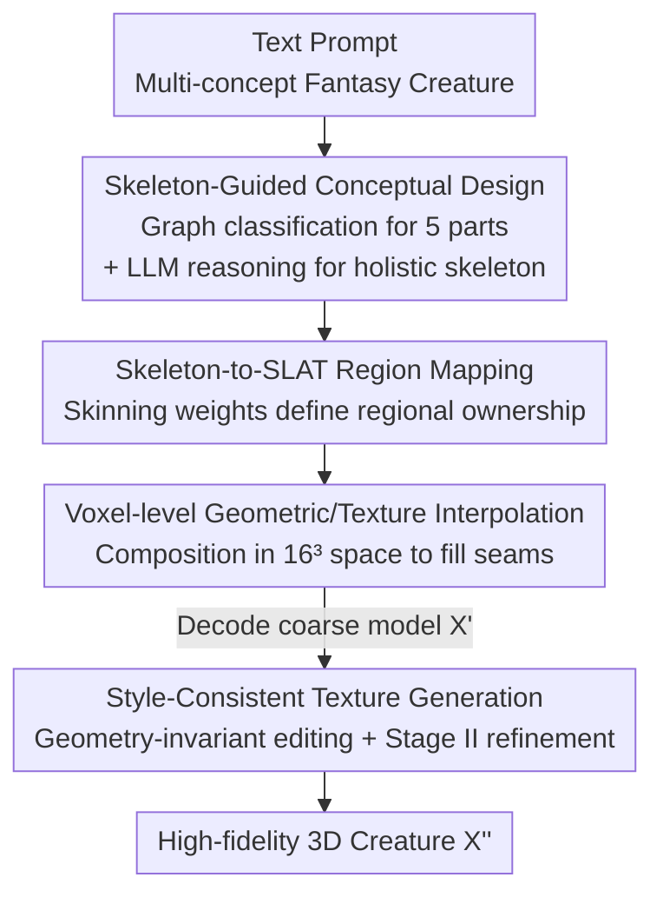

# Muses: Designing, Composing, Generating Nonexistent Fantasy 3D Creatures without Training

**Conference**: CVPR 2026  
**Paper**: [CVF Open Access](https://openaccess.thecvf.com/content/CVPR2026/html/Lu_Muses_Designing_Composing_Generating_Nonexistent_Fantasy_3D_Creatures_without_Training_CVPR_2026_paper.html)  
**Code**: Project Page https://luhexiao.github.io/Muses.github.io/  
**Area**: 3D Vision  
**Keywords**: Training-free 3D Generation, Fantasy Creatures, 3D Skeleton, Structured Latent Space, Concept Composition

## TL;DR
Muses is the first **training-free, feed-forward** framework for generating fantasy 3D creatures. It parses highly compositional text (e.g., "a creature with a tiger body, dragon wings, robotic legs, and nine fox tails") into 3D skeletons for individual parts, assembles a reasonable holistic skeleton via graph classification and LLM reasoning, and performs voxel-level geometric and texture interpolation within the Structured Latent Space (SLAT) of Trellis. Finally, it concludes with style-consistent texture editing, significantly outperforming methods like DreamBeast and OmniPart in visual fidelity and text alignment (VQAScore 0.93 vs. 0.82).

## Background & Motivation

**Background**: Mainstream 3D content generation follows three paths: distilling 2D generative priors into optimizable 3D representations (SDS family, e.g., DreamFusion), synthesizing multi-view 2D images followed by 3D reconstruction, and training feed-forward models on large-scale 3D data (e.g., Trellis). These methods suffice for "common" objects.

**Limitations of Prior Work**: Existing pipelines fail when the target is a **highly creative, out-of-distribution (OOD)** creature (combinations of multiple species with unusual parts). Part-based manipulation methods (DreamBeast using part-affinity, OmniPart for part-level generation) have two flaws: difficulty in controlling part granularity and extreme difficulty in fusing individual 3D parts into a coherent whole at the **seams**. DreamBeast is slowed by SDS per-instance optimization and supports at most three parts, while OmniPart requires manual assembly. Approaches that lift 2D creative images to 3D (e.g., UNO+Trellis) rely heavily on 2D image quality; since the target is far outside the 3D training distribution, neither realism nor harmony can be guaranteed.

**Key Challenge**: Direct splicing at the pixel or part level lacks a structural backbone capable of **explicitly and reasonably constraining "where each part goes, how large it is, and its orientation"**. Without this backbone, composition degenerates into messy splicing at the seams.

**Goal**: To generate geometrically coherent and texture-harmonious nonexistent 3D creatures that are faithful to creative text, while keeping the process automatic and feed-forward without training any new models.

**Key Insight**: The authors leverage the biological fact that the **3D skeleton is the fundamental representation of biological morphology**. Skeletons naturally encode the topological and proportional relationships of "body/wings/legs/head/tail." By treating it as a design backbone, the vague task of "creative composition" is formalized into a structure-aware pipeline: "design skeleton → compose by skeleton → generate texture by skeleton."

**Core Idea**: Replace part-level splicing and 2D-driven approaches with 3D skeletons. The creation of nonexistent creatures is decomposed into three stages: **Design → Compose → Generate**, all constrained by the same skeleton.

## Method

### Overall Architecture
The input is a text description $C$ of a fantasy creature (e.g., "a creature with an octopus body, kingfisher wings, and a sika deer head"), and the output is a high-fidelity 3D creature with unified styling. Muses uses Trellis (SLAT representation) as the backbone, remains entirely training-free, and operates in three serial stages:

- **Stage I: Skeleton-Guided Conceptual Design**: Parses $C$ into $M$ concepts, generating corresponding 3D assets $\{X\}_{m=1}^M$ and skeletons $\{G=(V,E)\}_{m=1}^M$. Graph classification splits each skeleton into five sub-skeleton categories (body/wings/legs/head/tail), and an LLM reasons a text-aligned, logically laid out holistic skeleton $\dot G$.
- **Stage II: SLAT-Based Content Composition**: Maps skeleton segments to SLAT regions using skinning weights. Geometric and texture interpolation are performed in the compressed $16^3$ voxel space to assemble the latent code $Z'$ of a coarse model $X'$.
- **Stage III: Style-Consistent Texture Generation**: Renders $X'$ as a reference image and performs geometry-invariant texture editing via FLUX.1 Kontext to obtain a style image $I'$. This is fed back into the second stage of Trellis to refine the final creature $X''$.

### Key Designs

**1. Skeleton-Guided Conceptual Design: Formalizing "creative assembly" as graph-based part classification + LLM layout reasoning**

The greatest pain point of part-level methods is uncontrollable granularity and a lack of orientation/proportion management. Muses first creates a holistic skeleton with **clear semantics and reasonable proportions/orientations**. It performs **graph-based skeleton classification**: given 3D assets and skeletons $G=(V,E)$ (where $V$ are joint coordinates and $E$ are connections), small branches like claws/antennae are cleared via connected component analysis and path optimization to get a clean skeleton $\tilde G$. Heuristic rules are then used for semantic decomposition. Starting from a root node $r$ near the pelvis: if $\deg(r)\ge 3$, then $b=r$; otherwise, $b$ is the neighbor of $r$ with the largest degree. Leaf nodes with $y$-coordinates lower than $b$ are selected as leg candidates $V_{low}$, and $G_{leg}$ is determined using symmetry relative to the main direction $\delta$. Along $\delta$, the first trunk node $d=\arg\min_{v,\deg(v)\ge 4}\langle v,\hat\delta\rangle$ is found; the path from $b$ to $d$ is $G_{body}$, symmetric extensions from $d$ are wings/legs, and the remainder is the head.

Rules only follow topology and lack **semantic awareness** to judge "how large the head should be and where it should point." Thus, the second step utilizes **LLM Reasoning Assembly (Qwen-Plus)**: three basic editing operators are defined: $\mathrm{Rot}(\hat G;\theta)$, $\mathrm{Trans}(\hat G;t,\lambda)$, and $\mathrm{Scale}(\hat G;\alpha)$. The category, position, size, and orientation of each candidate sub-skeleton are fed to the LLM, which infers connection relationships and decomposes assembly requests into a sequence of operators. If tokens like "two heads" appear in the prompt, the LLM instantiates multiple copies symmetrically. This stage is a mapping $f_{LLM}:(\bar G,\Delta,C)\to\dot G$.

**2. Skeleton-to-SLAT Region Mapping: Propagating "skeleton semantics" to the structured latent space rather than manual stitching**

Given a skeleton, one must determine which voxels in the SLAT representation belong to the wings or the head. Simple nearest-neighbor distance allocation is prone to over/under-segmentation. Muses uses **skinning weights** to establish explicit correspondence: it first predicts a skinning matrix $W\in\mathbb R^{Q\times J}$ ($W[i,j]$ is the influence of joint $j$ on mesh vertex $x_i$). Joint-level weights are aggregated by sub-skeleton and normalized into region-level weights $\widetilde W[i,l]=\frac{\sum_{j:G_l}W[i,j]}{\max(\sum_{l'}\sum_{j':G_{l'}}W[i,j'],\varepsilon)}$. These are then propagated to SLAT voxels: for each SLAT position $p_i$, $k$ nearest mesh vertices are found, and weights are weighted by inverse distance $\beta_{i,s}$ to obtain SLAT-level regional weights $W_{SLAT}[i,l]=\sum_s\beta_{i,s}\widetilde W[i_s,l]$.

**3. Voxel-level Geometric and Texture Interpolation: Filling seams in the compressed $16^3$ space instead of hard-splicing in sparse SLAT**

Even with regional division, large gaps exist at boundaries. The authors found that direct interpolation in the explicit $64^3$ SLAT space fails to fill gaps due to activated voxel sparsity, leaving visible seams and holes. Muses instead retreats to a more compact $16^3$ voxel space $S$ for linear interpolation—higher-level semantic latent spaces span gaps more easily than decoded sparse voxels. Geometry $S$, weights $W_{SLAT}$, and features $\{z_i\}$ are interpolated together. When multiple regions occupy the same voxel, features are merged by weight: $z_{comp}=\sum_i\tilde w_i z_i=\frac{\sum_i w_i z_i}{\sum_j w_j}$ (where $\sum_i\tilde w_i=1$), then decoded into $X'$.

**4. Style-Consistent Texture Generation: Geometry-invariant texture editing for an "aligned style image" followed by refinement**

The assembled $X'$ is geometrically sound but visually rigid. Muses concludes with two steps. **Geometry-Invariant Texture Editing**: $X'$ is rendered from the best view as a reference image $I$. FLUX.1 Kontext is used to generate a style image $I'\leftarrow\mathrm{FLUX\ Kontext}(I,C_{pos},C_{neg},\gamma)$ that follows a specific artistic style while maintaining geometric structure. Crucially, this style image is **aligned with the coarse geometry**, which is more conducive to fine texturing than generating from text $C$ alone. **Style-Self-Consistent Generation**: $I'$ and the coarse geometry $\{p'_i\}$ are fed back into Trellis Stage II $z''\leftarrow T_L(I',\{p'_i\})$ to decode the final creature $X''$.

### Loss & Training
The method is **entirely training-free**: no networks are fine-tuned. It directly reuses Trellis (SLAT, CFG scale 5.0, 25 steps), Puppeteer (skeleton and skinning weight prediction), Qwen-Plus (LLM assembly reasoning), and FLUX.1 Kontext (style editing). A single instance can be generated in under one minute on an NVIDIA RTX A6000.

## Key Experimental Results

### Main Results
Evaluated with CLIPScore on 30 samples, complemented by VQAScore (CLIP-FlanT5) to address CLIP's unreliability for highly compositional descriptions. A user study with 60 participants on 10 samples evaluated visual fidelity and text alignment preferences.

| Method | CLIP↑ | VQA↑ | Visual Fidelity↑ | Text Alignment↑ |
|------|-------|------|------------|-----------|
| DreamBeast | 0.2450 | 0.4948 | 6.15 | 0.63 |
| GaussianDreamer | 0.2287 | 0.5009 | 2.27 | 1.27 |
| UNO + Trellis | 0.2386 | 0.5085 | 1.94 | 0.32 |
| Trellis-Text-to-3D | 0.2432 | 0.7565 | 10.36 | 2.54 |
| OmniPart (Manual) | 0.2690 | 0.8151 | 12.62 | 9.84 |
| **Muses (Full)** | **0.2878** | **0.9254** | **66.67** | **85.40** |

Muses leads across all metrics. Specifically, in the user study, it achieved 66.67 in visual fidelity and 85.40 in text alignment—orders of magnitude higher than the runner-up, OmniPart.

### Ablation Study

| Configuration | CLIP↑ | VQA1↑ | VQA2↑ | Description |
|------|-------|-------|-------|------|
| w/o LLM Reasoning | 0.2573 | 0.6967 | 0.7311 | Reverts to pure rule splicing; wrong proportions |
| w/o Skinning Weights | 0.2664 | 0.7090 | 0.7081 | Reverts to nearest-neighbor; over/under-segmentation |
| w/o Interpolation | 0.2695 | 0.7326 | 0.7366 | Splice directly in 64³; visible seams/holes |
| w/o Geo-Inv Editing | 0.2532 | 0.7990 | 0.7075 | Texture mismatched with semantic regions |
| w/o Style Consistency | 0.2806 | 0.8359 | 0.7902 | Stops at rigid coarse model |
| **Ours (Full)** | **0.2878** | **0.9254** | **0.8496** | Full model |

### Key Findings
- **Removing LLM reasoning causes the largest drop**: Rules follow topology but lack semantic awareness; region proportions and relative orientations fail.
- **Geometry-invariant texture editing has the greatest impact on CLIP**: Providing a style image aligned with the geometry is critical for final text-visual alignment.
- **Robustness stays stable**: Failure rates rise with skeleton complexity (关节数/degree), but LLM reasoning only fails in 11% of "Hard" cases, proving scalability.
- **Transferable to non-biological objects**: As long as an object can be skeletonized (e.g., lamp base + wings), Muses remains applicable.

## Highlights & Insights
- **"3D Skeleton as Design Backbone" is a clever pivot**: It elevates creative composition from messy pixel-level splicing to a controlled structural level (topology + proportion). Skeletons provide free compositional constraints.
- **Interpolating in $16^3$ instead of $64^3$ is a practical trick**: Compressed latent spaces are more conducive to crossing gaps than sparse explicit voxels.
- **Zero-training with massive leads**: By stringing off-the-shelf models (Trellis/Puppeteer/Qwen/FLUX) into a structure-aware pipeline, Muses proves that "structural constraint + strong base" can outperform training specialized models for creative 3D generation.

## Limitations & Future Work
- **Two types of admitted failures**: Dependencies on Trellis's generative capacity (e.g., if it cannot generate a realistic peacock, it cannot extract a skeleton) and Puppeteer's skeleton initialization.
- **Limited to skeletonizable categories**: Animals, humanoids, and robots work; abstract objects that cannot be skeletonized do not.
- **Evaluation scale is relatively small**: Quantitative assessment used only 30 samples, and user studies involved 10 examples. The absolute gap in scores suggests a strong preference but may require more statistical calibration.

## Related Work & Insights
- **vs. DreamBeast (part-affinity + SDS)**: DreamBeast is limited to three parts and slowed by SDS; Muses is training-free, feed-forward, and part-unrestricted.
- **vs. OmniPart (part-level generation)**: OmniPart often fails to separate body parts correctly and requires manual assembly; Muses is fully automatic.
- **vs. UNO + Trellis (2D creative image lift)**: These rely on 2D image quality; Muses bypasses the 2D bottleneck by composing directly in 3D skeleton/SLAT space.

## Rating
- Novelty: ⭐⭐⭐⭐⭐ 
- Experimental Thoroughness: ⭐⭐⭐⭐ 
- Writing Quality: ⭐⭐⭐⭐ 
- Value: ⭐⭐⭐⭐⭐ 

<!-- RELATED:START -->

## Related Papers

- [\[CVPR 2026\] ArtLLM: Generating Articulated Assets via 3D LLM](artllm_generating_articulated_assets_via_3d_llm.md)
- [\[CVPR 2026\] Real2Edit2Real: Generating Robotic Demonstrations via a 3D Control Interface](real2edit2real_generating_robotic_demonstrations_via_a_3d_control_interface.md)
- [\[CVPR 2026\] 2D-LFM: Lifting Foundation Model without 3D Supervision](2d-lfm_lifting_foundation_model_without_3d_supervision.md)
- [\[ICCV 2025\] Easi3R: Estimating Disentangled Motion from DUSt3R Without Training](../../ICCV2025/3d_vision/easi3r_estimating_disentangled_motion_from_dust3r_without_training.md)
- [\[CVPR 2026\] Fast3Dcache: Training-free 3D Geometry Synthesis Acceleration](fast3dcache_training-free_3d_geometry_synthesis_acceleration.md)

<!-- RELATED:END -->
