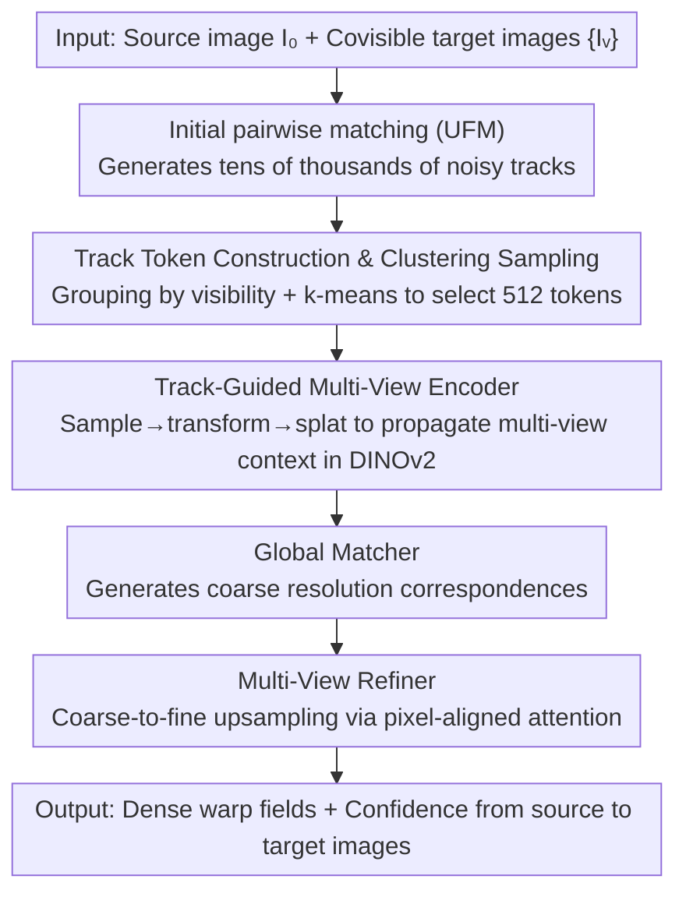

# MV-RoMa: From Pairwise Matching into Multi-View Track Reconstruction

**Conference**: CVPR 2026  
**arXiv**: [2603.27542](https://arxiv.org/abs/2603.27542)  
**Code**: [Project Page](https://icetea-cv.github.io/mv-roma/)  
**Area**: 3D Vision / Feature Matching  
**Keywords**: Multi-view matching, dense correspondence, track reconstruction, SfM, feature fusion

## TL;DR

MV-RoMa is proposed as the first multi-view dense matching model. By employing a Track-Guided multi-view encoder and a pixel-aligned multi-view refiner, it simultaneously estimates dense correspondences from a single source image to multiple target images. This produces geometrically consistent tracks for SfM, comprehensively outperforming existing methods on benchmarks such as HPatches, ETH3D, and IMC.

## Background & Motivation

1. **Background**: Feature matching is a fundamental task for 3D reconstruction and visual localization. Dense matching methods like RoMa and DKM can already generate high-quality pairwise matching results.
2. **Limitations of Prior Work**: Existing methods are inherently pairwise. In multi-view tasks like SfM, pairwise results must be chained into multi-view tracks, a process prone to fragmentation and geometric inconsistency.
3. **Key Challenge**: Post-processing optimizations (e.g., PixSfM, DFSfM) can only refine initial pairwise matches and require separate optimization for each track, which is computationally expensive and limited by the bottleneck of initial matching quality.
4. **Goal**: Realize multi-view consistent dense correspondence directly at the model level to eliminate cumulative errors from chaining.
5. **Key Insight**: Embed sparse geometric priors (from initial pairwise matching) as "track tokens" into the feature encoder to guide multi-view feature interaction.
6. **Core Idea**: Use a track token-guided multi-view encoder combined with a pixel-aligned attention refiner to achieve the first end-to-end multi-view dense matching.

## Method

### Overall Architecture

Input: One source image $I_0$ and multiple covisible target images $\{I_v\}$. An existing matcher (UFM by default) is used for initial pairwise matching, followed by clustering and sampling to construct sparse multi-view track tokens. Then: (1) The Track-Guided multi-view encoder injects multi-view information within a DINOv2 backbone to produce geometrically consistent dense features; (2) A global matcher generates coarse correspondences; (3) A multi-view refiner uses pixel-aligned attention for step-by-step upsampling to full-resolution dense correspondences. Output: Dense warp fields $W^{0\to v}$ and confidence scores from the source image to each target image.

### Key Designs

**1. Track Token Construction and Clustering Sampling: Compressing pairwise matches into compact multi-view geometric priors**

The multi-view encoder requires a prior indicating which points across views represent the same physical point. However, initial pairwise matches produce tens of thousands of tracks that are noisy and spatially uneven. MV-RoMa abstracts each track into a token: a coordinate vector $\mathbf{u}_i \in \mathbb{R}^{2V}$ recording the 2D positions of the track across all $V$ views, and a visibility mask $\mathbf{m}_i \in \{0,1\}^V$ marking visibility. Sampling is not random; tracks are first grouped by visibility patterns (e.g., "visible only in views 0/2" vs. "visible in all views"). K-means is then applied within each group to select the track closest to the centroid as the representative, maintaining a fixed $T=512$ tokens. This avoids spatial clustering of random samples and ensures partially visible tracks are not overshadowed by fully visible ones.

**2. Track-Guided Multi-View Encoder: Using sparse tracks as "messengers" to propagate multi-view context within DINOv2**

Direct multi-view feature interaction via cross-attention among all pixels across all views costs $O\big((V \cdot HW)^2\big)$, which is computationally prohibitive. MV-RoMa uses the 512 selected tracks as intermediaries. In each Transformer block of the latter half of the DINOv2 backbone, a three-step sample-transform-splat operation is inserted:
- **Attentional Sampling**: Tracks serve as queries to perform cross-attention with image features as keys/values, incorporating a distance-decaying spatial bias $B_v$ to "pull" local image information onto the tokens.
- **Track Transformer**: Tracks perform self-attention along the view axis. No view index embedding is used to maintain view-invariance, and the visibility mask filters out invisible views. This step executes actual cross-view information exchange.
- **Attentional Splatting**: The resulting multi-view-aware token features are written back to the image grids.
The complexity is reduced to $O(T \cdot HW \cdot V)$ because information is relayed through $T=512$ sparse tracks rather than dense pixel-to-pixel multiplication.

**3. Multi-View Matching Refiner: Geometrically consistent fine-tuning using pixel-aligned attention at high resolution**

The encoder provides coarse correspondences. To reach full resolution while maintaining multi-view context—where dense pixel-wise global cross-attention is impossible—the refiner follows a coarse-to-fine framework (similar to RoMa), adding multi-view attention only at stride 4 and stride 1. The key technique is **pixel-aligned attention**: the features of each target view are first warped back to the source view's coordinate system using the current warp prediction. Each source pixel then only attends to its corresponding location in the target views rather than searching the entire image. This alternates with ConvNeXt spatial propagation for $N$ iterations, upsampling the warp residual. This converts the spatial search into a local alignment problem with $O(HW \cdot V)$ complexity.

### A Complete Example: How a track token "sees" multiple views in the encoder

Consider a source image $I_0$ plus 4 target images (5 views total). After initial matching, 512 tracks are clustered. Assume the $i$-th track is visible only in views 0, 1, and 3 ($\mathbf{m}_i=[1,1,0,1,0]$) at coordinates $\mathbf{u}_i$. Inside a DINOv2 block: In the Attentional Sampling stage, token $i$ uses its coordinates in views 0/1/3 to sample local appearance from those views. In the Track Transformer stage, these three appearances attend to each other—if view 3 is blurred by occlusion, it can recover consistent geometric information from the clear appearances in views 0/1, while views 2/4 (masked) are ignored. In the Attentional Splatting stage, the fused token feature is written back to the corresponding pixels in views 0/1/3. After multiple blocks, the fragmented pairwise features are transformed into geometrically consistent multi-view features, eventually yielding aligned dense warps in the refiner.

### Loss & Training

- Utilizes the robust loss from RoMa, trained on MegaDepth + ScanNet for 200K steps.
- Learning rate $3\times10^{-5}$, decayed by 10x after 20K steps, batch size 4.
- Defaults to 1 source + 4 target images with 512 track tokens.

## Key Experimental Results

### Main Results

**HPatches Homography Estimation (AUC %)**:

| Method | DLT @1/3/5px | RANSAC @1/3/5px |
|------|-------------|-----------------|
| RoMa | 41.0/67.9/76.9 | 44.7/72.6/81.4 |
| **Ours (MV-RoMa)** | **46.1/71.9/80.1** | **47.2/73.2/81.8** |

**ETH3D 3D Triangulation**:

| Method | Accuracy 1/2/5cm | Completeness 1/2/5cm |
|------|-------------------|----------------------|
| RoMa | 75.58/86.25/94.95 | 5.64/15.73/38.60 |
| **Ours (MV-RoMa)** | **85.88/92.99/98.05** | 3.95/9.94/23.81 |
| RoMa + Dense-SfM | 84.79/92.62/97.77 | **7.38/17.06/36.35** |

**Multi-View Pose Estimation (AUC %)**:

| Method | Texture-Poor @3/5/10° | IMC @3/5/10° |
|------|----------------------|--------------|
| RoMa + Dense-SfM | 49.94/66.23/81.41 | 48.48/60.79/73.90 |
| **Ours (MV-RoMa)** | **51.79/66.77/81.74** | **51.31/62.92/75.92** |

### Ablation Study

| Configuration | ETH3D Acc@2cm | ETH3D Comp@2cm | HPatches AUC@3px |
|------|---------------|----------------|------------------|
| RoMa baseline | 86.25 | 15.73 | 67.9 |
| + MV-Encoder | Gain | Gain | Gain |
| + MV-Encoder + MV-Refiner | **92.99** | Best | **71.9** |

### Key Findings

- The largest improvement occurs under the strict 1px threshold on HPatches (41.0→46.1), indicating that multi-view consistency primarily enhances fine matching precision.
- The gap between DLT and RANSAC is minimal, suggesting extremely high inlier ratios.
- The advantage is pronounced on Texture-Poor datasets, proving that multi-view interaction is highly effective in low-texture scenarios.
- MV-Encoder and MV-Refiner provide complementary contributions.

## Highlights & Insights

- **Sparse track tokens for multi-view propagation** is the core innovation, preventing the quadratic complexity of global multi-view attention while retaining sufficient geometric priors. This "sparse proxy" strategy is generalizable.
- **Pixel-aligned attention** is a clever design—warping to align before attending converts a spatial search into a local alignment problem, significantly reducing computation.
- **Paradigm shift from "post-processing repair" to "end-to-end prediction"**: The model no longer relies on the quality upper bound of independent pairwise matching.

## Limitations & Future Work

- Still dependent on an existing matcher (UFM) to construct track tokens; unreliable priors may result if initial matching is poor.
- Currently processes 1+4 images; extending to significantly more views requires re-evaluating token counts and attention computation.
- Completeness on ETH3D is lower than some post-processing methods (e.g., Dense-SfM) due to a conservative NMS sampling strategy.
- Future work could explore removing the dependency on an initial matcher by learning multi-view priors internally.

## Related Work & Insights

- **vs RoMa**: The direct predecessor. While RoMa is SOTA for pairwise dense matching, MV-RoMa adds multi-view consistency to further improve performance.
- **vs PixSfM / DFSfM**: These are post-processing optimization methods. MV-RoMa generates multi-view consistent matches directly, removing the need for per-track optimization.
- **vs Tracktention**: Borrows the sample-transform-splat design but adapts it from video tracking to sparse multi-view matching scenarios.

## Rating

- Novelty: ⭐⭐⭐⭐ First multi-view dense matching model; elegant track token design.
- Experimental Thoroughness: ⭐⭐⭐⭐⭐ Extensive testing across HPatches, ETH3D, IMC, and Texture-Poor.
- Writing Quality: ⭐⭐⭐⭐⭐ Clear diagrams, smooth pipeline description, consistent notation.
- Value: ⭐⭐⭐⭐ Directly advances the SfM/3D reconstruction field by filling the gap in multi-view dense matching.

<!-- RELATED:START -->

## Related Papers

- [\[CVPR 2026\] MV3DIS: Multi-View Mask Matching via 3D Guides for Zero-Shot 3D Instance Segmentation](mv3dis_multi-view_mask_matching_via_3d_guides_for_zero-shot_3d_instance_segmenta.md)
- [\[CVPR 2025\] CoMatcher: Multi-View Collaborative Feature Matching](../../CVPR2025/3d_vision/comatcher_multi-view_collaborative_feature_matching.md)
- [\[CVPR 2026\] Intrinsic Image Fusion for Multi-View 3D Material Reconstruction](intrinsic_image_fusion_for_multi-view_3d_material_reconstruction.md)
- [\[CVPR 2026\] BRepGaussian: CAD Reconstruction from Multi-View Images with Gaussian Splatting](brepgaussian_cad_reconstruction_from_multi-view_images_with_gaussian_splatting.md)
- [\[CVPR 2026\] TROPHIES: Temporal Reconstruction of Places, Humans, and Cameras from Multi-view Videos](trophies_temporal_reconstruction_of_places_humans_and_cameras_from_multi-view_vi.md)

<!-- RELATED:END -->
