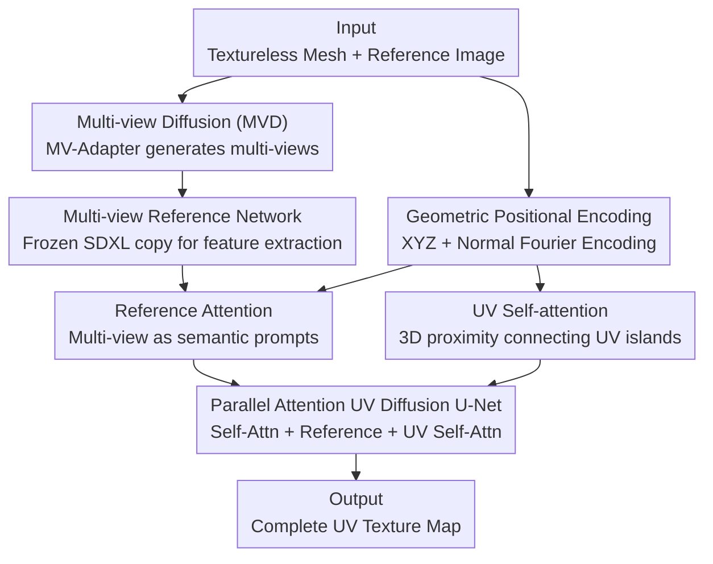

# MV2UV: Generating High-quality UV Texture Maps with Multiview Prompts

**Conference**: CVPR 2026  
**Paper**: [CVF Open Access](https://openaccess.thecvf.com/content/CVPR2026/html/Zhang_MV2UV_Generating_High-quality_UV_Texture_Maps_with_Multiview_Prompts_CVPR_2026_paper.html)  
**Code**: Not mentioned  
**Area**: 3D Vision / Texture Generation  
**Keywords**: UV texture generation, multi-view diffusion, geometric positional encoding, reference attention, occlusion completion

## TL;DR
MV2UV treats multi-view generated images as "semantic prompts" to directly generate texture maps in UV space using a fine-tuned SDXL diffusion model. By employing pixel-aligned 3D coordinates (XYZ) as cross-attention positional encodings, it simultaneously resolves multi-view inconsistencies and completes occluded regions, significantly reducing FID on GSO/DTC datasets.

## Background & Motivation
**Background**: Texturing 3D assets is a critical step in production pipelines like gaming, VR, and digital twins that determines visual quality. Traditional manual methods are difficult to scale. Existing automatic texture generation follows two main approaches: **multi-view methods** (e.g., Paint3D, MV-Adapter, Hunyuan3D) which generate images from multiple perspectives and reproject them onto UV maps, and **UV methods** (e.g., TEXGen) which generate directly on the UV map.

**Limitations of Prior Work**: Multi-view methods suffer from two major issues: first, **multi-view inconsistency**, where misalignments between views cause blurred or conflicting textures at seams; second, **poor handling of occlusions/unseen regions**, which usually rely on smooth extrapolation or semantic-less basic UV inpainting, leading to loss of detail. UV methods lack priors: UV coordinates themselves do not encode 3D spatial or semantic information, often resulting in textures that do not match the object's structural logic and fail to leverage powerful 2D image diffusion priors.

**Key Challenge**: Multi-view methods have rich semantics but lack consistency and completion; UV space allows for completion but lacks semantic and 2D diffusion priors. These two strengths are currently misaligned.

**Goal**: Design a two-stage framework that combines the semantic advantages of multi-view generation with the completion capabilities of UV generation while avoiding their respective weaknesses.

**Key Insight**: Instead of directly reprojecting multi-view images onto the UV map, one should use multi-view images as "semantic prompts" to guide UV space generation. When performing cross-attention between the UV map and multi-view images, pixel-aligned 3D coordinates (XYZ) should be used as positional encodings, allowing a UV pixel to dynamically attend to all multi-view regions sharing the same XYZ coordinates.

**Core Idea**: Use a UV-space generative model to concurrently complete unseen parts and resolve multi-view inconsistencies, where XYZ coordinate encoding acts as the bridge linking multi-view semantics reliably to the UV map.

## Method

### Overall Architecture
The input consists of a textureless mesh with a known UV layout and a reference image describing the texture. In the first stage, a multi-view diffusion model (MV-Adapter) generates a set of multi-view images from the reference image. In the second stage, instead of reprojection, these multi-view images are fed as image prompts into a UV texture diffusion model (fine-tuned from SDXL) to generate the full texture directly on the UV map. Within each block of the UV diffusion U-Net, three types of attention run in parallel: **Self-attention** to retain pre-trained priors, **Reference Attention** to inject multi-view features, and **UV Self-attention** to bridge disconnected UV islands. Geometric positional encoding serves as the binder for both Reference and UV Self-attention.

### Key Designs

**1. Multi-view as Semantic Prompts instead of Reprojection: Injecting multi-view semantics via Reference Attention**

Directly baking multi-view reprojections onto a mesh creates blurred conflicts at seams due to view inconsistency, while occluded areas are filled with low-semantic uniform colors. MV2UV treats multi-views as "prompts." Specifically, a copy of the SDXL denoising U-Net serves as a **frozen Reference Network**. VAE latents of each view at timestep $t=0$ are fed in (without noise to preserve original information) to extract block-wise features $f_{view}$. These features are then linked to the UV map through a **Reference Attention layer**: $\text{ViewRefAttn}(h_{in}, f_{view}, p_{uv}, p_{view}) = \text{Softmax}(\frac{Q_{ref} K_{ref}^\top}{\sqrt d})V_{ref}$, where the query comes from UV features and key/value from multi-view features. This allows the network to "learn to resolve conflicts autonomously" rather than passively averaging them, while occluded regions pull semantic information from nearby visible multi-view regions.

**2. Geometric Positional Encoding (XYZ): Aligning cross-attention via pixel-aligned 3D coordinates**

For Reference Attention to work, UV pixels must know "which part of the multi-view images to attend to." The core insight is that each pixel in both the UV map and multi-view images corresponds to a unique 3D coordinate on the object surface. These 3D coordinates are used as positional encodings $p_{uv}, p_{view}$ added to the query and key. Implementation-wise, normal maps and position maps of the mesh are rendered. The 3D coordinates (concatenated with normals to encode local geometry) are passed through a Fourier positional encoding function to capture high-frequency signals, then fed into a **learnable positional encoder** (a sequence of convolutional residual blocks) to produce pyramid features aligned with the attention layers. With XYZ encoding, a UV pixel dynamically attends to all multi-view regions sharing the same 3D coordinates, resulting in: (1) **Conflict Resolution**—the network adaptively generates sharp details rather than blurred averages; (2) **Semantic Completion**—occluded areas pull information from geometrically adjacent visible regions.

**3. UV Self-attention: Connecting broken UV islands via 3D proximity**

Standard image diffusion on a UV map is hindered by "UV islands"—surfaces adjacent in 3D might be cut into disconnected islands in the 2D UV layout. Standard 2D self-attention cannot associate them. This work adds a **UV Self-attention layer** $\text{UVSelfAttn}(h_{in}, p_{uv}) = \text{Softmax}(\frac{Q_{uv}K_{uv}^\top}{\sqrt d})V_{uv}$, using the same geometric positional encoding $p_{uv}$ for both query and key. Consequently, the model learns stronger weights for pixels that are closer in 3D space, bridging gaps in the UV layout to synthesize globally consistent textures.

**4. Parallel Attention Architecture: Adding task-specific capabilities while preserving pre-trained priors**

To integrate these components, the authors use a **parallel attention mechanism**. Weights from the original self-attention of the frozen SDXL backbone are used to initialize the Reference Attention and UV Self-attention layers. The block output is $h_{out} = h_{in} + \text{SelfAttn}(h_{in}) + \text{ViewRefAttn}(\cdot) + \text{UVSelfAttn}(\cdot)$. The residual parallel design ensures that the original self-attention retains SDXL's pre-trained 2D image priors, while the two new branches learn task-specific abilities: guiding UV generation with multi-view prompts and modeling intrinsic UV space relationships.

### Loss & Training
The backbone is fine-tuned from SDXL with original self/cross-attention frozen. Training data uses Material Anything (a subset of Objaverse, ~80k samples). Multi-part objects are merged into single meshes and UV-unwrapped using X-atlas. Albedo, position, and global normal maps are rendered from 6 fixed views and baked to UV maps. Robustness is enhanced with diverse lighting (point, ambient, area lights). Crucially, MV-Adapter is used to redraw rendered views with strengths $[0.1, 0.25, 0.5]$, sampled with 20% probability as data augmentation to specifically address multi-view inconsistency. Multi-view resolution is $768\times768$, and texture map resolution is $1024\times1024$.

## Key Experimental Results

### Main Results
Evaluation was conducted on 200 instances each from GSO (Google Scanned Objects) and DTC (Digital Twin Catalog). Given a single reference image, multi-views were generated via MV-Adapter and fed into the network. Metrics include FID↓ and KID↓ ($\times 10^{-4}$).

| Dataset | Metric | Ours | Prev. SOTA | Description |
|--------|------|------|----------|------|
| GSO | FID↓ | **24.4** | 24.7 (MV-Adapter) | Superior to strongest multi-view baseline |
| GSO | KID↓ | **43.6** | 47.5 (MV-Adapter) | Distribution closer to ground truth |
| GSO | FID↓ (vs TEXGen) | **24.4** | 75.2 (TEXGen) | 50.8 ahead of UV-based method |
| DTC | FID↓ | **26.4** | 28.4 (MV-Adapter) | ~2.0 improvement |
| DTC | KID↓ | **28.7** | 41.8 (MV-Adapter) | Significant lead |
| DTC | FID↓ (vs TEXGen) | **26.4** | 41.1 (TEXGen) | 14.7 ahead of UV-based method |

Compared to the UV-based TEXGen, FID improved by 50.8/14.7 on GSO/DTC respectively. It also outperformed multi-view methods (Hunyuan3D 2.1, UniTEX, MV-Adapter), particularly in occluded and inconsistent regions.

### Ablation Study
The paper highlights completion of occlusions and resolution of view inconsistencies.

| Configuration / Evaluation | Metric | Result | Description |
|------|------|------|------|
| Occlusion Completion (vs MV-Adapter) | FID↓ | 67.5 vs 123.6 | FID reduced by 56.1 in self-occluded areas |
| Occlusion Completion (vs MV-Adapter) | KID↓ | 47.6 vs 157.9 | ~2x completion quality improvement |
| Consistent View Input (GSO) | PSNR↑/SSIM↑ | 25.7 / 0.855 | Reconstruction quality under normal views |
| Artificial View Conflict (GSOc) | PSNR↑ | -0.2 drop | Swapping back view with strength=0.5 redraw |
| Artificial View Conflict (GSOc/DTCc) | SSIM↑ | -0.003 / 0.001 | Robust to conflicts, negligible performance drop |

### Key Findings
- **Occluded regions benefit the most**: In 10 self-occlusion samples, FID dropped from 123.6 to 67.5 and KID from 157.9 to 47.6. This ~2x quality boost directly validates the "multi-view as prompt + XYZ encoding" approach.
- **Immunity to view inconsistency**: After artificially introducing conflicts (replacing the back view), PSNR only dropped by 0.2 and SSIM by 0.001~0.003, showing the network autonomously resolves conflicts in UV space.
- **Reference Attention is core**: Removing Reference Attention destroys the multi-view semantic prompting mechanism, proving its decisive role in final quality.

## Highlights & Insights
- **Paradigm shift from "Projection" to "Prompt"**: Repositioning multi-views as semantic prompts rather than raw pixel sources for projection allows the generative model to actively harmonize rather than passively stitch. This perspective is insightful for all cross-view fusion tasks.
- **XYZ as Positional Encoding is the masterstroke**: Using pixel-aligned 3D coordinates for cross-attention positional encoding naturally solves the correspondence problem between UV pixels and multi-view regions, while simultaneously addressing occlusion completion and conflict resolution.
- **UV Self-attention for UV Islands**: Using 3D-proximity positional encoding to re-associate broken UV islands is a practical engineering insight for migrating 2D diffusion to UV space.
- **Parallel Residual Attention preserves priors**: Initializing new branches with weights from a frozen SDXL and using a residual parallel structure allows the model to leverage 2D image priors while learning task-specific abilities.

## Limitations & Future Work
- **Dependency on multi-view generation quality**: As Stage 1 relies on MV-Adapter, poor view quality or insufficient coverage limits the semantic prompts available for UV generation.
- **Sensitivity to geometric priors**: The method assumes known UV mapping and accurate position/normal maps. Poor UV unwrapping or noisy geometry may misalign the geometric positional encoding. ⚠️ This sensitivity is not fully discussed in the paper.
- **Data constraints**: Training is limited to the Objaverse subset (~80k samples, 6 fixed views). Generalization to complex topologies or translucent/anisotropic materials remains to be verified. Currently, it generates albedo/texture rather than full PBR material decomposition.
- **Future Improvements**: Joint optimization of multi-view and UV generation, or introducing adaptive view selection to reduce blind spots. Extending geometric encoding to richer local properties like curvature.

## Related Work & Insights
- **vs. Multi-view Reprojection (MV-Adapter / Hunyuan3D 2.1 / Paint3D)**: These methods suffer from inconsistencies and occlusion blind spots due to direct projection. Ours treats views as prompts to generate in UV space, reducing occlusion FID by 56.1 and remaining robust to conflicts.
- **vs. Direct UV Generation (TEXGen)**: TEXGen generates in UV space but lacks 3D/semantic and 2D diffusion priors. Ours injects both multi-view semantics and SDXL priors via Reference Attention and XYZ encoding, leading FID by 50.8/14.7 on GSO/DTC.
- **vs. Optimization-based (DreamFusion / ProlificDreamer)**: SDS-based methods are slow and prone to artifacts like the Janus problem. Ours is feed-forward, offering better efficiency and consistency.

## Rating
- Novelty: ⭐⭐⭐⭐⭐ The "multi-view as prompt + XYZ encoding" combination elegantly fuses the advantages of both major approaches.
- Experimental Thoroughness: ⭐⭐⭐⭐ Strong results on GSO/DTC plus specific occlusion/conflict ablations, though PBR and topological variety are somewhat limited.
- Writing Quality: ⭐⭐⭐⭐ Clear motivation and explanation of the three major designs, including attention formulas and geometric encoding.
- Value: ⭐⭐⭐⭐⭐ Directly addresses the key pain points of consistency and occlusion in 3D texture generation with high practical feasibility.

<!-- RELATED:START -->

## Related Papers

- [\[CVPR 2026\] PackUV: Packed Gaussian UV Maps for 4D Volumetric Video](packuv_packed_gaussian_uv_maps_for_4d_volumetric_video.md)
- [\[CVPR 2025\] HOI3DGen: Generating High-Quality Human-Object-Interactions in 3D](../../CVPR2025/3d_vision/hoi3dgen_generating_high-quality_human-object-interactions_in_3d.md)
- [\[CVPR 2026\] CaliTex: Geometry-Calibrated Attention for View-Coherent 3D Texture Generation](calitex_geometry-calibrated_attention_for_view-coherent_3d_texture_generation.md)
- [\[CVPR 2026\] Volumetric Functional Maps](volumetric_functional_maps.md)
- [\[CVPR 2026\] QD-PCQA: Quality-Aware Domain Adaptation for Point Cloud Quality Assessment](qd-pcqa_quality-aware_domain_adaptation_for_point_cloud_quality_assessment.md)

<!-- RELATED:END -->
