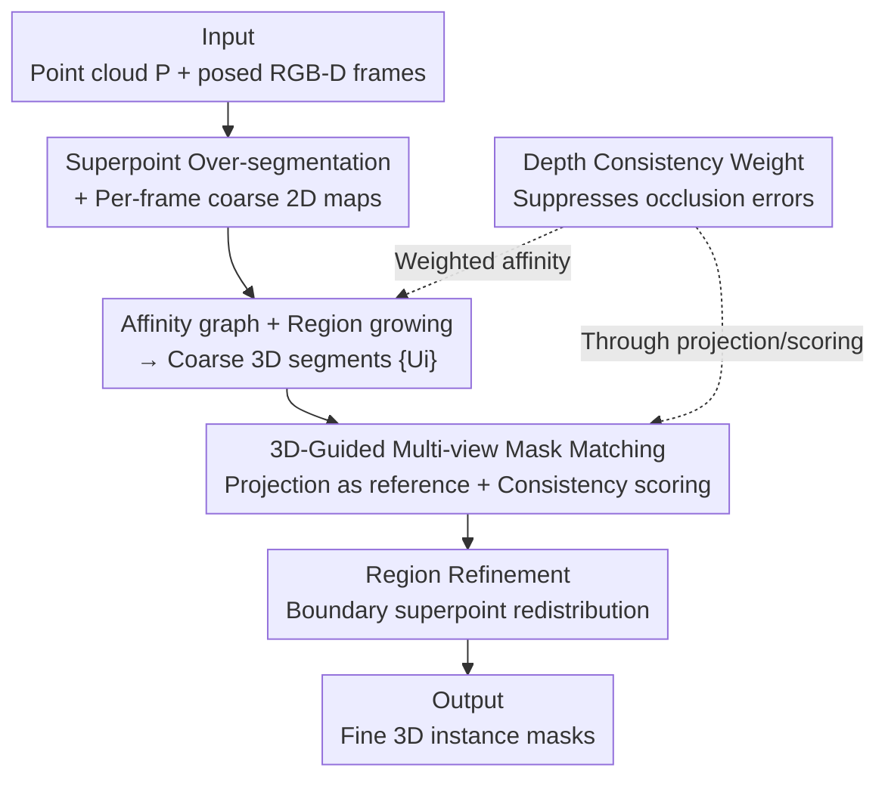

# MV3DIS: Multi-View Mask Matching via 3D Guides for Zero-Shot 3D Instance Segmentation

**Conference**: CVPR 2026  
**Paper**: [CVF Open Access](https://openaccess.thecvf.com/content/CVPR2026/html/Zhao_MV3DIS_Multi-View_Mask_Matching_via_3D_Guides_for_Zero-Shot_3D_CVPR_2026_paper.html)  
**Code**: https://github.com/zybjn/MV3DIS  
**Area**: 3D Vision / Instance Segmentation  
**Keywords**: Zero-Shot 3D Instance Segmentation, Multi-view Consistency, SAM, Mask Matching, Depth Consistency

## TL;DR
MV3DIS utilizes "projections of coarse 3D segments" as cross-view common references to match and filter 2D masks generated by SAM. Consistent 2D masks are then used to refine 3D instances. Without relying on video tracking or any 3D annotations, it pushes the zero-shot 3D instance segmentation mAP on ScanNetV2 to 38.5 (surpassing the Prev. SOTA by 4.5).

## Background & Motivation
**Background**: Traditional 3D instance segmentation (e.g., Mask3D) relies on large-scale manually annotated 3D data for supervised training, which performs well on closed sets but generalizes poorly and incurs high annotation costs. Leveraging the zero-shot segmentation capabilities of 2D vision foundation models like SAM, recent "training-free" methods (SAM3D, SAI3D, Open3DIS, etc.) generate 2D masks for each frame and use them as guides to merge 3D geometric primitives (superpoints) into instance-level segments.

**Limitations of Prior Work**: Most existing methods **process frames independently** and rely solely on 2D metrics (e.g., SAM's prediction IoU score) to determine the segmentation map for each frame. This leads to two issues: ① Inconsistent 2D masks across views for the same 3D object—fragmented masks in one frame might overwrite complete object masks during the merging of segmentation maps; ② This cross-view 2D inconsistency results in 3D over-segmentation. SAM2Object attempts to use SAM2's video tracking for consistency, but tracking is sensitive to motion blur, suffers from error accumulation, and is limited to sequential video.

**Key Challenge**: The root cause is that existing methods **judge consistency in 2D space** while ignoring the inherent 3D priors. 2D masks of the same object across views should share the same 3D geometry, but pure 2D metrics lack this constraint, failing to associate masks belonging to the same object.

**Goal**: (a) Maintain cross-view 2D mask consistency for the same object without 3D labels or temporal video sequences; (b) entries of incorrect correspondences caused by occlusions during 2D→3D projection.

**Key Insight**: Coarse 3D segments themselves serve as a **view-agnostic common reference frame**. By projecting coarse 3D segments into each frame, "which 2D masks cover the same 3D geometry" can be used to determine if they belong to the same object, bypassing pure 2D metrics.

**Core Idea**: Use "projections of coarse 3D segments" as a cross-view common reference to match 2D masks, measuring their consistency via 3D coverage distributions (coarse-to-fine: coarse segmentation → 3D-guided mask matching → 3D instance refinement).

## Method

### Overall Architecture
The input consists of a sequence of posed RGB-D frames (image $I_t$, depth $D_t$, intrinsic $K_t$, extrinsic $E_t$) and the scene point cloud $P\in\mathbb{R}^{N_p\times3}$. The output is 3D instance masks for all foreground objects. The pipeline follows a coarse-to-fine two-stage process:

**(a) Coarse 3D Instance Segmentation**: First, point clouds are over-segmented into superpoints $\{S_i\}$ using graph-cut (small blocks of geometrically similar points, significantly reducing primitives while injecting geometric priors). Grounding-DINO + SAM then produce 2D masks per frame, which are merged into a coarse segmentation map $\{L^C_t\}$ per frame after NMS (based on SAM’s IoU score). Finally, an affinity graph between superpoints is built based on these 2D maps, and region growing merges them into coarse 3D segments $\{U_i\}$.

**(b) 3D Instance Refinement**: Each coarse 3D segment is projected back into each frame for **3D-guided mask matching**, associating cross-view consistent 2D masks to generate refined segmentation maps $\{L^R_t\}$. These consistent masks are used to recompute affinities for **region refinement**, where boundary superpoints are redistributed to the most consistent instances. A **depth consistency weight** is applied throughout both stages to suppress projection ambiguities caused by occlusion.

### Key Designs

**1. 3D-Guided Multi-View Mask Matching: Using Coarse 3D Segments for 2D Mask Alignment**

This core design addresses the pain point of "independent frame processing and pure 2D metrics leading to cross-view inconsistency." Point clouds are projected onto frame $t$ using the pinhole camera model: homogeneous point $p=(x,y,z,1)^\top$ results in camera coordinates $p_c=E_t p$ and pixel position $(u,v)=(\tilde u/\tilde w,\tilde v/\tilde w)$. Visibility is determined by a binary indicator:

$$I_{vis}(p,I_t)=\mathbb{1}(0\le u<W \wedge 0\le v<H)\cdot\mathbb{1}(|z_c-d|<\alpha d)$$

where $d$ is the measured depth at the pixel and $\alpha=0.05$ is the relative tolerance. After projecting each coarse 3D segment $U_i$, candidate masks are selected using two visibility ratios: frame visibility $V^f_{i,t}$ and mask visibility $V^m_{i,t,j}$. The candidate set is:

$$G_i=\{(t,j)\mid V^f_{i,t}>\tau_f \text{ and } V^m_{i,t,j}>\tau_m\},\quad \tau_f=0.3,\ \tau_m=0.9$$

To determine which candidates represent the same object, the **3D coverage distribution** is defined: for each mask $m_{t,j}$, a coverage vector $v_{t,j}\in\mathbb{R}^{N_u}$ is constructed, where $v^k_{t,j}=\bar w^d_{k,t,j}\cdot V^m_{k,t,j}$ records the weighted occupancy of the $k$-th coarse 3D segment in that mask. Mask consistency is measured via cosine similarity:

$$s_{i,t,j}=\frac{1}{|G_i|-1}\sum_{(t',j')\in G_i\setminus\{(t,j)\}}\frac{v_{t,j}\cdot v_{t',j'}}{\lVert v_{t,j}\rVert\lVert v_{t',j'}\rVert}$$

Finally, NMS based on consistent scores suppresses inconsistent masks to yield refined maps $\{L^R_t\}$. This forces view consistency using 3D geometry without video tracking or temporal proximity.

**2. Depth Consistency Weight: Soft Weighting for Occluded Points**

The visibility indicator $I_{vis}$ uses a hard threshold $|z_c-d|<\alpha d$. However, **occluded points near the threshold may still be misidentified as visible**, polluting the matching process. A continuous depth consistency weight is introduced:

$$w^d_p=1-\frac{|z_c-d|}{\alpha d}$$

Greater depth differences result in lower weights, smoothing the impact of ambiguous points. This point-level weight is aggregated into segment-level weights $\bar w^d_{k,t,j}$ for mask matching and $\bar w^d_{i,t}$ for affinity construction, improving 3D→2D correspondence robustness.

**3. Region Refinement: Using Refined Masks to Correct Boundary Misassignment**

Coarse-stage region growing assigns superpoints to the "first region reaching the threshold $\tau_{merge}$," causing errors at boundaries that accumulate. The refinement stage recomputes affinities using refined consistent masks $\{L^R_t\}$. Boundary superpoints are allowed to be redistributed to the region with the highest affinity, iterating until convergence.

### Loss & Training
Ours is **completely training-free**: it optimizes no parameters, relying on off-the-shelf graph-cut, Grounded-SAM / SAM2, and geometric projection rules. Key hyperparameters include depth tolerance $\alpha=0.05$, candidate thresholds $\tau_f=0.3$ / $\tau_m=0.9$, and merging threshold $\tau_{merge}=0.5$.

## Key Experimental Results

### Main Results
Class-agnostic 3D instance segmentation on ScanNetV2, ScanNet200, and ScanNet++:

| Dataset | Metric | Ours | Prev. SOTA | Gain |
|--------|------|------|----------|------|
| ScanNetV2 | mAP / AP50 / AP25 | 38.5 / 60.2 / 76.2 | SAM2Object 34.0 / 52.7 / 70.3 | +4.5 / +7.5 / +5.9 |
| ScanNet200 | AP50 / AP25 | 54.7 / 69.7 | SGS-3D 51.3 / 64.6 | +3.4 / +5.1 |
| ScanNet++ | mAP / AP50 / AP25 | 22.0 / 36.7 / 51.7 | SAM2Object 20.2 / 34.1 / 48.7 | +1.8 / +2.6 / +3.0 |

Notably, on ScanNet200, MV3DIS (54.7 AP50) **outperforms fully supervised Mask3D** (51.2 AP50). On the more challenging ScanNet++, Mask3D trained on ScanNetV2 drops significantly (9.9 mAP), highlighting the superior generalization of zero-shot methods.

### Ablation Study

| Configuration (RR / 3DG-MM / DCW) | mAP | AP50 | AP25 | Description |
|------|------|------|------|------|
| Baseline (Coarse only) | 33.3 | 51.3 | 70.1 | Starting point |
| + RR | 35.5 | 53.2 | 72.1 | Region Refinement corrects boundaries (+2.2) |
| + RR + 3DG-MM | 37.0 | 57.6 | 74.2 | Mask Matching improves consistency (+1.5) |
| + RR + 3DG-MM + DCW (Full) | 38.5 | 60.2 | 76.2 | Depth Weight added (+1.5), Total (+5.2) |

### Key Findings
- 3DG-MM significantly boosts AP50 (53.2→57.6), validating the causal chain: improved multi-view consistency → more accurate affinities → better 3D segmentation.
- Robustness in sparse views: Using only 2% of views, it outperforms SAI3D using 20% of views.
- Qualitative results show the ability to segment finer details than Ground Truth (e.g., separating power outlets from walls).

## Highlights & Insights
- **"3D Projections as References" is an elegant tracking-free solution**: By replacing temporal video tracking with geometric coverage distributions, it avoids error accumulation and works with sparse views.
- **Continuous Depth Weight vs. Binary Visibility**: Smoothing occlusions near the threshold improves robustness in any 3D→2D projection task.
- Performance surpasses fully supervised models on ScanNet200, validating the "Foundation Model + Strong Geometric Prior" roadmap.

## Limitations & Future Work
- Strong dependency on the quality of SAM masks and initial superpoint over-segmentation.
- Hyperparameters ($\alpha, \tau_{merge}$, etc.) may require tuning for different datasets.
- Evaluation is limited to indoor RGB-D scenes; performance in outdoor or dynamic scenes is unconfirmed.
- Computational complexity: Projecting all 3D segments across frames and calculating pairwise cosine similarities might be intensive for large scenes.

## Related Work & Insights
- **vs SAM3D / SAI3D / Open3DIS**: These use pure 2D metrics leading to inconsistency; MV3DIS uses 3D guides to force consistency, achieving 38.5 mAP vs Open3DIS's 31.5 on ScanNetV2.
- **vs SAM2Object**: SAM2Object depends on video tracking; MV3DIS is purely geometric and works better on sparse views (+4.5 mAP).
- **vs Mask3D (Supervised)**: Mask3D generalizes poorly to new domains (9.9 mAP on ScanNet++); MV3DIS maintains high performance via zero-shot transfer.

## Rating
- Novelty: ⭐⭐⭐⭐ (Clean tracking-free mechanism).
- Experimental Thoroughness: ⭐⭐⭐⭐⭐ (5 datasets, extensive ablations).
- Writing Quality: ⭐⭐⭐⭐ (Clear logic, though some details are in supplementary).
- Value: ⭐⭐⭐⭐ (Strong performance, training-free, and open-sourced).

<!-- RELATED:START -->

## Related Papers

- [\[CVPR 2026\] Lite Any Stereo: Efficient Zero-Shot Stereo Matching](lite_any_stereo_efficient_zero-shot_stereo_matching.md)
- [\[CVPR 2026\] Fast-FoundationStereo: Real-Time Zero-Shot Stereo Matching](fast-foundationstereo_real-time_zero-shot_stereo_matching.md)
- [\[CVPR 2026\] PromptStereo: Zero-Shot Stereo Matching via Structure and Motion Prompts](promptstereo_zero-shot_stereo_matching_via_structure_and_motion_prompts.md)
- [\[CVPR 2026\] Multi-view Consistent 3D Gaussian Head Avatars 'without' Multi-view Generation](multi-view_consistent_3d_gaussian_head_avatars_without_multi-view_generation.md)
- [\[CVPR 2026\] MSGNav: Unleashing the Power of Multi-modal 3D Scene Graph for Zero-Shot Embodied Navigation](msgnav_unleashing_the_power_of_multi-modal_3d_scene_graph_for_zero-shot_embodied.md)

<!-- RELATED:END -->
