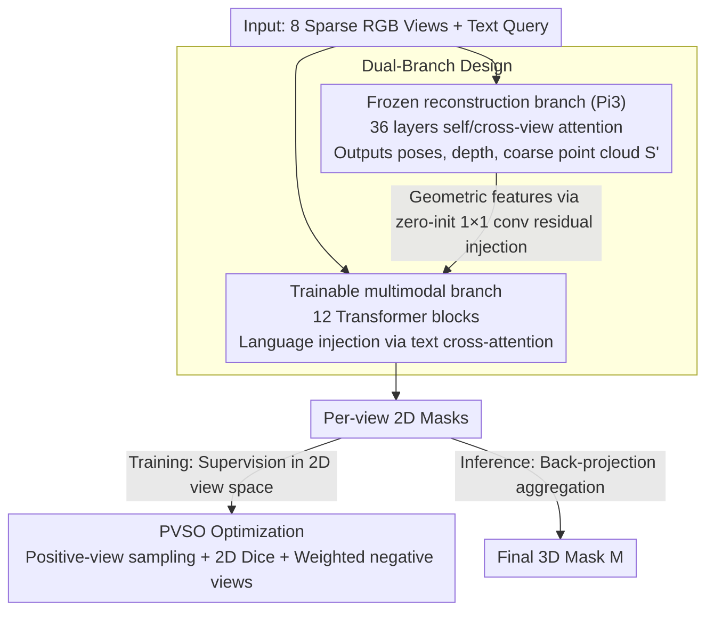

# MVGGT: Multimodal Visual Geometry Grounded Transformer for Multiview 3D Referring Expression Segmentation

**Conference**: CVPR 2026  
**arXiv**: [2601.06874](https://arxiv.org/abs/2601.06874)  
**Code**: [https://mvggt.github.io/](https://mvggt.github.io/)  
**Area**: 3D Vision / Multimodal Understanding  
**Keywords**: 3D Referring Expression Segmentation, Multi-view, Sparse-view Reconstruction, Foreground Gradient Dilution, Language Guidance

## TL;DR

This paper proposes a new task, MV-3DRES (language-guided 3D segmentation directly from sparse multi-view RGB), and the MVGGT framework. By utilizing a dual-branch design that fuses a frozen geometry branch with a trainable multimodal branch and applying the PVSO optimization strategy to resolve foreground gradient dilution, the method achieves 39.9 mIoU on the self-constructed MVRefer benchmark, significantly surpassing baselines.

## Background & Motivation

1. **Background**: 3D Referring Expression Segmentation (3DRES) has achieved strong results on dense, high-quality point clouds, with end-to-end methods like RG-SAN reaching 44.6 mIoU.
2. **Limitations of Prior Work**: Real-world robots, AR glasses, and mobile phones only provide sparse RGB views rather than dense point clouds. Existing 3DRES models fail on noisy or incomplete sparse reconstructed point clouds.
3. **Key Challenge**: (a) Pure 2D methods cannot handle depth ordering, occlusion, and spatial relationships (e.g., "in front of the chair"); (b) Two-stage "reconstruct-then-segment" pipelines produce poor-quality sparse point clouds where target regions are severely degraded.
4. **Goal**: Define the MV-3DRES task—jointly recovering scene structure and segmenting target objects directly from sparse multi-view RGB and text.
5. **Key Insight**: The authors identify a **Foreground Gradient Dilution (FGD)** problem in Dice loss under sparse 3D supervision and propose PVSO to transfer supervision to the 2D view space.
6. **Core Idea**: A frozen geometric branch provides structural priors, a trainable multimodal branch injects language guidance, and PVSO resolves unstable supervision for sparse foregrounds.

## Method

### Overall Architecture

The model takes $N=8$ RGB views and a text query as input. It utilizes two parallel branches: (1) **Frozen Reconstruction Branch** (based on Pi3): 36 layers of alternating self-attention and cross-view attention, outputting camera poses, depth maps, and a coarse point cloud $S'$; (2) **Trainable Multimodal Branch**: 12 Transformer blocks that receive geometric feature injections from the last 12 layers of the reconstruction branch and language injections via text cross-attention, outputting language-conditioned visual features. Finally, multimodal features are decoded into per-view 2D masks, which are back-projected and aggregated onto the 3D point cloud using depth and camera parameters to obtain the final 3D mask $M$. During training, PVSO applies supervision to these 2D masks to avoid foreground gradient dilution from sparse 3D point clouds.

### Key Designs

**1. Dual-Branch Design: Decoupling geometric reasoning and semantic understanding**

Simultaneously learning "what the scene looks like" and "which object is referred to" can lead to objective conflicts during training, especially since geometric priors are difficult to learn. MVGGT freezes the entire geometric branch, using pre-trained Pi3 weights to output stable depth and poses. The multimodal branch only injects language into this established spatial structure. Injections are designed to be "harmless": geometric features $F_l^{\text{geo}}$ pass through a zero-initialized $1\times1$ convolution $\mathcal{Z}$ before being added as a residual:

$$F_{l'}^{\text{in}} = F_{l'-1}^{\text{out}} + \mathcal{Z}(F_l^{\text{geo}})$$

Since $\mathcal{Z}$ is initially zero, the geometric branch does not perturb the multimodal branch at the start of training; useful connections "grow" gradually, preventing the disruption of stable geometric features. Language enters through standard cross-attention in each block. Ablations show that this "build space first, refine with language later" late fusion (39.9) significantly outperforms early fusion (36.1).

**2. FGD Analysis and PVSO Optimization: Moving supervision from 3D back to 2D**

In sparse-view reconstructed point clouds, the referred target often accounts for less than 2% of the points. The gradient of the Dice loss for a single point prediction $p_j$ is approximately $\partial\mathcal{L}/\partial p_j \approx -2/U$, where the denominator $U$ is dominated by the total number of points. When background points are overwhelmingly numerous, foreground gradients are diluted to the $10^{-9}$ to $10^{-11}$ range, leading to stalled training. PVSO (Positive-View-aware Supervision Optimization) moves supervision from the sparse 3D point cloud to the 2D view space, where the same target typically occupies 10–15% of the pixels, increasing foreground gradients by 1–3 orders of magnitude. This includes: positive-view-aware sampling to ensure sufficient target views in each batch (constrained by ratio $\rho_t$); 2D Dice loss on these high-occupancy views; and a weight $w_s = 1/|\mathcal{V}_n|$ for negative views to retain supervision without drowning out positive signals. PVSO alone brings +5.1 mIoU_global (26.9→32.0).

**3. MVRefer Benchmark: A unified metric for sparse-view tasks**

Existing 3DRES evaluations assume perfect point clouds. MVRefer samples 8 frames for each language-object pair in ScanRefer + ScanNet, with visibility verification. It decouples metrics: mIoU_global evaluates the final 3D mask, while mIoU_view/pos/neg evaluate reconstruction and segmentation quality in 2D to distinguish between geometric and alignment failures. It also splits data into Hard/Easy cases based on target pixel occupancy (<5% / ≥5%).

### Loss & Training

- Total loss: $L_{\text{total}} = L_{\text{BCE}} + \lambda_p L_{\text{PVSO}}$, with $\lambda_p = 1$.
- PVSO includes positive-view Dice and weighted negative-view Dice.
- AdamW optimizer, learning rate $1\times 10^{-4}$, batch size 16, 30 epochs, NVIDIA 4090.

## Key Experimental Results

### Main Results

**MVRefer Benchmark**:

| Method | Hard mIoU_global | Hard mIoU_view | Easy mIoU_global | Easy mIoU_view | Overall mIoU_global |
|------|-----------------|----------------|-----------------|----------------|---------------------|
| two-stage | 8.1 | 8.6 | 25.8 | 28.2 | 18.5 |
| 2D-Lift | 6.4 | 15.0 | 25.4 | 24.1 | 17.8 |
| **Ours** | **24.4** | **67.3** | **50.1** | **70.6** | **39.9** |

**ScanRefer Standard Setting (mIoU)**:

| Method | Unique | Multiple | Overall |
|------|--------|----------|---------|
| RG-SAN (GT Point Cloud) | 74.5 | 37.4 | 44.6 |
| **Ours (RGB Only)** | **65.2** | **33.8** | **39.9** |

### Ablation Study

| Configuration | Overall mIoU_global | Overall mIoU_view |
|------|---------------------|-------------------|
| W/o PVSO + W/o MVGGT (2D-Lift) | 17.8 | 20.4 |
| Base Network Only | 26.9 | 41.1 |
| + PVSO | 32.0 | 47.5 |
| + PVSO + MVGGT (Full) | **39.9** | **69.3** |

### Key Findings

- PVSO contributes +5.1 mIoU_global, while MVGGT adds +7.9, with the synergy providing the maximum gain.
- Late fusion achieves the best performance (39.9), validating the intuition of "geometric construction before language refinement."
- An optimal negative view ratio of 0.5 is found; too few views lack supervision, while too many drown the positive signal.
- On the "Unique" subset, using only RGB reaches 65.2 mIoU, narrowing the gap with GT point cloud methods to 9.3.

## Highlights & Insights

- The identification and formalization of the **FGD problem** is highly valuable. This applies not only to MV-3DRES but to any sparse 3D supervision scenario (e.g., point cloud completion).
- The **frozen geometry branch + zero-init injection** is a low-cost, high-impact design pattern that leverages large pre-trained models for downstream tasks.
- Reaching 90% of the performance of GT point cloud methods (on the Unique set) using only 8 RGB images demonstrates the immense potential of end-to-end multi-view reasoning.

## Limitations & Future Work

- A performance gap remains compared to GT point cloud methods (39.9 vs 44.6 Overall), especially in "Multiple" scenarios.
- Global mIoU for "Hard" scenes (targets < 5% pixels) is only 24.4, which is not yet practical.
- The fixed 8-frame sampling strategy might miss critical angles; adaptive view selection could be explored.
- The totally frozen geometric branch cannot adapt to specific scene-level geometric features.

## Related Work & Insights

- **vs. Traditional 3DRES (TGNN, RG-SAN)**: These assume GT point clouds. MVGGT approaches their performance using only sparse RGB.
- **vs. DUSt3R/MASt3R/VGGT**: These are multi-view reconstruction models. MVGGT's geometric branch reuses Pi3 (successor to VGGT) and adds language-guided segmentation.
- **vs. 2D-Lift**: Independent 2D segmentation per view followed by back-projection fails to handle 3D consistency and spatial relations effectively.

## Rating

- Novelty: ⭐⭐⭐⭐⭐ 
- Experimental Thoroughness: ⭐⭐⭐⭐ 
- Writing Quality: ⭐⭐⭐⭐⭐ 
- Value: ⭐⭐⭐⭐⭐ 

<!-- RELATED:START -->

## Related Papers

- [\[CVPR 2026\] Spatial Matters: Position-Guided 3D Referring Expression Segmentation](spatial_matters_position-guided_3d_referring_expression_segmentation.md)
- [\[CVPR 2026\] SAQN: Semantic-based Adaptive Query Network for 3D Referring Expression Segmentation](saqn_semantic-based_adaptive_query_network_for_3d_referring_expression_segmentat.md)
- [\[CVPR 2026\] OmniVGGT: Omni-Modality Driven Visual Geometry Grounded Transformer](omnivggt_omni-modality_driven_visual_geometry_grounded_transformer.md)
- [\[CVPR 2026\] GGPT: Geometry-Grounded Point Transformer](ggpt_geometry_grounded_point_transformer.md)
- [\[ICLR 2026\] Quantized Visual Geometry Grounded Transformer](../../ICLR2026/3d_vision/quantized_visual_geometry_grounded_transformer.md)

<!-- RELATED:END -->
