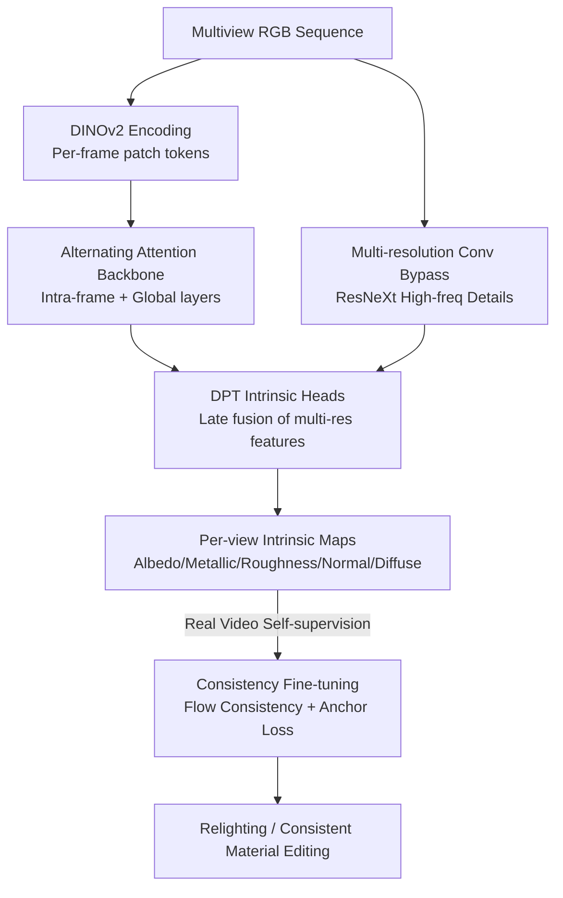

# MVInverse: Feed-forward Multiview Inverse Rendering in Seconds

**Conference**: CVPR 2026  
**Paper**: [CVF Open Access](https://openaccess.thecvf.com/content/CVPR2026/html/Wu_MVInverse_Feed-forward_Multiview_Inverse_Rendering_in_Seconds_CVPR_2026_paper.html)  
**Area**: 3D Vision / Inverse Rendering  
**Keywords**: Multiview Inverse Rendering, Feed-forward Prediction, Alternating Attention, SVBRDF, Consistency Fine-tuning

## TL;DR
MVInverse utilizes a VGGT-style alternating attention Transformer to simultaneously predict per-view consistent albedo, metallic, roughness, normal, and diffuse shading from multiview RGB sequences in a single feed-forward pass. This compresses multiview inverse rendering—which previously required minutes to hours of per-scene optimization—into seconds, while leveraging self-supervised consistency fine-tuning to ensure stable, flicker-free results on real-world videos.

## Background & Motivation

**Background**: Inverse rendering aims to decompose intrinsic scene attributes—albedo, roughness, metallic, normals, and lighting—from images. It is a fundamental task in graphics and vision, supporting asset reconstruction, AR/VR integration, and robotic material perception. Mainstream approaches fall into three categories: per-scene iterative optimization based on differentiable rendering/NeRF/3DGS, feed-forward network-based single-view intrinsic decomposition, and generative decomposition based on diffusion models.

**Limitations of Prior Work**: Each approach has significant drawbacks. ① Optimization-based methods (NeRF/NeuS/3DGS inverse rendering), while high-fidelity, require minutes to hours per scene, making them unsuitable for real-time or large-scale use. ② Single-view feed-forward methods are fast but inherently ignore cross-view relationships; material predictions for the same 3D surface diverge across different perspectives, leading to inconsistent artifacts. ③ Diffusion-based renderers offer good quality, but their iterative sampling is computationally expensive, inheriting the speed limitations of optimization methods.

**Key Challenge**: Achieving both speed and consistency/accuracy is difficult. Consistency requires joint reasoning across views, typically necessitating "polishing" via per-scene optimization. Speed usually requires falling back to single-view feed-forwarding, which loses cross-view constraints.

**Goal**: To maintain cross-view material consistency while reaching optimization-level accuracy in a single feed-forward pass, reducing multiview inverse rendering time from "minutes/hours" to "seconds."

**Key Insight**: The authors observe that feed-forward 3D reconstruction (ViT models like VGGT and Pi3) has already replaced lengthy optimization processes with end-to-end prediction. Multiview inverse rendering and multiview reconstruction share a similar structure—both solve for intrinsic quantities (geometry for reconstruction, material for inverse rendering) through iterative rendering. Since geometry can be solved feed-forwardly, material properties should be as well.

**Core Idea**: The feed-forward reconstruction paradigm is adapted for inverse rendering. A Transformer with alternating global/intra-frame attention maps multiview inputs directly to material attributes. Global attention implicitly associates the same 3D regions across views to ensure consistency, while intra-frame attention captures long-range lighting interactions within a single image. A multi-resolution convolutional bypass recovers high-frequency details. Finally, self-supervised consistency fine-tuning on real videos bridges the gap between synthetic and real-world generalization.

## Method

### Overall Architecture
Given a sequence $S=(I_1,\dots,I_N)$ of $N$ images, the network $f$ outputs five intrinsic maps for each frame in a single pass: albedo $A_i$, metallic $M_i$, roughness $R_i$, camera-space normals $N_i$, and diffuse shading $D_i$:

$$f\big((I_i)_{i=1}^{N}\big)=(A_i,M_i,R_i,N_i,D_i)_{i=1}^{N}.$$

The workflow is as follows: Each frame is encoded by DINOv2 into patch tokens and processed by a VGGT-style alternating attention backbone (alternating layers of intra-frame self-attention and global self-attention). This allows tokens to acquire both "intra-frame long-range context" and "cross-view consistent information." Simultaneously, a per-frame ResNeXt multi-resolution convolutional bypass extracts high-frequency local features, which are integrated into the Transformer stream at the final decoding stage. Five DPT-style dense prediction heads output pixel-aligned intrinsic maps. The diffuse image is the product of albedo and diffuse shading. After pre-training on synthetic data, the network undergoes self-supervised consistency fine-tuning on real videos to suppress temporal flickering.

### Key Designs

**1. Alternating Attention Backbone: Implicit Alignment of 3D Surfaces via Global Attention**

This addresses the "independent calculation" flaw of single-view methods. MVInverse employs a permutation-equivariant alternating attention Transformer (following VGGT/Pi3). Two complementary attention types alternate: frame-wise self-attention operates only within single images to capture spatial dependencies and semantic structures, while global self-attention operates across all input images. This allows tokens from different views to reference and reinforce one another, **implicitly associating tokens observing the same underlying 3D surface without requiring camera pose supervision**. Given a query patch in the first view, the attention heatmap highlights corresponding surface regions in the second view (consistency) and spatially distant but lighting-correlated areas (lighting interaction).

**2. Multi-resolution Convolutional Bypass: Restoring High-frequency Details for Albedo**

Inverse rendering requires higher spatial detail than depth or segmentation; high-frequency textures in the albedo must be precisely recovered. Since a pure DPT head can lead to over-smoothing, a per-frame multi-resolution convolutional encoder (ResNeXt) is introduced. It extracts local high-frequency features (from $\tfrac H4\times\tfrac W4$ to $\tfrac H{32}\times\tfrac W{32}$) and injects them via skip-connections into the prediction heads **only at the final decoding stage**. This preserves texture sharpness without disrupting the global cross-view representations learned by the Transformer.

**3. Consistency Fine-tuning: Bridging the Synthetic-to-Real Gap without Collapse**

To mitigate temporal flickering in real-world sequences where ground truth is absent, a two-stage approach is used. Following synthetic pre-training, the model is fine-tuned on real videos. Given adjacent frames $(I_0, I_t, I_{t+1})$, optical flow $F_{t+1\to t}$ is used to warp the predicted material $\hat M_{t+1}$ to frame $t$, forming $\hat M^{\text{warp}}_{t+1\to t}$. A consistency loss is calculated against $\hat M_t$. To prevent the solution from collapsing into a "temporally smooth but semantically meaningless" state, an anchor loss is added at frame 0 to match the pre-trained model's output $\hat M^{\text{pret}}_0$:

$$\mathcal L_{\text{finetune}}=\lambda_{\text{anchor}}\,\|\hat M_0-\hat M_0^{\text{pret}}\|_2^2+\|\hat M_t-\hat M^{\text{warp}}_{t+1\to t}\|_2^2,$$

where $\lambda_{\text{anchor}}=0.1$.

### Loss & Training
During pre-training, albedo, metallic, roughness, and diffuse shading are supervised using MSE and Multi-Scale Gradient (MSG) losses:

$$\mathcal L_{\text{mse}}(P)=\frac1N\sum_{i=1}^N (P_i-P_i^{*})^2,\qquad \mathcal L_{\text{msg}}(P)=\frac1{NM}\sum_{i=1}^N\sum_{l=1}^M (\nabla P_{i,l}-\nabla P^{*}_{i,l})^2,$$

where $P\in\{A,M,R,D\}$. Normals are supervised using cosine similarity: $\mathcal L_{\text{normal}}(N_i)=1-\langle \hat N_i,N_i\rangle$. Training data includes Hypersim, Interiorverse, Structured3D, etc. For real-world generalization, pseudo-albedo labels for Sekai-Drone videos are generated using DiffusionRenderer.

## Key Experimental Results

### Main Results

Single-view material estimation (Interiorverse test set): MVInverse outperforms diffusion-based and intrinsic decomposition SOTAs.

| Method | Albedo PSNR↑ | Albedo SSIM↑ | Albedo LPIPS↓ | Metallic RMSE↓ | Roughness RMSE↓ |
|------|------|------|------|------|------|
| IntrinsicImageDiffusion | 17.4 | 0.80 | 0.22 | 0.21 | 0.26 |
| DiffusionRenderer* | 21.9 | 0.87 | 0.17 | 0.28 | 0.35 |
| **Ours** | **23.0** | **0.92** | **0.09** | **0.14** | **0.17** |

Multiview consistency (Hypersim, cross-view re-projection RMSE):

| Method | Albedo RMSE↓ | Metallic RMSE↓ | Roughness RMSE↓ |
|------|------|------|------|
| RGB↔X | 0.1317 | 0.3451 | 0.1813 |
| IntrinsicImageDiffusion | 0.0878 | 0.0734 | 0.0810 |
| **Ours** | **0.0660** | **0.0634** | **0.0259** |

### Ablation Study

| Configuration | Key Observation |
|------|---------|
| Full Model | Sharp albedo details, cross-view consistency. |
| Without Conv Bypass | Albedo becomes noticeably blurry, loss of high-freq textures. |
| Before vs. After FT | Real video flickering significantly reduced (RMSE halved). |

### Key Findings
- **Cross-view consistency is the core strength**: In re-projection tests, MVInverse achieves the lowest RMSE across albedo/metallic/roughness.
- **Bypass for details**: The multi-resolution bypass is essential for recovering albedo high-frequency textures.
- **Fine-tuning reduces flickering**: Re-projection error on real videos drops from 0.0341 to 0.0161 for albedo.
- **Efficiency**: Feed-forward execution enables full intrinsic map generation in seconds, supporting real-time PBR relighting.

## Highlights & Insights
- **Reconstruction-to-Inverse Rendering Migration**: The analogy that "reconstruction solves for geometry, inverse rendering solves for material" via rendering iteration allows the use of alternating attention backbones.
- **Implicit Alignment**: Global attention acts as a pose-free aligner, associating tokens observing the same 3D region.
- **Anchor Loss**: Utilizing the pre-trained model's output as an anchor prevents self-supervised consistency training from collapsing.

## Limitations & Future Work
- **Generalization**: Generalization to diverse scenes is still limited by the diversity of available material labels.
- **Indirect Supervision**: Real-world albedo labels rely on pseudo-labels, which may bound accuracy.
- **External Dependencies**: Relighting still requires external depth/pose (e.g., Pi3) and optical flow networks.
- **Metrics**: Lack of a standardized hardware-specific latency comparison against optimization/diffusion baselines.

## Related Work & Insights
- **vs. Single-view (IntrinsicImageDiffusion/RGB↔X)**: These methods fail to maintain consistency across views; MVInverse leads significantly in cross-view RMSE.
- **vs. Optimization (NeRF/3DGS IR)**: Optimization methods are high-precision but too slow for real-time application; MVInverse achieves consistent decomposition without per-scene training.
- **Heritage**: The backbone is directly inspired by feed-forward 3D reconstruction architectures like VGGT and Pi3.

## Rating
- Novelty: ⭐⭐⭐⭐ 
- Experimental Thoroughness: ⭐⭐⭐⭐ 
- Writing Quality: ⭐⭐⭐⭐ 
- Value: ⭐⭐⭐⭐ 

<!-- RELATED:START -->

## Related Papers

- [\[CVPR 2026\] FUSER: Feed-Forward Multiview 3D Registration Transformer and SE(3)$^N$ Diffusion Refinement](fuser_feed-forward_multiview_3d_registration_transformer_and_se3n_diffusion_refi.md)
- [\[CVPR 2026\] Particulate: Feed-Forward 3D Object Articulation](particulate_feed-forward_3d_object_articulation.md)
- [\[CVPR 2026\] Z-Order Transformer for Feed-Forward Gaussian Splatting](z-order_transformer_for_feed-forward_gaussian_splatting.md)
- [\[CVPR 2026\] PanoVGGT: Feed-Forward 3D Reconstruction from Panoramic Imagery](panovggt_feed-forward_3d_reconstruction_from_panoramic_imagery.md)
- [\[CVPR 2026\] SGS-Intrinsic: Semantic-Invariant Gaussian Splatting for Sparse-View Indoor Inverse Rendering](sgs-intrinsic_semantic-invariant_gaussian_splatting_for_sparse-view_indoor_invers.md)

<!-- RELATED:END -->
